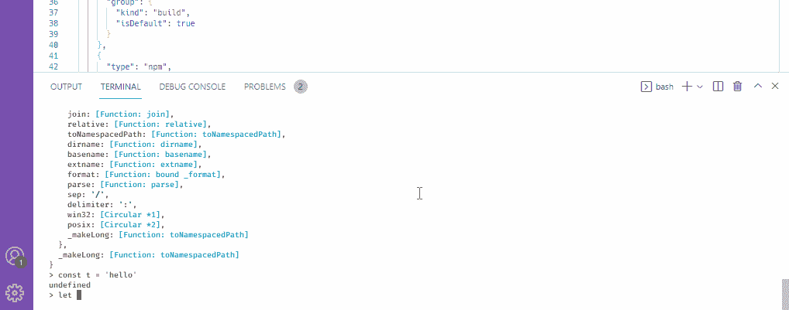
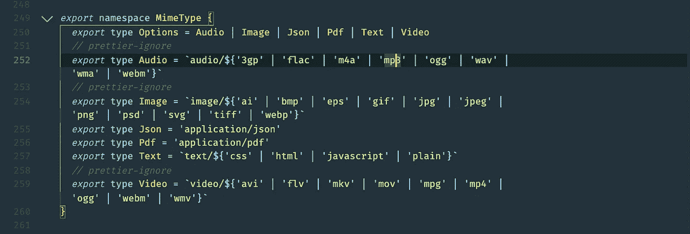
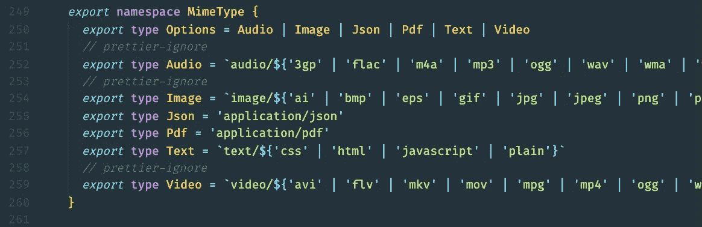
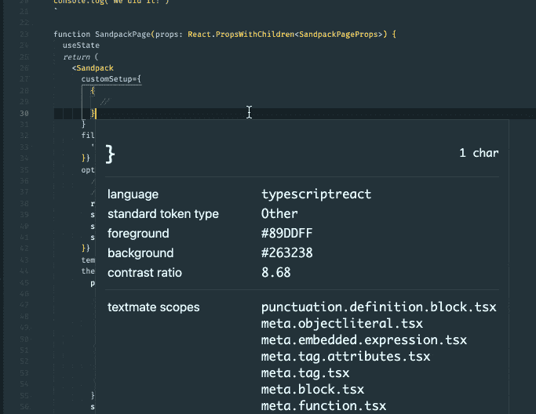
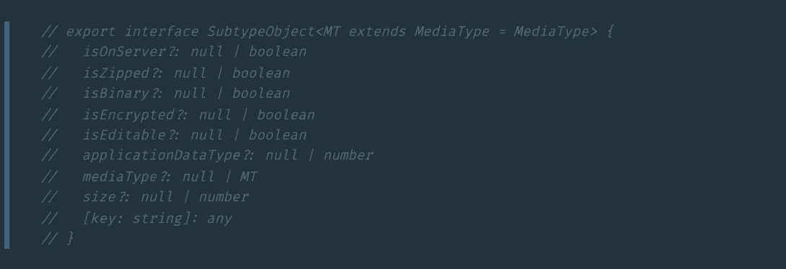
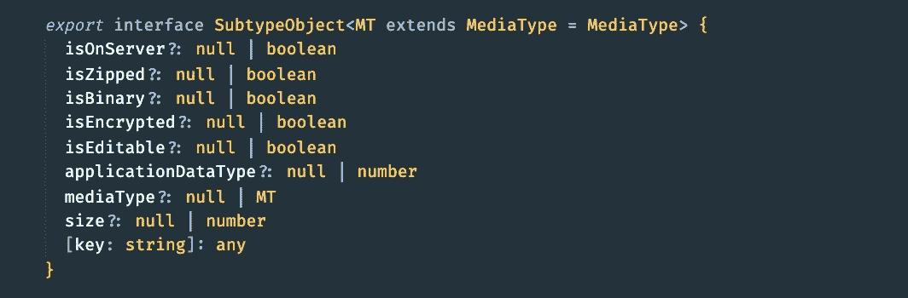
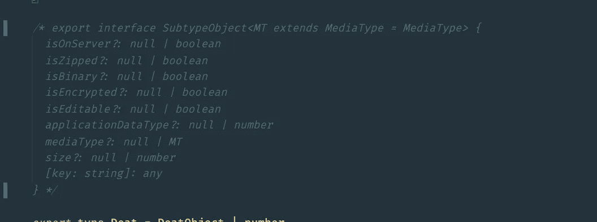
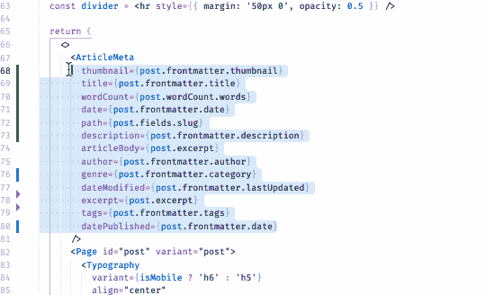
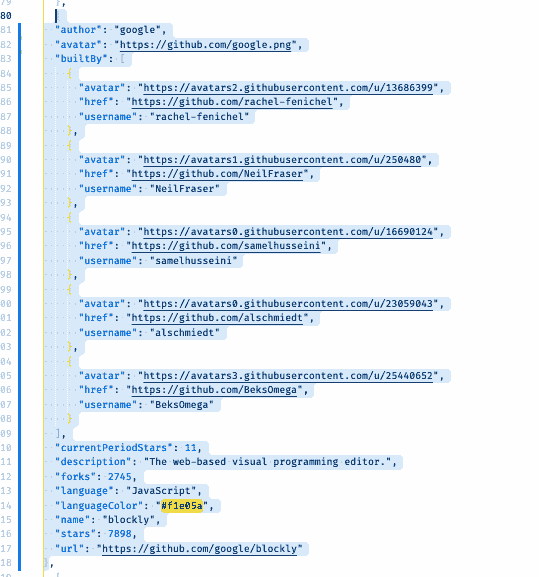

# 9 VS 代码实践来加速您的开发

> 原文：<https://betterprogramming.pub/9-marvelous-vscode-practices-you-need-to-do-now-in-2022-2ed881de8fce>

## 成为更好的 VS 编码员

*Jexo 在 Unsplash 上的照片*

在本帖中，我们将回顾一些 VSCode 实践，如果您正在使用 VSCode，并且希望与社区中的其他人一起使用让它变得如此棒的功能，那么您来对了本帖，因为我们在同一个团队中，是时候检查我们精彩的 VS Code 功能列表了！

这篇文章的目标是揭露至少*一个关键的* VSCode 特性，你不知道它对开发有很大的积极影响。如果我对至少一个人产生了影响，帮助他们改善了开发体验，那么我就实现了我的目标。

任何人最不希望的事情就是意识到他们已经错过了一个关键的特性，他们可能一直在使用这个特性。没有人希望这样。

你可以在那里找到许多文章，列出了令人敬畏的 VS 代码特性，但是有一件事他们没有做，那就是解释*为什么每个特性在他们自己的体验中加速了开发*。有时候，如果人们不理解*一个有用的特性如何影响他们作为人类的编码体验，那么这个特性就没有用。*

所以事不宜迟，让我们开始吧！

# 1.拆分终端和终止活动终端(推荐:将它们都绑定到快捷键)

如果您在桌面上开发所有项目，并在 VSCode 中使用终端，那么这个特性是必须的。

在 VS 代码中使用终端可以让您在执行 git 之类的命令行操作时呆在编辑器中。这是有帮助的，并随着时间的推移节省额外的脑细胞。

您可以通过以下两种方式之一执行拆分端子:

1.  打开命令窗口(Ctrl + P)>点击*端子:拆分端子*
2.  绑定到快捷键。我用`Ctrl + Shift + 5`

更有用的是*杀死你刚创建的终端*。这是一个游戏改变者，如果你像我一样，希望保持当前终端不变，只是希望快速打开一个终端来执行某人或多个命令以查看输出，*然后在我们完成后关闭以返回到我们正在用另一个终端做的事情*。

这是因为我们不想*篡改我们要返回的那个的当前 stdout* 输出。只是一些强迫症。(开玩笑)。当我们习惯于眨眼之间这样做时，我们的压力水平真的会有明显的变化。

看看下面这段简短的录音。在左边，你可以看到我将把当前月份赋给变量`todaysMonth`。但是由于我忘记了现在是几月，我开始快速打开一个终端，检查现在是几月，然后关闭它，回到变量:

图片来源:jsmanifest

就是这样的小动作，让我们的开发体验*快*，*刺激*，更*高效*！

# 2.切换终端面板(推荐:绑定到快捷键)

如果您在 VSCode 中使用终端，那么打开和关闭终端也很有用。有两种方法可以做到这一点:

1.  打开命令窗口(Ctrl + P)>点击*查看:切换终端*
2.  绑定到快捷键。我用`Ctrl + ~`

将此与*分离端子*、*杀死活动端子*结合使用，体验更佳。如果你是一个思维敏捷的人，你可以在编辑文件时绕着编辑器跳来跳去，通过利用这些快捷方式，你可能会比以前更想完成你的项目。我只是从我的经验来说，因为我完成事情越快，我就越有动力去做下一个任务。

# 3.将大小切换到内容宽度/自动换行

当我们编写代码时，为了更好的可读性，当代码达到一定的列数时，将长代码换行是很有用的。

正常情况下，我们不得不点击并按下退格键，以便在一条直线上组合和阅读长句，但实际上有一个隐藏的快捷方式可以为我们在整个文件*中做到这一点，而不改变文件*。

以下面这个例子为例。这看起来不太好读，而且在最初的几秒钟内也不清楚哪些内容与哪些内容组合在一起:

图片来源:jsmanifest

如果在整个项目中多个文件都是这样，我们可能会失去理解代码的动力。在这里，动机是关键。如果我们想保持动力，那么我们应该让通读代码变得更容易。现在当然*写*更干净的代码应该是重点，但是当代码行变长时，即使[更漂亮的](https://marketplace.visualstudio.com/items?itemName=esbenp.prettier-vscode)也没有多少办法让长代码行看起来更漂亮。

VSCode 提供了一个“escape hatch ”,在这里我们可以切换编辑器的最大列数，该编辑器正在换行超过我们的设置中设置的最大列数的代码行。

通过按下`Alt + Z`，我们可以暂时禁用它，然后我们可以以更直接、更优雅的方式通读长行代码:

图片来源:jsmanifest

# 4.检查编辑器标记和范围

当我们想要自定义我们的代码主题时，无论是来自 VScode、codesandbox，还是来自我们的个人博客，有时我们都希望使用当前代码主题的某种颜色或背景。

例如，我在 VScode 中使用了材质主题“高对比度”,我最喜欢的部分是 react 组件上的金色亮点:

图片来源:jsmanifest

您可以自己在主题的 JSON 配置中查找，或者使用 Inspect Editor Tokens and Scopes 特性，以一种更快、更酷的方式找到这些信息。

继续按下`Ctrl + P`，输入`inspect`，点击`Developer: Inspect Editor Token and Scopes`。

打开这个选项后，你就可以在文件中移动光标，检查当前代码的 AST 标记，以获得类似于*前景*或*背景*颜色的信息:

图片来源:jsmanifest

# 5.切换行注释(推荐:绑定到快捷键)

这是 VSCode 的顶级特性之一，从我开始使用 VSCode 的第一周开始，我就很高兴能使用它。

这个特性的伟大之处在于，它让您不必点击行首*来注释行*。这样日积月累就省时间了！

要对一行冷菜进行行注释，按下`Ctrl`并点击`/`按钮。

这变成了:

图片来源:jsmanifest

简介:

图片来源:jsmanifest

# 6.切换块注释(推荐:绑定到快捷键)

除了切换行注释，我们还可以使用块注释语法来切换注释。

例如这段代码:

图片来源:jsmanifest

变成了:

图片来源:jsmanifest

为此，默认快捷键是`Shift + Ctrl + L`

然而，我建议使用`Ctrl + Shift + /`来更紧密地与行注释快捷方式对齐，因为它*感觉正确*。

# 7.快速滚动敏感度(推荐:绑定到快捷键)

你的鼠标滚动代码的速度是否比预期的慢？你有两个选择:

1.  在电脑的设置中设定您的滚动敏感度。
2.  在计算机的设置中保留您的滚动敏感度，但在 VSCode 中设置您的滚动敏感度。

我们大多数人可以很容易地选择第一个选项，然后就到此为止，但我们已经习惯了 VSCode 之外的滚动敏感性。也许我们滚动抖音内容的速度是我们喜欢的方式，或者滚动我们的脸书新闻感觉就像现在这样。

VSCode 实际上提供了一个组合键，你可以*同时按住 Alt 和 scroll 来执行更快的滚动，然后放开 Alt 回到正常速度滚动*。

这一点很重要，因为实际上*并没有出现在我们的 json 设置视图模式*！所以很容易被错过。换句话说，我们中的一些人永远不会知道这个选项的存在，除非我们使用 *GUI 模式*。

# 8.对代码行排序(升序/降序)

我们经常发现自己在处理一个大对象，我们希望对所有的键/值对进行排序。当我们必须经常上下搜索键/值对时，我们尤其需要对它们进行排序。

如果我们能把这些键值对按字母顺序排序就好了，这样我们的眼睛就可以轻松一点，它们不会移动太多。

VSCode 有一个对行进行排序的特性，所以我们可以这样做，如下所示:

图片来源:jsmanifest

# 9.对 JSON 对象排序(升序/降序)

除了对代码行进行排序，我们还可以对 JSON 对象进行排序。这非常方便，因为我们经常使用 JSON 对象，无论是来自 API 响应还是在个人项目中操作数据。

继续安装 [Sort JSON objects](https://marketplace.visualstudio.com/items?itemName=richie5um2.vscode-sort-json) 扩展并寻找一个 JSON 对象，然后按`Ctrl + P`，搜索并点击`Sort JSON`。

图片来源:jsmanifest

我们也可以右键单击并选择菜单上的选项。我只需要*排序 JSON* 选项，所以我通常会禁用其他选项。

# 结论

本帖到此结束！我希望你发现这是有价值的，并期待在未来更多！