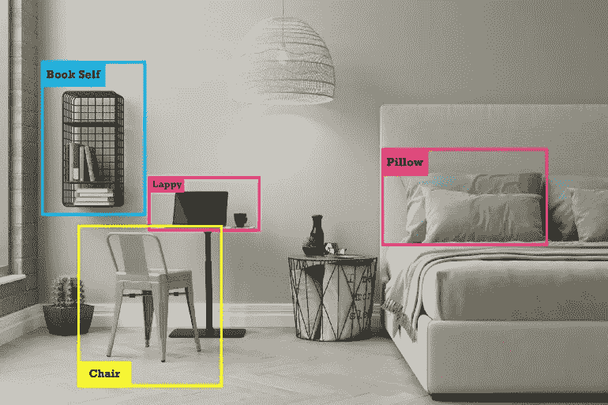
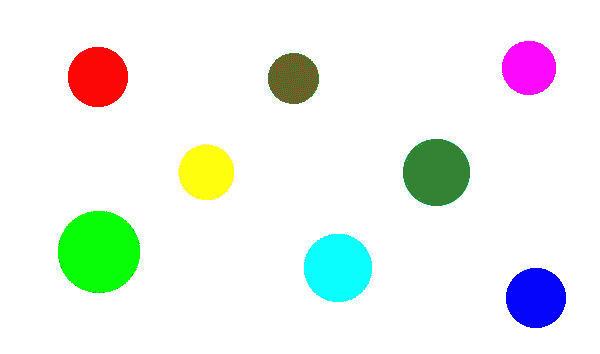
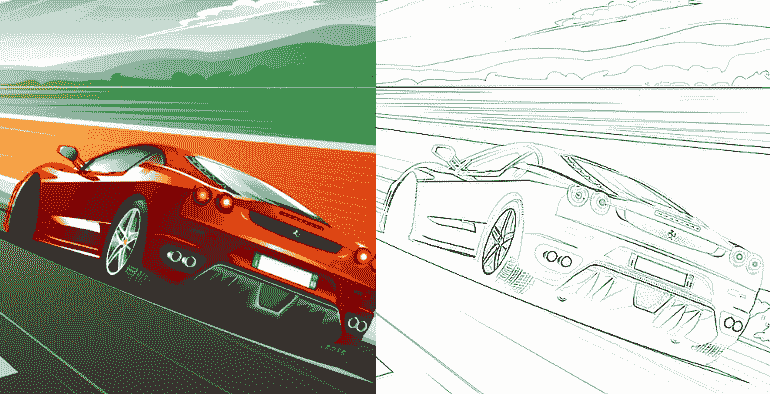
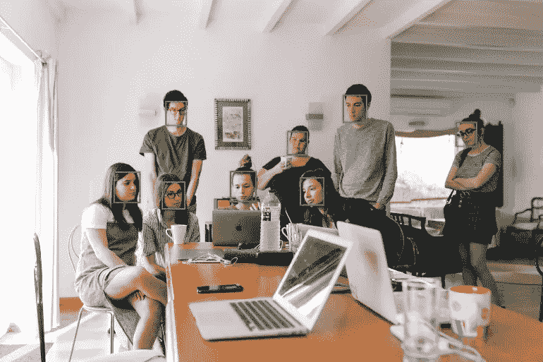
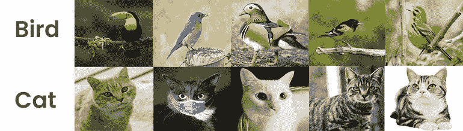
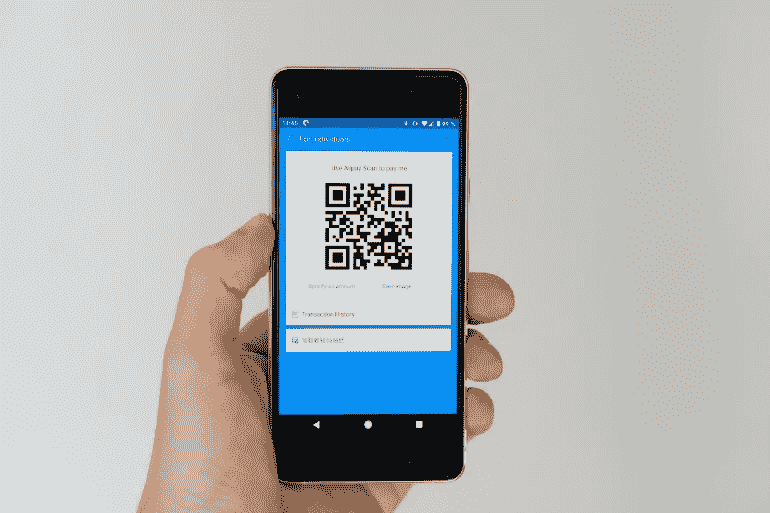
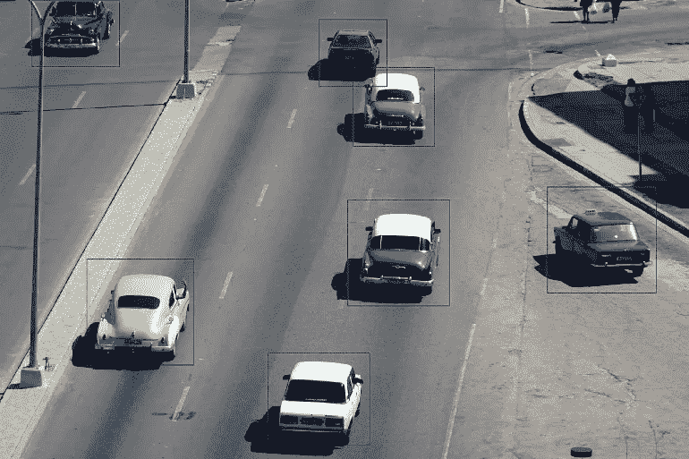
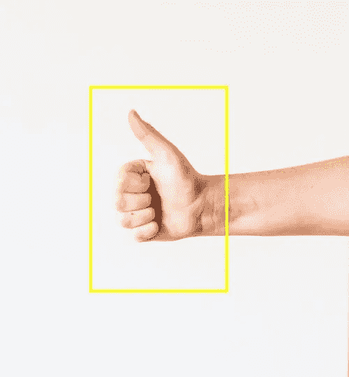

# 9 个最受欢迎的计算机视觉项目创意和有用资源

> 原文：<https://betterprogramming.pub/9-most-popular-computer-vision-project-ideas-with-useful-resources-74fd8b8e481>

## 帮助你学习新技能的项目

[钳工](https://unsplash.com/@benchaccounting?utm_source=unsplash&utm_medium=referral&utm_content=creditCopyText)在 [Unsplash](https://unsplash.com/s/photos/work-on-laptop?utm_source=unsplash&utm_medium=referral&utm_content=creditCopyText) 上拍照

人工智能的发展出现了许多新的领域，计算机视觉就是其中之一。

**计算机视觉**使系统能够从视频、图像和其他视觉输入中导出和提取有用的信息。

如果人工智能是为了让系统思考而设计的，那么计算机视觉可以让它们看到、观察和理解。

现在，计算机视觉被广泛应用于各种行业，其视野从公用事业到能源——制造业和汽车。

# 面向初学者的顶级计算机视觉项目创意

正如我们现在所知道的，计算机视觉涉及从视觉输入中提取信息，并且它还可以用于各种应用，以在许多层面上自动化系统。

计算机视觉的一些常见用途包括安全检查、逆向工程、图像编辑和处理、自主导航、机器人和计算机动画。

在本文中，我们将看看一些顶级的计算机视觉项目想法，您可以在 Python 的帮助下自己执行这些想法。

如果你了解 [Python 的库](https://towardsdatascience.com/best-python-libraries-for-every-python-developer-77daab4fa40e)，主要是 [OpenCV](https://opencv.org/) ，这些计算机视觉项目的思路是给你的。

# 1.目标跟踪

[台阶](https://unsplash.com/@thestandingdesk?utm_source=unsplash&utm_medium=referral&utm_content=creditCopyText)在[台阶](https://unsplash.com/?utm_source=unsplash&utm_medium=referral&utm_content=creditCopyText)上拍照

在不使用现代免费工具和资源的情况下，物体跟踪是计算机视觉的高级项目。

但是大量资源和免费工具的可用性使它成为计算机视觉中一个毫不费力的基本项目。现在，它是计算机视觉初学者尝试的第一批项目之一。

通常有两种类型的项目——一种是像 raspberry pi 这样的嵌入式系统，另一种是实时对象跟踪，比如计算机的网络摄像头和智能手机的摄像头。

计算机视觉中使用各种算法来执行这样的项目，一些最流行的算法有 [S.S.D .(单次检测器)](https://towardsdatascience.com/review-ssd-single-shot-detector-object-detection-851a94607d11)， [R-CNN 的(基于区域的卷积神经网络)](https://en.wikipedia.org/wiki/Region_Based_Convolutional_Neural_Networks#:~:text=Region%20Based%20Convolutional%20Neural%20Networks%20(R%2DCNN)%20are%20a,vision%20and%20specifically%20object%20detection.)，Y [OLO(你只看一次)](https://pjreddie.com/darknet/yolo/)等。

以下是一些视频数据集，您可能会对这项计算机视觉任务感兴趣:

*   [TLP 数据集](https://amoudgl.github.io/tlp/)
*   [追踪网](https://tracking-net.org/)
*   [MOT17](https://motchallenge.net/data/MOT17/)

# **有用的资源**

 [## OpenCV:对象检测(objdetect 模块)

### 想知道你的数码相机是如何检测人和脸的吗？看这里找到答案！级联分类器语言…

docs.opencv.org](https://docs.opencv.org/3.4/d2/d64/tutorial_table_of_content_objdetect.html)  [## 物体探测技术| Axonator

### 使用对象检测技术质量控制模块识别和定位图像或视频中的各种对象…

axonator.com](https://axonator.com/object-detection-technology) 

# 2.颜色检测

由作者创建

颜色检测是想要开始使用计算机视觉模块 open-cv 的初学者的基本项目之一。

有了这个，你可以学习各种颜色是如何相互区分的，你也可以很好地掌握像遮罩这样的概念。

这个初学者的颜色检测项目也可以帮助学习其他详细的功能，比如 NumPy 阵列的这些彩色图像如何以 RGB 图像的形式堆叠。

然而，对于更复杂的颜色检测项目，将需要使用深度学习模型，如 CANET 和 UNET，并且它将提供困难的分类和分割。

# **有用资源**

*   [Python 中的颜色检测项目](https://data-flair.training/blogs/project-in-python-colour-detection/)

以下是一些有趣的数据集，您可能希望将其用于您的项目:

*   [谷歌-512 数据集](https://cvhci.anthropomatik.kit.edu/~bschauer/datasets/google-512/)
*   [乐高颜色](https://www.kaggle.com/thijshavinga/lego-colors)
*   [护照颜色](https://www.kaggle.com/bezrukov/passport-colors)

# 3.边缘检测

由作者创建

**边缘检测**是计算机视觉中的一种现代图像处理技术，广泛用于识别图像中不连续的特定点。

图像亮度急剧变化的这些点被称为边缘或边界。

用于边缘检测的广泛使用和流行的计算机视觉算子之一是 **canny 边缘检测器。**

它使用多阶段算法来检测给定视觉输入中的各种边缘。捕捉图像边缘背后的主要思想是捕捉图像中描绘的基本事件，然后执行任何期望的改变，并从该特定图像中提取某些信息。

# **有用的资源**

 [## Python 中的谨慎边缘检测——计算机视觉

### 这是一个简单易懂的教程，一步步讲解如何构建 Canny 边缘检测算法。

towardsdatascience.com](https://towardsdatascience.com/canny-edge-detection-step-by-step-in-python-computer-vision-b49c3a2d8123)  [## 比较边缘检测方法

### 有许多不同的边缘检测方法，如果你想知道他们如何相互比较…

medium.com](https://medium.com/@nikatsanka/comparing-edge-detection-methods-638a2919476e) 

# 4.人脸检测

照片由[福克斯](https://www.pexels.com/@hillaryfox?utm_content=attributionCopyText&utm_medium=referral&utm_source=pexels)从[像素](https://www.pexels.com/photo/group-of-people-watching-on-laptop-1595385/?utm_content=attributionCopyText&utm_medium=referral&utm_source=pexels)拍摄

人脸检测是一项相对简单的任务，可以被称为计算机视觉的基础级项目。

但是，当我们走向人脸识别时，它是一个中级的计算机视觉项目，但它也是从人脸检测开始的。

计算机视觉中的人脸检测使用将人脸从其背景和周围的其他物体中分离出来的方法。

对于人脸检测，[使用 haar 级联分类器](https://towardsdatascience.com/computer-vision-detecting-objects-using-haar-cascade-classifier-4585472829a9)，因为它有助于在一帧中检测不止一个人脸，而是多个人脸。

对于正面人脸，haar 级联分类器通常是一个 XML 文件，与 open-cv 模块相耦合，用于读取和检测人脸。

此外，在高级水平上，诸如定向梯度直方图(H.O.G .)的各种机器学习模型也可以与支持向量机(SVMs)一起使用来执行面部检测的任务。

# **有用的资源**

 [## 使用 Python 和 OpenCV 进行人脸识别|人脸识别

### 在本文中，我们将了解什么是人脸识别，以及它与人脸检测有何不同。我们将简单介绍一下…

www.mygreatlearning.com](https://www.mygreatlearning.com/blog/face-recognition/)  [## OpenCV:使用 OpenCV 进行人脸识别

### OpenCV(开源计算机视觉)是一个流行的计算机视觉库，由英特尔于 1999 年创建。跨平台…

docs.opencv.org](https://docs.opencv.org/3.4/da/d60/tutorial_face_main.html) 

# 5.图像分类

由作者创建

图像分类是涉及计算机视觉的最重要和最突出的深度学习应用之一。

然而，要做这样一个涉及分类的项目，通常需要很好地掌握 TensorFlow、Keras 和 Python。

通过从事这样的项目，你可以学习深度学习中分类所涉及的各种技术和算法。

可以用于图像分类的数据集是 [CIFAR-10](https://www.cs.toronto.edu/~kriz/cifar.html) ，因为它提供了分为十个目标类别的 60，000 多张图片。因此，在 CIFAR-10 中，每个目标类有 6，000 个图像。

虽然该数据集中的照片分辨率低于其他数据集，但它让您可以测试多种算法，而没有任何技术问题和延迟。

# **有用资源**

# 6.条形码和二维码扫描仪

照片由[马库斯·温克勒](https://unsplash.com/@markuswinkler?utm_source=unsplash&utm_medium=referral&utm_content=creditCopyText)在 [Unsplash](https://unsplash.com/s/photos/barcode?utm_source=unsplash&utm_medium=referral&utm_content=creditCopyText) 上拍摄

条形码和 QR 码扫描仪是另一个初级计算机视觉项目，您可以在 Python 的帮助下轻松快速地构建它。

你所要做的就是安装 [pyzbar 库](https://pypi.org/project/pyzbar/)和 OpenCV 的默认计算机视觉库。

Pyzbar 库旨在提供解码功能，可以轻松地从图像中的 QR 码和条形码中定位和提取信息。

除此之外，您还可以将 pyzbar 与 OpenCV 一起使用，在 decode 函数检测到的 Q.R .和条形码周围显示一个检测框。这是一个非常简单的实现，使用这两个库没有什么大不了的。

从事这样的项目会让你熟悉计算机视觉的现实应用。

# **有用的资源**

 [## Python 条形码和二维码阅读器

### 在本文中，我将带您了解如何使用 Python 和机器学习制作条形码和二维码阅读器…

thecleverprogrammer.com](https://thecleverprogrammer.com/2020/10/23/barcode-and-qr-code-reader-with-python/)  [## 使用 Python 构建条形码/QR 码阅读器

### 使用 Pyzbar 库的简单且可实际操作的机器学习项目

towardsdatascience.com](https://towardsdatascience.com/building-a-barcode-qr-code-reader-using-python-360e22dfb6e5) 

# 7.车辆计数

杰里米·贝赞格在 [Unsplash](https://unsplash.com/photos/grj6q49sxSo?utm_source=unsplash&utm_medium=referral&utm_content=creditCopyText) 上的照片

随着监控系统的发展，几乎所有的地方都配备了人工智能系统，人工智能与摄像头相结合，提供有效的监控。

如果有一个在监控中集成人工智能的缩影，那就是这些检测和计数车辆的摄像头。虽然车辆计数是这些摄像机的基本功能，但它们也可以临时改装并用于各种其他目的。

它是计算机视觉的一个相对中级的项目，因为它需要多种功能。整个过程包括帧差分，图像阈值，轮廓发现，图像膨胀，我们可以得到一个结果项目，可以依靠这些过程计数车辆。

这个项目完全依赖于 Python 和 OpenCV 库。

# **有用的资源**

 [## 基于 OpenCV 和 Python 的视频车辆检测

### 对智能城市的想法感到兴奋？你会喜欢这个关于建立自己的车辆检测系统的教程，我们将…

www.analyticsvidhya.com](https://www.analyticsvidhya.com/blog/2020/04/vehicle-detection-opencv-python/)  [## 车辆检测和跟踪

### “只要有摄像机，你绝对可以成为超人”。埃隆·马斯克在 TED 演讲。

towardsdatascience.com](https://towardsdatascience.com/vehicle-detection-and-tracking-44b851d70508) 

# 8.手势识别

照片由[真诚媒体](https://unsplash.com/@sincerelymedia?utm_source=unsplash&utm_medium=referral&utm_content=creditCopyText)在 [Unsplash](https://unsplash.com/s/photos/hand-gesture?utm_source=unsplash&utm_medium=referral&utm_content=creditCopyText) 上拍摄

在这个项目中，您设计了一个检测手势的系统。然后可以命令不同的手势执行不同的任务，你甚至可以用一个依赖于你的手势的系统来玩电脑游戏。

然而，虽然手势识别这个简单的项目是一个基本的计算机视觉项目，但您可以通过添加许多手势并针对每种类型的手势进行指挥来使它变得复杂。

这个项目使用的 Python 库是 OpenCV，可以贴上几乎所有计算机视觉和深度学习项目的初级库的标签。此外，假设你想设计一个基于手势操作的系统，比如你的电脑。

在这种情况下，可以借助另一个名为 [**的 Python 库 Pyautogui 库**](https://pypi.org/project/PyAutoGUI/) 来完成。这个库旨在帮助控制键盘和鼠标，而无需任何用户交互。

# **有用的资源**

 [## 用 OpenCV 玩 Chrome 的恐龙游戏

### 当没有互联网连接时，你会在 Chrome 浏览器上看到什么？是的，每个人都知道恐龙…

levelup.gitconnected.com](https://levelup.gitconnected.com/playing-chromes-dinosaur-game-using-opencv-19b3cf9c3636)  [## 使用神经网络从零开始构建手势识别-机器学习简单而有趣

### 从自拍图像到学习神经网络模型

towardsdatascience.com](https://towardsdatascience.com/build-hand-gesture-recognition-from-scratch-using-neural-network-machine-learning-easy-and-fun-d7652dd105af) 

查看这些数据集，开始行动:

*   [0 到 5 位数的手势](https://www.kaggle.com/shirleylizz/hand-gestures-of-digits-from-0-to-5)
*   [手势识别数据库](https://www.kaggle.com/gti-upm/leapgestrecog/version/1)
*   [多模态手势数据集](https://www.gti.ssr.upm.es/data/MultiModalHandGesture_dataset)

# 9.自主车辆中的道路车道检测

这可能是迄今为止我们列出的最先进的项目，这是自动化车辆理念背后的主要项目。然而，自动化车辆的想法非常复杂，道路车道检测只是其中的一部分。

在这个项目中，你将设计一个计算机视觉系统，可以检测道路的车道及其边缘。

道路车道检测以阈值化视觉输入的方式工作。将图像的视觉输入阈值化为灰度，从而使系统更容易检测车道。

OpenCV 库用于这个项目，还有一个 Canny 边缘检测器，用于检测道路上的边缘。确定车道和道路的边缘决定了车辆的运动，并将其保持在指定的区域内。

# **有用的资源**

# 结论

计算机视觉是几十年来对深度学习中的自动系统以及我们如何用各种视觉输入来命令它们的研究的结果。

在本文中，我们仅列举了众多计算机视觉项目中的九个，但是作为初学者，您可以实现许多项目及其数据集。

如果对 Python 和 OpenCV 有很好的理解，你可以在人工智能和计算机视觉领域超越，成为未来人工智能和计算机视觉的积极参与者。

# 寻找更多有趣的文章？看看这些:

 [## 给 Python 开发者的 10 个很酷的 Python 项目想法

### 您可以使用 Python 构建的有趣想法和项目列表

towardsdatascience.com](https://towardsdatascience.com/10-cool-python-project-ideas-for-python-developers-7953047e203)  [## 12 个适合初学者和专家的酷数据科学项目创意

### “到目前为止，您已经完成了多少个数据科学项目？”

towardsdatascience.com](https://towardsdatascience.com/12-cool-data-science-projects-ideas-for-beginners-and-experts-fc75b5498e03)  [## GitHub 上十大热门 Python 项目

### 像这样的 GitHub 项目是人们创造力和才华的完美展示

towardsdatascience.com](https://towardsdatascience.com/top-10-trending-python-projects-on-github-fb852cd58262) 

# 了解作者

**克莱尔 D** 。是 **Digitalogy** 的内容设计师和战略家，他可以将你的内容想法转化为清晰、引人注目、简洁的文字，与读者建立强有力的联系。

在 [**上跟我连线**](https://medium.com/@harish_6956)**[**Linkedin**](https://www.linkedin.com/in/claire-d-costa-a0379419b/)**&[**Twitter**](https://twitter.com/ClaireDCosta2)**。******