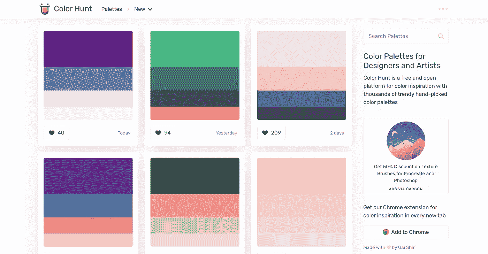
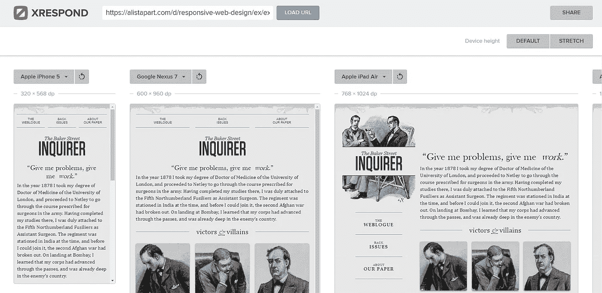
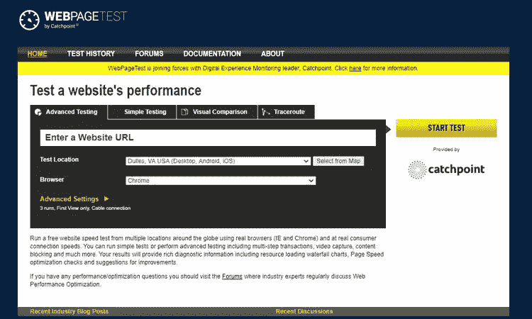
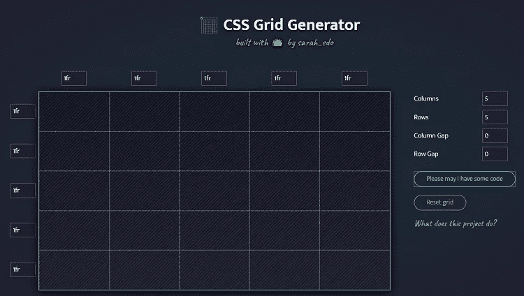
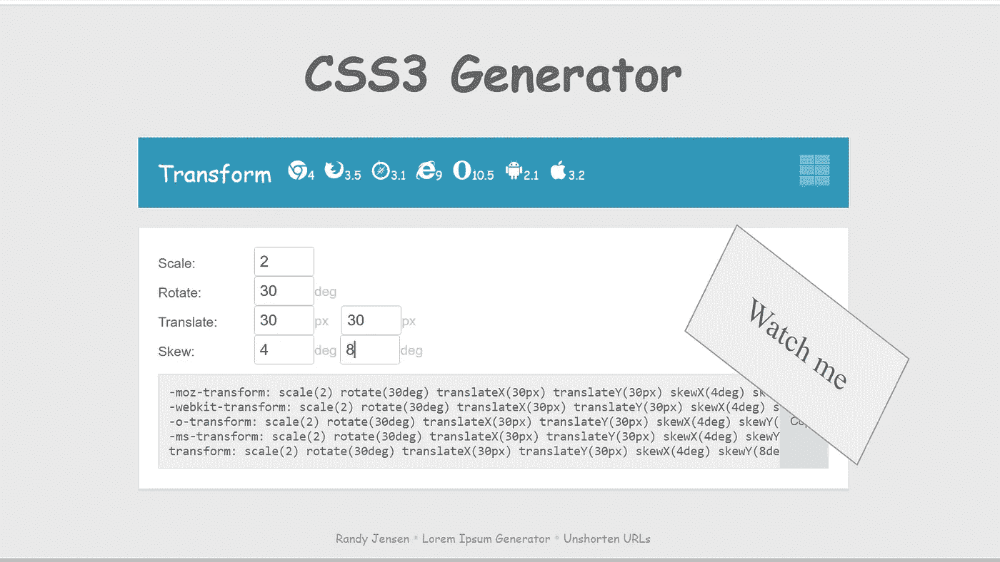
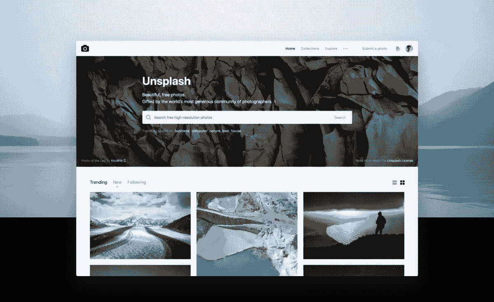
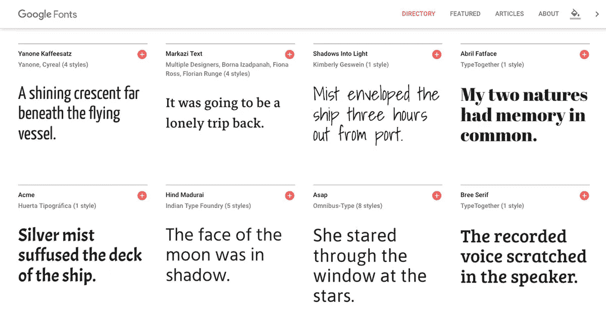
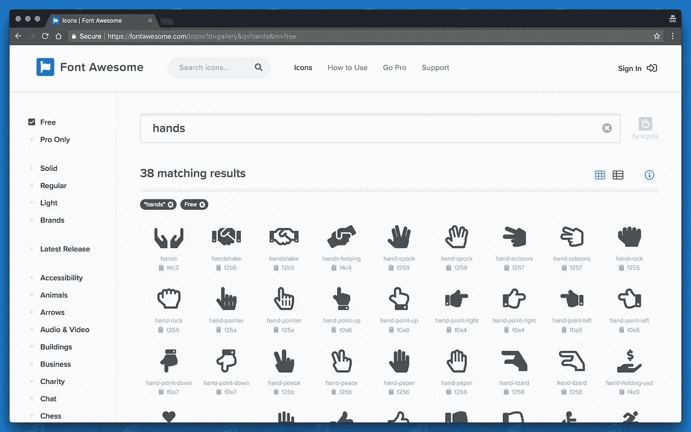
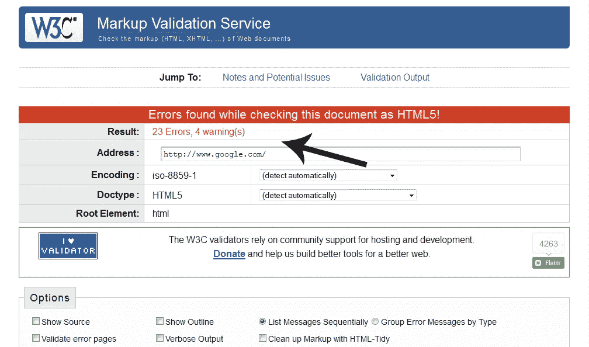

# Web 开发人员必备的 9 种工具和资源

> 原文：<https://betterprogramming.pub/9-must-have-tools-and-resources-for-web-developers-86d6832f0242>

## 从 CSS 代码片段生成器到标记验证器，这些工具是 web 开发人员虚拟工具箱的必备工具

图片由[克里斯蒂娜](https://unsplash.com/@wocintechchat)从 Unsplash

虽然学习网页设计或网页开发所需的技能是从事网页工作的第一步，但它还包括熟悉行业工具。

这里列出了九个在线工具，你可以把它们添加到你的虚拟工具箱中，这些工具是你进行网络开发、网页设计或者两者都需要的。

# 1.调色板—色彩搜索

[Color Hunt](https://colorhunt.co/) 是一个开放的调色板集合。该工具提供了数千种美学配色方案及其颜色代码。这是为你的项目寻找色彩灵感和完美调色板的好工具。

您可以保存您最喜爱的调色板，管理您的个人收藏，并快速访问复制颜色代码。

# 2.响应式设计— XRespond

XRespond 应用程序是一个“虚拟设备实验室”，你可以预览任何网站在各种设备上的外观，包括各种型号的 iPhone、iPad、诺基亚、谷歌 Nexus、Kindle 和 Chromebook。

它有一个下拉菜单，可以从各种智能手机、平板电脑和笔记本电脑中进行选择，以测试特定的设备。如果你想知道你的站点在特定的显示器上是如何显示的，它还支持自定义的宽度/高度设置。

虽然测试应该在真实的设备上进行，但是这个工具可以让你在不同的设备上模拟你的站点，让人们在客户会议上明白你的意思。

**注意:**如果你正在寻找一个类似的工具来模拟你正在本地构建的项目，一个很好的选择是[我有反应能力吗](http://ami.responsivedesign.is/)。虽然在屏幕尺寸和其他功能上有所限制，但它允许你通过使用地址栏中的`http://localhost/`来了解你的网站在各种设备上会是什么样子。

# 3.网页性能测试——网页测试

[WebPageTest](https://www.webpagetest.org/) 是最流行的测量网页性能的工具之一，而且是免费的。它使您能够从世界各地的许多不同位置，在许多不同的浏览器中，在您的站点上运行 web 性能测试。

进入你的网站，点击开始测试。显示的输出窗口显示了网页的以下参数值:

*   加载时间:加载页面所需的时间
*   第一字节时间:请求开始执行的时间
*   页面大小:网页的总大小
*   请求:您的网页发出的请求数

它还提供信息，包括网站托管性能检查、资源加载瀑布图和改进建议。

# 4.可视化网格生成器— CSS 网格生成器

CSS 网格在相当长的一段时间内已经成为 CSS 最令人兴奋的发展。它是一个专门的 CSS 工具，用于构建你能想到的任何 web 布局，从最简单到最复杂，让使用浮动来设计布局的黑暗日子一去不复返。

CSS 网格生成器是一个在线工具，面向那些更喜欢使用可视化编辑器编写布局的人。界面超级光滑，你可以很快组装出一个基本的 CSS 网格布局。

**注意:**你需要媒体的询问才能使版面反应灵敏。

# 5.CSS 代码生成器— CSS3 生成器

[CSS3 生成器](https://css3generator.com/)是我最喜欢的工具之一，可以在可视化的帮助下轻松生成 CSS 代码。你可以为盒子大小，转换，变换，flexbox，列等生成 CSS 代码。

它是免费软件，不需要下载，允许用户通过下拉框选择选项。

# 6.免费库存照片— Unsplash

Unsplash 是一个很好的免费图片资源，你可以在你的网络开发项目中使用它。它[授予您](https://unsplash.com/license)一项“不可撤销的、非排他性的、全球范围的版权许可，允许您免费下载、复制、修改、分发、表演和使用来自 Unsplash 的照片，包括用于商业目的，无需获得摄影师或 Unsplash 的许可或授权。”

该平台拥有超过 207，000 名投稿摄影师，每月在其超过 200 万张照片的不断增长的库中生成超过 170 亿张照片。

# 7.免费网络字体——谷歌字体

[根据](https://fonts.google.com/)[维基百科](https://en.wikipedia.org/wiki/Google_Fonts)的说法，谷歌字体是“一个超过一千个免费和开源字体系列的库，一个用于浏览库的交互式网络目录，以及通过 CSS 和 Android 使用字体的 API。”

由于 Google Fonts 目录中列出的所有字体都是开源的，所以你不仅可以在任何网页上使用它们，无论是商业的还是非商业的，而且，与 Typekit 不同，你还可以将它们下载到你的计算机上，甚至自己进行调整！

**使用谷歌字体:**

*   使用左侧的过滤器显示您想要选择的字体种类，并选择您喜欢的几种字体。
*   要选择字体系列，请按下旁边的⊕按钮。
*   选择字体系列后，按页面底部的[数字]系列选择栏。
*   在出现的屏幕中，首先需要复制显示的 HTML 代码行，并将其粘贴到 HTML 文件的头部。将它放在现有的`[<link>](https://developer.mozilla.org/en-US/docs/Web/HTML/Element/link)`元素之上，这样在您尝试在 CSS 中使用它之前，字体就会被导入。
*   然后，您需要将列出的 CSS 声明适当地复制到您的 CSS 中，以便将自定义字体应用到您的 HTML 中。

一些最流行的谷歌字体是 Robotto，Lato，Open Sans，Montserrat。

# 8.免费网络图标——字体真棒

字体牛逼是给你的网站添加字体图标最流行的方式。字体很棒的图标是用可缩放的矢量创建的，所以你可以使用在任何屏幕尺寸下都能很好工作的高质量图标。

它是免费的、开源的、GPL(通用公共许可证)友好的。您可以将它用于商业项目、开源项目或几乎任何您想要的项目。

**在 CSS 中使用字体牛逼图标:**

*   将整个`font-awesome`目录复制到您的项目中。
*   在你的 HTML 的`<head>`中，引用你的`font-awesome.min.css`的位置。
    `<link rel="stylesheet" href="path/to/font-awesome/css/font-awesome.min.css">`
*   使用 CSS 前缀`fa`和图标名称，你可以在任何地方放置字体很棒的图标。字体 Awesome 被设计成与行内元素一起使用，更语义上是``。
*   这里有一些[例子](https://fontawesome.com/v4.7/examples/)来帮助你更好地理解如何在你的项目中使用字体牛逼的图标。

# 9.标记验证— W3C 验证程序

标记验证是确保网页技术质量的重要一步。[标记验证服务](https://validator.w3.org/)是万维网联盟的一个验证器，它允许互联网用户对照文档类型定义检查 HTML5 之前的 HTML 和 XHTML 文档的格式良好的标记。

W3C 验证帮助你在搜索引擎中获得更好的排名。代码中的错误会影响网站的性能，并对网站的 SEO 产生很大的影响，因为搜索引擎在搜索时会检查网站的 HTML 或 XHTML 代码。

# 附加阅读

 [## 让你的用户界面设计更容易理解的 10 种方法

### #10:知道可及性不是创新的障碍

better 编程. pub](/10-ways-to-make-your-ui-designs-more-accessible-5544c1e8d663)