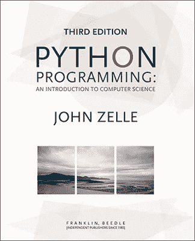
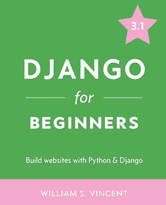
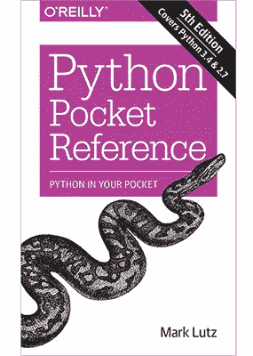
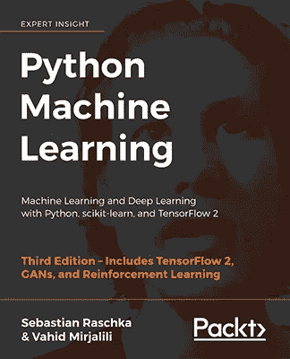
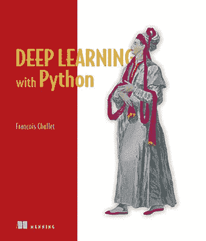
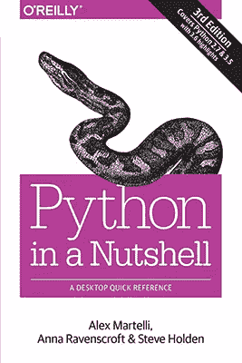
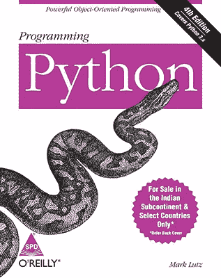
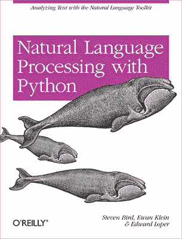

# 2021 年必读的 9 本 Python 书籍

> 原文：<https://betterprogramming.pub/9-must-read-python-books-in-2021-f7d932d4021b>

## 你会推荐谁读哪本书？

照片由来自[佩克斯](https://www.pexels.com/photo/python-book-1181671/?utm_content=attributionCopyText&utm_medium=referral&utm_source=pexels)的[克里斯蒂娜·莫里洛](https://www.pexels.com/@divinetechygirl?utm_content=attributionCopyText&utm_medium=referral&utm_source=pexels)拍摄

> “编写 Python 代码的乐趣应该在于看到短小、简洁、易读的类，这些类用少量清晰的代码表达了大量的动作，而不是大量让读者厌烦得要死的琐碎代码。”
> 
> —吉多·范·罗苏姆

[Python 的](https://www.python.org/)受欢迎度和全方位的特性使其成为各种项目的完美编程语言。此外，这种受欢迎程度和企业的广泛采用导致了行业对熟练 Python 开发人员的强烈需求。

今天，有大量的资源，例如书籍、YouTube 频道、播客、GitHub repos、在线课程和网站，它们广泛涵盖了 Python 中的各种主题。

# Python 书籍

> 慢慢来，不要伤到你的大脑。

互联网上充满了学习 Python 的各种便利媒介。尽管我们之前讨论了更广泛采用的媒介，书籍仍然是学习者的最爱。书籍之所以在 Python 学习者中如此受欢迎，是因为它们允许读者按照自己的时间和节奏吸收和实践内容。

请继续关注我们，我们将在下面的列表中为所有技能水平的学习者发掘一些更著名的 Python 书籍。

# 1.想想 Python

*   **作者:**艾伦·唐尼
*   出版商:奥莱利
*   **难度:**初学者

《思考 Python》一书的封面

> “对于所有活产婴儿，平均怀孕时间为 38.6 周，标准差为 2.7 周，这意味着我们应该预计 2-3 周的偏差是常见的。”
> 
> 艾伦·b·唐尼

**《思考 Python》**无疑是了解 Python 编程基础的最佳书籍之一。这本书为初学者提供了一个很好的进入 Python 世界的切入点，采用了一种更渐进的方法来教授这些主题。

这本书的最新版本用 Python 3 版本更新了所有包含的代码示例，为学习者提供了最新的学习体验。这本书还附带了一些练习、案例研究和关于主题的详细解释。下面列出了“思考 Python”的一些主要亮点:

●为初学者提供直接从浏览器开始学习 Python 的诀窍。

●提供 Python 中概念的清晰定义。

●强调调试，教会读者快速发现、解决和避免错误。

# 2.Python 编程:计算机科学导论

*   **作者:**约翰·m·泽尔
*   **出版商:**富兰克林，比德尔
*   **难度等级:**初学者

《Python 编程:计算机科学导论》一书的封面

由于 Python 的易用性和简单性，它可以成为初学者的首选编程语言。类似地，“Python 编程:计算机科学入门”的唯一目标就是让初学者尽可能容易地掌握 Python 的基础知识。

作者的目标是将这本书用作大学级别的教科书，为此，作者采取了更多的传统方法来教授 Python，重点关注问题解决、程序设计和编程作为核心技能。所以，如果你是大学生，想学习 Python，我们推荐试试这本书。这本书的主要亮点如下:

●注重使用易于使用的图形包，鼓励使用这种图形用户界面包

●大量有趣的例子和章节末练习

●专注于帮助读者掌握基础知识，而不要用 Python 的全部主题来淹没他们

# 3.Django 初学者:用 Python 和 Django 构建网站

*   **作者:**威廉·文森特
*   **发布者:** WelcomeToCode
*   **难度:**初学者

《Django 初学者:用 Python 和 Django 构建网站》一书的封面

[**Django**](https://www.djangoproject.com/) 已经成为现代开发者中最受欢迎的 web 应用开发框架之一。用 Python 构建的 Django 已经证明了自己有足够的能力提供构建令人惊叹的 web 应用程序所需的几乎所有东西，而无需深入核心 Python。

从一个简单的 Hello World 开始，“ **Django for 初学者:用 Python 和 Django 构建网站”**”完美地提供了一种循序渐进的方法，教你如何构建全面的 Django 应用程序。这本书还重点教你维护安全性、定制外观和感觉以及有效测试应用程序的最佳实践。

除了 Hello World 应用程序之外，本书涵盖的其他应用程序包括:

Pages 应用程序

●留言板应用

●博客应用

●一款报纸应用

# 4.Python 口袋参考:口袋里的 Python

*   **作者:**马克·卢茨
*   出版商:奥赖利
*   **难度等级:**中级

《Python 袖珍参考:口袋中的 Python》一书的封面

> “在 Python 的思维方式中，显式比隐式好，简单比复杂好。”
> ――马克·卢茨

"**Python Pocket Reference:Python in Your Pocket**"并不是一个完整的 Python 学习资源，而是为开发人员提供了大量 Python 主题的即时参考。作者打算将这本书作为其他更全面的 Python 书籍的伴侣，这些书籍由提供教程、代码示例和其他学习材料。

这本书的最新版本涵盖了 Python 3.4 和 2.7 中所有需要知道的内容，同时也涵盖了这两个版本之间的差异。Mark 的袖珍参考资料是针对具有 Python 编程经验的开发人员的。这本书涵盖了几个主题，例如:

●常用的标准库模块和扩展

●用于创建和处理对象的语句语法

**●** 面向对象编程工具

●内置对象类型，如数字、字典等

●特殊运算符重载方法

# 5.Python 机器学习:使用 Python、scikit-Learn 和 TensorFlow 2 进行机器学习和深度学习

*   **作者:**塞巴斯蒂安·拉什卡&瓦伊德·米尔贾利利
*   **出版商:** Packt 出版公司
*   **难度等级:**中级

《Python 机器学习:使用 Python、scikit-learn 和 TensorFlow 2 进行机器学习和深度学习》一书的封面

多亏了 Python，机器学习的[热度在最近几年扶摇直上。**“**Python 机器学习:使用 Python、scikit-learn 和 TensorFlow 2 进行机器学习和深度学习**”面向的是具备编程语言基础知识的 Python 开发人员和数据科学家，他们渴望创建令人印象深刻的基于机器学习和深度学习的智能解决方案。如果你是其中之一，这本书将是最适合你的。**](https://towardsdatascience.com/a-tour-of-machine-learning-algorithms-466b8bf75c0a)

**谈到本书的内容，除了必要的介绍，第三版提供了大量关于机器学习主题的内容，例如:**

**●训练简单的 ML 算法**

**●带有 Scikit-learn 包的分类器**

**●建立良好数据集的步骤**

**●在应用中嵌入机器学习模型**

# **6.使用 Python 进行深度学习**

*   ****作者:**弗朗索瓦·乔莱**
*   **出版商:曼宁出版公司**
*   ****难度等级:**中级**

****

**《用 Python 进行深度学习》一书的封面**

**“**用 Python 进行深度学习**”是一本优秀的书，它简化了使用 Python 进行深度学习的复杂性。这本书的作者不是别人，正是著名的深度学习 Python API[Keras](https://keras.io/)的创造者。弗朗索瓦的书使用 Keras 作为深度学习世界和 Python 之间的桥梁，通过直观的解释和实际的例子来逐步建立你对该主题的理解。**

**这本书分为几个部分，涵盖了大多数关于机器学习和[神经网络](https://www.investopedia.com/terms/n/neuralnetwork.asp)的介绍性内容，以及深度学习在现实世界挑战和任务中的实际应用，例如:**

**●计算机视觉**

**●文本和序列**

**●最佳实践**

**●生成式深度学习**

# **7.Python 简括:桌面快速参考**

*   ****作者:**亚历克斯·马尔泰利，安娜·拉文斯克罗夫特&史蒂夫·霍尔登**
*   **出版商:奥赖利**
*   ****难度等级:**中级**

****

**《Python 简括:桌面快速参考》一书的封面**

**无论您过去是否使用过 Python，或者您是一名希望学习 Python 的资深开发人员，您都会发现“ **Python 一言以蔽之:桌面快速参考**”非常有用。这本书涵盖了 Python 世界中一系列广泛使用的主题，是 Python 编程语言的快速参考。**

**这本书的作者将它分成了五个部分，涵盖了从基础到核心功能以及更高级的功能。这五个部分的简要说明如下:**

**● **第一部分:**介绍和解释 Python 解释器**

**● **第二部分:**涵盖了核心 python 语言及其内置主题**

****●第三部分:**介绍 Python 库和扩展模块**

**● **第四部分:**用 Python 讲述网络和 web 编程**

**● **第五部分:**涵盖了 Python 程序的扩展，它的分布以及从 v2 到 v3 的迁移**

# **8.编程 Python:强大的面向对象编程**

*   ****作者:**马克·卢茨**
*   **出版商:奥赖利**
*   ****难度等级:**中级**

****

**《编程 Python:强大的面向对象编程》一书的封面**

**假设您已经非常清晰地理解了 Python 中的介绍性主题，那么接下来呢？**

**接下来要做的最明显的事情是通过开发一个简单而实用的 Python 应用程序来测试您的新知识。**

**如果您正在寻找特定领域的示例，我们怎么推荐 Lutz 的书“**编程 Python:强大的面向对象编程**”都不为过。这本书非常适合中级 Python 开发人员，涵盖了一些广泛使用的应用程序的深入教程，主题范围广泛，如下所示:**

**Python 的简单快速介绍**

**●使用系统工具、文件和目录进行系统编程**

**●使用 Tkinter 进行 GUI 编程**

**●具有客户端和服务器端脚本、网络脚本和电子邮件客户端的互联网编程**

# **9.用 Python 进行自然语言处理:用自然语言工具包分析文本**

*   ****作者:**史蒂文·伯德、伊万·克莱恩&爱德华·洛珀**
*   ****出版商:**奥莱利**
*   ****难度:**高级**

****

**《用 Python 进行自然语言处理:用自然语言工具包分析文本》一书的封面**

**[自然语言处理](https://en.wikipedia.org/wiki/Natural_language_processing)已经成为现代设备的重要元素，因为它们在提供智能功能(如预测文本、手写识别、人性化语言翻译等)方面发挥着关键作用。《用 Python 进行自然语言处理:用自然语言工具包分析文本》这本书包含了足够的学习资源，适合那些初次接触编程世界的人或 Python 新手。**

**这本书更适合对 Python 基础有很强掌握的开发人员，因为它充满了数百个详细的例子和练习。它使用 Python 库 [NLTK](https://www.nltk.org/) 来教授主题，例如:**

**●自然语言处理简介**

**●获取文本和词汇资源**

**●处理原始文本**

**●对单词进行分类和标记**

**●文本分类**

# **结论**

**学习 Python 可以为你带来大量有利可图的机会。如果你渴望得到一份本世纪最热门、最高薪的工作，我们建议你对 Python 中的概念有一个坚实的理解。我们在本文中涉及的书籍以一种读者友好的方式解释了即使是最复杂的 Python 主题，做得非常出色。**

**我们的列表中是否涵盖了你最喜欢的所有书籍？我们很想听听你的想法。**

**感谢阅读！**