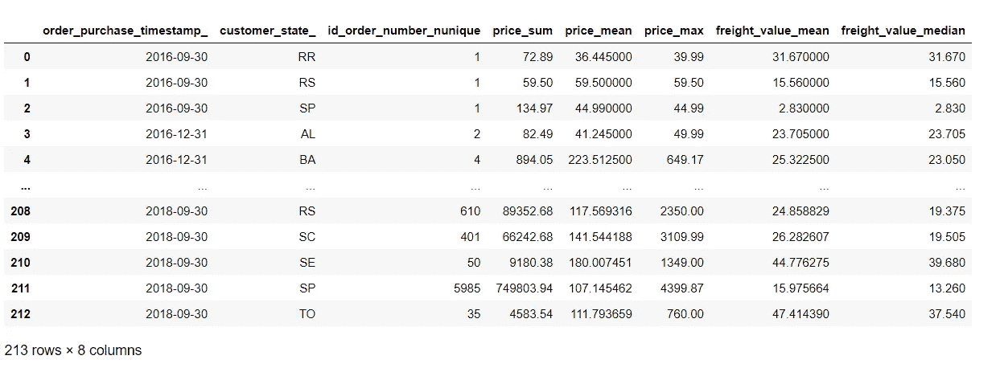
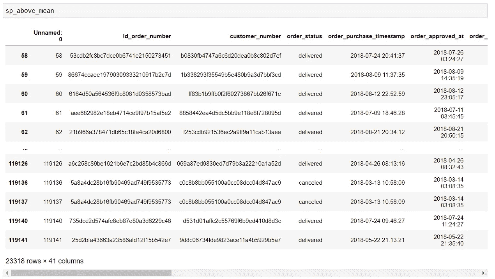
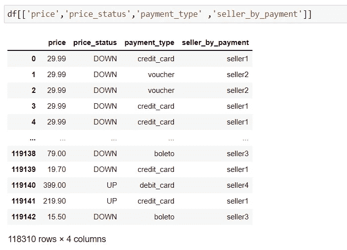

# 9 个熊猫功能将完成大多数数据分析任务

> 原文：<https://betterprogramming.pub/9-pandas-functions-that-will-do-99-of-any-analytics-task-e6b6fb1b16bf>

## 删除值，更改列名，等等


照片由[真诚媒体](https://unsplash.com/@sincerelymedia?utm_source=unsplash&utm_medium=referral&utm_content=creditCopyText)在 [Unsplash](https://unsplash.com/s/photos/cooking-cake?utm_source=unsplash&utm_medium=referral&utm_content=creditCopyText) 上拍摄

我总是对我的数据科学/分析学生说:

> 大多数情况下，执行数据分析任务就像遵循蛋糕食谱一样

为了做蛋糕，你需要一些工具，不是吗？比如搅拌机，勺子，烤箱…

有了熊猫，你就有了完成任何数据分析任务的必备工具，让我们来了解一下你的“厨房”里不能缺少什么？

# 读取数据文件

好吧！重要的事情先来。这一步就像:让我看看我的冰箱里有什么！

在这里，我将读取一个 Excel 文件，它存储在一个名为“dados”的文件夹中，在我的实际文件夹之外。

```
import pandas as pdimport numpy as np #Reading an Excel Filedf = pd.read_excel('../dados/Olist-full.xlsx')
```

请注意，我使用的是静态文件，这一点很重要。对我来说，如果你正在执行一个初步的探索性分析，这是最好的开始方式。

例如，在这之后，您可以将代码直接连接到数据湖。

# 更改列名

首先，使用`.columns`方法，让我们看看我们的列名是什么:

```
#Showing columns names
df.columns
```

在这里，在我的例子中，打印最后一行，返回这一列的名称:

```
Index(['Unnamed: 0', 'order_id', 'customer_id', 'order_status',
       'order_purchase_timestamp', 'order_approved_at',
       'order_delivered_carrier_date', 'order_delivered_customer_date',
       'order_estimated_delivery_date', 'order_item_id', 'product_id',
       'seller_id', 'shipping_limit_date', 'price', 'freight_value',
       'payment_sequential', 'payment_type', 'payment_installments',
       'payment_value', 'review_id', 'review_score', 'review_comment_title',
       'review_comment_message', 'review_creation_date',
       'review_answer_timestamp', 'product_name_lenght',
       'product_description_lenght', 'product_photos_qty', 'product_weight_g',
       'product_length_cm', 'product_height_cm', 'product_width_cm',
       'product_category_name_english', 'customer_unique_id',
       'customer_zip_code_prefix', 'customer_city', 'customer_state',
       'seller_zip_code_prefix', 'seller_city', 'seller_state'],
      dtype='object')
```

那么，如果我想更改一个或多个列的名称，该怎么办呢？我们可以使用`rename()`函数，并在其上传递一个字典。

```
#Changing columns names
df = df.rename(columns = {
    'order_id': 'id_order_number',
    'customer_id': 'customer_number'
})
```

如果我们再次打印列名，我们将得到:

```
Index(['Unnamed: 0', 'id_order_number', 'customer_number', 'order_status',
       'order_purchase_timestamp', 'order_approved_at',
       'order_delivered_carrier_date', 'order_delivered_customer_date',
       'order_estimated_delivery_date', 'order_item_id', 'product_id',
       'seller_id', 'shipping_limit_date', 'price', 'freight_value',
       'payment_sequential', 'payment_type', 'payment_installments',
       'payment_value', 'review_id', 'review_score', 'review_comment_title',
       'review_comment_message', 'review_creation_date',
       'review_answer_timestamp', 'product_name_lenght',
       'product_description_lenght', 'product_photos_qty', 'product_weight_g',
       'product_length_cm', 'product_height_cm', 'product_width_cm',
       'product_category_name_english', 'customer_unique_id',
       'customer_zip_code_prefix', 'customer_city', 'customer_state',
       'seller_zip_code_prefix', 'seller_city', 'seller_state'],
      dtype='object')
```

更改列名是很重要的，因为我们的代码需要对使用它的每个人都是可读和可理解的。记住，帮助你未来的同事，他可能要在你今天开发的代码上工作。选择有意义的名称，不仅对列有意义，对变量也有意义。

# 检查和描述

现在我们将检查我们的数据帧。我总是从`info()`函数开始，以了解我们正在处理的列中变量的类型。

```
#Basic information about our dataframe
df.info()<class 'pandas.core.frame.DataFrame'>
RangeIndex: 119143 entries, 0 to 119142
Data columns (total 40 columns):
 #   Column                         Non-Null Count   Dtype  
---  ------                         --------------   -----  
 0   Unnamed: 0                     119143 non-null  int64  
 1   id_order_number                119143 non-null  object 
 2   customer_number                119143 non-null  object 
 3   order_status                   119143 non-null  object 
 4   order_purchase_timestamp       119143 non-null  object 
 5   order_approved_at              118966 non-null  object 
 6   order_delivered_carrier_date   117057 non-null  object 
 7   order_delivered_customer_date  115722 non-null  object 
 8   order_estimated_delivery_date  119143 non-null  object 
 9   order_item_id                  118310 non-null  float64
 10  product_id                     118310 non-null  object 
 11  seller_id                      118310 non-null  object 
 12  shipping_limit_date            118310 non-null  object 
 13  price                          118310 non-null  float64
 14  freight_value                  118310 non-null  float64
 15  payment_sequential             119140 non-null  float64
 16  payment_type                   119140 non-null  object 
 17  payment_installments           119140 non-null  float64
 18  payment_value                  119140 non-null  float64
 19  review_id                      118146 non-null  object 
 20  review_score                   118146 non-null  float64
 21  review_comment_title           119143 non-null  object 
 22  review_comment_message         119143 non-null  object 
 23  review_creation_date           118146 non-null  object 
 24  review_answer_timestamp        118146 non-null  object 
 25  product_name_lenght            116601 non-null  float64
 26  product_description_lenght     116601 non-null  float64
 27  product_photos_qty             116601 non-null  float64
 28  product_weight_g               118290 non-null  float64
 29  product_length_cm              118290 non-null  float64
 30  product_height_cm              118290 non-null  float64
 31  product_width_cm               118290 non-null  float64
 32  product_category_name_english  116576 non-null  object 
 33  customer_unique_id             119143 non-null  object 
 34  customer_zip_code_prefix       119143 non-null  int64  
 35  customer_city                  119143 non-null  object 
 36  customer_state                 119143 non-null  object 
 37  seller_zip_code_prefix         118310 non-null  float64
 38  seller_city                    118310 non-null  object 
 39  seller_state                   118310 non-null  object 
dtypes: float64(15), int64(2), object(23)
memory usage: 36.4+ MB
```

现在您可以注意到`dtypes`值，看看它们是否符合您的期望。在这里我可以看到，我期待的是`order_purchase_timestamp` *，*的`datetime`值，但我得到的是对象 1。你会进一步看到我们如何改变这种情况。

这里很重要的一点是，你要看看你的变量是如何表现的。于是我们有了两个强大的熊猫功能，`describe()` 和`value_counts()` *。*第一个是变量数量，第二个是分类变量数量。

```
#Describing the 'price' variable
df['price'].describe()
```

这里我描述价格变量，它返回给我:

```
count    118310.000000
mean        120.646603
std         184.109691
min           0.850000
25%          39.900000
50%          74.900000
75%         134.900000
max        6735.000000
Name: price, dtype: float64
```

这样，我就可以了解我的变量在孔数据集中的行为，以及平均值、标准差、最小值和最大值等重要测量值。

使用`value_counts()`函数，我可以探索分类变量的行为，比如`payment_type`。这里我可以看到原始结果和归一化结果，只是改变了一个参数。

```
#Describing the 'price' variable
df['payment_type'].value_counts()#Describing the 'payment_type' variable
df['payment_type'].value_counts(normalize = True)
```

查看结果，首先是原始结果:

```
credit_card    87776
boleto         23190
voucher         6465
debit_card      1706
not_defined        3
Name: payment_type, dtype: int64
```

现在是正常化的:

```
credit_card    0.736747
boleto         0.194645
voucher        0.054264
debit_card     0.014319
not_defined    0.000025
Name: payment_type, dtype: float64
```

在这里，我可以看到(再次)我的洞数据集，我有 73.67%的付款，由信用卡支付。

# 丢弃值

降低价值就像扔掉冰箱里的臭鸡蛋。为此，我们有一些可能性。

让我们使用`isna()`函数检查我们的数据帧中是否有 NaN 值。

```
#Checking if we have any NaN value
df.isna().any()
```

它返回给我们以下内容:

```
Unnamed: 0                       False
id_order_number                  False
customer_number                  False
order_status                     False
order_purchase_timestamp         False
order_approved_at                 True
order_delivered_carrier_date      True
order_delivered_customer_date     True
order_estimated_delivery_date    False
order_item_id                     True
product_id                        True
seller_id                         True
shipping_limit_date               True
price                             True
freight_value                     True
payment_sequential                True
payment_type                      True
payment_installments              True
payment_value                     True
review_id                         True
review_score                      True
review_comment_title             False
review_comment_message           False
review_creation_date              True
review_answer_timestamp           True
product_name_lenght               True
product_description_lenght        True
product_photos_qty                True
product_weight_g                  True
product_length_cm                 True
product_height_cm                 True
product_width_cm                  True
product_category_name_english     True
customer_unique_id               False
customer_zip_code_prefix         False
customer_city                    False
customer_state                   False
seller_zip_code_prefix            True
seller_city                       True
seller_state                      True
dtype: bool
```

现在我们可以做一个决定，删除具有 NaN 值的列中的行，例如在`product_id`上。

```
#Droping NaN values of the product_id column
df = df.dropna(subset = ['product_id'])
```

# 更改列类型

正如我们在上面看到的，`order_purchase_timestamp`是一个对象列，但它应该是一个日期时间列，那么，我们该如何做呢？

```
#Changing the dtype of the order_purchase_timestampdf['order_purchase_timestamp'] = pd.to_datetime(df['order_purchase_timestamp'])
```

您还可以使用其他函数，比如 [to_numeric()](https://pandas.pydata.org/docs/reference/api/pandas.to_numeric.html) ！

# 使用日期和时间

知道如何操作日期和时间很重要！

如何只获取特定日期时间列的年份或月份？理解数据框架中的圆对我们来说至关重要。

```
#Create a new column with the month of the order
df['order_month'] = df['order_purchase_timestamp'].dt.month
```

你可以得到，天，年，小时…

# 分组

分组对于任何数据分析都是必不可少的。我在这里发表了一篇[文章](/the-best-way-to-group-data-in-pandas-7f446a1fc7fa)，向你展示了使用 Pandas 对你的数据框进行分组的最佳方式。

让我们来看一个非常好的例子！我想要特定时间段内不同列的一些测量值，每个时间段 3 个月:

```
#Grouping for each 3 months by customer_state
buys_3m = df.groupby([pd.Grouper(key = 'order_purchase_timestamp', freq = '3M'), 'customer_state']).agg({
    'id_order_number': 'nunique',
    'price': ['sum', 'mean', 'max'],
    'freight_value': ['mean', 'median'],
}).reset_index()buys_3m.columns = ['_'.join(col) for col in buys_3m.columns]
```

并且，它返回…



# 过滤

过滤数据可以让我们对真正重要的数据进行个性化处理。假设我只想选择特定销售类型的数据，这些数据来自特定的州，并且高于某个值，我们该如何做呢？

```
#Filtering for SP state and price up or equal 115
sp_above_mean = df[(df['price'] >= 115) & (df['seller_state'] == 'SP')]
```

这将返回一个新的`dataframe`:



您也可以使用过滤器来移除异常值:

```
#Filtering by the quantile - we can remove outliers with this
q1 = df['price'].quantile(0.01)
q2 = df['price'].quantile(0.99)df_price_outliers = df[(df['price'] >= q1) & (df['price'] <= q2)]
```

# 通过应用和映射进行个性化

我们还可以使用`apply()`函数和`map()` 函数进一步定制我们的分析。看到了。

```
#Creating a new column with apply
df['price_status'] = df['price'].apply(lambda x: 'UP' if x >= df['price'].mean() else 'DOWN')
#Creating a new column using map
df['seller_by_payment'] = df['payment_type'].map(credit_cards)
```

这为我们创造了:



下面是完整的代码:

我们已经到了这个蛋糕食谱的末尾，你已经有了一个非常完整的，但是是初始的代码，它将能够指导你进行数据分析。有了我给你的这些工具，你一定能满足需求！

我希望你喜欢它！

.

.

.

如果你想了解更多，请点击这里查看我的指导课程:[https://mentorcruise.com/mentor/NathanLara/](https://mentorcruise.com/mentor/NathanLara/)