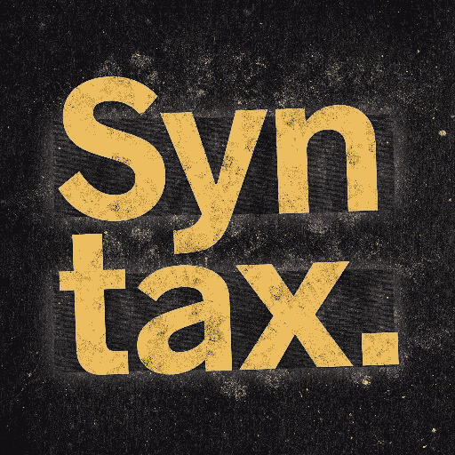
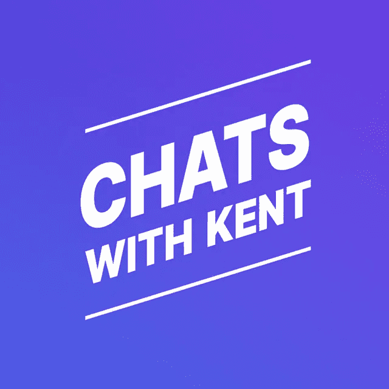
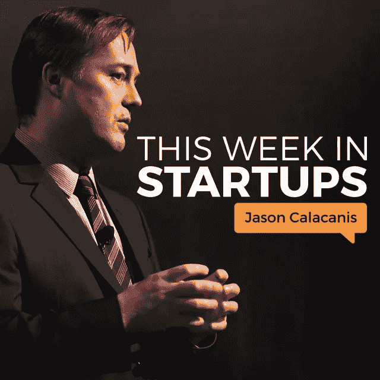
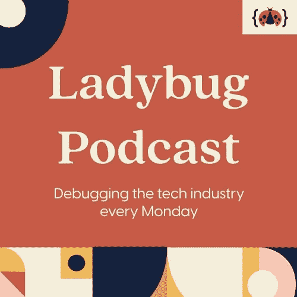
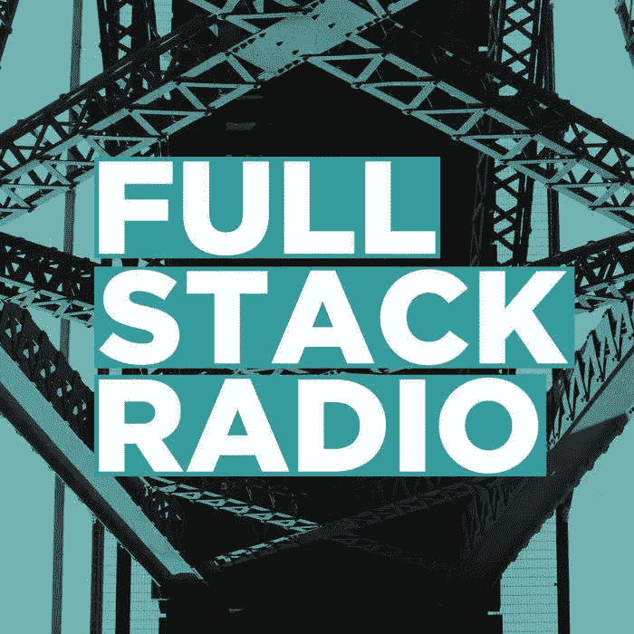
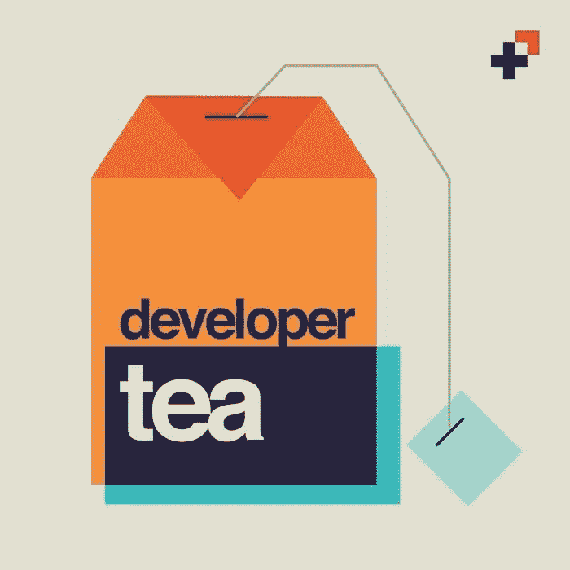

# 唤醒你的网络开发技能的 9 个播客

> 原文：<https://betterprogramming.pub/9-podcasts-to-wake-up-your-web-development-skills-4de195b8fc97>

## 无论你是在床上，在路上，还是在工作间隙，播客都能让你保持活力

在 [Unsplash](https://unsplash.com?utm_source=medium&utm_medium=referral) 上由 [Mohammad Metri](https://unsplash.com/@mohammadmetri?utm_source=medium&utm_medium=referral) 拍摄的照片

有很多方法可以学习更多关于 web 开发的知识:文章、YouTube 视频、书籍、导师等等。

这些方法都很棒，但当你不想睁开眼睛、翻页或去咖啡店开会时，播客是“必去之地”，这样你就可以什么都不用做就能了解最新情况。

无论你是躺在床上，在上班的路上，还是在工作时做白日梦(我们都这样做；还可以)，播客随时随地都有。

有许多播客可供像你这样的网络开发者使用，但这里有九个脱颖而出。有些是技术性的，有些是关于你更大的幸福，但所有这些都会给你的生活增加很多价值。

咦嗬！我们开始吧。

# 1.句法

由全栈 JavaScript 开发者 Wes Bos 和 Scott Tolinksi 创建的[语法](https://syntax.fm/)提供了关于大量 web 开发主题的深入、长达一小时的剧集。

截至本文发表时已有 361 集，您已经挑选出了有趣且轻松的播客。Wes 和 Scott 讲述了他们作为 web 开发人员的真实经历，JavaScript 框架，CSS 的最新更新，以及使 web 工具更简单的许多方法。

每个月，Syntax 都会举办家常便饭，回答你的问题。你可以提交任何与网络开发相关的问题，他们会制作一集。

如果你时间不多，可以听听 Syntax 每周的《草率对待》剧集。在 30 分钟或更短的时间内，它们非常适合短途旅行或懒惰的周六、周日、周一，嗯，任何一天，早上。

哦，如果你需要烧烤方面的建议，喊一声韦斯。烧烤是他的专长。

# 2.前方的网络

由全栈设计师 Jen Simmons 主持， [The Web Ahead](https://podcasts.apple.com/podcast/id464936442) 提供一个半小时(有时两小时)的节目，由网络开发专家主讲。

虽然最后一集#117 于 2016 年播出，但回顾档案是非常值得的。

在这些引人入胜的节目中，Jen 与世界专家谈论“网络的未来”，他们会教你很多很多东西。从网络架构到改善人性，再到制作网络动画，Jen 讨论了这一切。

# 3.与肯特聊天

Kent c . Dodds——不要忘记“c”——与来自不同背景的开发人员讨论“生活、职业和代码”。

无论他谈论的是宇宙飞船控制、移情还是 A11y(即让你的网站和内容可访问)，肯特在这 30 分钟的剧集中为你深入浅出。

与我看过的其他播客不同，[与肯特聊天](https://kentcdodds.com/chats-with-kent-podcast/)被分成几季。目前，三季共 38 集，其中充满了成为一名出色的网络开发人员和人类所需的软硬技能的课程。

此外，在每集的结尾，肯特会给你一个小小的家庭作业任务，满足你完成一个小任务的需要。

肯特聊天的一个令人耳目一新的方面是他采访的女性和混血开发人员的数量。他们有很多人。在大多数播客中，男女比例几乎是无限比 1。

但是，我必须再次强调，不要忘记他名字中的“c”。这里有更多关于[如何拼写他的名字](https://kentcdodds.com/info)的信息。；)

# 4.本周启动

如果你正在寻找一些关于创业的有趣而直率的建议，那么杰森·卡拉卡尼斯的[本周创业](https://thisweekinstartups.com/)就是为你准备的播客。

虽然它关注的不仅仅是网络开发，但你可以利用 Jason 和他的许多专家嘉宾的可信建议，开始你的自由职业或网络开发业务。

超过 1，200 集，你可以学习如何扩展你的创业公司，在你的网站上创造更多支持加密货币的方式，[营销你的服务](https://bettermarketing.pub/5-little-css-tricks-to-make-your-website-go-a-long-way-7cda61fcd7d0)，等等。

# 5.瓢虫播客

致力于“调试技术行业”的[瓢虫](https://www.ladybug.dev/)播客为软件开发新手提供了许多很好的建议。

由艾玛·博斯提安、西德尼·巴克纳、凯莉·沃恩和阿里·斯皮特主持的瓢虫播客为我们普通人增加了一些务实的建议。

这四位女性已经开发软件多年了。他们一起帮助你学习编码，提升你对最新技术的知识，获得你的第一个开发者角色，以及更多。

对于聋人/重听开发者，瓢虫播客在 GitHub 上发布他们所有的[抄本。没有理由播客不应该是可访问的，对吗？这些播客大多有文字记录。](https://github.com/ladybug-podcast/ladybug-website/tree/master/transcripts)

如果你想要一些很棒的建议——不要晦涩的术语——那就听听这个播客吧。

# 6.职业聊天

Swyx 和 Randall(是的，他们有很酷的名字)创造了超级短的剧集——平均不到十分钟——充满了一个有价值和可操作的想法。

这些微小的金块将帮助你促进你的个人成长，并创造一个可持续的开发人员职业生涯，让你感到满足和满足。

有 18 集，[职业聊天](https://careerchats.transistor.fm/)正处于开始阶段，但如果你不介意粗糙的边缘，那么给这个播客一个机会。

截至 2021 年 1 月，Swyx 和 Randall 正在休创造性的休假，但如果你有兴趣了解什么时候辞职，为什么没有 CS 学位也很好，或者如何建立一致性，那么就享受他们小而有力的价值拍摄吧。

# 7.全栈无线电

[被称为](https://fullstackradio.com/)的“对构建伟大软件产品感兴趣的开发者的播客”，Adam Wathan 的 152 集节目每周采访了解系统管理、产品设计、UX 等更多内容的嘉宾。

这些长达一小时的剧集充满了有趣的聊天，将帮助您从许多不同的角度学习软件开发。

# 8.修订路径

写这篇文章时，[已经有 403 集了，改版路径](https://revisionpath.com/podcasts/)专注于展示“来自世界各地的黑人设计师、开发人员和数字创意人员”

莫里斯·切瑞从 2013 年开始主持这个播客。从那时起，他采访了数百名黑人创意人员，强调他们生活的许多方面，包括他们的目标、工作和灵感。

这些 50 分钟的剧集大多聚焦于黑人设计师，但 Revision Path 也与软件开发人员、独立游戏开发人员、企业家、动画师以及其他许多在创意领域有所作为的人进行了交谈。

# 9.显影剂茶

由 Jonathan Cutrell 于 2015 年创建的[开发者茶](https://developertea.com/)旨在帮助工程师在喝茶休息时“找到清晰、观点和目的”。

截至 2021 年 6 月，《开发者茶》已经是第 966 集了。每一集有趣而紧凑的情节都会给你带来巨大的价值，帮助你培养最健康的自己。

这个播客的结构与你通常的技术播客非常不同:开发者 Tea 通过真实的例子解释了 web 开发的许多元素。这种技术和明智建议的结合是改善你作为一个[开发者和个人](/6-ways-creating-a-3d-sword-in-blender-can-help-you-become-a-better-programmer-dacf28b844af)的生活的一种令人惊异的方式。

大多数剧集时长约为 15 分钟，采访其他开发者的剧集时长为 30 分钟。

Developer Tea 是当你想提升你自己、你的目标、你的前景和你的 web 开发技能时你想要访问的播客。

*当然是用咖啡代替茶。茶是什么？

虽然许多其他播客可能会提高你的技能，给你带来一些笑声，但我希望这九个播客会为你的时间提供很多价值。但是如果它们不是你想要的，这里还有四个。

# 奖励播客

1.  [极客 2 英语](https://geek2englishpodcast.com/)
2.  [变更日志](https://changelog.com/podcast/)
3.  [调试](https://www.imore.com/debug)
4.  [大于代码](https://www.greaterthancode.com/episodes)

# 资源

1.  [语法](https://syntax.fm/)
2.  [前方网](https://podcasts.apple.com/podcast/id464936442)
3.  [与肯特聊天](https://kentcdodds.com/chats-with-kent-podcast/)
4.  [本周启动](https://thisweekinstartups.com/)
5.  [瓢虫播客](https://www.ladybug.dev/)及其[抄本](https://github.com/ladybug-podcast/ladybug-website/tree/master/transcripts)
6.  [职业聊天](https://careerchats.transistor.fm/)
7.  [全栈无线电](https://fullstackradio.com/)
8.  [修订路径](https://revisionpath.com/podcasts/)
9.  [显影剂茶](https://developertea.com/)

## 在你走之前…

如果这些文章有帮助或有趣，并且你想支持我的写作，[给一个中等会员试试](https://ashleighbonner.medium.com/membership)。只需 5 美元，你就可以无限制地访问数以千计的故事，使用我的链接注册[会给我一小笔佣金。](https://ashleighbonner.medium.com/membership)

如果你想做一次性捐赠，我会很高兴你能给我买些麦麸片。

 [## 通过我的推荐链接加入 Medium——ash Leigh Bonner

### 作为一个媒体会员，你的会员费的一部分会给你阅读的作家，你可以完全接触到每一个故事…

ashleighbonner.medium.com](https://ashleighbonner.medium.com/membership)