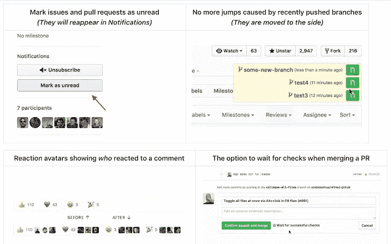
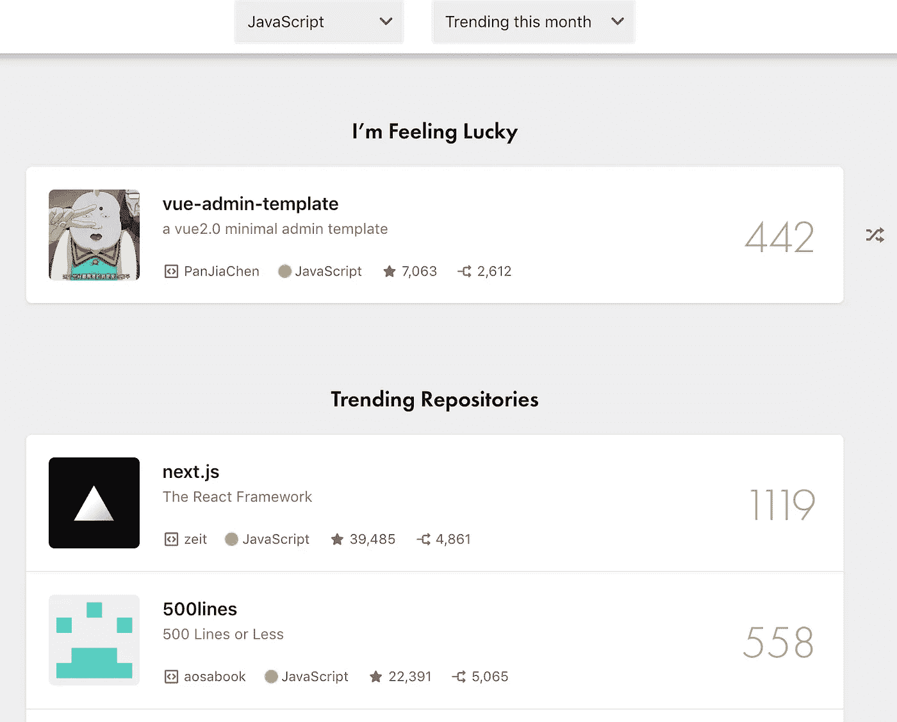
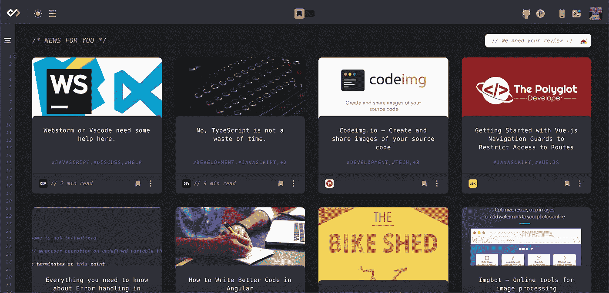
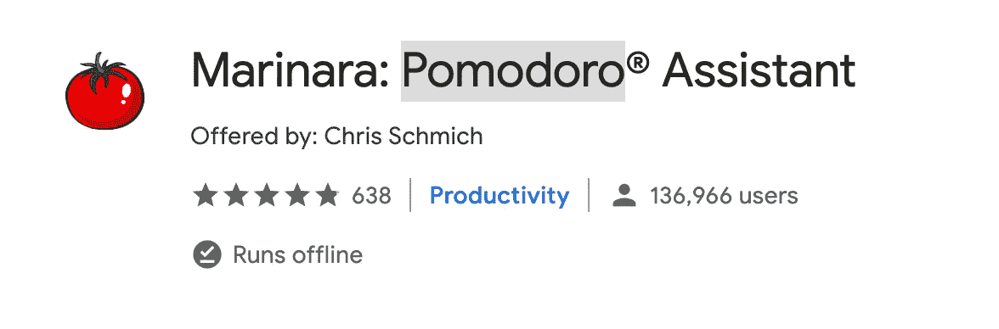
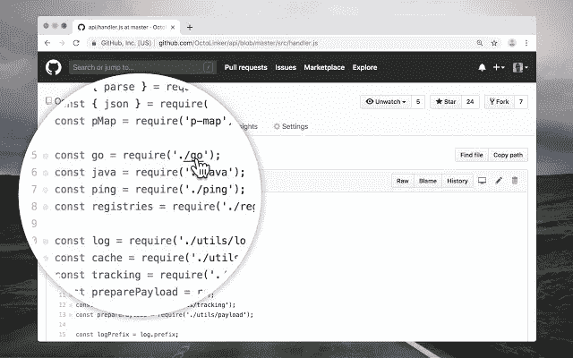
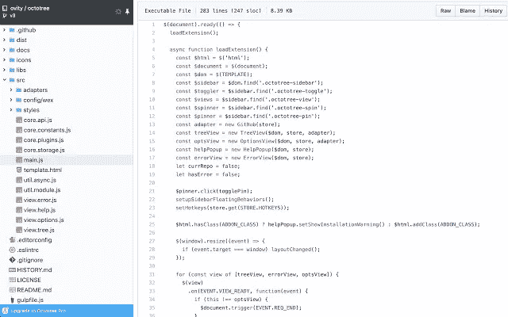

# 9 个对开发者有用的浏览器扩展— 2020 版

> 原文：<https://betterprogramming.pub/9-productivity-browser-extensions-for-developers-2020-edition-eb84cda6f038>

## 使用这些浏览器扩展，让您的生活更加轻松

卢卡·布拉沃在 [Unsplash](https://unsplash.com?utm_source=medium&utm_medium=referral) 上的照片

作为 web 开发人员，我们有利用 web 浏览器扩展的特权。当涉及到增强您的工作环境和提高编码生产率时，Web 浏览器扩展非常有用。

我们正在接近 2020 年，许多新的扩展已经出现。我决定收集对 web 开发人员最有用的扩展，并把它们放在一个列表中。

> “如果说我看得更远，那是因为我站在巨人的肩膀上。”——艾萨克·牛顿

# 精制 GitHub

改进的 GitHub 简化了 Github 界面，增加了有用的功能。

[精制 Github](https://chrome.google.com/webstore/detail/refined-github/hlepfoohegkhhmjieoechaddaejaokhf)

“我们希望 GitHub 能够注意到并实施一些急需的改进。因此，如果你喜欢这些改进，请发邮件给 [GitHub support](mailto:support@github.com) 询问相关事宜。”—精致的 Github 创作者。

## 安装指南

*   [镀铬扩展件](https://chrome.google.com/webstore/detail/refined-github/hlepfoohegkhhmjieoechaddaejaokhf)
*   [火狐插件](https://addons.mozilla.org/en-US/firefox/addon/refined-github-/)
*   Opera 扩展:使用这个 Opera 扩展[来安装 Chrome 版本。](https://addons.opera.com/en/extensions/details/download-chrome-extension-9/)

# 黑客标签

如果你想了解开源项目的趋势，Hacker Tab 是很有用的。每次打开新标签页时，您都会看到所有新项目的列表。您可以在每周、每天和每月的时间表之间切换，也可以在不同的编程语言之间切换。

[黑客标签](https://github.com/huchenme/hacker-tab-extension) —用 GitHub 趋势项目替换浏览器新标签屏幕。

## 安装指南

*   [镀铬扩展件](https://github.com/huchenme/hacker-tab-extension)
*   [火狐插件](https://addons.mozilla.org/en-US/firefox/addon/hacker-tab/)

# 每日 2.0 —忙碌的开发人员的资源

作为一名优秀的软件开发人员，意味着你应该总是努力学习更多的知识，了解最新的技术。

每日 2.0

每天，新的和更新的软件开发技术都在互联网上发布。对于我们开发人员来说，保持更新是一个巨大的麻烦。开发人员为开发人员制作了 Daily，帮助我们专注于代码，而不是不断地在 web 上搜索开发新闻。

## 安装指南

*   [镀铬扩展](https://chrome.google.com/webstore/detail/daily-20-source-for-busy/jlmpjdjjbgclbocgajdjefcidcncaied?hl=en)
*   [火狐](https://addons.mozilla.org/en-US/firefox/addon/daily/)

# 没有硬币

有网站强迫我们的 CPU 为他们挖掘加密货币。No Coin 是一个微小的浏览器扩展，旨在阻止 Coinhive 等硬币矿工，他们在未经你同意的情况下使用你的计算机资源。

没有硬币

受到成千上万用户的信任，没有硬币为您提供了一种安全可靠的方式来阻止矿工使用您的 CPU 和电源。No Coin 还提供了一种简单的方法，允许矿工在有限的时间内通过验证码或需要采矿的短链接。

## 安装指南

*   [镀铬扩展](https://chrome.google.com/webstore/detail/no-coin-block-miners-on-t/gojamcfopckidlocpkbelmpjcgmbgjcl?hl=en)
*   [火狐](https://addons.mozilla.org/en-US/firefox/addon/no-coin/)

# JSON 格式化程序

这个扩展使得 JSON 易于阅读。JSON 格式化程序是开源的。

JSON 格式化程序

JSON 格式化程序添加了一个页面动作来美化 JSON。与类似的扩展不同，这只是美化了它。它没有添加任何种类的查看器、颜色或折叠。

## 安装指南

*   [镀铬扩展件](https://chrome.google.com/webstore/detail/json-formatter/bcjindcccaagfpapjjmafapmmgkkhgoa?hl=en)
*   [火狐扩展](https://addons.mozilla.org/en-US/firefox/addon/basic-json-formatter/)

# 番茄定时器

番茄定时器扩展

**番茄工作法**是一种时间管理方法。原始技术有六个步骤:

1.  决定要完成的任务。
2.  设置番茄定时器(传统上为 25 分钟)。
3.  努力完成任务。
4.  当计时器响起时结束工作，并在一张纸上打上勾号。
5.  如果您的复选标记少于四个，请稍事休息(三到五分钟)，然后继续第二步。
6.  在吃了四个番茄之后，休息一段时间(15-30 分钟)，将你的对号计数归零，然后继续第一步。

当你读这篇文章的时候，我正在用番茄红素。番茄工作法是一种很实用的做事方式，它能帮助你学会如何集中注意力和管理时间。如果你想了解更多关于如何集中注意力的知识，这本书对我很有帮助。

## 安装指南

*   [镀铬延伸件](https://chrome.google.com/webstore/detail/marinara-pomodoro%C2%AE-assist/lojgmehidjdhhbmpjfamhpkpodfcodef?hl=en)
*   [火狐扩展](https://addons.mozilla.org/en-US/firefox/addon/tomato-clock/)

# 元搜索引擎优化检查器

此扩展有助于检查网页内的元数据，这些元数据在浏览时通常是不可见的。

检查你的元标签，以确保良好的搜索引擎优化得分

这个扩展主要是针对那些需要验证他们站点的 HTML 以遵循网站管理员的 Google 指南的 web 开发人员，但是它对于那些想要看到通常不可见的页面内容的人也很有用。

当元数据不在特定范围内时会显示警报，例如当描述标签太短或太长时。

SEO 是一门独立的语言。我建议通读《 [3 个月至第一:2019 年让你的网站在谷歌](https://www.amazon.com/Months-No-1-No-Nonsense-Playbook-Getting-ebook/dp/B075HGN2L5/ref=as_li_ss_tl?ie=UTF8&linkCode=ll1&tag=thegeniusde07-20&linkId=2f743511fe6012a60bf50835854c59e8&language=en_US)上被发现的“严肃”SEO 行动手册》，了解 SEO 的最佳实践和技巧。

## 安装指南

*   [镀铬扩展件](https://chrome.google.com/webstore/detail/meta-seo-inspector/ibkclpciafdglkjkcibmohobjkcfkaef?hl=en)
*   [火狐扩展](https://addons.mozilla.org/en-US/firefox/addon/seo-inspector/)

# 八接头

使用 OctoLinker 高效浏览 GitHub 上的项目。OctoLinker 将特定于语言的语句如`include`、`require`或`import`转换成链接。

OctoLinker 展示

**源代码在 GitHub 上**:[https://github.com/OctoLinker/OctoLinker](https://outgoing.prod.mozaws.net/v1/bd0196d3edef758aff896cb48ae84170165693c805b93e79a042af9f8ee98a19/https%3A//github.com/OctoLinker/OctoLinker)

## 安装指南

*   [镀铬扩展](https://chrome.google.com/webstore/detail/octolinker/jlmafbaeoofdegohdhinkhilhclaklkp)
*   [火狐扩展](https://addons.mozilla.org/en-US/firefox/addon/octolinker/)

# 八叉树

Octotree 是一个在 GitHub 上显示代码树的扩展。它非常适合探索项目源代码，而不必将许多存储库下载到您的机器上。

## 安装指南

*   [镀铬扩展](https://chrome.google.com/webstore/detail/octotree/bkhaagjahfmjljalopjnoealnfndnagc)
*   [火狐扩展](https://addons.mozilla.org/en-US/firefox/addon/octotree/)

# 结论

我希望我改善了你的编码环境。感谢您的阅读，并保持敬畏！