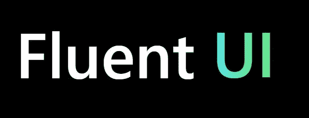
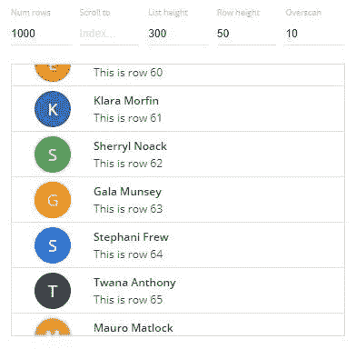
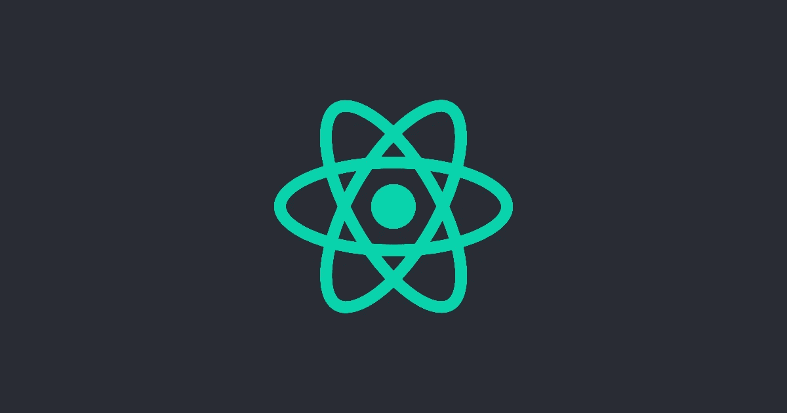
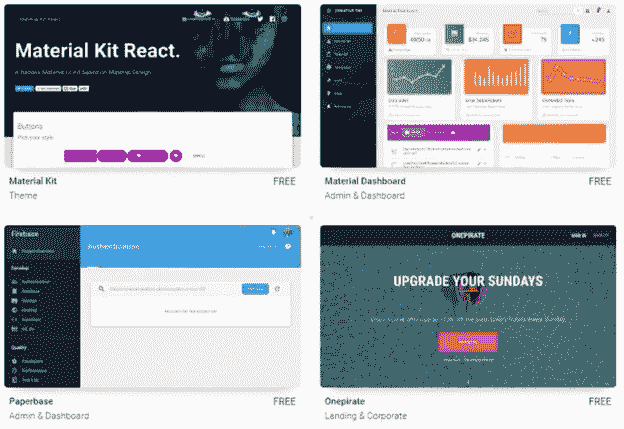
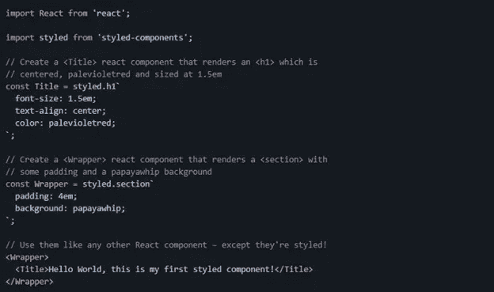
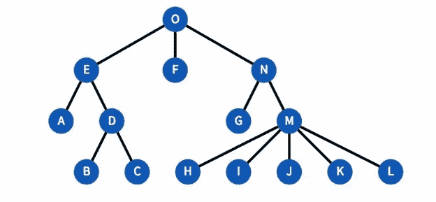
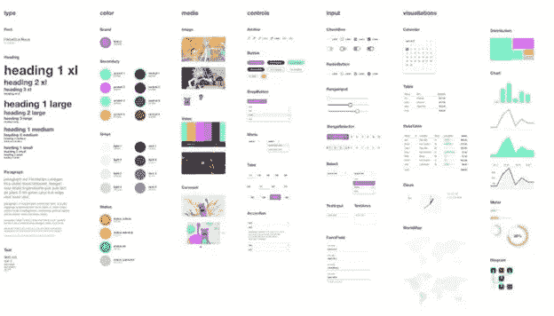
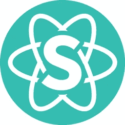

# 9 反应图书馆给你的老板留下深刻印象

> 原文：<https://betterprogramming.pub/9-react-libraries-to-impress-your-boss-8977e10431ac>

## **最佳 React 库的精选列表**

由[阿尔方斯·莫拉莱斯](https://unsplash.com/@alfonsmc10?utm_source=medium&utm_medium=referral)在 [Unsplash](https://unsplash.com?utm_source=medium&utm_medium=referral) 上拍摄的照片

所有开发人员都必须跟上不断变化的技术和软件领域的最新趋势。持续学习和熟悉不断变化的技术是优秀开发人员的主要特征。学习没有停顿。

在本帖中，我们将讨论和浏览每个开发人员必须了解的九大 React 库，这将增强他们的工作能力，并提供对全球正在使用的内容的全面了解。不浪费时间，让我们开始吧。

我之所以选择这些库，是因为它们不仅能帮助我们构建功能强大、令人印象深刻的应用程序，还能让我们用更少的代码更快、更容易地构建应用程序，让整个过程一次变得更简单。

# 1.流畅的用户界面网页

Fluent UI 是由微软开发团队创建的令人兴奋的 UI 库；它为组件提供了类似于 office 产品的行为和图形。它附带了一系列 UX 框架，用于创建漂亮的跨平台应用程序，这些应用程序共享代码、设计和交互行为。

UI 库提供了与桌面、Android 和 iOS 设备的兼容性，并由 Office 365、OneNote、Azure DevOps 和其他微软产品使用。

它带有许多预建的组件，可以开发任何应用程序的大部分部分，其设计遵循微软的 Office 设计语言。

如果你想创建一个感觉和外观都像办公产品的应用程序，那就不要浪费时间了！

**人气**—GitHub 上的 12k 明星

# 2.反应虚拟化

如果你的应用程序有一个表格化的数据，它有助于提高应用程序的性能。它的工作方法是——它只呈现用户可见的内容。例如，如果您有 200 个项目，但一次只能看到 10 个，React Virtualized 会将发送到 DOM 的请求数量限制为 10 个，从而提高应用程序的性能和效率。

如果您有一个包含数百或数千个元素的列表，或者当您试图在一个表中呈现许多列时，React Virtualized 是一个有用的库。仅在滚动时，所有其他项目都会呈现到 DOM 中。一个巧妙的小把戏。

**人气**—GitHub 上的 22.4k 明星

在 GitHub 上找到虚拟化的 React[。](https://github.com/bvaughn/react-virtualized)

# **3。创建 React 应用程序**

这是一个我们都至少用过一次的库，如果你没有用过，我会感到惊讶。如果你有或没有，让我们看看为什么这个图书馆是一个无名英雄。

Create React App 是一款命令行应用，由 React 的联合创始人脸书创建。这款应用是 React 成功的主要原因之一，因为它让 React 开发环境的设置变得轻而易举。一个简单的命令，一切都为你设置好了，不用担心一个应用程序是否能在旧的浏览器或完全不同的浏览器上运行。它使整个过程变得非常流畅和容易，这吸引了许多开发者。

这是每个 React 项目的必备工具，因为它可以节省您大量的时间，否则您会花费大量的时间来手动设置和配置您的应用程序。此外，它还有很多不同的内置功能。

其主要特点是:

**1。少学**

您不需要学习和配置许多构建工具。此外，它还带有即时重新加载功能，这有助于您专注于开发和您的应用程序想法，而不是不必要的事情。当需要部署时，您的软件包会自动优化。只需一个简单的命令，你就可以开始了。

**2。只有一个依赖**

您的应用程序只需要一个构建依赖项。Create React App 确保其所有底层部分无缝协作，没有复杂的版本不匹配。不用担心不同的浏览器版本或不同的浏览器。

**3。无锁定**

在引擎盖下，Create React app 使用 webpack、Babel、ESLint 和其他令人惊叹的项目来驱动应用程序。如果你想要一个高级配置，你可以从 Create React App 中“弹出”并直接编辑它们的配置文件。

**人气**—GitHub 上的 89.9k 明星

在 GitHub 上找到 [Create React App](https://github.com/facebook/create-react-app) 。

# **4。材料界面**

如果你不是一个具有良好设计意识和技能的有设计天赋的开发者，这个库就是你的救星。

这是一个由谷歌创建的用户界面库，它有一个光滑的设计。这个图书馆永远不会出错。

您可以快速构建漂亮的 React 应用程序。Material-UI 是一个可定制的简单组件库，用于构建更快、更漂亮、更易访问的 React 应用程序。这个图书馆已经存在好几年了，而且很受欢迎。

**人气**—GitHub 上 70.7k 的明星，NPM 上每周超过百万的下载量；它被亚马逊、美国宇航局、网飞等公司使用。

在 GitHub 上找到[材质 UI](https://github.com/mui-org/material-ui) 。

# **5。样式组件**

在 React 中，我们通常必须为组件创建一个单独的 CSS 文件，但是这样做的话，您可能会面临意外覆盖站点其他地方使用的选择器或者为所有组件保存一个有组织的 CSS 文件的问题。但是多亏了样式组件，您可以通过在组件中直接使用 CSS 语法来避免这个问题。

Styled components 是一个 CSS-in-JS 工具，它在组件和样式之间架起了一座桥梁，提供了许多特性，可以让您以一种实用的、可重用的方式运行样式组件。

**人气**—GitHub 上的 34.6k 明星

在 GitHub 上找到[风格的组件](https://github.com/styled-components/styled-components)。

这里有一个来自他们官方 GitHub 库的例子:

# **6。Redux**

Redux 是一个杀手级的库。它使得使用 React 超级简单！顾名思义，它减少了开发人员的工作。

Redux 是 JavaScript 应用程序的状态管理解决方案。它通常与 React 结合使用，但也可以与其他类似 React 的框架一起使用。

我们都知道在 React 中数据只能向下流动。例如，我们有一个 React 应用程序，不同的节点是它的组件。React 只允许数据单向流动。现在，如果节点 M 想要将数据传输到节点 D，它必须向上一级，直到组件 O(我们主要在那里存储状态)，然后只能对节点 D 做出反应。这对于小型应用程序来说是可以管理的，但对于大型复杂的应用程序来说，这就变得一团糟了。但是 Redux 为开发者解决了这个问题。

Redux 之所以这么受欢迎，是因为它自己管理状态；开发人员不再需要考虑或寻找复杂组件树中不同组件之间如何交换数据的方法。Redux 自己做。一个人需要表现出来，它会自动表现出来。组件 M 现在可以将数据传输到组件 D，而无需开发人员考虑如何继续。

**人气**—GitHub 上的 56.6k 明星

在 GitHub 上找到 [Redux](https://github.com/reactjs/react-redux) 。

# **7。索环**

Grommet 是一个组件库，为响应迅速、可访问、移动优先的 web 项目而设计。它包含原子设计方法，并在一个整洁的包中提供可访问性、模块化、响应性和主题。

对于小屏幕手机或宽屏幕显示器，索环将帮助您快速设计布局。它为所有不同的手机显示屏提供布局——一个奇妙的一体化框架。如果你正在做或者计划做一个项目，那么这是必须的。这是谷歌物质主题的一个奇妙替代。

一些最著名的公司已经使用 Grommet 来设计他们的 web 应用程序，包括网飞、三星、优步、波音、惠普和 Twilio。

**人气**—GitHub 上的 7.5k 明星

在 GitHub 上找到[索环](https://github.com/grommet/grommet)。

# **8。反应引导**

React Bootstrap 对于喜欢 Bootstrap 或一直使用常规 Bootstrap 的开发人员来说是梦想成真。因为它带来了 Bootstrap 的强大功能和简单性。它包括大量预构建的纯 React 组件，没有第三方库。React Bootstrap 提供了与 Bootstrap 减去 jQuery 相同的大部分功能，从而使其完全基于 React。

**人气**—GitHub 上 19.8k 明星

在 GitHub 上找到 [React 引导](https://github.com/react-bootstrap/react-bootstrap)。

# **9。语义界面**

语义 UI 是一个帮助构建 web 应用程序的框架。它为您的应用程序提供了一组组件、定义响应性布局的工具以及灵活的主题支持。

这个库提供了组件的 React 实现，所以不需要额外的 JavaScript 依赖。语义 UI React 使用语义 UI 中的主题，因此您可以重用 CSS 样式表并利用语义 UI 主题。

**人气**—GitHub 上的 12.4k 明星

在 GitHub 上找到[语义 UI](https://github.com/Semantic-Org/Semantic-UI) 。

谢谢你一直坚持到帖子结束。如果你知道一个其他人会从中受益的库，那么把它写在下面。

祝你今天开心！玩的开心！