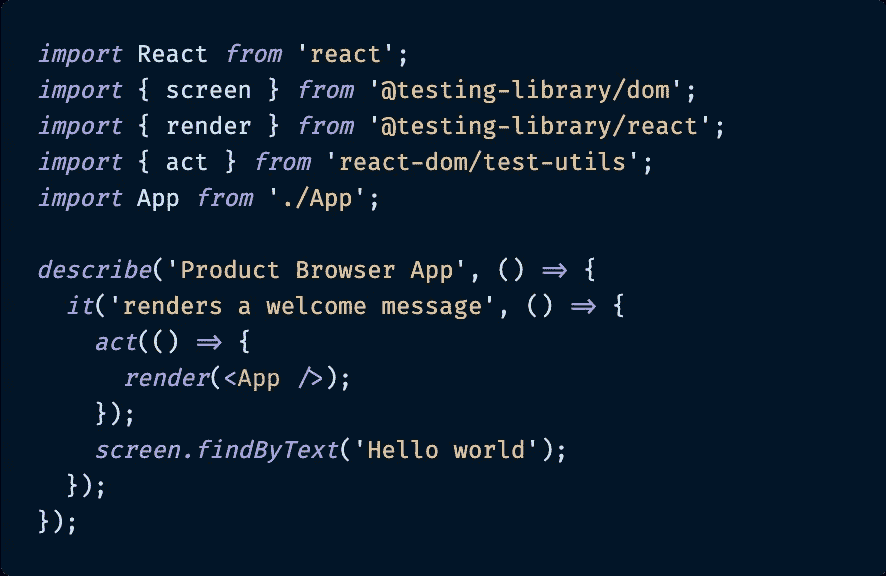
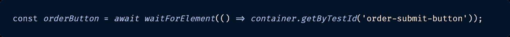
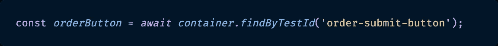
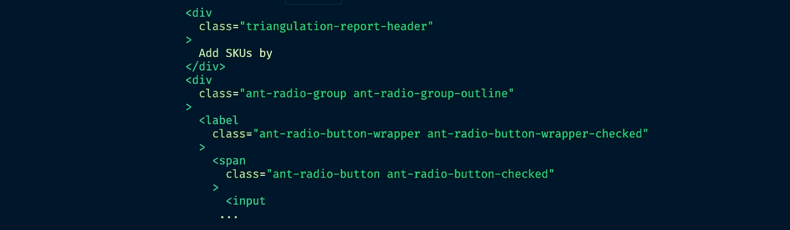
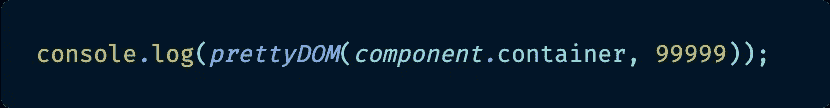
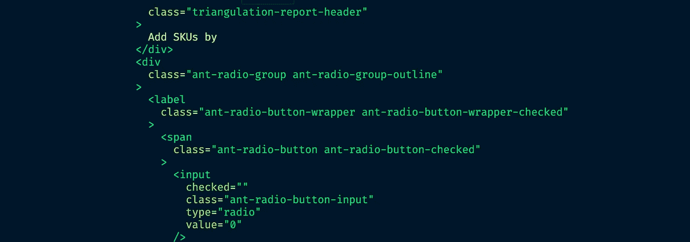
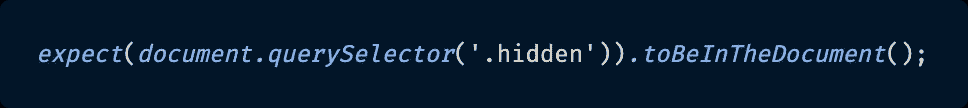
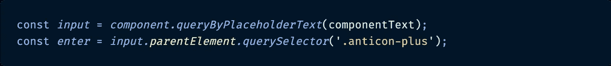
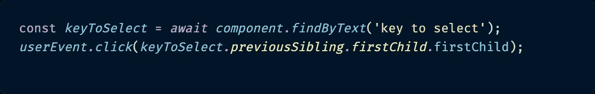

# 9 React 测试库提示和技巧

> 原文：<https://betterprogramming.pub/9-react-testing-library-tips-and-tricks-5cce3e458282>

## 编写测试很难。这些建议让事情变得简单了一些


法尔扎德·纳兹菲在 [Unsplash](https://unsplash.com/s/photos/technology?utm_source=unsplash&utm_medium=referral&utm_content=creditCopyText) 上拍摄的照片。

几周前，我有幸参加了为期两天的工作培训课程，以提高我的[反应测试库](https://testing-library.com/docs/react-testing-library/intro)知识和技能。

在我的工作中，我的团队非常依赖多种形式的自动化测试(单元、集成、端到端等)。)来帮助确保我们的应用程序的所有部分都正常工作。因此，当我参加课程时，我已经对如何使用 React 测试库(RTL)有了基本的了解，因为我们在几个月前就已经开始使用它，因为我们开始在我们的应用程序中编写更多基于 React hooks 的组件。我们之前的 Jest 和 Enzyme 的单元测试组合也不再满足我们的需求。

然而，这次培训让我看到了一些我完全不知道的关于使用 RTL 的有用信息。我想分享我的 9 个最大收获，希望它们能帮助你使用这个测试库。

# 什么是 React 测试库？又为什么不一样？

注意:这不是一篇“RTL 入门”的文章。本文假设您已经很好地理解了如何使用测试框架。我的目的是向您展示一些额外的技巧，使编写(和调试)测试更容易。

也就是说，在深入本文之前，我将简要概述一下 [React 测试库](https://testing-library.com/docs/react-testing-library/intro)的原因和方法。

## 为什么

Kent C. Dodds 创建了 React 测试库来解决一个问题:其他测试库鼓励开发人员编写与他们正在测试的组件的实现细节过于紧密耦合的测试。Dodds 认为测试应该只验证组件的最终结果(行为)。

想想也有道理吧？

为什么我们不像编写端到端测试那样编写集成测试呢？关注用户视角的测试(组件在 DOM 中的外观和行为)。因为这是最终最重要的:当用户与组件交互时，组件做了它们应该做的事情吗？

我们不一定关心它是否在 Redux 存储中存储了什么，或者是否进行了特定的 API 调用来获取数据。用户不知道也不关心这些——他们关心的是屏幕上是否显示他们点击的信息，或者他们订购的商品是否正被运送给他们。作为开发商，RTL 的立场是我们也应该关心这个问题。

为此，Dodds 建议采用以下方式进行测试:

*   避免依赖组件的实现细节。
*   使测试易于维护(例如，重构组件实现不会破坏测试)。
*   避免浅层安装，因为我们想测试组件集成解决用户问题(比如编辑表单中的数据)。

这让我想到…

## 怎么做

React 测试库是一个非常轻量级的解决方案，用于测试 React 组件。它在`react-dom`和`react-dom/test-utils`之上提供了轻量级的实用函数，以鼓励更好的测试实践。

以下是 React 测试库的一些有趣方面:

*   它侧重于验证实际的 DOM 节点，而不是验证呈现的 React 组件的实例。
*   它提供了查询 DOM 的工具，与用户查询 DOM 的方式相同。
*   它通过标签文本查找元素(就像用户一样)。
*   它从文本中找到链接和按钮(就像用户一样)。
*   它提供了一种通过`data-testid`找到元素的方法，作为文本内容和标签没有意义或者不实用或不可用的元素的“出口”。

既然这个问题已经解决了，让我们来看看好东西:热门提示。

# 技巧 1:用屏幕代替组件

你有没有想过，“小子，老是写`component.getByText...`或`component.getByLabel...`真烦人。我希望有别的方法"？原来有:叫`[screen](https://testing-library.com/docs/dom-testing-library/api-queries#screen)`。

DOM Testing Library 导出的所有查询(RTL 就是基于它构建的)都接受一个`container`作为第一个参数。因为查询整个`document.body`非常常见，所以 DOM Testing Library 还导出了一个`screen`对象，其中包含预绑定到`document.body`的每个查询(使用`[within](https://testing-library.com/docs/dom-testing-library/api-helpers#within-and-getqueriesforelement-apis)`功能)。

你可以这样使用它:



只需从“@testing-library/dom”导入 screen，就可以开始使用它了。

相信我:过一段时间，`screen`将会变得越来越方便，因为您可以编写测试来检查在 DOM 中什么是可见的或启用的(或不启用的)。

# **提示#2: FindByText 而不是 waitForElement…getByText**

如果你以前用过 RTL，你可能知道它有几个方便的异步函数，以`waitFor`、`waitForElement`或`waitForElementToBeRemoved`开头。这对于等待某个元素响应某个动作而出现或消失非常有用。

典型地，`waitFor`代码看起来像这样:



RTL 的一行程序一直在等待，直到订单按钮在 DOM 中可见。

上面的一行非常简洁明了，但是还有一种更简洁的方式:借助`findBy...`。

看看这个:



一种更短、更简洁的异步等待元素在 DOM 中可用的方式。

通过使用 RTL 提供的任何`findBy`查询(`findByText`、`findByTestId`、`findByPlaceholder`等)。)，它会自动将要搜索的元素包装在一个等待它被呈现的承诺中，使您不必自己编写包装器代码。

就其本身而言，这可能看起来不多，但是想象一下在您的应用程序中编写许多这种类型的测试。更精简的测试代码开始快速增加。

# 技巧 3:异步操作的 UserEvent

H/T to [调试不工作的代码是痛苦的。调试不工作的测试可能更痛苦——尤其是当你在组件上运行 RTL 的`component.`](https://medium.com/u/db72389e89d8#4: PrettyDOM 代替 debug </strong></h1><p id=)`[debug()](https://testing-library.com/docs/react-testing-library/api#debug)`时，但是组件的 DOM 树太大了，以至于在控制台中呈现整个东西之前就被切断了。


使用 React 测试库进行调试的典型方式。

下面是典型的`debug()`在 RTL 测试中运行时控制台显示的内容:



注意到这张截图末尾的“…”了吗？这是控制台中 DOM 树的渲染结束的地方。

然而，这个烦恼有一个解决办法。它被称为`[prettyDOM](https://testing-library.com/docs/dom-testing-library/api-helpers#prettydom)()`，RTL 的`debug()`方法实际上是建立在它的基础上的。`prettyDOM`函数源于 DOM 测试库，除了指定要打印的组件或元素之外，它还允许额外的配置。它有一个可选的`maxLength`参数来限制结果字符串的大小——或者，在我的例子中，打印出非常非常大的 DOM 树。

下面是我如何使用`prettyDOM`打印那些讨厌的超大 DOM 树:



只需将 prettyDOM 中可选的 maxLength 参数设置为一个非常非常大的数字，就可以在控制台中看到整个组件的打印结果。

这里是用`prettyDOM`渲染到控制台的 DOM 树的另一个片段。请注意，在 RTL `debug()`方法结束后，它会继续运行:



DOM 树的这种呈现持续了很长时间，但是您可以看到它一直在经过。ant-单选按钮-选中“span 它之前切断的地方。

最近，当我试图调试团队应用程序中一些特别棘手的组件时，`prettyDOM`成了我的救命恩人。如果没有这个选项，我会花很长时间来找出测试的问题所在。

# 技巧 5:document . query 选择检查组件的类

我希望你不要遇到这个问题——我真的希望——但是如果你在你的 React 应用程序中使用一个组件库，比如 [Ant Design](https://ant.design/) ，你将很快学会测试一些更复杂的组件(例如，表格、单选按钮等)。)和 RTL 在一起会很痛苦。

这是因为您用来标识和检查具有 RTL 的元素的许多典型方法在 Ant 组件上并不存在(或者过于通用)。在某些情况下，您需要检查 Ant 元素是被启用还是被禁用，但是与定制组件可能有一个目标`data-testid`不同，Ant 没有。它有一个额外的类添加到它的`className`属性中。

但是 RTL 没有提供检查组件类的选项。在这种情况下，我们必须求助于 DOM 的`document`级别并使用`document.querySelector`。

要检查一个 Ant 组件是否被隐藏，下面是我如何做的:



是的，我在这个组件中寻找一个“隐藏的”类，以确保某些东西在这个测试中不可见。

这不是特别优雅的代码，但在紧要关头也能工作。就像肯特·c·多兹说的把`data-testid`当成一个“逃生出口”，以同样的方式考虑`document.querySelector()`。请谨慎使用它，并且仅当您没有其他选择来将 RTL 中的元素作为目标时才使用。

# 技巧 6: ParentElement 访问目标之上的元素

这是我上周才学会的一个鲜为人知的技巧——同样是因为用 React 测试库测试 Ant 组件很痛苦。

我需要在输入中输入文本，然后单击输入框末尾的加号(+)按钮将值保存到 DOM 中。然而，加号按钮碰巧是组件中 input 元素之上的一级，所以为了定位它，我学习了`[parentElement](https://developer.mozilla.org/en-US/docs/Web/API/Node/parentElement)`选择器，它实际上是浏览器的原生功能，而不是 RTL 特有的。我不能只在整个组件中搜索加号按钮，因为页面上有多个加号按钮用于多种输入。



标识输入，然后在其父元素中标识与之关联的图标。

正如你在上面的例子中看到的，首先我创建了针对输入的变量`input`，然后我创建了针对输入的父元素中的加号按钮的第二个变量`enter`。

这让我单击正确的输入加号按钮，即使没有`data-testid`或其他关于这个 Ant 输入的单独定义特征。最近它派上了用场。希望也能帮到你。

# 技巧 7: PreviousSibling 和 nextSibling 访问与目标一致的元素

在一个非常类似的情况下，我还了解到了`[previousSibling](https://developer.mozilla.org/en-US/docs/Web/API/Node/previousSibling)`和`[nextSibling](https://developer.mozilla.org/en-US/docs/Web/API/Node/nextSibling)`(也是浏览器原生属性)的选项，通过 React 测试库在 DOM 中选择特定元素周围的元素。

在这个场景中，我需要单击 Ant 表组件中的复选框来选择表中的一个选项。checkbox 元素是选项名称的同级，是表的每一行中唯一唯一的元素。



我使用行名(“选择键”)定位到表中的一行，然后沿着 DOM 返回到它的前一个兄弟行，它包含复选框。

首先，我使用行的惟一名称(`'key to select'`)创建了一个变量(`keyToSelect`)，目标是 Ant 表中的一行。然后我可以使用目标元素的`previousSibling`来访问复选框并选择表中的行。

我承认这不是最简单的语法，但是它解决了我的问题。您也可以使用`nextSibling`完成完全相同类型的元素定位。

# 技巧 8:对 DOM 中的模糊文本匹配使用{ exact: false }

有时，在 RTL 很难使用`getByText`或`findByText`类型的搜索，因为它默认为精确匹配。这意味着只有当字符串在 DOM 中完全相同时,`getByText('Hi there')`才会起作用:完整字符串，区分大小写。如果在`'Hi’`和`'there'`之间有`<span>`、换行符(`\n`)或其他东西，这个`getByText()`查询将无法找到文本。

为了进行不区分大小写的模糊匹配，并且包含子字符串，您可以添加`{ exact: false }`。

看看下面这个例子:


通过添加 exact: false 选项，这两个选项都将在 RTL 的 DOM 中定位 div。

虽然如果需要匹配子串，更推荐使用正则表达式，但是对于 DOM 中更简单的文本选择，我认为这是一个很好的替代。我不知道你怎么想，但是我总是不得不在浏览器中测试 regex 来记住如何写它。我很少用它。

# 技巧 9:从命令行打开浏览器中的任何文件

最后一个技巧，这个技巧实际上并不是专门针对 React 测试库的，但是我也在这个课上学到了，我认为它很酷。

如果您选择使用 VS 代码作为 JavaScript IDE，并且希望从 VS 代码内置的终端命令行在浏览器中打开一个文件，这很容易。

在命令行中，你所要做的就是输入`open <file path>`，瞧:一个新窗口会在你的浏览器中弹出。

我之所以在这里提到它，是因为当我向我们的应用程序添加新的测试时，它为我提供了一种快速简单的方法来检查我的代码覆盖率。我发现在浏览器版本的代码覆盖率中点击来查看哪些行被测试比在终端中使用小的打印输出要容易得多。

例如，为了打开我们项目的代码覆盖率，我会写:

```
open coverage/lcov-report/index.html
```

它就在那里，准备接受详细检查。VS 代码方便快捷的胜利。我认为这是一个有趣的事实，我希望你会发现它也很有用。

# 结论

React 测试库是一个强大的框架，它真正改变了我们对 React 应用进行集成测试的方式。我花了一分钟时间来理解 RTL 带来的变化，但我认为这对于应用程序在现实世界中应该如何工作更有意义。

虽然我知道一些关于 React 测试库的事情，但是我学到了很多鲜为人知的技巧和诀窍，这些技巧和诀窍帮助我简化了我自己的测试。

过几周再来看看——我会写更多关于 JavaScript、React、ES6 或其他与 web 开发相关的东西。

感谢阅读。我希望您学到了一些新东西，这将使您自己使用 React 测试库更加容易。如今，集成测试是任何优秀 web 应用程序的必要组成部分。我至少能做的是让你过得轻松一点。

# 参考资料和更多资源

*   React 测试库[文档](https://testing-library.com/docs/react-testing-library/intro)
*   React 测试库 [GitHub repo](https://github.com/testing-library/react-testing-library)
*   RTL 用户事件 [GitHub 回购](https://github.com/testing-library/user-event)