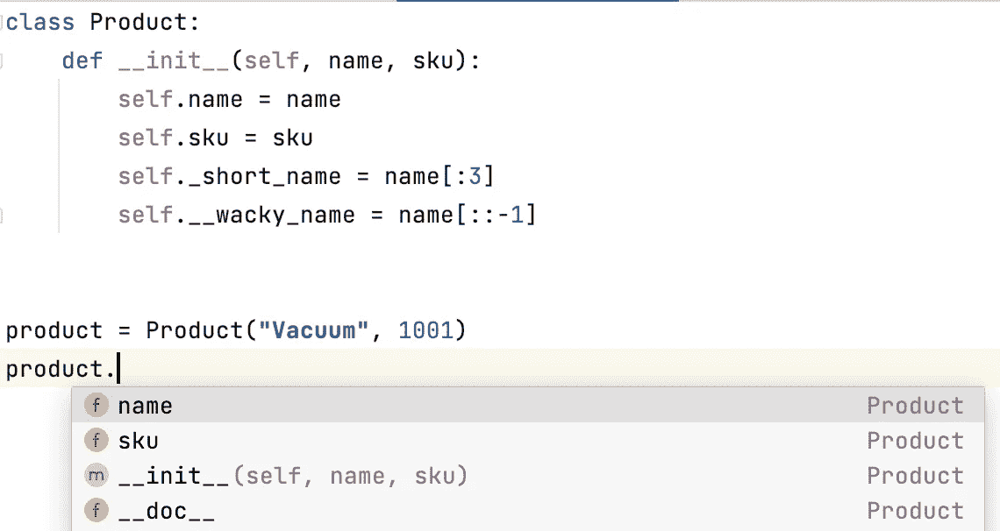

# 定义第一个 Python 类需要考虑的 9 条规则

> 原文：<https://betterprogramming.pub/9-rules-to-consider-for-defining-your-first-python-class-5109e02771b4>

## 利用 Python 作为 OOP 的强大功能


[国立癌症研究所](https://unsplash.com/@nci?utm_source=medium&utm_medium=referral)在 [Unsplash](https://unsplash.com?utm_source=medium&utm_medium=referral) 拍摄的照片。

从本质上讲，Python 是一种面向对象的编程(OOP)语言。它的一个显著特性是能够定义自定义类来将数据存储为属性，并通过方法执行特定的操作。

在本教程中，我想强调在定义你的第一个 Python 类之前你应该知道的重要方面。

# 1.覆盖初始化方法

大多数情况下，你需要覆盖初始化方法(`__init__`)。此方法接受您要设置给该类的每个实例对象的参数。假设我们正在为一家公司创建一个管理产品的应用程序，我们希望将一个类定义为产品的数据模型。根据业务需要，产品最重要的信息是名称和 SKU(库存单位)号。因此，我们可以有以下初始化方法的代码:

```
class Product:
    def __init__(self, name, sku):
        self.name = name
        self.sku = sku
```

在某些情况下，产品具有额外的信息，这些信息在创建实例时无法设置。例如，假设一个产品的可用单位数将在以后确定。与其以后再做`product.unit_count = xxx`，不如在`__init__`方法中设置这个属性，如下所示:

```
class Product:
    def __init__(self, name, sku):
        self.name = name
        self.sku = sku
        self.unit_count = None
```

这种方法的最大优点是明确。代码的读者会在一个地方找到所有的实例属性(即初始化方法)，所以他们会确切地知道一个实例有什么属性。

# 2.定义类属性

除了实例属性，我们还可以定义类属性(由类的所有实例共享的属性)。例如，因为所有产品都是由同一家公司制造的，所以所有实例都共享同一个制造商和品牌。在这种情况下，我们可以定义类属性:

```
class Product:
    maker = "ABC Company"
    brand = "abc"
```

作为一种最佳实践，您希望在类体的顶部定义这些类属性，以便读者能够清楚地理解它们。

还应该注意，当您访问类属性时，您可以使用类或实例对象。通常，他们会给你同样的结果。但是，当您使用实例对象访问它时，您希望确保实例对象没有被意外地设置为具有相同属性名称的不同值。发生这种情况时，将直接使用实例的属性，而 class 属性仅用作后备。这听起来可能令人困惑，但是您可以在下面观察到这种效果:

```
>>> product = Product("Vacuum", 1001)
>>> **# the instance has the class attribute as the class**
>>> product.brand == Product.brand == "abc"
True
>>> product.brand = "Dx"
>>> **# the instance now has the attribute different from the class**
>>> product.brand
'Dx'
```

# 3.定义实例方法

我们经常需要对实例对象应用特定的操作。通常，这些操作是使用函数定义的。当函数被定义在一个类中并且这些函数被实例对象调用时，我们称它们为实例方法。以下代码片段向您展示了一个简单的示例:

```
class Product:
    # the same initialization method as before def update_stock(self, warehouse):
        # get the stock info for the warehouse
        self.unit_count = get_stock_from(warehouse)
```

`update_stock`是一个实例方法的例子，它接受`warehouse`参数并相应地获取股票信息。需要注意的一点是，第一个参数通常被命名为`self`，它指的是调用该方法的实例对象。虽然这个参数可以有不同的名称，但是最好将其命名为`self`。

# 4.定义静态和类方法

如前所述，实例方法旨在操纵实例对象。然而，有些情况下我们需要独立于实例的函数。在这些情况下，我们可能需要定义静态和类方法。静态方法通常是不依赖于类或任何实例的实用函数。因此，您可以将它们视为理论上可以放在类之外的函数。

下面显示了一个可能的例子。假设产品有一个以磅为单位的重量属性。应用程序的其他一些部分有其他与体重相关的信息。我们很可能希望以千克为单位显示重量。在这种情况下，我们可以将这个函数作为一个静态方法。语法是放置一个名为`staticmethod`的装饰器，这意味着我们正在定义一个静态方法。

```
class Product:
    # the same initialization method as before @staticmethod
    def to_kg(weight_pound):
        return weight_pound * 0.453592
```

类方法的使用频率通常较低。有时，我们可以使用它们作为实例化的一种方便方式。假设我们的应用程序可能从外部 API 调用接收到一个包含产品信息的 dict 对象。下面是我们如何使用类方法来满足这一需求:

像静态方法一样，我们使用函数上方的装饰符`classmethod`来表示我们正在创建一个类方法。类方法的惯例是有第一个名为`cls`的参数，它引用类(在本例中是`Product`)。

# 5.对只读属性使用属性装饰器

如果你有任何其他 OOP 的经验，你可能知道有只读属性。这个特性可以通过使用`property`装饰器在 Python 中实现。下面的代码片段向您展示了一个示例。

```
class Product:
    # the same initialization method as before
    @property
    def formatted_sku(self):
        return f"SKU: {self.sku}"
```

正如使用`staticmethod`和`classmethod`装饰器一样，我们将`property`装饰器放在方法之上。通常，我们修饰一个实例方法，这样我们就可以像访问一个普通属性一样使用这个函数，这使得你的代码更加简洁。

当然，`property`装饰器的全部特性还包括为同一个属性创建 setters 和 deleters。可以在我的[上一篇](/why-bother-using-property-decorators-in-python-935c425f86ed)中找到相关信息。

# 6.使用更好的访问控制

另一个 OOP 特性与封装有关，通过封装，你可以考虑向类的外部用户公开什么方法和属性。您可能听说过与封装相关的各种术语，例如私有与公共。当我们说 *public* 时，我们指的是那些可以被类外的实体访问的属性，而 *private* 属性指的是那些可以在类内访问的属性。

默认情况下，类中的所有内容都是公共的。当您想要定义私有属性时，约定是更改属性的命名方式。我们用下划线开始命名，而不是以字母开头。需要注意的是，带有一个下划线的(如`_var_name`)和带有两个下划线的(如`__var_name`)是有细微差别的。

尽管这两个名字都是打算非公开使用的，但是您会看到我们通常需要使用带有一个下划线的名字(也称为受保护的属性)。相反，带有两个下划线的属性被称为私有属性。访问它们涉及到[名称篡改](https://medium.com/analytics-vidhya/python-name-mangling-and-how-to-use-underscores-e67b529f744f)。以下代码片段向您展示了相关示例:

在这个例子中，`_short_name`是一个受保护的属性，而`__wacky_name`是一个私有属性。在类的主体中，您可以像平常一样使用这两个属性。然而，当您在类外访问它们时，它们的行为会有所不同。例如，PyCharm 中的自动完成提示甚至不包括它们，这是我们所希望的行为，因为它们旨在被非公开地访问。



对受保护和私有属性的非公开“访问”

应该注意的是，如果您选择这样做，Python 不会限制您对这些非公共属性的访问。注意我们是如何访问以双下划线开头的私有属性的。就是 mangling 的意思:`__var_name`变成了`_ClassName__var_name`。应用这个转换规则，`__wacky_name`变成了`_Product__wacky_name`。

```
>>> product = Product("Vacuum", 1001)
>>> product._short_name
'Vac'
>>> product._Product__wacky_name
'muucaV'
```

# 7.集成类型提示

从 Python 3.5 开始，类型提示变得可用。这个特性增加了代码的清晰度，并且公共 ide 可以利用所提供的关于类型的提示来给出更有意义的自动完成建议。您可以找到许多关于在 Python 中使用类型提示的在线教程。本文并不打算对这个主题进行全面的回顾。相反，我将向您展示在类定义中使用类型提示的一些常见方法。

在初始化或其他方法中，您可以为参数提供类型提示并返回数据类型。另一个常见的情况是类属性。要指定类型，可以使用冒号后跟类型。下面是一些例子:

类中的类型提示

关于方法的返回值，您通过使用`->`指定返回的数据类型来提供提示。

# 8.编写文档字符串

首先应该注意的是，编写清晰的文档字符串并不意味着可以编写不清晰的代码。您总是需要确保您的代码在没有任何文档字符串的情况下也是可读的。Docstrings 只是为了给那些不熟悉代码的人增加额外的清晰度，这样他们就可以很快知道如何使用这个类、它的属性和它的方法。对于一个类——尤其是一个公共类——您必须提供两个文档字符串。

首先，您将为该类编写 docstrings。通常，它具有以下组件:

*   用一句话概括这门课的预期目的。
*   公共属性的列表。
*   公共方法的列表。

其次，您将为每个公共方法编写单独的 docstrings。对于这些函数，您遵循函数的 docstring 约定，其中包括函数的用途、输入参数和返回数据。在适用的情况下，您可能还需要指定它可能引发的异常。以下代码显示了类的文档字符串:

类文档字符串示例

上面的代码片段只是给你一个关于为一个类编写 docstrings 的一般概念。只要适用，您还可以向代码中添加注释。但是记住你要在评论太少和太多之间找到平衡。当你觉得你的代码可能很混乱的时候，考虑一下重新写代码，让它变得清晰，这样你就不需要写任何注释了。如果你觉得你的代码不能告诉它自己做什么，你可能想添加一些注释。请注意，您的注释应该始终保持简洁，因为注释可能会让阅读您代码的人分心。

# 9.字符串表示

当您定义一个类时，最好重写`__str__`和`__repr__`方法，这样实例就可以有正确的字符串表示。这两种方法的目的不同。

*   `__str__`方法是打印实例对象时使用的方法。通常，它提供关于实例的描述性信息。它是为那些不太关心你的类应该如何被实例化的用户设计的，这是`__repr__`应该做的工作。
*   `__repr__`方法是在交互式控制台中输入 Python 变量时看到的字符串。在大多数情况下，应该清楚地显示如何创建具有相同属性值的实例。这很重要，因为您希望向更关心类的底层实现的用户(如其他开发人员)展示实例化方法。

下面的代码片段向您展示了我们如何覆盖这两个方法:

字符串表示

对于`Product`类的当前实现，这是它们被`print`函数和控制台用于检查的方式:

```
>>> product = Product("Vacuum", 1001)
>>> print(product)
Vacuum (SKU: 1001)
>>> product
Product('Vacuum', 1001)
```

# 结论

在本文中，我们回顾了 Python 类应该考虑的九个元素。应用这些元素将使你的类具有可读性和一致性，从而使它们更易于长期维护。

这里有一个快速回顾:

1.  在初始化方法中，指定所有实例属性——即使是那些没有好的初始值的属性。
2.  类属性是所有实例或与类本身相关的事物共享的属性。
3.  该类的功能主要来自各种实例方法。所以一定要定义好的。
4.  静态方法通常是与类相关的实用函数。在这些方法中，您不需要访问类或任何实例的任何属性。相比之下，类方法需要访问与类相关的属性或方法。
5.  只读属性可以由 property decorator 实现，它将函数调用转换为点标记访问，其行为类似于访问属性。
6.  使用下划线作为前缀使非公共属性/方法不容易被外部用户访问是一种惯例。
7.  使用类型提示使代码清晰，并使您的 ide 提供有用的自动完成建议。
8.  如果你的类打算被公开使用，文档字符串是必须的。即使一个类被私人使用，拥有有意义的 docstrings 也是一个好习惯。
9.  字符串表示对于检查非常有用，可以帮助用户更好地理解您的类。