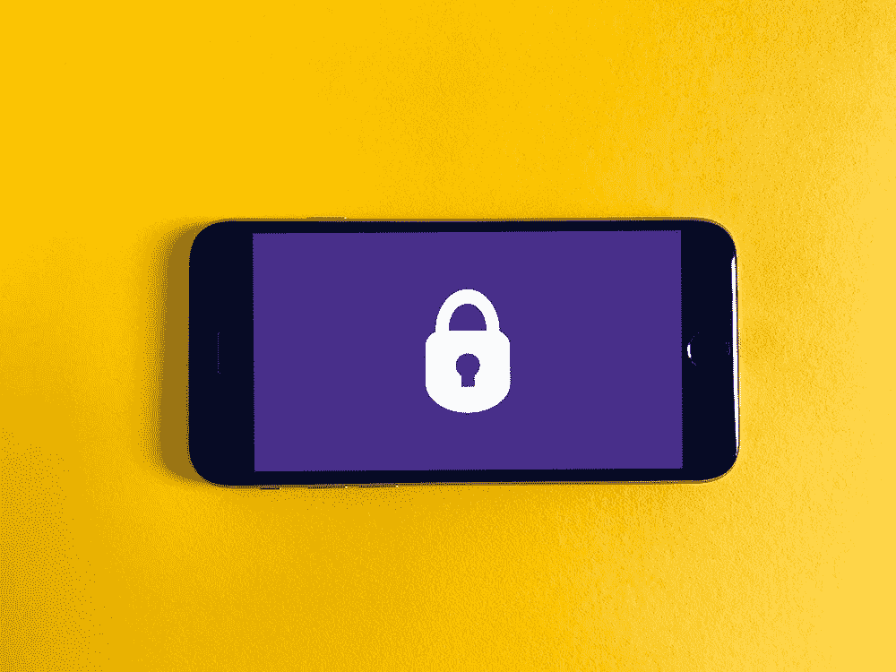
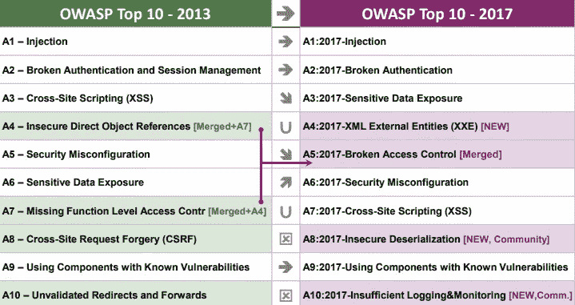
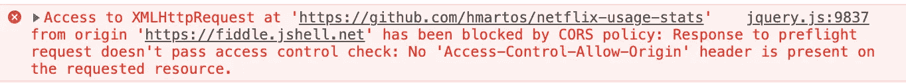
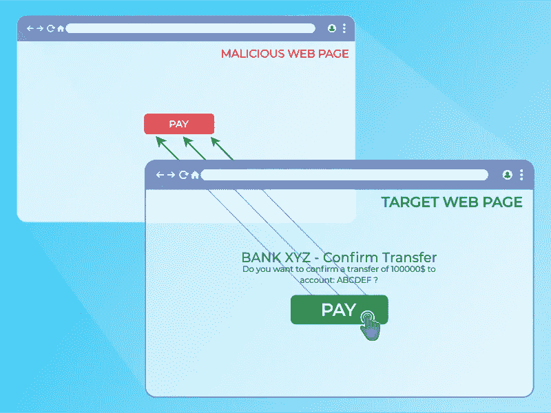
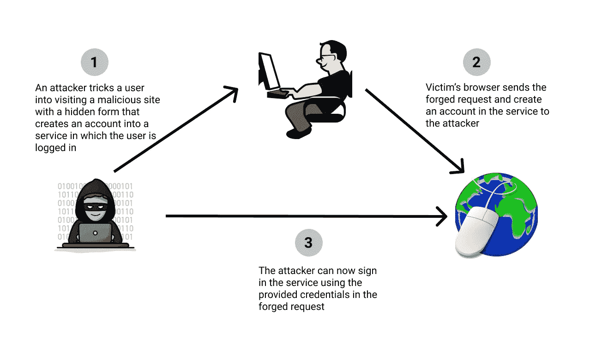

# 部署 Web 应用程序前需要考虑的 9 个安全问题

> 原文：<https://betterprogramming.pub/9-security-implications-to-consider-before-deploying-a-web-app-1f94a58c6fc9>

## 保护 web 应用程序免受最常见攻击的清单

图片来自 [Unsplash](https://unsplash.com/photos/DoWZMPZ-M9s)

当部署一个新的 web 应用程序时，它通常要接受安全检查。但是也有急于走向市场的情况，因此部署安全性条件较低的应用程序的第一个版本并不罕见。

每隔三到四年， [OWASP](https://owasp.org/) 就会发布一份[十大网络应用安全风险的列表。](https://owasp.org/www-project-top-ten/)这个列表反映了 web 服务实现中最常见的错误。

最新发布的 OWASP 前 10 名(2017 年)与前一版(2013 年)之间的变化

在我的职业生涯中，我开发过几个具有高安全性含义的 web 应用程序。在这段时间里，我已经提交、发现并修复了所有这些类型的错误。我也进行了一些道德上的黑客攻击，所以我对开发人员通常失败的地方有所了解。

在本文中，我将强调在部署 web 应用程序之前要考虑的不同的安全方面，与底层技术无关。

**免责声明:**这是基于 OWASP 十大安全检查清单和我自己的经验。您的 web 应用程序可能不需要此列表中的某些点，或者可能需要下面没有列出的一些安全考虑事项。

# 设计

良好的 API 设计是避免安全问题的关键。遵循设计最佳实践和良好的 API 文档有助于识别 restful API 中的危险信号。

有[指南](https://stackoverflow.blog/2020/03/02/best-practices-for-rest-api-design/)和特定工具，像 [Swagger 编辑器](https://swagger.io/tools/swagger-editor/)和 [OpenAPI 规范](https://swagger.io/specification/)对这些目的非常有用。

# 认证和授权

大多数情况下，您的应用程序会有一个私有区域，因此您应该在执行任何请求之前执行身份验证和授权控制。

如果请求者不是具有活动会话和所需权限的有效用户，这些控制应该阻止任何操作的执行。

好的 API 文档应该包括认证细节。

# 访问控制— CORS

访问控制应该仅限于 web 应用程序域(或白名单)。如果服务器上启用了 CORS，预检请求将检查请求的来源是否允许，如果不允许，将抛出错误。

从 JSFiddle 向 GitHub 发出请求会抛出一个 CORS 错误

在开发阶段使用非常宽松的 CORS 配置，并在生产环境中意外地部署这种配置是很常见的。

你可以用 test-cors.org 测试你的服务器上是否启用了 CORS。

# SQL 注入

这种攻击包括在服务器数据库中执行表单注入查询。这样，黑客可以从我们的数据库或系统中提取、修改或删除数据。

保护我们的服务器免受这种攻击的最好方法是净化数据库查询中可能结束的所有参数。

[sqlmap](http://sqlmap.org/) 是识别 SQL 注入缺陷的伟大工具。

# HTTP 安全标头

HTTP 安全头对于保护我们的应用程序免受常见攻击非常有用。像[头盔](https://helmetjs.github.io/)这样的库允许我们在 [Express](https://expressjs.com/) 应用中无缝地添加这些头。

有许多用于不同目的的 [HTTP 安全头](https://developer.mozilla.org/en-US/docs/Web/HTTP/Headers#security)可以帮助缓解最常见的攻击:

## **XSS*袭击*袭击**

[跨站点脚本](https://portswigger.net/web-security/cross-site-scripting) (XSS)攻击包括执行攻击者注入可信网站的任意 JavaScript 代码。在最新的 OWASP Top 10 (2017)中，XSS 是第七大最常见的 web 应用程序漏洞。

使用`[Content-Security-Policy](https://developer.mozilla.org/en-US/docs/Web/HTTP/Headers/Content-Security-Policy)` 报头和严格的输入净化可以防止和降低 XSS 攻击的风险。如果需要支持遗留浏览器，还应该设置`[X-XSS-Protection](https://developer.mozilla.org/en-US/docs/Web/HTTP/Headers/X-XSS-Protection)`头。

## ***点击劫持***

[Clickjacking](https://developer.mozilla.org/en-US/docs/Web/Security/Types_of_attacks#click-jacking) 包括劫持用户在网站中的交互，例如他们的点击或击键，使用顶层的一个看不见的框架来欺骗用户执行非预期的操作。

用户点击了绿色的付费按钮，却没有意识到他们实际上是在恶意网页的透明顶层点击了红色的付费按钮。图片来自 [OWASP](https://owasp.org/www-project-web-security-testing-guide/latest/4-Web_Application_Security_Testing/11-Client-side_Testing/09-Testing_for_Clickjacking.html) 。

我们可以通过添加 HTTP 头`[Content-Security-Policy](https://developer.mozilla.org/en-US/docs/Web/HTTP/Headers/Content-Security-Policy/frame-ancestors)` [frame-ancestors](https://developer.mozilla.org/en-US/docs/Web/HTTP/Headers/Content-Security-Policy/frame-ancestors) 或`[X-Frame-Options](https://developer.mozilla.org/en-US/docs/Web/HTTP/Headers/X-Frame-Options)`来增加对应用程序的保护，以防止我们的站点嵌入或被嵌入到`iframe`中。

## **CSRF*袭击*袭击**

[跨站点请求伪造](https://developer.mozilla.org/en-US/docs/Web/Security/Types_of_attacks#cross-site_request_forgery_csrf) (CSRF)是一种攻击，它迫使用户的浏览器在他们当前登录的 web 应用程序上执行不必要的操作。

CSRF 攻击的例子

针对 CSRF 攻击的主要缓解措施是使用 CSRF 令牌和`[SameSite](https://developer.mozilla.org/en-US/docs/Web/HTTP/Headers/Set-Cookie/SameSite)`cookie。对于 Node.js 应用程序，`[csurf](https://www.npmjs.com/package/csurf)`模块为 CSRF 令牌的创建和验证创建一个中间件。

# 错误处理

如[墨菲定律](https://en.wikipedia.org/wiki/Murphy%27s_law)所述，如果某些事情可能出错，它就会出错，所以你的 restful API 应该准备好优雅地处理错误。

避免在错误中暴露可能对攻击者有用的信息(如技术、版本或非常描述性的消息)。通过返回标准状态代码和一般响应来处理 HTTP 错误。

好的 API 文档应该包括不同错误响应的细节，比如未授权访问或内部服务器错误。

# 日志记录、监控和审计

最重要的是创建并保存应用服务器的日志，以便能够随时了解发生了什么。所收集日志的数量和详细程度因应用程序而异。

确保适当的日志轮换以避免生成巨大的日志文件，并根据日志保留策略保留旧的日志文件以符合审计要求。

如果您有一个 [SIEM，](https://en.wikipedia.org/wiki/Security_information_and_event_management)您可以设置这些日志来创建警报，并在我们的应用程序中检测到异常时触发警报。

最新的 OWASP Top 10 (2017)首次将日志记录和监控不足列为常见的 web 应用安全风险。

# 最新的系统和依赖项

每个软件和每个系统都应该定期更新，至少要安装安全补丁。

像 [Anchore](https://anchore.com/) 或 [Snyk](https://snyk.io/) 这样的工具可以帮助你发现已知的漏洞，这样你就可以快速修复它们。

# HTTPS

始终使用 SSL/TLS 上的 HTTP 在客户端和服务器之间建立安全的通信通道。

您可以在与`[Strict-Transport-Security](https://developer.mozilla.org/es/docs/Web/HTTP/Headers/Strict-Transport-Security)`头(HSTS)的连接中强制使用 HTTPS。

# 最后的想法

安全级别必须根据您所保护的数据的敏感性进行调整。安全漏洞可能会给企业带来严重的后果，有时直到出现问题时才考虑安全性，而此时可能已经太晚了。

虽然[不可能完全安全](https://medium.com/@aprilcwright/is-it-even-possible-to-be-completely-secure-6c7a92a297a9)，但是考虑到这些因素可以极大地降低安全事故及其相关风险。

感谢阅读！