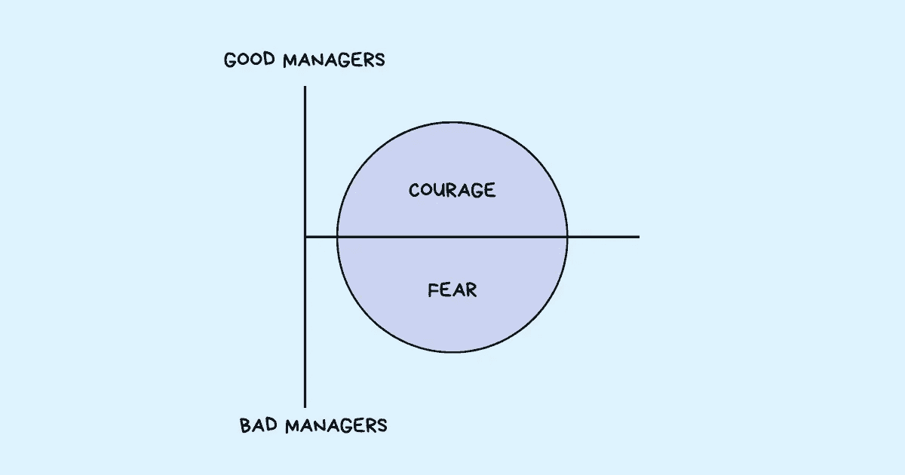

# 糟糕经理的 9 个迹象

> 原文：<https://betterprogramming.pub/9-signs-of-a-bad-manager-a22feb59c4eb>

## 经理们，知道当每个人都在看着你的时候不要做什么

如果你工作了足够长的时间，很可能你自己也遇到过糟糕的经理。他们的哪一点最让你烦恼——他们是无情的、挑剔的、苛求的、虐待的、好斗的、疏忽的、暴躁的、糟糕的还是明显无能的？是他们寻求关注的行为、责备和侮辱他人的欲望、无法信任还是缺乏诚信给你带来了最大的精神痛苦？

是的，糟糕的经理从他们的员工身上吸取了太多的情绪和精神能量，以至于没有精力去做真正的工作。残酷的事实是，随着越来越多的时间花在“取悦老板”和“处理老板的坏脾气”上，剩下的时间就越来越少了。

虽然许多经理认为他们正在为员工创造伟大的工作扫清道路，但他们最终真正做的是站在他们头上——从而阻止他们清晰地思考。他们是利用员工真正潜力的绊脚石。有趣的是，他们没有意识到这一点。最糟糕的老板最糟糕的一点是他们不知道自己的无知。

他们的行为让员工面临失败，但他们相信自己在自己的岗位上做得相当不错。其他人拒绝接近他们，担心他们的想法会遭到抵制，但他们认为可以信任他们的真实想法。失败和错误本应是宝贵的学习经验，却变成了指责和指责的战场。决策不是作为一个团队做出的，而是变成了建立权威和控制局面的权力游戏。自由和增强权能的概念只是口头上说说，却没有体现在行动中。他们对某件事或某个人默默地感到不快和恼火，拒绝说出自己的想法，同时宣扬开放和建设性论点的价值。

当“他们说什么”和“他们做什么”和“他们如何行动”不匹配时，他们怎么能被信任呢？本应在员工工作成功中发挥重要作用的经理，却成了他们失败的原因。

英特尔前董事长兼首席执行官安迪·格罗夫在《高产出管理》中说:“当一个人没有做好自己的工作时，只有两个原因。这个人要么不能做，要么不会做；他要么没有能力，要么没有上进心。”当人们不在一个组织中工作时，一个糟糕的经理会立刻认为是以前的*“他们不知道如何工作！”*完全无视他们的行为如何挫伤了员工的积极性*“他们知道如何去做，但却没有真正的积极性！”*

# 9 个迹象表明你是一个糟糕的经理

和一个糟糕的经理一起工作会很痛苦。但是很容易把他们认定为最糟糕的老板，因为他们有很多共同的品质。如果你是一名经理，而且很可能是一名优秀的经理(或者你是这么认为的)，也许是时候做一次现实检查了。识别老板的不良行为需要观察他们是如何运作的:

## 1.他们摧毁了他们团队的信心

当有人犯了错误，在某件事上失败，或者不知道如何完成某件事时，他们的反应是让他们觉得自己很愚蠢:“真的，你不知道怎么做吗？”“我刚才是不是招错人了？”

他们特别擅长让他们的团队成员觉得自己比其他人渺小。他们不是将自己目前的表现与过去的表现进行比较，而是不断提醒自己还有多少不足:“xyz 是我的明星员工。你为什么不能像她一样？”“我希望你能做…”

他们善于批评团队成员的弱点，却不承认他们的优点。他们没有帮助他们改善和投资他们的成长，而是在固定的思维模式中找到借口——人们有固定的天赋，那些不好的人无法做很多事情来变得更好:“她永远不够好！”“他根本不具备这种素质！”在这种心态下，他们放弃了表现不好的团队成员，不给他们证明自己的机会。

他们不是通过建立对团队的信心和信任来提升团队成员，而是通过指责和指责来让他们失望。玛娅·安杰洛有句名言:

> “人们会忘记你说过的话，会忘记你做过的事，但人们永远不会忘记你带给他们的感受。”

糟糕的经理会摧毁团队的信心，进而影响他们做得更好的动力。

## 2.他们不知道如何处理情绪

有时事情会进展顺利，而在其他时候，就没那么顺利了。有些日子会阳光灿烂，而有些日子会平淡无奇。起伏是角色的一部分。这是一种坐过山车的感觉——一会儿兴奋，一会儿又崩溃。

我以前说过——当经理不容易。不是每个人都学会处理痛苦的情绪，这是工作的一部分。但这正是糟糕的管理者与优秀管理者的区别。

在处理冲突时，糟糕的管理者通常不冷静、清晰地对待自己的情绪，也不花时间去调和事实，而是匆忙做出结论和判断。他们以“我的方式或高速公路”的态度开始，并通过大喊大叫、辱骂、贬低、使用攻击性肢体语言和其他可能导致有毒工作环境的粗鲁行为进行防御。

他们也会根据情绪做出重要的决定。这个决定的核心是这样一个问题——“这会让我看起来怎么样？”而不是“我做了正确的决定吗？”他们认为分歧是对他们身份的攻击，是不尊重的表现，而不是找到正确答案的机会。如果别人挑战他们的观点，他们担心会失去自己的权威。

他们不听，他们只想被听到。他们不承担责任，他们只想邀功。他们不想做出正确的决定，他们只想做出让他们感觉良好的决定。

糟糕的管理者让他们的情绪引导他们的思维，蒙蔽他们的判断，让他们无法清晰地思考。

## 3.他们通过一系列的命令来加强沟通

在一个组织中解决问题的最好方法是什么？使跨团队和跨职能的人们能够相互交流。让人在[协作](https://www.techtello.com/cross-functional-teams/)中感到自在，没有界限。不要让等级制度减缓交流或成为延误的原因。

糟糕的管理者恰恰相反。他们通过指挥链加强沟通，这意味着每一次沟通都需要经过经理。团队中的人被迫与他们的经理交谈，经理与另一个团队的经理交谈，经理再与他们团队中合适的人交谈。这个循环并没有就此结束。

随着信息的回流，同样无效的指挥链被投入使用。与人面对面交谈几分钟就能解决的事情现在需要几天时间，更糟糕的是，它增加了各种问题——困惑、缺乏清晰度、误解和错位。当太多人参与到一个等式中时，即使简单的解决方案也会变成复杂的灾难。

无效的团队沟通实践使管理者成为团队内外所有沟通形式的瓶颈。它可能会增强经理的权力，但它无法服务于公司及其员工。

糟糕的管理者喜欢继续掌权，甚至不惜拖团队后腿。

## 4.他们拒绝承认好主意

糟糕的经理对任何打破模式、需要冒险、不符合他们过去的成功以及与他们自己的想法不一致的事情都有偏见。他们忙着关闭想法，以至于没能有效地倾听(T2)。

为什么他们总是找理由对真正有前途的想法说不？

因为他们担心失败会影响他们的能力。这会影响他们的信誉，毁掉他们的职业生涯。他们不想在他们的人面前因为误报而尴尬——说某样东西会很受欢迎，而事实上它会是个失败。他们认为，拒绝一个伟大的想法没有成本，谨慎行事可以保持他们的形象完整，因为其他人看不到无形的损失。

出于好看的动机和对丢面子的恐惧，他们坚持安全下注，这意味着拒绝所有潜在的伟大想法。他们聪明的思维模式把他们困在了自己的极限之内——在这里，他们无法跨出一步，探索各种可能性。

糟糕的经理会否决好主意，从而将潜在的收益转化为无形的损失。

## 5.他们没有提供方向

糟糕的经理领导混乱，而不是清晰。团队成员没有被给予明确的期望，他们的任务和责任没有分离，他们缺乏决策的背景。就个人而言，团队成员不知道他们要去哪里，也不知道他们的工作如何符合团队的目标。

由于团队中的人不知道什么推动他们前进，什么推动他们后退，他们以做出重大贡献为代价继续做无关紧要的工作。团队成员无法区分需要更多解释的情况和想法已经成熟到可以付诸行动的情况。很多时间被浪费在没有太大价值的谈话中，而很少关注将对他们的成长产生巨大影响的工作。

> “作为经理，你工作的第一大部分是确保你的团队知道成功是什么样的，并关心如何实现它。”—朱莉·卓

当经理没有传达对员工的期望时，员工如何实现这些期望？当人们连方向感都没有的时候，他们怎么能做出正确的决定呢？

糟糕的管理者担心结果，却没有定义目标，也没有提供导致这些结果的背景。

## 6.他们没有设定可接受的行为标准

每个人都喜欢自己的努力得到认可和赞赏。每个人都想要尊重和钦佩。当人们知道自己的贡献有所作为时，他们会对工作更加投入，他们会更加努力工作，并享受自己的努力。而让员工知道自己被重视的最好方式是什么？给他们积极的反馈并认可他们的努力。明确他们的行为会有所不同，并给他们一个重复这些良好行为的机会；这促使他们在团队中追求更高的成就。

仅仅告诉人们他们做得对是不够的。树立不容忍不良行为的榜样同样重要。员工需要知道他们做对了什么，做错了什么。这既是为了消除不良行为，也是为了强化良好行为。

> “说到标准，作为一个领导者，不是你宣扬什么，而是你容忍什么。在设定期望时，不管说了什么或写了什么，如果低于标准的表现被接受，并且没有人被追究责任——如果没有后果——那么糟糕的表现就会成为新的标准。”—叶小开·巴宾

糟糕的经理不会采取任何措施来应对不良行为，从而设定了一种预期，即任何人都可以逃避平庸的表现或不可接受的行为。他们对自己的员工也不感兴趣，无法注意和欣赏员工的出色工作——对出色完成的工作没有表扬。他们也不会为自己的团队成员辩护，或者在发生冲突时站出来为他们辩护。当另一个部门的人欺负他们的团队成员时，他们宁愿保持沉默。

不关心给团队成员反馈的坏经理会限制他们的成就，让一个坏苹果毁了一群人。

## 7.他们因恐惧而领导

害怕失败，害怕错误，害怕失去信誉，害怕地位，害怕未知，害怕批评，害怕改变…一个糟糕的经理不仅带着恐惧领导，而且他们还缺乏认识到自己的行为对他人的负面影响的自我意识。他们忽视与他们对自己的信念相矛盾的反馈。

基于恐惧的管理看起来如下:有时表现得像一个微观管理者，像一只鹰一样关注着团队的每一个动作。在其他时候，使用恐吓作为完成工作的策略。甚至在错误发生之前就指出来。避免挑战，和已知的人呆在一起，不惜一切代价防止失败。顺应大众观点，而不是说出自己的想法。压制反对声音，让位于确认偏见。避免艰难的决定以避免以后的麻烦。

出于恐惧的领导，即使是无意的，也会对组织中的人产生深远的影响:员工开始采取防御行动，而不是出于好奇，他们花费时间和精力想要正确，而不是想要学习，他们的行动是为了保护他们的自尊，而不是为了在冒险和表现出脆弱性时感到安全。

当恐惧成为所有决策的首要因素时，糟糕的经理也会驱使他们的团队成员带着恐惧行动。

## 8.他们让自己的喜好干扰了公平

糟糕的经理做出决定是基于他们有多喜欢某个人，而不是他们有多好。他们认为有些人有价值，有些人没用。有些人有天赋，有些人不行。有些人值得被提升，而有些人甚至不值得他们付出时间。

他们非常容易产生确认偏差——有选择地选择强化他们信念的数据，拒绝每一个矛盾的证据。他们是扭曲信息和创造故事的大师，以符合他们的信仰和假设。病假变成懒惰，错过送货表示无能，不参加会议表示不尊重，问问题是企图显示优越感。他们不去验证他们的假设，并且很快就下结论。

每个人都可以看到他们偏心，根据他们的讨人喜欢的因素而不是他们的潜力来提升团队成员，雇用那些将他们作为经理而不是对组织有益的人。每个人都能看到，除了他们。他们看不到自己的偏见。

糟糕的经理不会给团队成员平等的机会。他们喜欢某些人而忽视其他人的偏见干扰了他们公平行事的能力。

## 9.他们试图阻止表现优异的人

糟糕的经理将团队中的高绩效者视为对自身形象的威胁:“如果团队中的其他人拥有更多知识、更好的工具和技能，人们会怎么想我？”“他们会质疑我的权威吗？”“他们会尊重我吗？”“我会失业吗？”

总是担心团队中的高绩效者会超过他们，这阻碍了他们发挥自己的真正潜力，并导致这些行为:表现出不愿错过正确的机会。让他们远离聚光灯。扮演万事通的角色，主动给自己专业领域的人提供建议。

他们不太关注留住自己最优秀的人才和培养卓越的文化，而是更担心其他人的表现会损害自己在公司的地位。当高绩效员工因其不成熟的行为和保持控制的策略而离开组织时，他们会责怪他们，而不是客观地审视自己导致他们离开的行为。更糟糕的是，当一名高绩效员工离开时，一些经理感到如释重负:“终于，我的团队可以看到我的辉煌了！”“我现在又可以发光了！”

糟糕的经理不会把他们的高绩效员工作为增长的引擎，他们会把他们拉回来，以保持他们的自尊完好无损。

想扭转局面吗？从罗伯特·萨顿的建议开始:

1.  有强烈的观点和微弱的信念。
2.  不要把别人当成白痴。
3.  倾听你的人民；不要假装听到他们说的话。
4.  问很多好问题。
5.  向他人寻求帮助，并感激地接受他们的帮助。
6.  不要犹豫地说，“我不知道。”
7.  当人们失败时，原谅他们，记住教训，并教给每个人。
8.  像对了一样去战斗，像错了一样去倾听。
9.  争论失败后不要记仇。相反，尽全力帮助胜利者实现他们的想法。
10.  了解你的弱点和缺陷，与纠正和弥补你弱点的人一起工作。
11.  向你的员工表达感激之情。

# 摘要

糟糕的经理:

1.  摧毁他们团队的信心，以及做得更好的动力。
2.  让他们的情绪引导他们的思维，蒙蔽他们的判断力，让他们想清楚。
3.  喜欢保持权力，即使以拖慢他们团队的速度为代价。
4.  否决好的想法，从而将潜在的收益转化为无形的损失。
5.  担心结果——没有定义目标和提供背景——导致那些结果。
6.  不够关心给他们的团队成员反馈，从而限制了他们的成就，让一个坏苹果毁了一群。
7.  当恐惧成为所有决策的首要因素时，糟糕的经理也会驱使他们的团队成员带着恐惧行动。
8.  不给自己团队成员平等的机会。他们喜欢某些人而忽视其他人的偏见干扰了他们公平行事的能力。
9.  不要把他们的高绩效者作为增长的引擎，他们把他们拉回来是为了保持他们的自尊完好无损。

*原载于 2021 年 4 月 15 日*[*【https://www.techtello.com】*](https://www.techtello.com/bad-managers/)*。*