# 区分初级和中级 Python 程序员的 9 个技巧

> 原文：<https://betterprogramming.pub/9-skills-that-separate-a-beginner-from-an-intermediate-python-programmer-8bbde735c246>

## 思考和编写代码…但主要是思考


照片由来自[佩克斯](https://www.pexels.com/photo/woman-sitting-while-operating-macbook-pro-1181676/?utm_content=attributionCopyText&utm_medium=referral&utm_source=pexels)的[克里斯蒂娜·莫里洛](https://www.pexels.com/@divinetechygirl?utm_content=attributionCopyText&utm_medium=referral&utm_source=pexels)拍摄

*由于 Honza Král* ，文章中的一些代码已经更新

Python 是一种奇妙的语言。语法很简单，您不必在代码中进行任何分号搜索。对于初学者来说，我认为 Python 是最容易入门的语言之一。

您已经有了一套很好的库，并且可以安装大量的其他库来增加您的编程体验。

过一会儿，你可能会觉得为一个简单的操作写很多代码有点困难。这实际上没有你想象的那么糟糕。理解你正在做的事情背后的逻辑比代码行更重要。短代码更好，但是如果逻辑被破坏了，你的代码无论如何都会有问题。有了经验和创造力，你的代码最终会更短更好。

# 初级与中级

那么，对于 Python 编程来说，初学者和中级者的区别是什么呢？

在这篇文章中，我将重点介绍以下内容:

*   解决问题和提出问题。
*   XY 问题
*   理解代码工作(或不工作)的原因
*   使用字符串
*   使用列表
*   使用循环
*   使用函数(并正确地谈论它们)。
*   面向对象编程
*   尊重 PEP

# 1.解决问题和提问

作为一名程序员，如果你缺乏解决问题的技能，我会说你很难用优秀的代码来弥补。

如果你解决问题的头脑不发达，你可能无法描绘出你试图解决的问题的最佳解决方案。编程不仅仅是写代码。解决问题是*你需要的*技能，你才有机会爬出初学者的范畴

询问关于编程的问题也很重要。如果你只是想找人来解决你的问题，而没有尝试过任何事情，你还不如退出。这很难，但如果你不尝试自己解决问题，你将从解决方案中一无所获。

如果你想了解我如何提出编程问题，我有一篇单独的文章:

[](https://medium.com/better-programming/how-to-ask-questions-about-programming-dcd948fcd2bd) [## 如何提出关于编程的问题

### 你至少要付出 n%的努力

medium.com](https://medium.com/better-programming/how-to-ask-questions-about-programming-dcd948fcd2bd) 

# 2.XY 问题

> “我需要从一个字符串中提取最后三个字符”。
> “不，你没有。您需要文件扩展名"

XY 问题是一个有趣的问题。你有一个问题——X，当你打电话给服务台询问问题 Y 的解决方案时，你认为这个方案可以解决你的问题 X

上面的案例就是一个完美的例子。如果您想要某个文件名的文件扩展名，很容易假设您想要最后三个字母。

它会如何发展:

```
def extract_ext(filename):
    return filename[-3:]print (extract_ext('photo_of_sasquatch.png'))>>> png
```

太好了！现在做`photo_of_lochness.jpeg`


来自 [Pexels](https://www.pexels.com/photo/photo-of-man-touching-his-head-3752834/?utm_content=attributionCopyText&utm_medium=referral&utm_source=pexels) 的 [Andrea Piacquadio](https://www.pexels.com/@olly?utm_content=attributionCopyText&utm_medium=referral&utm_source=pexels) 的照片

用户应该从一开始就要求扩展。最后三个字母是 Y 问题。X 问题是我们想要扩展。

```
def extract_ext(filename):
    return filename.split('.')[-1]print (extract_ext('photo_of_sasquatch.png'))
print (extract_ext('photo_of_lochness.jpeg'))>>> png
>>> jpeg
```

成功！

也可以使用标准库***OS . path . split ext()***。查看这里: [os.path.splitext()](https://www.geeksforgeeks.org/python-os-path-splitext-method/)

# 3.理解代码工作(或不工作)的原因

作为一个初学者，你可能会花上几天的时间编写一小段代码。如果代码突然工作了，你可能会有一种解脱的感觉，然后直接跳到代码的下一部分。这是你能做的最糟糕的事情之一。在不理解*为什么*的情况下接受它的工作可能比不理解为什么*不*运行的代码更危险。

不理解代码为什么不运行是经常会发生的事情。当您进行故障诊断，并最终找出它为什么不起作用时，思考它为什么不起作用以及最终是什么使它起作用是非常重要的。你将把这些知识转移到你的下一个程序中。

例如，如果您的代码中有几级缩进的缩进错误，您可能只是开始随机移动代码块——然后庆祝它最终工作。

请记住，在大多数 ide 中，您可以折叠循环和 if 语句。这样可以很容易地看到您正在处理的部分。

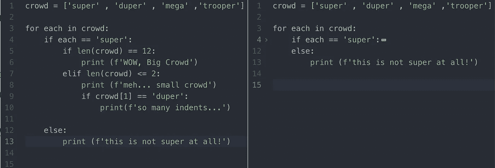

右边带有折叠 if/else 的原子。

另一种可视化代码的方式是使用[www.pythontutor.com](http://www.pythontutor.com)，在那里你可以看到代码是如何一行一行运行的。

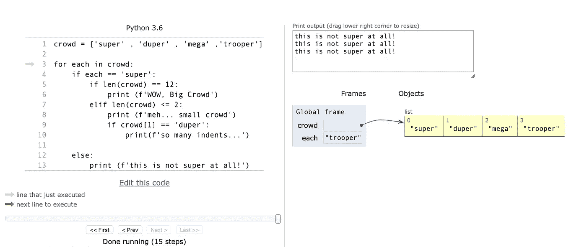

使用 pythontutors 执行代码。

# 4.使用字符串

这一节并不完全与字符串相关。更多的是挖掘 Python 的美好库。

我们很早就在 Python 中了解到，字符串也可以被视为一系列字符。您可以使用索引访问字符串中的字符。

```
word = 'supergreat'
print (f'{word[0]}') >>> sprint (f'{word[0:5]}')>>> super
```

一个敏锐的学习者会检查`str()`提供了什么，但是你也可以继续编程，而不用检查`str()`的文档。

要查看函数或程序的文档，您可以调用`help(str)`或`dir(str)`。当你这样做的时候，你可能会发现一些你以前不知道的方法。也许你查阅了`str()`，发现有一种叫做`endswith()` 的方法——也许你可以用它做点什么。

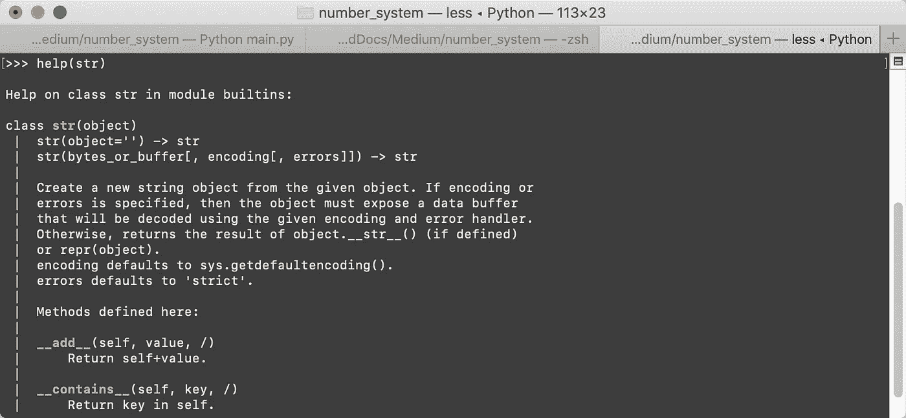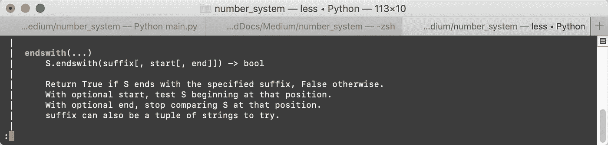

这是一个用两种不同方式做同样事情的代码示例。一种是使用我们一分钟前讨论过的分割。另一个是使用我们刚刚学到的`endswith()`:

大多数程序员永远不会阅读所有的文档并了解所有的东西。成为程序员的一部分就是要知道如何搜索关于如何解决你的问题的信息。

# 5.使用列表


照片来自 [Pexels](https://www.pexels.com/photo/notebook-1226398/?utm_content=attributionCopyText&utm_medium=referral&utm_source=pexels) 的 [Suzy Hazelwood](https://www.pexels.com/@suzyhazelwood?utm_content=attributionCopyText&utm_medium=referral&utm_source=pexels)

列表很棒，用途也很广。

下面是一个混合整数和字符串的例子:

```
my_list = ['a' , 'b' , 'n' , 'x' , 1 , 2 , 3, 'a' , 'n' , 'b']
for item in my_list:
    print (f'current item: {item}, Type: {type(item)}')
```

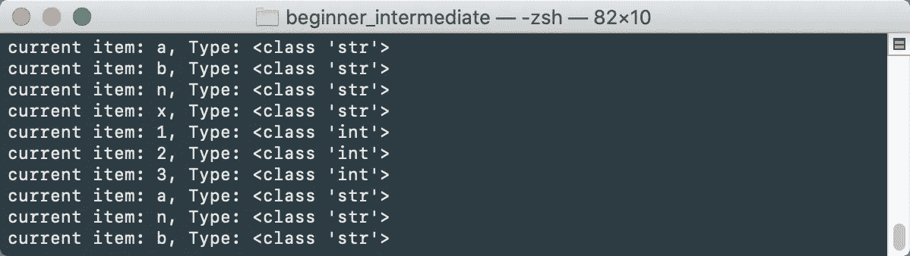

注意我们是如何混合字符串和整数的。如果我们试图对它进行排序，我们会得到一个错误:

```
print (my_list.sort())
```

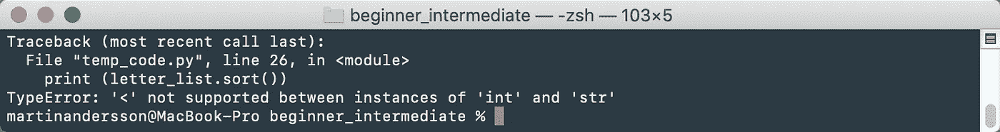

如果我们想把整数和字母分开呢？一种方法是使用循环来检查列表中的每一项。初学者会在早期使用循环，而循环对于编程来说是必不可少的。

代码可能如下所示:

这是一种有效的方法，尽管有点混乱。代码可以运行，但是可以重构为用一行代码编写*！*

如果你想在生活中多一点快乐，学习 Python 中的列表理解。这里有同样的问题，但是使用列表理解:

```
my_list = [letter for letter in my_list if isinstance(letter,str)]
```

就是这样！

事情不必就此结束！这就是你如何使用`filter`来获得相同的结果:

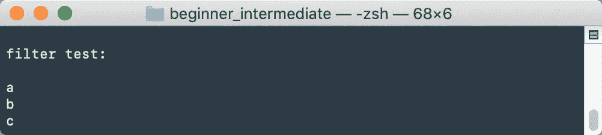

现在你可能明白了，有很多方法可以达到同样的结果。你必须弄清楚什么对你或你的团队有效。

## **奖金**

*   反转列表(或字符串):

```
names = ['First' , 'Middle' , 'Last']
print(names[::-1])>>> ['Last', 'Middle', 'First']
```

*   连接列表中的元素:

```
names = ['First' , 'Middle' , 'Last']
full_name = ' '.join(names)
print(f'Full Name:\n{full_name}')>>> First Middle Last
```

# 6.使用循环

你以前见过 Python 中的这段代码吗？

```
greek_gods = ['Zeus' , 'Hera' , 'Poseidon' , 'Apollo' , 'Bob']for index in **range(0,len(greek_gods))**:
    print (f'at index {index} , we have : {greek_gods[index]}')
```

你可能会从其他语言中认出它，但它不是很 Pythonic 化。在 Python 中，可以使用 for-each 循环:

```
for name in greek_gods:
    print (f'Greek God: {name}')
```

你可以很快看到我们这里没有索引。如果你想用索引打印呢？在 Python 中，您可以使用`enumerate`——这是一种访问您需要的一切的绝妙方法。

```
for index, name in enumerate(greek_gods):
    print (f'at index {index} , we have : {name}')
```

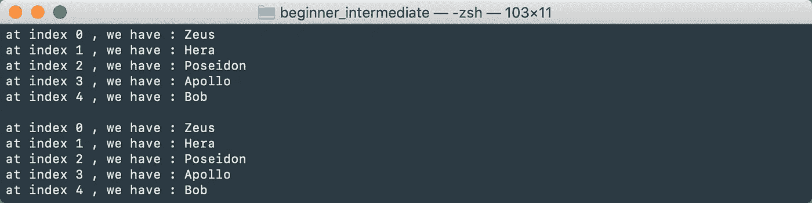

相同的图案，最后一个是用蟒蛇皮做的。

# 7.使用功能(并正确谈论它们)

当我从事动画工作时，我总是说，如果你做同样的动作五次，你应该考虑是否需要一个程序。有时候花两周时间开发一个工具可以节省你六周的工作时间。

当你写代码的时候，你发现你不止一次地做着同样的动作，你应该考虑这是一个过程还是一个函数，而不仅仅是代码。一个函数会返回一些东西，而一个过程只是运行代码。第一个例子是过程，第二个例子是函数。

可能会很混乱。下面的插图展示了它的工作原理:

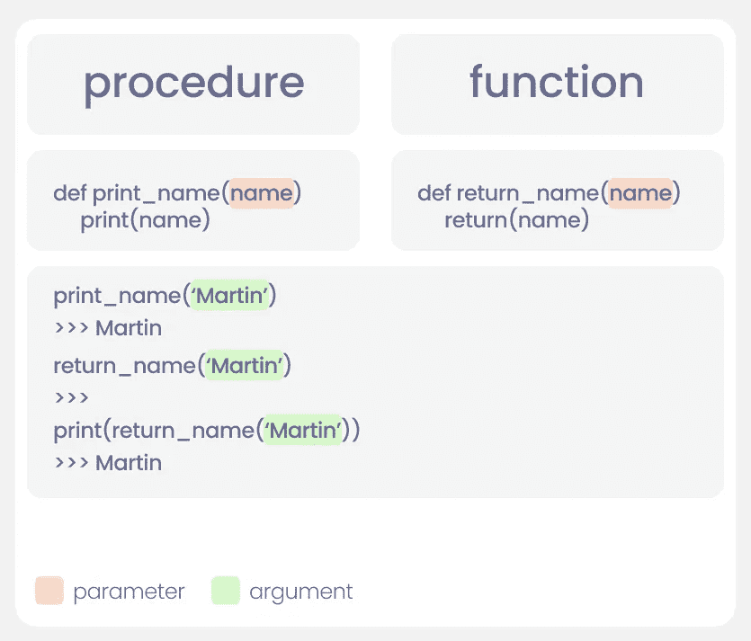

注意`print`和`return`的区别。看起来它们做了同样的事情，但是如果你看看输出，这个函数只是返回发送的名字。

下一个需要了解的语法是形参和实参。当在过程或函数中定义时，它们被称为参数(红色)；当你将`name`传递给过程或函数(绿色)时，它们被称为参数。

这里有一些例子。

## **例 1**

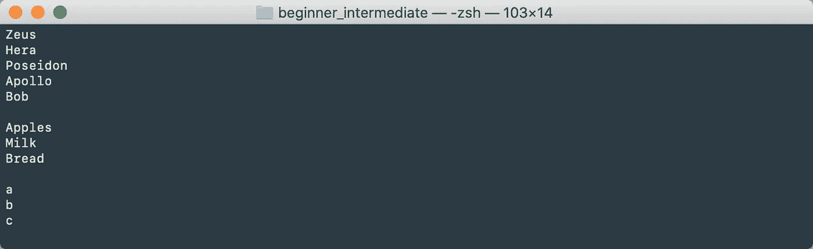

我们在过程中编写一次循环，并在需要时调用它，而不是编写三次。

在第二个例子中，你可以看到它是如何返回反向列表的。

## **例 2**

# 面向对象编程

Python 是一种面向对象的语言，强大的力量在于对象。把一个对象想象成一个蓝图——如果你使用这个蓝图，你就创建了这个蓝图的一个实例。这意味着您可以创建任意数量的蓝图实例，并且在使用它时不会破坏蓝图中的任何内容。

面向对象编程(OOP)是一个庞大的主题，因此本节不会涵盖您需要了解的所有内容，但是我们将通过几个简单的示例来帮助您入门。

如果你以前读过 OOP，你可能已经厌倦了学生课堂，但是现在开始。首先定义一个名为`Student`的类。学生将有一个`name`和一个`subject_list`:

```
class Student():
    def __init__(self,name):
        self._name = name
        self._subject_list = []
```

`__init__`是类的构造函数。这一部分是用类的核心填充的。稍后您将看到我们如何向类中添加方法。方法是属于类的过程或函数，当您在程序中使用该类时可以调用。

如果您想创建一个学生，您可以将它分配给一个变量，如下所示:

```
student1 = Student('Martin Aaberge')
```

如果您需要更多的学生，您将使用同一个类并为其添加另一个名称:

```
student2 = Student('Ninja Henderson')
```

`student1`和`student2`都是`Student`类的实例。他们有着相同的蓝图，但彼此没有任何关系。在这一点上，我们对学生没什么可做的，但我们确实添加了一个主题列表。为了填充这个列表，我们将创建一个方法。您可以调用方法与类的实例进行交互。

让我们更新这个类:

这个类现在可以用来创建学生、编辑学生以及获取我们存储的学生信息。

通常将类保存在单独的文件中，并将它们导入到主代码中。在我们的示例中，我们将在 student.py 文件中创建`Student`类，并将其导入到 main.py 文件中。(在这种情况下，它们都位于同一个文件夹中)

```
from student import Studentstudent1 = Student('Martin')
student1.add_subject('biomechanics_2020')
student1.get_student_data()
```

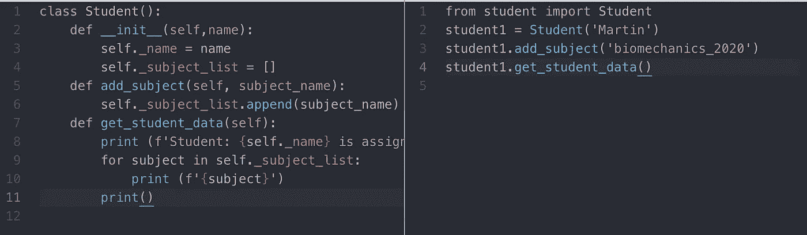

学生类和使用它的 main.py。

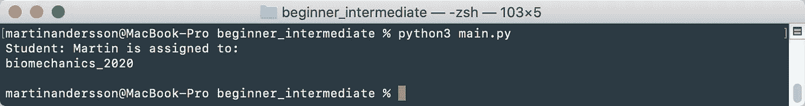

# 尊重 PEP

你经常可以见证有人写 Python 代码不尊重 PEP。我可能自己做。

当您在开发环境中工作时，遵循标准是很重要的——如果不是 PEP 标准，至少是您公司的标准。

PEP 是一套代码指南。这里是 PEP-8 的[链接。这是一本精彩的读物。确保你通读一遍，这样你就知道它是关于什么的了。一个经典的例子是 snake_case。Python 变量是用 snake_case 写的。这意味着用下划线分隔单词。即使大学也做错了，所以不要觉得太糟糕——停止这样做。](https://www.python.org/dev/peps/pep-0008/)

这是正确的:

```
chocolate_cake = 'yummy'
```

这是错误的:

```
chocolateCake = 'Yummy'
```

# 最后

作为一个初学者是一个令人惊奇的经历。奋斗是艰难的，但是你的学习曲线是陡峭的，会给你带来新的经验！


照片由[像素](https://www.pexels.com/photo/bald-blur-boy-buddhism-236302/?utm_content=attributionCopyText&utm_medium=referral&utm_source=pexels)的 [Pixabay](https://www.pexels.com/@pixabay?utm_content=attributionCopyText&utm_medium=referral&utm_source=pexels) 拍摄

很难走出初学者的状态。很难知道应该关注什么。下一步是什么？

也许这篇文章已经把你推向了正确的方向，也许它只是一堆你已经知道的随机胡言乱语。如果你不确定下一步去哪里，不要害怕问。确保你利用了那些比你更有经验的人。虚心接受不同的意见，看看什么适合你。如果你还没有准备好使用某些编码方式，在你学习新的和更好的方式时，继续让你的代码运行。

## 来源

[1] XY 问题，[https://en.wikipedia.org/wiki/XY_problem](https://en.wikipedia.org/wiki/XY_problem)