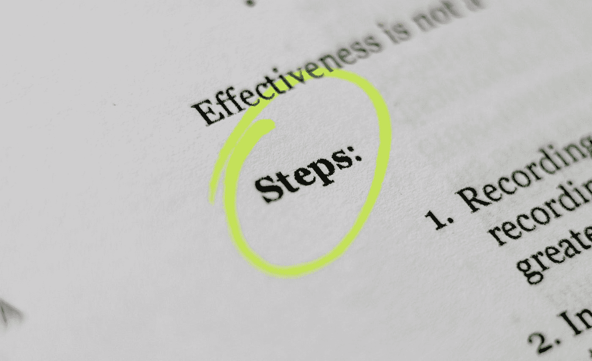

# 软件项目移交的 9 个步骤

> 原文：<https://betterprogramming.pub/9-steps-to-software-project-handovers-9325fbb72cfc>

## 传递接力棒并不容易。以下是如何做的

布拉登·科拉姆在 [Unsplash](https://unsplash.com?utm_source=medium&utm_medium=referral) 拍摄的照片。

软件项目一直都需要移交。新人加入，其他人离开公司。当我第一次交接的时候，我很不擅长。随着时间的推移，我不断进步，刚刚得到了 Niklas Baumstark 的精彩介绍。

让我分享一些我认为你可以用九个步骤来构建令人惊讶的交接的想法。我们开始吧！

# 1.提前计划

在 [Unsplash](https://unsplash.com?utm_source=medium&utm_medium=referral) 上由 [Waldemar Brandt](https://unsplash.com/@waldemarbrandt67w?utm_source=medium&utm_medium=referral) 拍摄的照片。

移交需要时间。你会忘记提及重要的事情，接收者会忘记问重要的问题。你越早开始越好。这就为知识的吸收留出了空间——如果有什么不清楚的地方，还会回来找你。

# 2.清理干净！

[钳工](https://unsplash.com/@benchaccounting?utm_source=medium&utm_medium=referral)对[去毛刺](https://unsplash.com?utm_source=medium&utm_medium=referral)拍照。

在你移交之前，确保软件是干净的。搜索`TODO`笔记。要么删除它们，要么澄清它们。

删除死代码— *你不需要它* ( [YAGNI 原则](https://en.wikipedia.org/wiki/You_aren%27t_gonna_need_it))。

一般来说，您应该只安装您实际使用的软件。随着时间的推移，您可能安装了曾经需要但现在不再需要的东西。删除未使用的依赖项。不知道为什么装的人真的很难去掉。

此外，更新您拥有的依赖关系。最好是长期支持版本(LTS 版本)。

确保单元测试有效，并且覆盖了重要的部分——或者指出哪些部分没有被覆盖，需要小心处理！让这些测试在 CI 管道中运行有助于确保它们被实际执行。

Docker 有助于确保人们可以运行该软件。

最后，把一切都交给版本控制和推送！

# 3.创建一个精彩的自述文件

[斯科特·格雷厄姆](https://unsplash.com/@homajob?utm_source=medium&utm_medium=referral)在 [Unsplash](https://unsplash.com?utm_source=medium&utm_medium=referral) 上拍照。

自述文件是您的软件给人的第一印象。它应该在 Tweet 长度中清楚地说明项目是关于什么的，给出如何安装的说明，并展示如何使用它。

还有几件事你可能想提一下。例如，如何运行测试或者核心设计原则，软件给出的保证，或者项目拥有的用户类型。

你可以记录很多东西，但是尽量保持简短。自述文件不应过于冗长。您可以添加指向更详细文档的链接。

如果你想知道如何组织它，看看 readme.so:

 [## README . so——创建自述文件的最简单方法

### 使用 readme.so 的 markdown 编辑器和现成的模板为您的存储库轻松创建一个简单的 readme

readme.so](https://readme.so/en) 

# 4.谈论设计原则

照片由[丹清除](https://unsplash.com/@danclear?utm_source=medium&utm_medium=referral)上的 [Unsplash](https://unsplash.com?utm_source=medium&utm_medium=referral) 拍摄。

书面文档是好的，但是从核心开发人员那里听到它是非常不同的。你强调事情的方式和你重复的观点比书面文本更能体现细微差别。这也给了提问的机会。而且最起码，你知道拿到项目的人之前听说过核心想法。

专业小说家有他们的个人风格，他们都是“有效的”。类似于软件。它从简单的风格选择开始(例如，如果你用`'single quotes'`或`"double quotes"`标记字符串)。你通常按照什么顺序编写函数参数？

这些都是微小的选择，保持一致很好，但并不重要。

框架至关重要。他们强迫你使用某种开发风格。

你给用户的保证是至关重要的。您的库的用户是否期望在每次发布之前进行独立的安全审计？你的用户能指望你的 API 在 25 毫秒内响应吗？您的端点是否保存到[重试](https://levelup.gitconnected.com/10-robustness-and-resiliency-design-patterns-to-learn-today-c03776f73936)？

假设至关重要。您希望哪些服务在什么时间做出响应？你的安全边界在哪里？

# 5.实际上提供了访问所有内容的权限

Jason D 在 [Unsplash](https://unsplash.com?utm_source=medium&utm_medium=referral) 上的照片。

很明显，软件开发人员需要访问他们应该维护的代码。但是，您可能还想考虑所有其他文档(例如，Confluence、Google Drive、壁画/绘画上的示意图。IO/Lucidchart)。确保从软件项目的自述文件中链接到它们。

他们可能需要访问除本地环境(如登台环境)之外的不同环境或其中的几个环境。

他们可能需要访问帐户(例如 AWS)。你的日志放在哪里？错误收集在哪里？哪里收集了 bug、问题、故事和任务？

哦，请不要只给他们机会。确保他们知道如何使用资源。

# 6.指点一下从哪里开始

由[拍摄的克莱门斯·范·雷](https://unsplash.com/@clemensvanlay?utm_source=medium&utm_medium=referral)趴在[的 Unsplash](https://unsplash.com?utm_source=medium&utm_medium=referral) 上。

软件的核心类/对象/功能是什么？

行刑从哪里开始？最常用的是什么？代码库的哪些部分相当稳定，哪些需要经常调整？

# 7.指出正在进行的工作

马修·汉密尔顿在 [Unsplash](https://unsplash.com?utm_source=medium&utm_medium=referral) 上的照片。

软件永远不会结束。它一直在进化。总是有工作要做。

你的项目的下一个任务是什么？已经开始但从未完成的工作在哪里？

# 8.谈论流程

克莱顿·罗宾斯在 [Unsplash](https://unsplash.com?utm_source=medium&utm_medium=referral) 上拍摄的照片。

你如何处理新的发布？部署是如何工作的？如果出现严重错误，需要通知哪些人？你认为一个事件是什么，你如何处理它？您如何处理备份？每一个变更都需要有拉取请求和评审吗？

# 9.回顾与被回顾

马库斯·温克勒在 [Unsplash](https://unsplash.com?utm_source=medium&utm_medium=referral) 上的照片。

做一个不小的改变，让其他人回顾一下。甚至可能在他们审查代码时仔细检查代码。指出他们需要检查的内容，并解释你为什么要实施变革以及你是如何做的。

如果成功了，就逆转它。让对方做出改变，并对其进行评估。确保您指出了细节(例如，当参数的顺序与整个库中的典型选择相违背时，或者当 rest 端点的命名方案与 REST 有点不同时)。你知道这些要点，但是其他人可能甚至没有意识到你可以在这些方面保持一致。