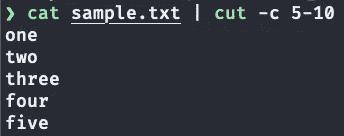
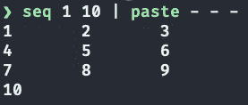
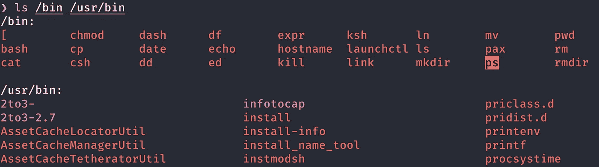
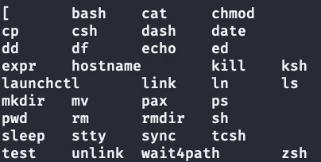
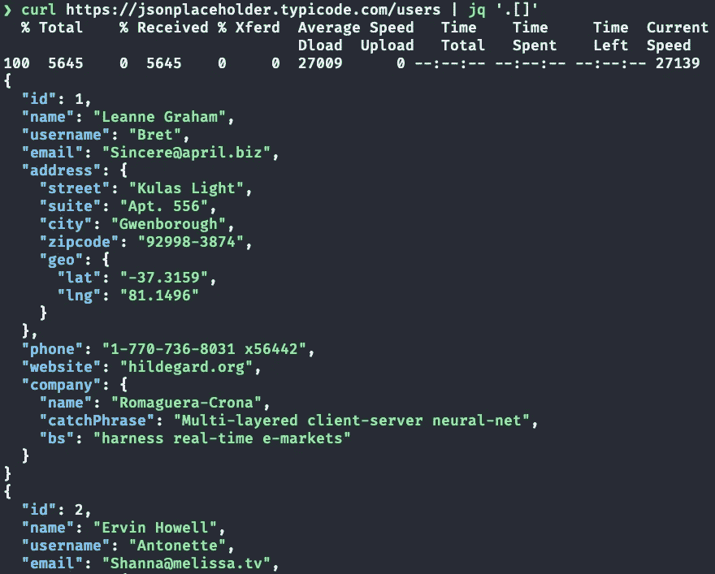
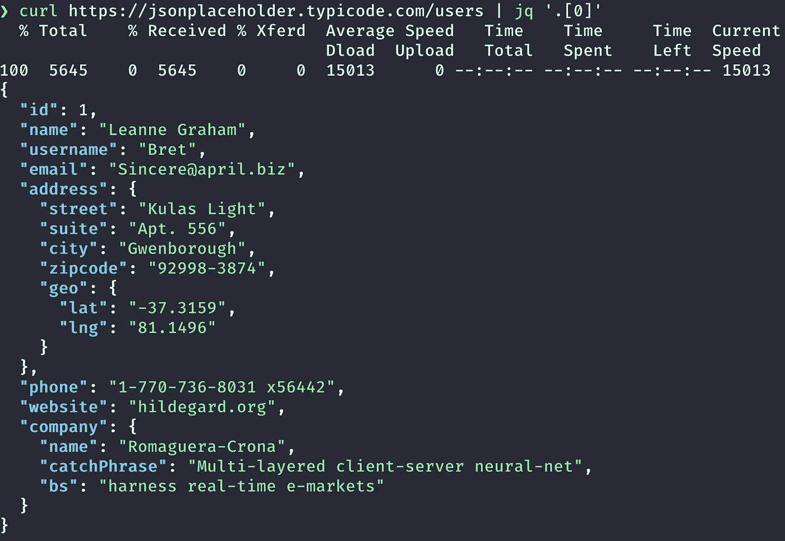
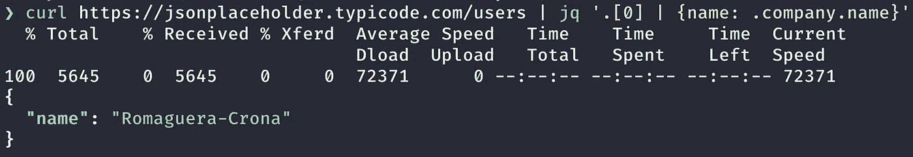
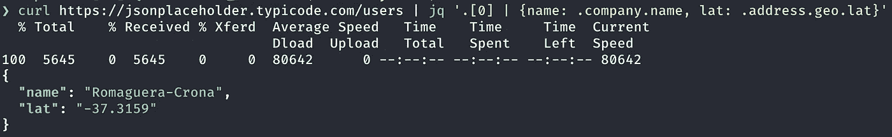

# 您今天就可以开始使用的 9 个终端命令

> 原文：<https://betterprogramming.pub/9-terminal-commands-you-can-start-using-today-7b9b0e273894>

## 提高效率的终端命令


由 [Mikel Parera](https://unsplash.com/@mikelparera?utm_source=medium&utm_medium=referral) 在 [Unsplash](https://unsplash.com?utm_source=medium&utm_medium=referral) 上拍摄的照片

# 介绍

如果你每天都使用终端，你一定知道很多命令。在本文中，我们将介绍删除字符的`cut`命令、创建列的`paste`命令、使用`grep`进行反向匹配、JSON 处理器、轻松重命名、如何使用`sed`命令复制、删除和粘贴行等等。

所以，打开你的终端，让我们开始吧！

```
Table of Contents
· [Introduction](#6f89)
· [Cut Command](#e379)
· [Paste Command to Create Columns](#9f02)
· [Grep Invert Match](#934f)
· [How to Grep Empty Lines](#7ab8)
· [Recursively Find All Files](#f65d)
· [JSON processor jq](#dac2)
· [bc (Basic Calculator)](#cd19)
· [Copy, Delete, and Paste Line Using sed](#21e4)
· [rename](#0188)
· [Conclusion](#77f5)
· [More articles about the terminal and command-line](#e0b7)
· [Newsletter](#f30e)
```

# 剪切命令

`cut`命令从文件的每一行删除一些字符。下面将输出文件`sample.txt`中每行的第五到第十个字符位置:

```
$ cat sample.txt
001 one
002 two
003 three
004 four
005 five$ cat sample.txt | cut -c 5-10
one
two
three
four
five
```

`-c`选项只选择字符，而`5-10`告诉它们在第五个和第十个字符之间。



行动中的 cut 命令。图片作者。

# 粘贴命令来创建列

`paste`命令合并文件行。您还可以使用它来创建列。

```
$ seq 1 10 | paste - - -
1 2 3
4 5 6
7 8 9
10
```

`paste — —`将创建两列，而`paste — — — —`将创建四列。



运行中的粘贴命令。图片作者。

您可以使用`-d`选项添加分隔符。下面的代码将在状态之间添加一个逗号，并创建四列，然后将其重定向到另一个文件。

```
$ cat statenames
Alabama
Alaska
Arizona
Arkansas
California
Colorado
Connecticut
Delaware
Florida
Indiana
Iowa
Kansas
...
$ cat statenames | paste -d, - - - - > myfile
$ cat myfile
Alabama ,Alaska,Arizona,Arkansas
California,Colorado,Connecticut,Delaware
Florida,Indiana,Iowa,Kansas
```

# Grep 反向匹配

`ls /bin /usr/bin`列出了`/bin`和`/urs/bin`目录中的内容:



ls /bin /usr/bin 的输出。图片作者。

输出包含`/bin:`和`/usr/bin:`。

我们可以使用`grep -v pattern`输出所有与模式不匹配的行。我们可以使用管道`|`将`ls`的输出发送到`grep`命令的标准输入。

`grep -v '/bin:$'`命令输出除`/bin:`和`/usr/bin:`以外的所有行。`$`锚匹配一行的结尾。

```
$ ls /bin /usr/bin | grep -v '/bin:$' | paste - - - - | less
```



ls/bin/usr/bin | grep-v '/bin:$ ' | paste 的输出— — | less。作者图片

我使用`paste — — — —` 创建了四列。

# 如何 Grep 空行

`^$`表达式匹配空行:

```
$ cat sample.txt
001 one
002 two003 three004 four
005 five$ cat sample.txt | grep -v '^$'
001 one
002 two
003 three
004 four
005 five
```

文件 sample.txt 包含空行。`grep -v '^$'`输出没有空行的文件内容。

我们可以将它与前面的命令一起使用:

```
$ ls /bin /usr/bin | grep -v '/bin:$' | grep -v '^$' | sort | paste - - - - > mylist
$ cat mylist
2to3- 2to3-2.7 AssetCacheLocatorUtil AssetCacheManagerUtil
AssetCacheTetheratorUtil BuildStrings CpMac DeRez
GetFileInfo IOAccelMemory IOMFB_FDR_Loader MergePef
MvMac ResMerger Rez RezDet
...
```

我添加了`grep -v '^$'`，它输出所有不匹配空行的行，然后对它们进行排序，创建四列，并将其写入`mylist`文件。

# 递归查找所有文件

您可以使用`find`命令递归查找所有文件。`find . -name "foo*"`搜索当前目录中文件名以`foo`开头的所有文件:

```
$  tree
.
├── dir1
│   ├── foo4.txt
│   ├── foo5.txt
├── foo1.txt
├── foo2.txt
└── foo3.txt
$ find . -name "foo*"
./foo1.txt
./dir1/foo4.txt
./dir1/foo5.txt
./foo3.txt
./foo2.txt
```

# JSON 处理器 jq

`[jq](https://linuxcommandlibrary.com/man/jq)`是一个命令行 JSON 处理器。当您对 API 使用`curl`命令时，您会得到 JSON 格式的返回值。您可以使用`jq`实用程序来处理数据。

完全省略索引的`.[]`语法将返回数组元素的所有*。*

```
$ curl [https://jsonplaceholder.typicode.com/users](https://jsonplaceholder.typicode.com/users) | jq '.[]'
```



jq。[]返回所有元素。图片作者。

```
$ curl [https://jsonplaceholder.typicode.com/users](https://jsonplaceholder.typicode.com/users) | jq '.[0]'
```

`jq ‘.[0]’`将返回第一个元素。



jq 命令示例。图片作者。

您可以获得第一个元素的公司名称:

```
curl [https://jsonplaceholder.typicode.com/users](https://jsonplaceholder.typicode.com/users) | jq '.[0] | {name: .company.name}'
```



jq 命令示例 2。图片作者。

`jq`中的`|`运算器将`.[0]`的输出送入`{...}`的输入。这在字段外构建了一个对象。您可以使用`.company.name`访问嵌套属性。

您可以获得多个字段:

```
$ curl [https://jsonplaceholder.typicode.com/users](https://jsonplaceholder.typicode.com/users) | jq '.[0] | {name: .company.name, lat: .address.geo.lat}'
```



jq 命令示例 3。图片作者。

[了解更多关于](https://stedolan.github.io/jq/) `[jq](https://stedolan.github.io/jq/)` [的信息。](https://stedolan.github.io/jq/)

# 基本计算器

`bc`支持任意精度的数字。

> 在[计算机科学](https://www.wikiwand.com/en/Computer_science)中，**任意精度算术**，也叫 **bignum 算术**，**多精度算术**，有时也叫**无限精度算术**，表示[计算](https://www.wikiwand.com/en/Calculation)是对那些[精度](https://www.wikiwand.com/en/Precision_(arithmetic))的[位](https://www.wikiwand.com/en/Numerical_digit)只受主机系统可用[内存](https://www.wikiwand.com/en/Memory_(computers))限制的数字进行的。
> 
> — [任意精度算法](https://www.wikiwand.com/en/Arbitrary-precision_arithmetic)

这意味着它不仅支持基本计算，也支持大数运算。

```
❯ bc --version
bc 1.06
Copyright 1991-1994, 1997, 1998, 2000 Free Software Foundation, Inc.
❯ bc
bc 1.06
Copyright 1991-1994, 1997, 1998, 2000 Free Software Foundation, Inc.
This is free software with ABSOLUTELY NO WARRANTY.
For details type `warranty'.
5 + 12
17
5+11
16
1000/2
500
10/3
3
quit
```

`bc`命令可以从管道获取输入:

```
$ echo '10*2/5' | bc
4
```

让我们看看能否计算出`100!`:

```
$ echo {1..100} | tr ' ' '*' | bc
93326215443944152681699238856266700490715968264381621468592963895217
59999322991560894146397615651828625369792082722375825118521091686400
0000000000000000000000
```

`echo {1..100}`命令输出`1 2 3 ... 100`，`tr`将一个空格转换成一个`*`，`bc`将执行 bignum 算法。

# 使用 sed 复制、删除和粘贴行

`sed`命令是一个流编辑器，执行基本的文本转换。它允许你在文本文件中替换、删除和插入。

`sed`一个不太为人所知的功能就是复制、删除、粘贴一行。您可以使用`sed '<n>h;<n>d;<m>G'`复制删除第 n 行并粘贴到第 m 行:

```
$ cat sample.txt
one
two
three
four
five
six
seven

$ cat sample.txt | sed '4h;4d;6G'
one
two
three
five
six
four
seven
```

这将复制并删除第 4 行，并将其粘贴到第 6 行。

您可以复制并粘贴一行(不能删除):

```
$ cat sample.txt | sed '4h;6G'   
one
two
three
four
five
six
four
seven
```

或者直接删除行:

```
$ cat sample.txt | sed '4d;6d'
one
two
three
five
seven
```

或者做更复杂的事情:

```
$ cat sample.txt | sed '4h;4d;6G;5h;7G'
one
two
three
five
six
five
seven
five
```

# 重新命名

`rename`命令重命名多个文件。

```
$ ls
foo.htm  bar.htm  baz.htm

$ rename .htm .html *.htm
$ ls
foo.html bar.html baz.html
```

上面的代码将文件扩展名`.htm`更改为`.html`。您可以通过前置和追加字符串来修改文件名。

在所有文件前添加`my-`:

```
$ ls
file-1 file-2 file-3 file-4$ rename -A "my-" *
$ ls
my-file-1 my-file-2 my-file-3 my-file-4
```

将`.txt`追加到所有文件:

```
$ rename -a ".txt" *
$ ls
my-file-1.txt my-file-2.txt my-file-3.txt my-file-4.txt
```

您也可以使用`-s`或`-S`选项进行替换。`-s`选项替换第一次出现的内容，而`-S`选项替换所有内容。

使用`-S`选项将所有出现的`—`替换为`_`:

```
$ rename -S "-" "_" *
my_file_1.txt my_file_2.txt my_file_3.txt my_file_4.txt
```

# 结论

我希望这些命令是有用的，你可以开始使用它们。

如果您忘记了如何使用它们，`man`命令会为您提供所有选项。或者你可以使用[替代工具](https://medium.com/better-programming/13-fantastic-learning-tools-and-resources-for-bash-scripting-51a6de98015c)。

# 更多关于终端和命令行的文章

*   [终端改造的终极指南](https://towardsdatascience.com/the-ultimate-guide-to-your-terminal-makeover-e11f9b87ac99?source=your_stories_page-------------------------------------)
*   [Rust-Powered 命令行实用程序可提高您的工作效率](https://towardsdatascience.com/rust-powered-command-line-utilities-to-increase-your-productivity-eea03a4cf83a?source=your_stories_page-------------------------------------)
*   [7 个强大的 Rust 驱动的命令行实用程序](https://towardsdatascience.com/awesome-rust-powered-command-line-utilities-b5359c38692?source=your_stories_page-------------------------------------)

**通过** [**成为**](https://blog.codewithshin.com/membership) **会员，获得媒体上所有故事的访问权限。**


[https://blog.codewithshin.com/subscribe](https://blog.codewithshin.com/subscribe)

[](/master-mac-linux-terminal-shortcuts-like-a-ninja-7a36f32752a6) [## 像忍者一样掌握 Mac/Linux 终端快捷键

### 学习终端忍者的秘密，以提高生产力

better 编程. pub](/master-mac-linux-terminal-shortcuts-like-a-ninja-7a36f32752a6) [](https://towardsdatascience.com/the-ultimate-guide-to-your-terminal-makeover-e11f9b87ac99) [## 终端改造的终极指南

### 今天你将度过的最好的 11 分钟:程序员的终端提示

towardsdatascience.com](https://towardsdatascience.com/the-ultimate-guide-to-your-terminal-makeover-e11f9b87ac99)