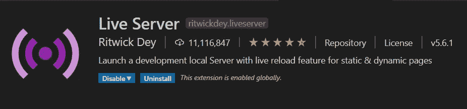
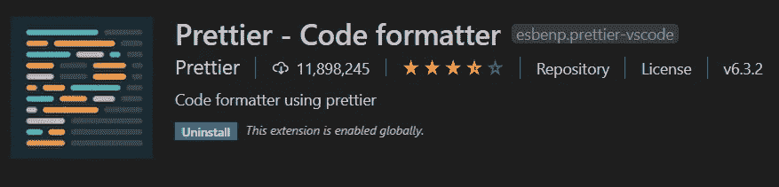
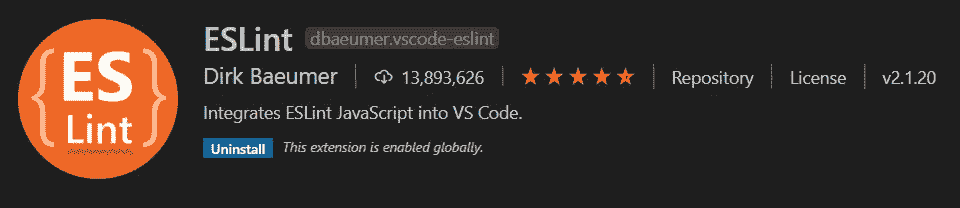
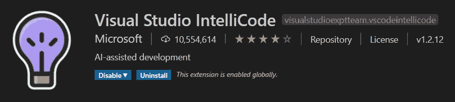
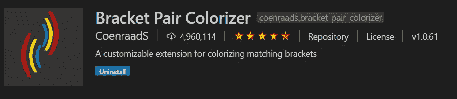
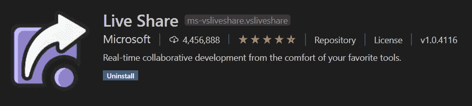

# 9 个对 Web 开发人员有用的 VS 代码扩展

> 原文：<https://betterprogramming.pub/9-useful-vs-code-extensions-for-web-developers-36f10da43e1e>

## 通过使用这些扩展，加快您的工作并提高您的生产率

克里斯多夫·高尔在 [Unsplash](https://unsplash.com?utm_source=medium&utm_medium=referral) 上拍摄的照片。

Visual Studio 代码是开发人员社区中使用最广泛的代码编辑器之一。它被广泛用于 web 开发。您可以用它非常快速地编辑、构建和调试您的代码。

使用 VS 代码进行开发的一个最重要的原因是它的扩展。它增加了许多扩展，可以帮助您改进代码并节省时间。

如果您是一名 web 开发人员，您可能会在项目中使用 VS 代码。如果没有，那就试一试。

在本文中，我们将讨论一些 VS 代码扩展，它们将帮助您节省时间并提高生产率。我们开始吧！

# 1.吉特朗斯

[GitLens](https://marketplace.visualstudio.com/items?itemName=eamodio.gitlens) 扩展在 Visual Studio 代码中提供 Git 功能。它让您了解代码随着时间的推移所做的更改。它还会告诉您进行这些修改的作者的姓名以及修改的时间。

在处理一个项目时，我们经常对代码进行修改，并将新代码和代码一起提交到存储库中。使用这个扩展，我们可以知道为什么、何时以及由谁对代码进行了修改。

# 2.实时服务器

在 web 开发过程中, [Live Server](https://marketplace.visualstudio.com/items?itemName=ritwickdey.LiveServer) 扩展非常有用。这个扩展为静态和动态页面都提供了一个*动态重载* 特性。每当您保存代码时，更改都会立即反映在浏览器中。

每次保存代码时，它都会重新加载浏览器，您可以看到浏览器中反映的更改。因此，这个扩展可以更快地发现错误，因此您可以轻松地对代码进行一些实验。

# 3.较美丽

顾名思义，[这个扩展](https://marketplace.visualstudio.com/items?itemName=esbenp.prettier-vscode)是一个代码格式化程序，让你的代码更具可读性和一致性。您不必花任何时间来格式化您的代码。这个扩展将为你做一切。

它会自动调整从外部来源复制的代码。现在，您不再需要在 pull 请求中讨论代码缩进和样式。

# 4.埃斯林特

这个扩展在你的 VS 代码中集成了 [ESLint](https://eslint.org/) 。ESLint 可以格式化你的代码，它也会分析你的代码，然后给出进一步改进的建议。

这个扩展帮助您检查语法错误，确保您的代码符合标准，并消除可能的错误。

# 5.Visual Studio 智能代码

[Visual Studio IntelliCode](https://marketplace.visualstudio.com/items?itemName=VisualStudioExptTeam.vscodeintellicode) 在 VS 代码中为 Python、Java、JavaScript 开发提供人工智能辅助特性。

这个扩展使用人工智能来猜测你的下一步(例如，你接下来将使用什么功能)，然后为它们提供建议，并自动填充你的代码。

# 6.括号对着色机

顾名思义，[括号对着色扩展](https://marketplace.visualstudio.com/items?itemName=CoenraadS.bracket-pair-colorizer)为开始和结束括号和圆括号提供相同的匹配颜色。这使得识别哪些括号属于一起变得更容易。

这个扩展给你的代码一个整洁干净的外观，并且它使理解代码变得更容易。

# 7.设置同步

根据 [Visual Studio Code](https://code.visualstudio.com/docs/editor/settings-sync) ， [Settings Sync](https://marketplace.visualstudio.com/items?itemName=Shan.code-settings-sync) 让你在你的机器上共享你的 Visual Studio 代码配置，比如设置、按键绑定和已安装的扩展。

您可以在所有机器上使用您最喜欢的设置。

它会同步所有扩展和包含以下内容的完整用户文件夹:

1.  设置文件
2.  按键绑定文件
3.  启动文件
4.  片段文件夹
5.  VS 代码扩展和配置
6.  工作区文件夹

# 8.Chrome 调试器

Chrome 的这个[调试器](https://marketplace.visualstudio.com/items?itemName=msjsdiag.debugger-for-chrome)允许前端开发人员直接从 Visual Studio 代码中调试他们在 Google Chrome 中运行的 JavaScript 代码。用起来比其他 ide 中的调试器流畅多了。

您可以设置断点，调试脚本标记以及使用该扩展动态添加的其他脚本。

# 9.实时分享

这个 [Live Share](https://marketplace.visualstudio.com/items?itemName=MS-vsliveshare.vsliveshare) 扩展实现了开发者之间的实时协作。它为用户提供了与其他用户共享实时会话的能力，允许他们编辑代码和共享服务器。

除了传统的结对编程之外，这个扩展允许开发人员在保留他们的编辑器偏好(例如主题)和拥有他们的光标的同时一起工作。

# 结论

本文到此为止。我们已经讨论了在 VS 代码中工作时可以使用的一些有用的扩展。

这些扩展通过提供像自动代码格式化这样的特性，可以节省您大量的时间，并使您的代码看起来干净且易于理解。

感谢阅读！