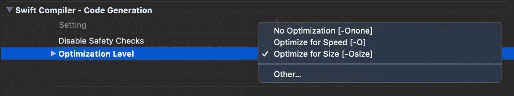

# 提高 Swift 代码性能的 9 种方法

> 原文：<https://betterprogramming.pub/9-ways-to-boost-your-swift-code-performance-56e0986dd9ec>

## 挤压雨燕提高速度的一些技巧

# **重要提示**

Swift 是一种快速语言，并且在每个版本中都变得更快。iOS 设备也很快，所以很可能根本不需要这些提示。即使在我们遇到性能问题的情况下，最好的做法是使用缓存、后台线程或任何其他技术来绕过它们。

但是当处理大数字、慢设备或者仅仅为了理论，知道这些提示不会伤害你。

# **在构建设置中设置优化级别**

优化代码的第一件事是让 Xcode 自己优化代码。Xcode 编译器足够聪明，知道何时可以忽略无用的函数结果，或者直接调用没有子类化的方法，但这可能会带来额外的编译时间或大小的代价。

转到构建设置，并找到“Swift 编译器—代码生成”部分。在那里，您可以找到“优化级别”设置，其中有三个选项:

*   没有优化
*   速度优化
*   尺寸优化

通常最好为发布版本设置“速度优化”，为调试设置“大小优化”，当然这取决于您的项目需求。

基本上，如果你需要的是有利于尺寸的动力，那就把优化级别设置为“优化速度”。

# **对方法和类使用“Final”和“Private”**

Swift 优化级别处理的事情之一是直接或间接调用方法。您可能知道，Swift 是一种面向对象的语言，这意味着您可以子类化和覆盖方法来扩展功能。为了让它工作，Swift 使用了一种叫做动态调度的东西。

动态调度是一种算法，它决定每当向对象发送消息时应该调用哪个方法。它使用一个“虚拟表”。

每当一个对象被请求返回方法地址时，它就在虚拟表中搜索它的地址。这不是一个显而易见的动作——记住，它需要查找一个子类，看看这个方法是否被覆盖，然后返回这个方法。这个方法也可以被另一个子类覆盖，所以它需要一次又一次地这样做，直到到达它的底部。为了帮助 Swift 优化这项昂贵的任务，您可以在方法、变量甚至整个类的开头添加属性“final”。

当您选择在构建设置中优化 swift 代码时,“final”属性将确保对方法的调用是直接的，而不需要寻找子类实现。

# **在发布版本中避免“打印”**

打印到控制台对于调试来说很好，但是开发人员有时有一个坏习惯，就是让打印命令在代码中到处浮动。由于打印命令被写入控制台，并且利用了磁盘，这似乎是一个非常昂贵的 I/O 操作。有多贵？非常。看一看:

使用“print”调用的测试运行速度慢了 1600 倍！

我的建议是永远不要直接调用" print ",而是用某个类来包装它，并在那个类中添加一个宏，这样你就永远不会忘记那些" print "命令了！

# **“内联”您的代码**

创建小函数始终是最佳实践，每个函数都致力于一项任务。但是将您的代码分成小函数也会带来性能成本——您向堆栈中添加了另一个函数，并且您迫使 Swift 使用虚拟表来动态调度您的调用。当你想压缩你的代码以获得更高的性能时，你可以放弃你的代码，而“内联”你的方法，这样会更快。同样，这是干净代码和性能之间的权衡。

# **处理阵列**

大量的性能优化主要是在处理大量的迭代，或者换句话说，数组的时候。

如果您知道数组是如何构建的，并且知道其中的利弊，那么您可以对代码进行额外的优化。

下面是一些用数组优化代码的例子:

## **迭代数组**时使用“withUnsafeBufferPointer”

当处理 Swift 对象时，我们有时会忘记内存问题或安全性，因为 Swift 正在为我们处理一切。这是以性能为代价的。如果想用安全换取性能，可以使用“withUnsafeBufferPointer”方法来获取数组元素的指针数组。

但是您应该小心—如果由于某种原因这些元素被释放，那么当您在代码中处理它时可能会崩溃。

# **连续数组**

这是一种不太熟悉的数组类型，但是当您知道如何利用它时，它会很方便。

一般来说，数组将它们的对象保存在内存块中，不一定是连续的。这意味着每当你向数组中添加一个新项时，它都会找到一个空闲块，分配它并将其添加到数组中。这对于提高性能很有帮助，但是对于迭代来说效率较低。所以，如果这是一个你知道要迭代的大数组，ContiguousArray 可以是一个解决方案。

ContiguousArray 确保数组中的所有项彼此相邻。这对寻找下一个元素非常有帮助。但是，像往常一样，我们正在处理一个权衡——这里没有魔法。实际使用 ContiguousArray，说我们正在为数组管理添加约束，插入或追加之类的简单操作现在可能会更重。我们现在强制其所有元素都是连续的，所以这取决于您的用例。

# **在数组**中使用值(结构)而不是引用(类)

这是另一个很棒的技巧。您可能知道数组可以桥接到 NSArray。NSArray 只能保存对象，Array 可以保存对象(引用)和值。

当 Swift 中的数组包含引用时，它会自动获取 NSArray 的属性，因此无法进行优化。但是，如果您只在数组中保留诸如 Int 或 Structs 之类的值，编译器可以很容易地对其进行优化。

如果您必须在结构和类之间做出选择，这是结构的一大优势——在数组中保存结构比保存类要有效得多。

在上面的例子中，填充结构数组的动作快了四倍！

# **用链表代替数组**

数组使用起来很简单，但是在某些情况下链表会更有效。由于链表只是指向彼此的项目，所以在列表中间插入一个项目非常容易——只需正确连接指针就可以了。在阵列中，成本可能会更高。所以，无论何时你需要替换条目位置，追加等等，链表是非常快速的。另一方面，当你需要排序或查找时，数组比链表表现得更好。

# **如果可能的话，将协议限制在类中。**

如果您知道您定义的协议仅用于类，请将其标记为类协议。当编译器知道该协议仅用于类时，它可以优化 ARC(自动引用计数),使代码运行得更快。

# **权衡表(或“优化价格表”)**

没有什么是免费的，尤其是速度的提高，所以我在这里总结了上面的技巧，以及在项目中实现它们时需要付出的*代价:*

*   **构建设置中的优化级别:**支付:构建规模
*   **对方法和类使用“final”和“private”**—支付:子类和分派的约束
*   **避免发布版本中的“打印”** —付款:控制台无日志
*   **“内联”您的代码** —付款:重复代码；代码不“干净”
*   **迭代数组时使用“withsunsafebufferpointer”**—支付:安全
*   **ContiguousArray** —付款:追加可能会很慢
*   在数组中使用值(结构)而不是引用(类)——支付:取决于你的结构——可以是堆内存
*   **使用链表代替数组** —支付:集合分类方法可能很慢，比如排序或查找
*   **仅在可能的情况下将协议限制在类别中**。—支付:如题所言—这里有约束。

# **总结**

正如我在开始时所说的，许多性能问题可以通过使用不同的应用程序架构技术、缓存或任何其他算法方法来解决。

但是知道如何挤压你的快速引擎以获得最大速度总是好的。