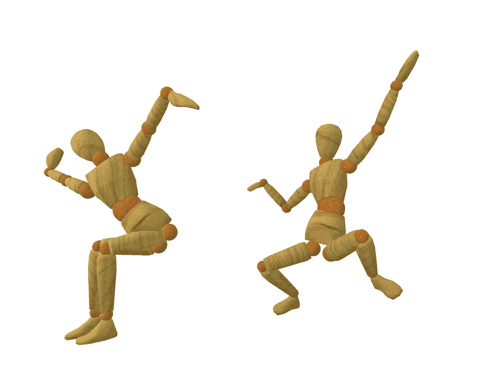
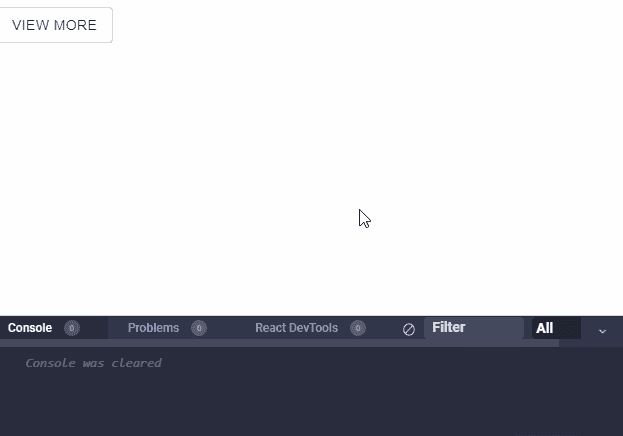

# React 中操纵和使用组件的 9 种方式

> 原文：<https://betterprogramming.pub/9-ways-to-manipulate-and-work-with-components-in-react-cf0a7a2b194f>

## 有许多不同的方式来处理您的组件

图片由 PublicDomainPictures.net[的](https://www.needpix.com/photo/1469146/2-wooden-dancers-dancing-white-background-isolated-wood-gesture)彼得·席德莱茨基拍摄

这是一个 web 开发人员的大好时机——因为创新继续快速爆发，尤其是在 JavaScript 社区。

[React](https://reactjs.org/) 是一个构建复杂用户界面的不可思议的库，如果您是 React 新手，那么这篇文章可能会帮助您了解它对 web 开发人员来说有多么强大。如果您不是 React 新手，那么您可能不会在这篇文章中发现任何新东西，但是，希望您可能会发现一些新东西，因为我将尝试展示使用 React 组件的新旧策略。

在本文中，我们将介绍 2020 年操作和使用 React 组件的九种方式。

事不宜迟，我们开始吧！

# 道具组件

让现有组件重用其逻辑并将其传递到其他地方的许多方法之一是提供一种通过使用 props 将逻辑传递到自定义组件的方法。

流行的 React 组件库如 [Material-UI](https://github.com/mui-org/material-ui) 在它们提供的每个组件中都经常使用这种策略。

有充分的理由说明为什么这是重用逻辑的好方法。

如果你想要一个例子，看看这个来自 [Gatsby](https://www.gatsbyjs.org/) 应用的`[PrivateRoute](https://github.com/gatsbyjs/gatsby/blob/master/examples/simple-auth/src/components/PrivateRoute.js)`组件。它是封装认证逻辑的简单组件。如果当前用户没有通过认证，它会将他们重定向到登录屏幕。否则，它将继续呈现从`props.component`接收的组件。

因为它可以呈现从`props.component`传来的任何东西，所以它可以为您想要的任何组件重用认证逻辑。这使得使用路由逻辑成为一种简单而强大的方法。

另外，你也可以传递一个表示 HTML DOM 元素的字符串，比如`div`或`span`，它仍然会将它呈现为一个组件，因为 React [内部调用](https://github.com/facebook/react/blob/master/packages/react/src/ReactElement.js#L146) `[React.createElement](https://github.com/facebook/react/blob/master/packages/react/src/ReactElement.js#L146)` [，](https://github.com/facebook/react/blob/master/packages/react/src/ReactElement.js#L146)将其作为元素`type`传递。

# 在一次调用中呈现元素、类组件或函数组件

当描述你的用户界面应该是什么样子时，React dev 团队推荐使用 JSX。

但是不要忘记，使用 JSX 最终只是调用`React.createElement`的语法糖。因此值得一提的是，您也可以安全地使用`React.createElement`来创建您的组件。

在 JSX 上使用`React.createElement`有一些好处。

其中最让我感兴趣的一个好处是，它让我重新开始编写普通的 JavaScript，因为我们将重新使用函数。其他好处包括避免让 React 处理这个调用，并在一个代码块中访问所有实现细节，这样我们就避免了 JavaScript 必须执行的额外步骤。

react-final-form [背后的团队广泛使用这个模式](https://github.com/final-form/react-final-form/blob/master/src/renderComponent.js)作为工厂来创建他们的字段组件。

# 用高阶组件劫持道具(HOC)

高阶组件作为 React 中重用组件逻辑的一项高级技术，在过去也有过辉煌的一面。它们基本上是将一个 React 组件作为参数并返回一个全新组件的函数。

使用这种方法，您可以在不可见的中间层中覆盖和劫持组件的道具。这个中间层是更高阶组件的逻辑发生的地方。他们可以选择覆盖包装组件的道具或控制其呈现行为。

为了演示这一点，我编写了一个基本的`withAuthValidation`高阶组件，它将作为输入(`DeactivatorInput`)传递，只对管理员用户可用。它首先将一个组件作为`props`，并执行一些认证逻辑。然后，如果用户没有通过认证，它会尝试禁用输入:

# 使用渲染属性重用组件逻辑

我仍然记得当[的渲染道具第一次出现在屏幕上的时候](https://cdb.reacttraining.com/use-a-render-prop-50de598f11ce)。它们很快在 React 社区中流行起来，并成为一种广泛采用的模式，通过组件重用代码逻辑。

使用这种模式可以解决高阶组件试图解决的相同问题。但是很多开发人员喜欢使用 render prop 模式有一个很好的原因:高阶组件引入了一个问题，你需要[复制静态方法](https://reactjs.org/docs/higher-order-components.html#static-methods-must-be-copied-over)。

render props 受到很多人青睐的另一个原因是，你不会像对待高阶组件那样实例化一个新的组件实例。您只需要使用一个组件来实现该模式(这提供了一种更自然的反应方式):

# 将子组件作为功能重用组件逻辑

这基本上与使用 render prop 方法相同，只是看起来不同，因为 React 已经在开始组件标记和结束标记之间放置了子标记，所以逻辑上它将保持在那里:

# 使用多个渲染函数重用组件逻辑

您不限于一个渲染/子功能，您可以有多个:

然而，我不太喜欢或推荐这种方法，因为在编写`Dashboard`的 render 方法时，这种方法非常有局限性。但是在上面这种情况下，侧边栏或顶栏不会移动到 UI 中的任何地方，这是很有用的。

# 使用 React 挂钩重用组件逻辑

然后是 [React Hooks](https://reactjs.org/docs/hooks-intro.html) ，时至今日，它已经风靡了整个社区。

钩子允许您解决上面列出的任何问题，并通过使用看起来像函数的东西将您带回到正常的 JavaScript:

渲染道具引入的一个问题是，当我们渲染多个相互嵌套的渲染道具组件时，我们会遇到*回调地狱*，看起来像这样:

当使用钩子时，它可能看起来像这样:

# 通过使用子组件来重用组件逻辑

我有时仍然会发现有人质疑一个组件在没有像这样显式传递的情况下如何接收某些属性:

可以理解的是，有人质疑这段代码的有效性，因为我们没有看到任何道具被传递给`DeactivatorInput`，但是实际上有一种方法。

能够根据需要注入额外的道具来反应元素而不仅仅是组件，这很好。`React.cloneElement`能够为您做到这一点:

React 还提供了几个其他的处理孩子的工具——比如`React.Children.toArray`,你可以把它和`React.cloneElement`一起用于多个孩子:

这种策略通常在实现[复合组件](https://www.youtube.com/watch?v=hEGg-3pIHlE)时使用——然而，现在实现这种类似功能的更好方法是使用[React](https://reactjs.org/docs/context.html)T4 】,因为前一种解决方案的缺点是只有直接子节点可以接收传递给`React.cloneElement`的道具，除非在每个嵌套子节点中执行递归，这是不必要的。

有了 React `Context`，你可以把孩子放在任何地方，不管他们有多嵌套，他们仍然能够代表你被同步。

[隆隆图](https://github.com/rumble-charts/rumble-charts/blob/master/src/helpers/proxyChildren.js)是大量使用`React.Children.map`决定孩子行为的成功例子。

# 动态创建深度嵌套的组件

在本节中，我们将讨论[递归](https://www.geeksforgeeks.org/recursion/)以及它如何帮助简化使用 React 组件的过程。

假设我们有一个包含重复元素的组件，比如包含下拉菜单按钮的导航栏。

一个下拉列表可以有多个项目，每个项目可以有自己的嵌套下拉列表，如下所示:

我们不想自己动手编写这些嵌套菜单。我们应该执行的唯一手工劳动是编写递归:

创建这样的组件是使组件可重用和动态的好方法。

# 结论

本文到此结束。我希望你发现这是有价值的，并期待在未来更多！