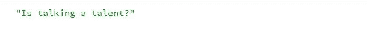
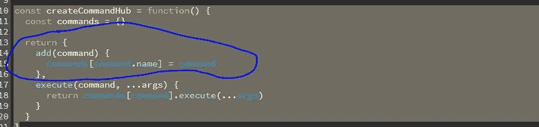
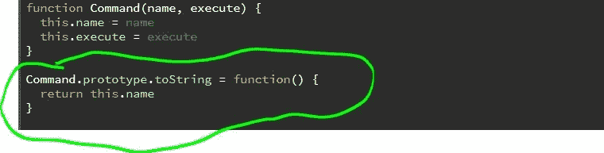

# 2020 年 JavaScript 中使用对象的 9 种方式

> 原文：<https://betterprogramming.pub/9-ways-to-work-with-objects-in-javascript-in-2020-d772c29db429>

## 物体永远不会死亡


*照片由* [*费尔南多·埃尔南德斯*](https://unsplash.com/@_ferh97) *上* [*下*](https://unsplash.com/)

像许多其他语言一样，JavaScript 有很多技巧来完成简单和困难的任务。让我们看看 2020 年使用 JavaScript 对象的九种方式。

注意:这是一个列表，我认为这是一个很好的处理对象的简短列表。有些是有趣的，有些是众所周知的，有些只是为了提供信息。

无论如何，如果你喜欢用 JavaScript 编码，那么你可能会同意我的观点，使用对象比使用其他类型有趣得多。

# 1.如何真正创建一个空对象

你知道你可以用 JavaScript 创建对象吗？你当然有！

你还知道你可以创建空的对象吗？

这里有一个例子:

```
const myEmptyObject = {}
```

这是在创建普通的空对象时所能达到的最好效果。然而，在内部，它并不是真正的空，因为你本质上做的是类似于`Object.create(Object.prototype)`的事情。这将为您创建一个对象，它可以访问位于原型链顶端的`Object.prototype`中的属性。

这意味着你将能够使用像`myEmptyObject.toString()`这样的方法。

要真正创建一个空对象，你只需要在使用它的时候传入`null`:

```
const myTrulyEmptyObject = Object.create(null)
```

当您使用上面的方法创建对象时，在您自己添加属性之前，属性实际上是不存在的。

99.99%的情况下，我不会推荐这样做，因为没有理由不从基本原型开始。

# 2.合并对象变体#1 ( `Object.assign`)

当您使用`Object.assign`方法时，您需要一个`target`对象作为合并附加对象和/或属性的对象。

目标对象是`Object.assign`的第一个参数。从第二个参数开始，其后的任何参数都将被合并到目标对象中。

下面是 Mozilla 对该方法的官方定义:

> Object.assign()方法将所有可枚举的自身属性从一个或多个源对象复制到目标对象。它返回目标对象。

# 3.合并对象变体#2(扩展语法)

当您以这种方式合并对象时，您是在对象文字上使用 spread 运算符。

这种语法被纳入了 ECMAScript 2018 官方规范，因此对一些人来说，它可能仍然是一种新的补充。

以这种方式合并多个对象非常简单，许多人推荐这种方式，因为您的代码仍然可以保持整洁和可读性，因为您所要做的就是键入三个点。仅此而已。

请记住，合并对象的规则仍然保持不变，所以您可以使用最奇怪的方式将对象合并在一起，就像这样:

## 扩展生命函数

JavaScript 中的函数在很多方面都很强大。你几乎可以用它们做任何事情。这是由于 JavaScript 中函数的本质——它们本质上是一等公民，所以你可以把它们扔到任何地方，随心所欲地进行破坏。

例如，由于 JavaScript 中的函数仍然是对象，所以您仍然可以将函数视为对象，这意味着您可以随意使用它们，并用它们做一些令人惊奇的事情。

您甚至可以用奇怪的方式将它们合并到对象文字中，如下所示:

因为 IIFEs 是自调用的，所以我们立即返回一个将被合并到`icons`对象中的对象。结果将是相同的对象，但是合并了:

# 4.2020 年检查现有房产

一个绝对会在社区中掀起风暴的特性是[可选链接](https://developer.mozilla.org/en-US/docs/Web/JavaScript/Reference/Operators/Optional_chaining)。这个新的操作符采用了`.?`的形式，允许读取一个位于连接对象链深处的属性值，而不必明确验证链中的每个引用都是有效的。

这意味着如果你有任何深度嵌套的对象结构，如下所示:

```
const food = {
  fruits: {
    apple: {
      dates: {
        expired: '2019-08-14',
      },
    },
  },
}
```

…您不再需要编写重复的代码，例如:

```
function getAppleExpirationDate(obj) {
  if (food.fruits && food.fruits.apple && food.fruits.apple.dates) {
    return food.fruits.apple.dates.expired
  }
}
```

使用可选的链接会变得容易得多:

```
function getAppleExpirationDate(obj) {
  return food?.fruits?.apple?.dates?.expired
}
```

在你的代码中到处使用它感觉更干净。

像这样的函数:

…可以很容易地变成这样，同时保持其可读性:

这只会让你比以往更欣赏[更漂亮的](https://prettier.io/)。

**注意:**在撰写本文时，并不是所有的现代浏览器都支持这个特性。但是你现在可以使用 [TypeScript](https://www.typescriptlang.org/) 并开始你想要的可选链接，因为它被编译回旧浏览器可以阅读的语法。

# 5.通过覆盖`.toString()`调用对象

当对象被指定为对象文字的键时，它们被字符串化。这带来了一些很好的用例。

让我们看看下面的例子:

如果您运行这个代码片段，您将看到代码工作，结果如下:



如果您仔细观察我们添加命令的方式，您会发现它应该会抛出如下错误:



之所以没有，是因为当我们定义`Command`构造函数时，我们也覆盖了`toString`原型方法，如下所示:



当非主类型值被指定为对象的属性时，JavaScript 试图在将它们作为键附加之前对它们进行字符串化，方法是返回到原型上的`.toString`方法。

[@reduxjs/toolkit](https://redux-toolkit.js.org/) 就用了这一招，允许将动作直接作为键传递。例如，它们可以直接用作键，从而映射分配给动作的`.type`值的 reducer 函数。

# 6.解构

在该语言的众多重要新增功能中，有一项是对象析构:

```
const obj = {
  foods: {
    apples: ['orange', 'pineapple'],
  },
}const { foods } = objconsole.log(foods) *// apples: ["orange", "pineapple"]*
```

# 7.重命名析构属性

```
const obj = {
  foods: {
    apples: ['orange', 'pineapple'],
  },
}const { foods: myFoods } = objconsole.log(myFoods) *// apples: ["orange", "pineapple"]*
```

# 8.迭代对象的键(`for in`)

迭代对象的键的一个简单方法是使用`for in`语法:

# 9.迭代对象的键变体#2 ( `Object.keys`)

您可以使用的另一种方法是使用`Object.keys`方法:

```
const obj = {
  foods: {
    apples: ['orange', 'pineapple'],
  },
  water: {
    f: '',
  },
  tolupa: function() {
    return this.name
  },
}const { foods } = objconst keys = Object.keys(obj)
console.log(keys)
```

这里的区别是，你将在你将要工作的数组中接收密钥。

如果你想做额外的事情，比如链接操作和转换成更结构化的值，这也更方便——这是更有用的:

# 结论

这就是这篇文章的结尾。我希望你发现这是有价值的。以后多多关照！