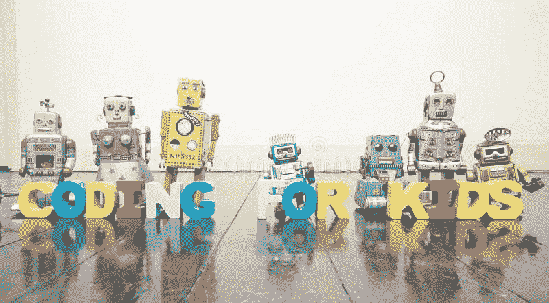

# 一个 10 岁孩子对计算机编程的看法

> 原文：<https://betterprogramming.pub/a-10-year-olds-perspective-about-computer-programming-c8556a9cb747>

## 先说编码！

我是由我父亲介绍计算机编程的。我爸妈是程序员，我一直很好奇。有一天，我的父母给了我 Osmo 和 Dash 机器人，并教我如何发出指令，使机器人移动，并用 Osmo 制作拼图。我变得如此感兴趣，以至于现在我正在学习很多关于计算机编程的知识。

所以我想我会分享我对编程的感受，也许会激励其他孩子学习技术，以便更好地为他们未来的职业生涯做准备。你永远不知道！

# **计算机编程好玩吗？**

计算机编程非常有趣，因为你可以用计算机的语言和它说话。当你在谷歌的搜索栏中输入一些正常的东西时，它会转化为隐藏在表面之下的代码，这样计算机就可以理解你的请求。基本上，你是在不知道的情况下输入代码。很酷，不是吗？然而，要编写的代码远不止这些。很难编写代码并让它做你需要它做的任何事情。你想让它变得精确。这就像多米诺骨牌效应:如果一件事出错，你输入的整个代码都会出错。但是一旦开始做，就不想停下来了。就是这么好玩！

通过可汗学院学习真的很有趣。可以学习 JavaScript，Python 等。你可以尝试的一件事是挥舞的雪人。有教程，进入之后就可以开始输入*椭圆(x，y，w，h)* 然后是*；*。那会形成一个圆圈。也可以输入 *rect (x，y，w，h 半径*)* 再输入*；*，这样就成了一个长方形。如果您在 *radius ** 中键入一个数字，该数字将使矩形的角变得更圆而不是更尖。

我可以告诉你更多，但是我更愿意让你自己去发现，这样你就可以像我一样从计算机编程中获得更多的乐趣！

# **一些不错的学习网站和应用**

我认为可汗学院是一个很好的学习环境网站，因为它在顶部有一些阅读课程的内容。你按它，然后它会有许多课程弹出。在最下面，它会说计算。你按那个，然后它有一大堆编程视频，挑战，和项目。好玩吧。

当我在那里练习时，我觉得我在用别的东西做东西——对我来说，这很有趣。

另一个不错的学习环境网站是 Coding Jam。有些课程会让你经历一切。不仅有练习回合，而且当你完成所有课程并返回主页时，你可以访问一个工作室。有一扇门，你按下它，当它打开时，会有 1-3 的数字。我想我说得太多了，但是你们自己去实验吧。

还有许多其他网站/应用程序可以查看，但我要提到的最后一个是 Swift Playgrounds。浮面上有“字”。有些角色喜欢寻找宝石，你必须给他们编程，让他们走向宝石，抓住它们，有时你必须走过入口才能得到宝石。他们还会教你调试是如何工作的。超级好玩！

# **为什么要学编程？**

为什么要学计算机编程？嗯，学习如何编程真的很有帮助，因为你可能需要在以后的工作中用到这些技能。

我想学习计算机编程，因为它很棒，如果我想在这个领域找到一份好工作，我需要知道如何编码。我们的世界将会使用很多技术来帮助每个人的日常生活，我想成为其中的一部分，发明很多东西。

我希望你现在想学习计算机编程，或者至少尝试一下！