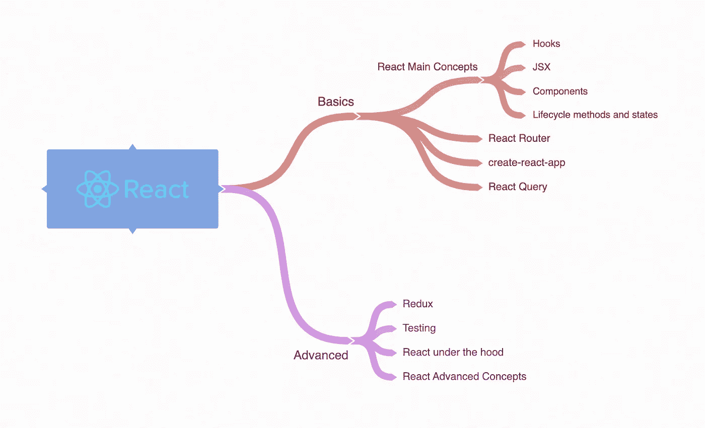
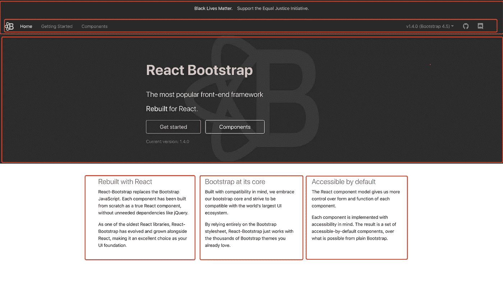

# 2021 年 React 学习路线图

> 原文：<https://betterprogramming.pub/a-2021-roadmap-to-learning-react-c58c28f5bb58>

## 从初学者到专家你需要知道的所有事情

图片来源:作者

React 是用于创建动态 web 应用程序的最流行的 JavaScript 库之一。它背后有巨大的社区支持和活跃的开发团队。

尽管 React 本身相对简单，但仅仅学习一个库是不够的，尤其是如果您想创建一个复杂的 web 应用程序。

我从 2016 年开始在 React 中开发，随着任务复杂度的增加，我不得不学习其他的“助手库”来实现功能。

在本文中，我想展示一个路线图，您可以使用它来学习如何使用 React 创建真实世界的应用程序。我将列出重要的 React 概念和您应该知道的其他有用的库。

# 先决条件

因为 React 是一个 JavaScript 库，所以您应该非常了解 JavaScript 基础知识和 ES6 语法。

我建议您在能够使用纯 HTML/CSS 和普通 JavaScript 编写一个简单的网站后，才开始学习 React。

# 基础

在这一节中，我想分享为了构建一个简单但功能强大的 React 应用程序而必须学习的东西。推荐的学习资源(以及我用过的资源)将列在本部分的末尾。

## 创建-反应-应用

 [## Facebook/创建-反应-应用程序

### 创建没有构建配置的 React 应用程序。Create React 应用程序可以在 macOS、Windows 和 Linux 上运行。如果某事…

github.com](https://github.com/facebook/create-react-app) 

我相信通过编码来学习，这个库将帮助您立即开始使用 React 应用程序。

它将使用一些默认文件建立一个项目，并让您直接进入编码，看看 React 是如何工作的。

如果你喜欢冒险，你也可以弹出应用程序，深入了解 React 代码是如何编译的，以便在浏览器上运行。但是如果你是一个初学者，你不应该担心如何从头开始创建一个 React 应用程序。

## JSX

您应该从 React 的最基本概念开始，即使用 JSX 创建组件。您很少会看到没有它的真实应用程序。熟悉以下主题:

*   [使用 JSX 渲染元素](https://reactjs.org/docs/rendering-elements.html)
*   [嵌入 JavaScript 表达式](https://reactjs.org/docs/introducing-jsx.html#embedding-expressions-in-jsx)
*   [指定元素属性](https://reactjs.org/docs/introducing-jsx.html#specifying-attributes-with-jsx)
*   [以编程方式更新元素，并在浏览器中看到它的变化](https://reactjs.org/docs/rendering-elements.html#updating-the-rendered-element)

## 成分

这是一个非常重要的概念。一个 React 应用程序由许多独立的和可重用的*组件*组成。

组件是具有高度特异性的代码片段，通常是孤立的。每个组件都很好地处理一件事情，数据通过道具或上下文共享。

例如，您可能有一个只负责呈现导航链接的 header 组件。

这个概念有四个部分:

*   学习如何在组件之间传递数据
*   训练你的思维从组件的角度来思考网页
*   生命周期方法和状态
*   函数与类组件

你应该掌握道具的概念，如何将它们传递给子组件，以及如何使用 [PropTypes](https://reactjs.org/docs/typechecking-with-proptypes.html) 来验证道具。上下文是组件之间传递数据的另一种方式，但它更像是一个高级概念。

然后，您会希望开始从组件的角度来考虑 web 页面。拿任何一个网页，比如 [H & M 的官网](https://www2.hm.com/en_ca/index.html)，试着把它分解成组件。这将迫使你关注尽可能少的代码，并练习代码设计。我在一次采访中也被多次要求这样做。

[React Bootstrap](https://react-bootstrap.github.io/) 的主页面分解成组件

每个组件都有一组生命周期方法，动态数据存储在状态中。当存储在状态中的数据发生变化时，组件将重新呈现以更新该变化。这些也是需要理解的基本概念。

在学习这些概念时，您无疑会遇到条件呈现和从一个列表中呈现多个组件。至此，您应该能够创建一个简单的 React 应用程序。

要理解的最后一点是功能和类组件及其用例之间的区别。这会直接导致钩子。

## 钩住

 [## 介绍钩子-反应

### 钩子是 React 16.8 中的新增功能。它们允许您使用状态和其他 React 特性，而无需编写类。这个…

reactjs.org](https://reactjs.org/docs/hooks-intro.html) 

[React Hook](https://reactjs.org/docs/hooks-intro.html) 是 React 16.8 中最近新增的库。它与函数组件一起使用，它允许开发人员在不使用类的情况下使用状态和其他特性。

以前，功能组件是无状态的。状态和生命周期方法用于类组件。通过钩子，开发人员可以将状态用于功能组件。

你应该知道如何使用最常见的钩子，比如`useState`和`useEffect`。

## 反应路由器

 [## React 路由器:React 的声明式路由

### 学习一次，路线无处不在

reactrouter.com](https://reactrouter.com/web/guides/quick-start) 

React Router 是 React 的路由器库，它允许您基于 URL 呈现不同的组件。

学习这个库将是创建全栈 React 应用的第一步。

## 反应查询

 [## 反应查询

### 不用编写 reducers、缓存逻辑、定时器、重试逻辑、复杂的异步/等待脚本(我可以继续下去...)…

react-query.tanstack.com](https://react-query.tanstack.com/) 

web 应用程序必须能够获取数据，复杂的应用程序需要维护大量的状态。React 没有一种自以为是的获取和更新数据的方式，管理状态也很困难。于是像 Redux 这样的库诞生了。

然而，Redux 很复杂，并且引入了大量样板代码。如果你刚刚开始学习 React，你应该从一个更容易的选项开始。

React Query 是另一个轻量级库，它经常被描述为“React 缺少的数据获取库”它比 Redux 容易学得多，而且可以利用钩子(现在你应该很熟悉了)。

这将使数据获取变得非常容易，并让您体验一下真实世界的应用程序是如何做到这一点的。(我在工作中广泛使用了这个库。)

## 摘要

*   创建-反应-应用
*   React 基础:组件、道具、生命周期方法和状态
*   反应钩
*   反应路由器
*   反应查询

## 推荐资源

*   [React 官方文档](https://reactjs.org/docs/getting-started.html)
*   [Traversy Media 的 React 速成班](https://www.youtube.com/watch?v=sBws8MSXN7A&ab_channel=TraversyMedia)
*   [忍者神偷播放列表](https://www.youtube.com/watch?v=6RhOzQciVwI&list=PL4cUxeGkcC9hNokByJilPg5g9m2APUePI&ab_channel=TheNetNinja)
*   [React 路由器五分钟教程](https://www.freecodecamp.org/news/react-router-in-5-minutes/)
*   [忍者的 React 查询播放列表](https://www.youtube.com/watch?v=x1rQ61otgtU&list=PL4cUxeGkcC9jpi7Ptjl5b50p9gLjOFani&ab_channel=TheNetNinja)

# 更高级

## Redux 和 Redux Thunk

 [## redux-JavaScript 应用程序的可预测状态容器。|还原

### JS Apps Redux 的可预测状态容器帮助您编写行为一致的应用程序，运行在不同的…

redux.js.org](https://redux.js.org/)  [## reduxjs/redux-thunk

### Redux 的 Thunk 中间件。今天的大多数教程都假设您使用的是 Redux Thunk 1.x

github.com](https://github.com/reduxjs/redux-thunk) 

尽管 Redux 很复杂，并且为最简单的数据读取引入了大量样板代码，但它仍然是业内非常流行和广泛使用的状态管理库。

您应该学习如何执行以下操作:

*   用 Redux 建立一个项目
*   使用 Redux 获取数据和管理状态
*   或者，查看 Redux Thunk

一开始我很难理解 Redux。这里有一篇[文章](https://www.valentinog.com/blog/redux/)真正详细地解释了所有的概念，并附有关于 Redux 的一步一步的教程。

Redux Thunk 是一个流行的库，经常与 Redux 一起使用。它允许动作创建者返回函数而不是动作对象。对于学习 React 来说，这是可选的，但仍然是一个值得了解的好库。

## 测试

 [## 笑话🃏愉快的 JavaScript 测试

### Jest 是一个 JavaScript 测试框架，旨在确保任何 JavaScript 代码库的正确性。它允许您…

jet js . io](https://jestjs.io/)  [## React 测试库|测试库

### React 测试库通过添加用于处理 React 组件的 API 构建在 DOM 测试库之上。项目…

testing-library.com](https://testing-library.com/docs/react-testing-library/intro/) 

编写测试很重要，根据我的经验，这通常比编写实际代码更难。

你应该学习最流行的测试库，比如 [Jest](https://jestjs.io/) 和 [Enzyme](https://enzymejs.github.io/enzyme/) ，以及如何用 [Sinon](https://sinonjs.org/) 这样的库模拟 API 调用。还有其他的库，比如 [React 测试库](https://testing-library.com/docs/react-testing-library/intro/)。

随着应用程序变得越来越复杂，对单个组件进行良好的单元测试以确保正确性非常重要，而不是假设它们的行为符合预期。

## 高级反应概念

React 官方文档方便地将所有高级概念从主要概念中分离出来。从技术上讲，构建 React 应用程序不需要了解任何高级概念。

然而，生产级应用通常会利用其中一些概念，例如 ref 和高阶元件。完全理解 React 的能力总是有用的，即使您不使用它。

编写代码时，您可能会偶然发现这些概念中的大多数。至少浏览一下这一部分来理解 React 完全能够做什么是有用的。

## React 是如何工作的

在这个阶段，您已经准备好深入 React 的内部工作了。

你可以先在 create-react-app 创建的 React app 上运行`eject`，了解 React 代码是如何在浏览器上运行的。

您也可以尝试自己设置一个 React 应用程序，而不使用 create-react-app 库。研究一下 [Gulp](https://gulpjs.com/) 、 [webpack](https://webpack.js.org/) 或 [Babel](https://babeljs.io/) ，看看如何使用这些库来传输 React 代码。许多应用程序需要比 create-react-app 提供的设置更大的灵活性。

最后，您可以查看 React 的源代码，以全面了解这个库。

## 摘要

*   Redux/Redux Thunk
*   测试反应组件
*   反应先进的概念
*   自己建立一个 React 项目
*   React 源代码

## 推荐资源

*   [Redux 初学者教程](https://www.valentinog.com/blog/redux/)
*   [Jest 速成班](https://www.youtube.com/watch?v=7r4xVDI2vho&ab_channel=TraversyMedia)
*   [测试反应](https://medium.com/dailyjs/testing-react-an-overview-56204839cbad)
*   [React 官方文档](https://reactjs.org/docs/getting-started.html)(高级概念部分)

# 最后的想法

希望这个列表能对你有所帮助，不管你是一个刚刚开始学习 React 的初学者，还是想更新你的 React 知识。

React 是由脸书积极开发的，多年来，出现了许多新的特性和库来支持这个令人惊叹且易于使用的库。

我对即将到来的事情感到非常兴奋，我希望你也一样。

最后，我想祝你在 React 之旅中一切顺利！