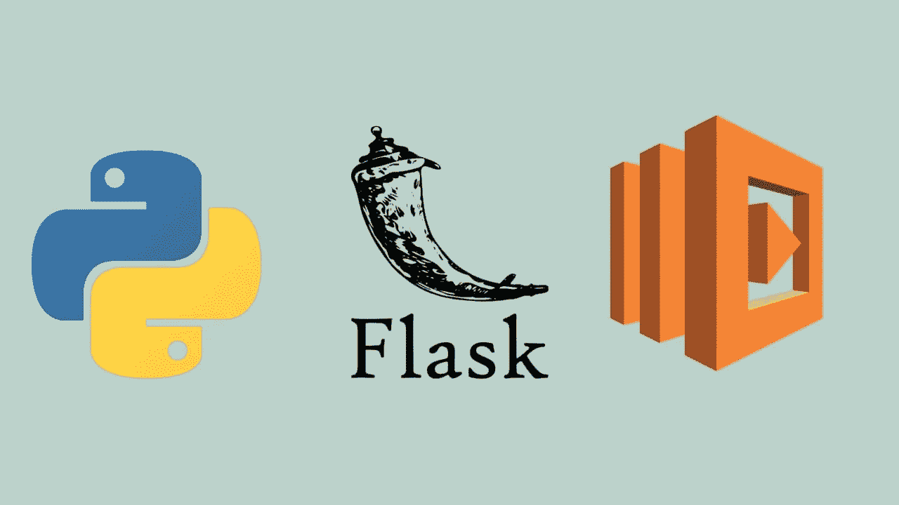
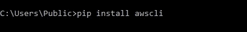
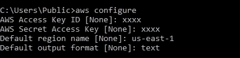
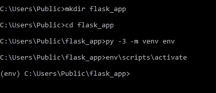
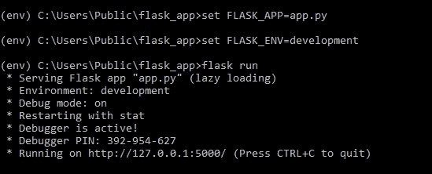
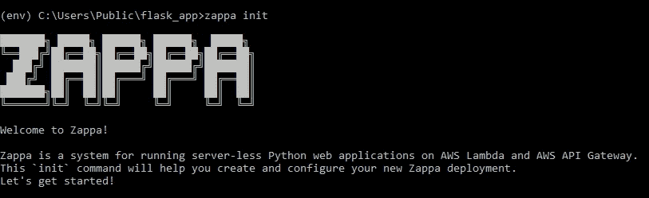
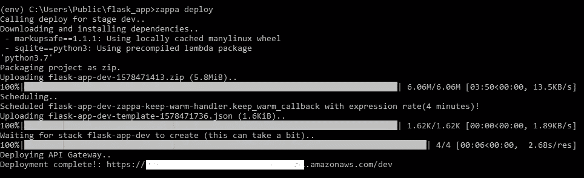

# AWS Lambda 上的 Python APIs 五分钟指南

> 原文：<https://betterprogramming.pub/a-5-minute-guide-to-python-apis-on-aws-lambda-d359630fe743>

## 以更好的方式启动您的 Python 项目



使用 Canva.com 制造

随着机器学习时代的到来，越来越多的人在使用 Python。像 [Jupyter](https://jupyter.org/) Notebooks、 [PyCharm](https://www.jetbrains.com/pycharm/) 和 VS Code 这样更智能的 ide 使得函数式编程变得简单有趣。

您可以专注于手头的业务案例，轻松连接数据，快速编写和测试功能，而无需担心代码结构。

然而，也很容易忽略更大的画面。当你训练出一个完美的模型或者创造出一个能让你赚到数百万的解决方案时，你怎么能让别人消费你的代码呢？Web 应用还是 REST API？服务器上的主机还是无服务器？Azure 还是 AWS？

如果你开始时没有考虑到结果，你可能会有很多返工。

# ***烧瓶，无服务器，和 AWSλ***

如果你使用 Python 已经有一段时间了，你可能听说过 [Flask](https://www.palletsprojects.com/p/flask/) 和 [Django](https://www.djangoproject.com/) 。这些流行的 Python web 框架帮助您创建 REST APIs 或 web 应用程序。

对于较大的项目，选择 Flask 或 Django 时需要考虑一些细微差别，但是让我们改天再讨论这个问题。我更喜欢 Flask for REST APIs，因为它简单、轻量级且易于学习。

在本练习中，我们将在 AWS 上部署一个“Hello World”Flask 应用程序。

无服务器架构帮助您构建和运行应用程序，而无需考虑服务器。服务器供应、高峰时期的扩展和操作系统维护都由云提供商管理，您只需按请求付费。

听起来像是微服务的完美家园，不是吗？AWS Lambda 函数允许您在支持微服务架构的平台上运行无状态无服务器应用程序。

Lamda 函数可以由各种事件触发(比如 S3 上的文件上传)或者通过 API 网关触发。顺便提一下，如果您想将 API 放在一个容器中，也可以考虑查找 AWS Fargate。

# ***要求***

您需要设置一个 AWS 帐户，并在 Windows 系统上安装 Python 3.6(或更高版本)。VS 代码使事情变得简单，但是你可以使用任何你喜欢的 IDE。我们开始吧！

# ***1。安装并配置 AWS CLI***

安装 AWS 命令行界面(CLI)，并使用您的 AWS“访问密钥 ID”、“秘密访问密钥”、区域名称和输出格式对其进行配置。

这些凭证将用于创建 Lambda 函数。以后，您还可以使用 CLI 命令从命令提示符管理所有 AWS 资源，而不必每次都登录 AWS 管理控制台。

它对于在 S3 存储桶之间传输文件尤其方便。



# **2*。创建虚拟环境***

为您的应用程序创建一个文件夹，导航到该文件夹，并启动一个 Python 3 虚拟环境。一旦激活，您就可以在新环境`env`中安装所有需要的库。

```
mkdir flask_app
cd flask_app
py -3 -m venv env
env\scripts\activate
```



# 3.安装库，完成代码，并进行本地测试

使用 [pip](https://pip.pypa.io/en/stable/) 安装烧瓶。在`flask_app`文件夹中创建一个`app.py`文件，并用下面的示例代码保存它。

确保在部署代码之前在本地测试它。部署 Lambda 函数后，可以使用 CloudWatch 日志来监控它。如果函数不起作用，它会显示错误细节。

然而，在一个复杂的场景中，仅仅通过读取日志可能很难精确定位问题。

如下所示在本地主机上运行 Flask，并测试所有应用程序路由。

```
set FLASK_APP=app.py
set FLASK_ENV=development
flask run
```



# ***4。最后，一些 Zappa 魔法！***

[Zappa](https://github.com/Miserlou/Zappa) 是一个开源库，让 Lambda 上的部署变得轻而易举。

通常，部署包括将虚拟环境打包成 zip 文件，将 zip 文件上传到 S3 存储桶，配置 Lambda 函数，并将其附加到 API 网关。

Zappa 在幕后完成所有这些工作。它与 Flask、Django 和其他 WSGI 框架配合得很好。

使用 pip 安装 Zappa，然后按照下面的代码操作。

```
zappa init
```



然后，Zappa 将请求环境名称、要使用的 S3 桶和 Flask 应用程序的位置等信息。要对每个问题使用默认值，只需按 Enter 键。

一旦创建了`zappa_settings.json`，您就可以开始部署了。

```
zappa deploy
```



片刻之后，您的 API 就启动并运行了！您可以使用 Zappa 生成的链接来访问和测试 API。

如果您对应用程序进行了更改并希望重新部署，请使用下面的命令。

```
zappa update
```

感谢您的阅读。我洗耳恭听任何问题，所以一定要让我知道。