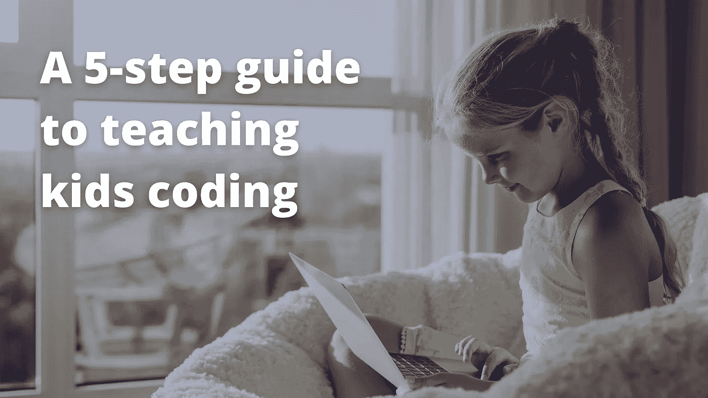
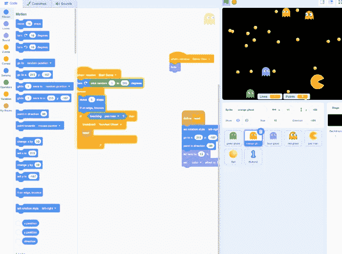
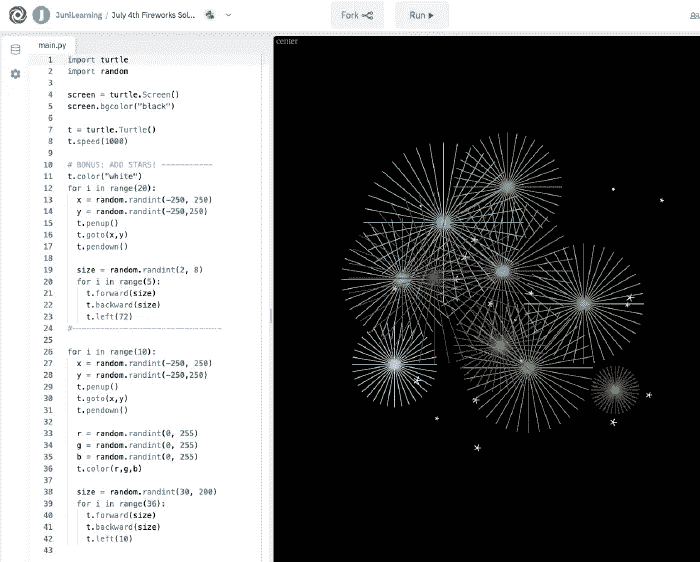

# 教孩子编码的 5 步指南

> 原文：<https://betterprogramming.pub/a-5-step-guide-to-teaching-kids-coding-8e45b194ba63>

## 面向儿童的编程

## 你想教孩子们如何编码吗？以下是开始的方法

作者照片。

我是一个三岁男孩的父亲，随着他的成长，我开始考虑如何教他编程。当然，他现在还太年轻，我甚至不确定他是否有兴趣继续他父亲的事业。但是如果他感兴趣，我想给他提供合适的资源来激发他的好奇心和学习。

在和我的一些朋友讨论想法时，我们意识到我们对教孩子一些技能知之甚少。我们都是长大后才学会编程的。我是最年轻的，15 岁开始学习。我们不知道当我们的孩子八九岁时，我们可以给他们什么样的挑战。

几天前，我有机会与[由尼学习](https://junilearning.com/?utm_source=livecodestream)的优秀人员交谈，这是一个专注于教授儿童数据科学、数学等知识的网站，他们与我分享了一些让您的孩子进入这个迷人世界的步骤。

在我们开始之前，让我告诉你从小学习编程有很多好处——不管孩子们长大后决定追求什么样的道路。编程改变了你的思维方式，让你更善于分析和解决问题。这些技能可以让他们的职业生涯受益，让他们跳出框框思考。

让我们开始吧。

# 1.找到他们的激情

说到学习，孩子们就像海绵一样，他们通过与世界互动和享受乐趣学得最好。不应该强迫他们学习新技能。相反，它应该是专注于他们喜欢做的事情(很像我们，对吗？).

如果你把他们已经有的爱好和兴趣与他们天生的好奇心和正确的编程项目结合起来，你已经为你的孩子的成功做好了准备。

他们喜欢游戏吗？太好了，[和他们一起建造一个游戏](https://junilearning.com/blog/coding-projects/how-to-make-a-scratch-game-step-by-step/?utm_source=livecodestream&utm_medium=step_guide_kids_coding&utm_campaign=outreach)。

他们喜欢艺术吗？尝试一个更加视觉化或设计化的项目。

或者甚至是网络？为什么不教他们如何建立网站呢？

# 2.选择一种可视化编程语言

我喜欢 Python 和 JavaScript，但它们可能不适合一个八岁的孩子。如今，有一些很棒的编程语言是专门设计来教孩子编程的。由尼的人给我们推荐了五种最适合孩子的编程语言。

教小孩子的关键是用视觉元素而不是文字。他们可以更好地处理信息，这让他们更专注于解决任务。

如果不是，问问你的孩子他们更喜欢什么。

这个:

或者:

用 Scratch 编码创建的吃豆人游戏。Scratch 允许孩子们直观地创建他们最喜欢的游戏，并使用丰富多彩的代码块来控制角色！

基于可视化元素的编程语言可能是一个更好的选择。请记住，重要的不是语法，而是培养解决问题的技能和打破常规的思维。

对于更小的孩子(8-11 岁)，像[麻省理工学院的 Scratch platform](https://scratch.mit.edu/) 这样的基于块的编码语言有很大的视觉吸引力，就像乐高介绍工程一样介绍编码。对于大一点的孩子(11 岁以上)，你可以通过使用[海龟](https://docs.python.org/3/library/turtle.html)库给 Python 语言添加视觉元素。

# 3.从小处着手

你孩子的第一个项目可能不应该是构建操作系统或任何复杂的东西。任何开发人员都会以经典的“Hello World”开始他们使用新编程语言的第一个项目，并从那里开始，他们会继续进行一个基本的任务，如 notes 应用程序或类似的东西。

你的孩子也一样。从基础和简单的项目开始，让他们在准备好的时候承担更大的任务。不要试图把他们逼得太紧。记住，他们在学习，当他们享受学习而不是被学习所挫败时，他们会尽力而为。

如果你的孩子目标过高，感到沮丧，帮助他们，把他们的挑战分成更小的部分，让他们可以很快解决。

# 4.利用失败培养韧性

建立在失败的基础上。在 [Unsplash](https://unsplash.com/) 上由 [Kelly Sikkema](https://unsplash.com/@kellysikkema) 拍摄的照片。

编码可能具有挑战性，有时还很痛苦。不管我们的年龄如何，我们有时会被一个问题困住，不知道如何解决它——这可能会令人沮丧。

对你的孩子来说，不会有什么不同。陷入困境和失败是学习过程的一部分。提醒你的孩子，如果你没有犯错误，那么你没有努力，因此没有学习。

# 5.建立在成功的基础上

不管他们刚刚解决了多么小的任务，祝贺和庆祝你孩子的成功。这对他们来说是一个巨大的成就，使他们能够向前迈进，迎接下一个挑战。

完成一项挑战或任务也是激励他们做更多事情的绝佳时机。一旦他们准备好了，你就可以通过要求他们在项目中投入额外的努力来扩展范围。例如，如果他们为自己的生日建了一个倒计时器，让他们扩展它来支持他们朋友和家人的生日。

这个 Python 和 Turtle 编码项目从简单的焰火动画扩展到在星空背景下编码多种形状和大小的具有挑战性的焰火。

永远记住，主要目标是让他们在学习和发展技能的同时获得乐趣，从而在生活中帮助他们。

# 最终注释

学习编码有巨大的潜力——不仅对成年人，尤其是对孩子。编码需要思维技能，这在许多与计算机科学完全无关的情况下非常有用。

教你的孩子如何编码可以为他们打开许多大门，激发他们的好奇心、创造力和想象力，并给他们解决问题所需的工具。

通常建议你的孩子在八岁左右开始这样的活动，这和他们开始下棋的时间差不多。

我还需要等一会儿才能和我儿子开始，但我会不耐烦地等。即使他决定做别的事情，我也希望他喜欢编程。我希望我们能像父子程序员一样一起开发东西。

我要感谢由尼学习中心的人们，感谢他们出色的工作和激励。没有他们，这篇文章是不可能的。

感谢阅读！