# 60%键盘对你有好处

> 原文：<https://betterprogramming.pub/a-60-keyboard-is-good-for-you-a7d65194f0ce>

## 我从全尺寸键盘到 60%键盘的旅程

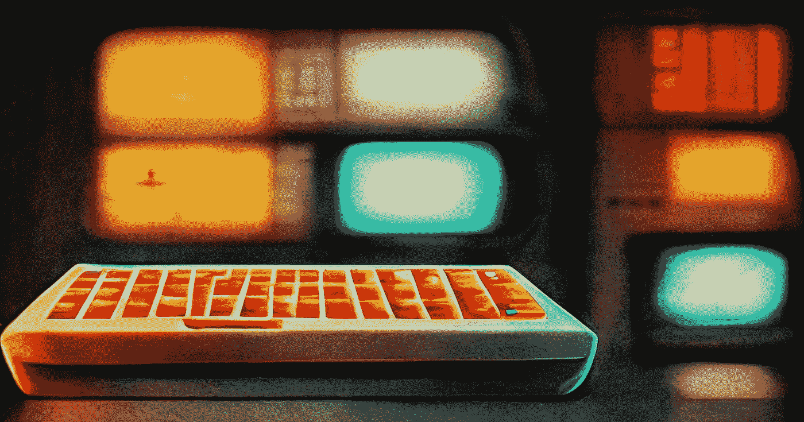

*生成使用* [*中途*](https://www.midjourney.com/)

几年前，在我工作过的一家公司，我看到了大量的机械键盘，特别是 60%的键盘，我给自己买了一个。

从那以后，我就一直用那六成的机械键盘，再也回不去了。然而，我注意到，像软件开发中的许多其他实践一样，我们很容易停留在我们已经知道的舒适区，因为有太多的东西需要学习。

正如我在我的介绍性博客文章中所写的，开发人员是终身学习者。所以，我希望分享我自己的经历能鼓励你去尝试一些完全不同的东西。这一开始可能看起来很难，但是随着时间的推移，会提高你的打字体验和效率。

让我们从基础开始。

# 什么是机械键盘？

> *物理键盘，每个键使用单独的弹簧和开关(*[*PCMac*](https://www.pcmag.com/encyclopedia/term/mechanical-keyboard)*)*

等等，那么什么**不是机械键盘呢？**

生产最广泛的键盘类型被称为[薄膜](https://en.wikipedia.org/wiki/Membrane_keyboard)(尽管也有其他类型):

> *一种物理键盘，其“键”不是分离的，而是只有轮廓和符号印刷在平坦、柔性表面上的压力垫。*

## 一些历史

最初，当键盘第一次被生产出来时，它们是机械的。随着计算机开始变得越来越便宜，制造商们也在想办法让键盘变得更便宜，于是薄膜键盘就诞生了。

然而，薄膜键盘有机械键盘的缺点，所以近年来，对键盘有高要求的用户(游戏玩家、打字者、程序员等..)又开始使用它们了。

这里有一个由 wepc.com 做的比较:

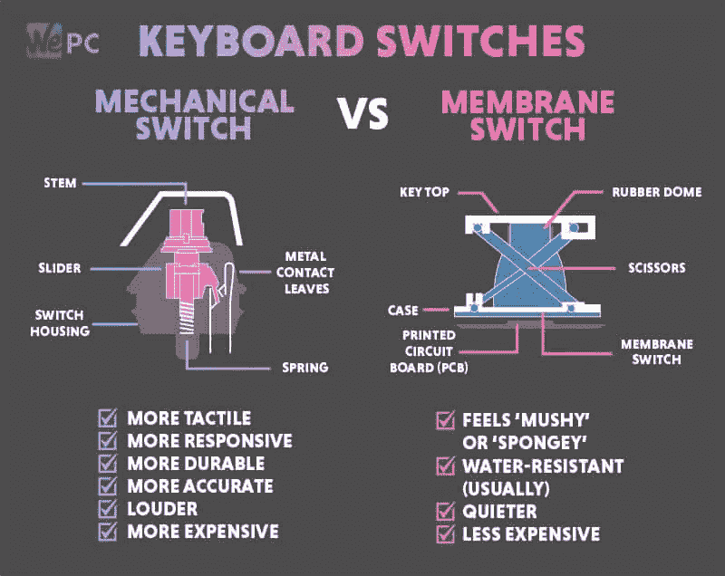

# 回到机械键盘

机械键盘最重要的部分是开关类型。有三种类型:**线性**、**触觉、**和**点击式**:

*   线性(红色、黄色、黑色)——最安静，点击速度最快，这使得它们在游戏玩家中很受欢迎。
*   触觉(棕色、橙色)—在每次按键时都能感觉到触觉凸起。
*   咔嗒声(蓝色、绿色)—噪音最大，启动时会发出咔嗒声。

*(来源:*[*steelseries.com*](https://steelseries.com/blog/gaming-keyboard-mechanical-switches-44)*)*

键帽(开关上方的实际塑料)、板类型和形式(大小)也是机械键盘的重要因素。

那我们来谈谈形式吧。

# 什么是 60%键盘？

键盘有许多自定义形式，如下图所示:

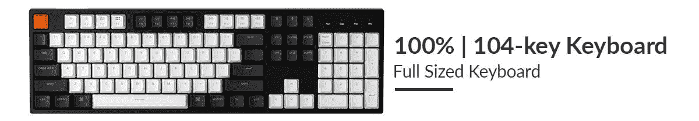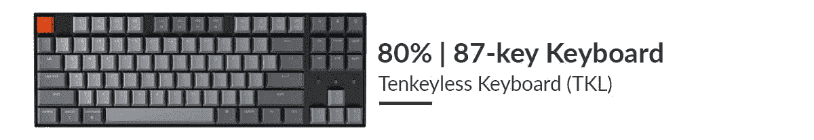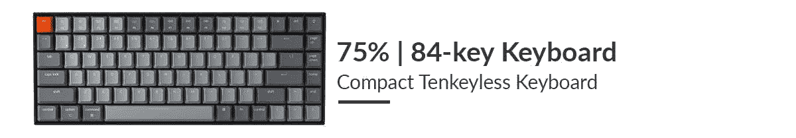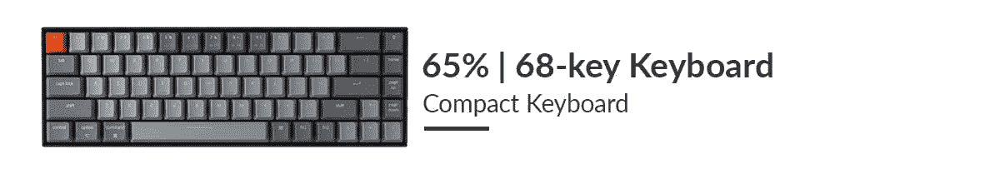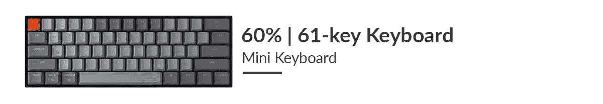

*(来源于*[【keychron.com】](https://www.keychron.com/blogs/news/keyboard-size-layout-buying-guide)*)*

全尺寸键盘可能是“经典”键盘，而我们在大多数笔记本电脑上看到的大约是 75%的变化。从我的个人经验来看，我会说我们大多数人对 75%到全尺寸的键盘都很适应。

如果我们降到 65%，通常我们首先失去的是功能键(`F1`、`F2`，...).

但是功能键是有用的，因此通常存在一个 [**Fn 键**](https://en.wikipedia.org/wiki/Fn_key) ，当按住该键时，会将顶行的功能“切换”到功能键:

这仍然是相当合理的，因为 F 键不是很常用，所以不时地按下一个额外的键来使用 F 键仍然在“舒适”的范围内。

然而，当我们低于 65%时，事情开始变得“不那么舒服”(也更有趣)。也许最大的变化是去掉了**箭头键**。这些按键如此常见，以至于没有它们也能正常工作听起来有些疯狂。

今天我们要讨论 60%键盘的好处，以及为什么我认为它们对你有好处:)

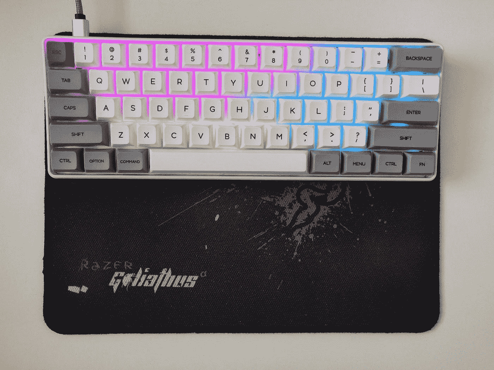

*(我的 60%键盘)*

# 为什么 60%的键盘对你有好处？

**TL；博士:**

1.  更快地从使用鼠标切换到打字
2.  对大多数人来说，它更符合人体工程学
3.  更快地到达所有导航键
4.  更紧凑
5.  比较便宜的

## 1.键盘和鼠标

每当我们打字的时候，我们双手的中立位置都在所谓的[主排键](https://www.computerhope.com/jargon/h/hrk.htm)上，左手是`A`、`S`、`F`，右手是`J`、`K`、`L`、`;`。

假设您是右撇子，无论何时您想使用鼠标，您都需要将手从主行键移到鼠标，如下图所示:


正如我们可以，当使用全尺寸键盘工作时，距离是相当大的。对于 60%的键盘，它看起来像这样:

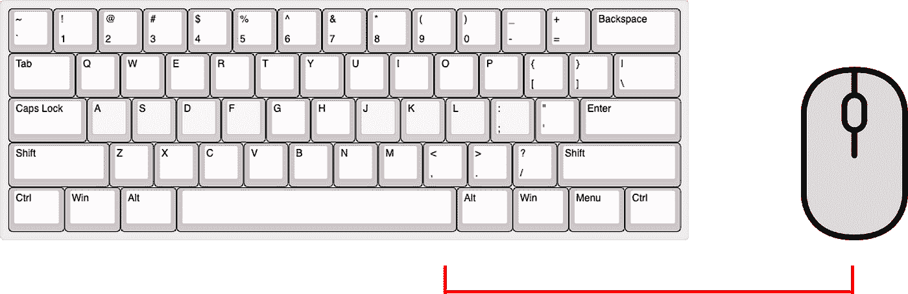

这意味着使用 60%的键盘，在双手打字和鼠标之间切换要快得多(大约一半的距离！).

## 2.人类工程学

虽然这取决于你的肩长，但一般人在使用全尺寸键盘时，需要从中立的休息位置向外弯曲双手。60%或 10 无键键盘几乎总是更符合人体工程学。

下面这篇文章似乎真的深入到为你选择正确的键盘形式:[键盘外形指南/ Ctrl.blog](https://www.ctrl.blog/entry/keyboard-form-factor-guide.html) 。

## 3.更快地使用导航键

机械键盘的一个共同特征是按键映射可编程性。我们可以对按键进行编程，使其表现不同。

一个特定的功能是“临时层切换”，它允许一个被按住的键临时改变整个键盘的键映射(只要它被按住)。

以下可视化显示了我个人的临时图层索引映射。我选择了`Caps Lock`键作为我的层切换键，因为我很少使用这个功能，而且它很好地定位在主行上。

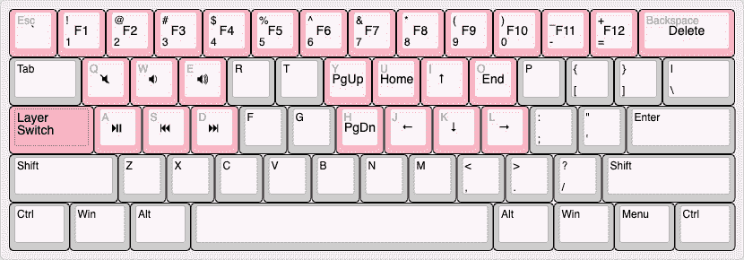

正如你所看到的，所有的导航键和 Fn 键(+额外的媒体键！)现在离主行更近了，即使使用箭头键也能让你的手保持在同一个位置！

*注意:习惯这样的新键映射需要一些时间。我花了 3 周时间达到正常的工作速度，从那以后，我的工作速度变得更快了^^*

## 4.更紧凑

这里真的没有太多要添加的，它只是更小，因此允许更多的桌面空间，更便于携带。

## 5.比较便宜的

更少的按键==更少的材料==更便宜(假设键盘的所有其他因素都相同)

# 在工作中使用时

我们已经说过，机械键盘的一个特点是它们通常比薄膜键盘的声音大。

虽然如果你喜欢打字的声音，这可以被认为是一个优势，但当与其他人一起工作时，这可能会成为一个威胁生命的事件(当我长时间使用 clicky-switch 键盘时，一些同事毫不掩饰地表达了谋杀我的愿望)。

然而，有一些安静得惊人的开关，甚至比薄膜键盘还要安静。

我们现在要介绍我目前的机械键盘设置，我个人很喜欢(也很安静)。

# 我的 60%键盘设置

## 预建键盘

我自己的键盘设置非常简单。我最初买了一个预建的预算键盘，这是非常可定制的。

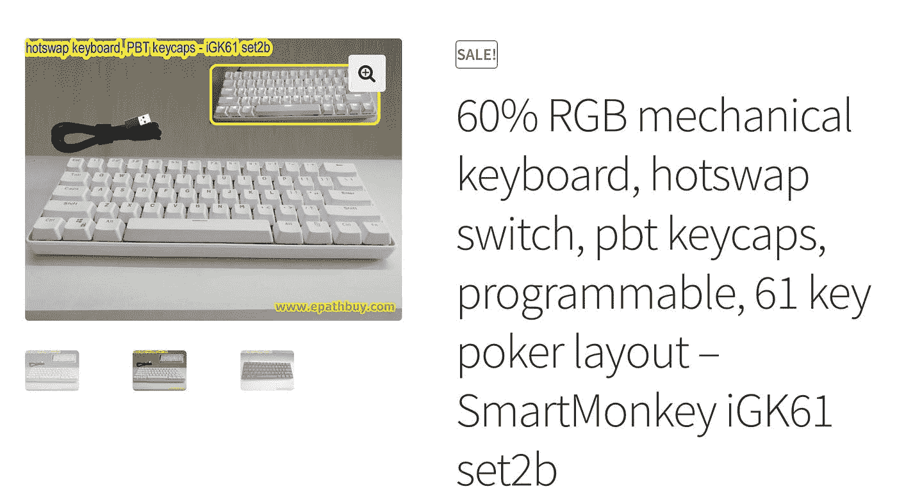

[*购买链接*](https://www.epathbuy.com/product/60-rgb-mechanical-keyboard-hotswap-switch-pbt-keycaps-programmable-61-key-poker-layout-smartmonkey-igk61-set2b)

我们来分解一下这个键盘的长标题描述:

1.  **60%** —这个我们已经知道了；)
2.  **RGB** —每个按键上的全红绿蓝灯光，完全可编程动画等…
3.  **热插拔开关** —这意味着主板允许您拔出现有的开关，并轻松更换。
4.  **pbt 键帽** —键帽的类型。这本身就是一个完整的主题，这里有一个[概述](https://drop.com/talk/108/massdrop-101-intro-to-keycaps)。
5.  **可编程** —有软件允许配置从按键映射和照明到宏指令的一切。
6.  **61 键扑克布局** —键盘正好有 61 个键。“扑克”代表所有 60%键盘的非官方名称。
7.  **smart monkey igk 61 set2b**—键盘的确切型号。

有两个定制选项:键盘颜色和开关型号。

我的第一个开关是[凯尔盒白色](https://keebworks.com/kailh-box-white/#:~:text=The%20Kailh%20BOX%20White%20is,tactility%20and%20a%20click%20noise.)。这些开关非常灵活，虽然我非常喜欢它们的打字感觉(我试过的最好的开关之一)，但我需要一些别的东西来办公。

## 无声开关

经过一番研究，我发现了 Gazzew 的 Boba U4 静音开关。

这些开关如此安静真是神奇！

我也非常喜欢它们的打字感觉，它们是我目前最喜欢的办公室打字开关。

## GSA 键帽

接下来，我想给我的键帽一些颜色。虽然我不认为它们是最好看的键帽，但它们的“相同高度”GSA 轮廓(是的，键帽布局是你应该知道的另一件事)真的很好:

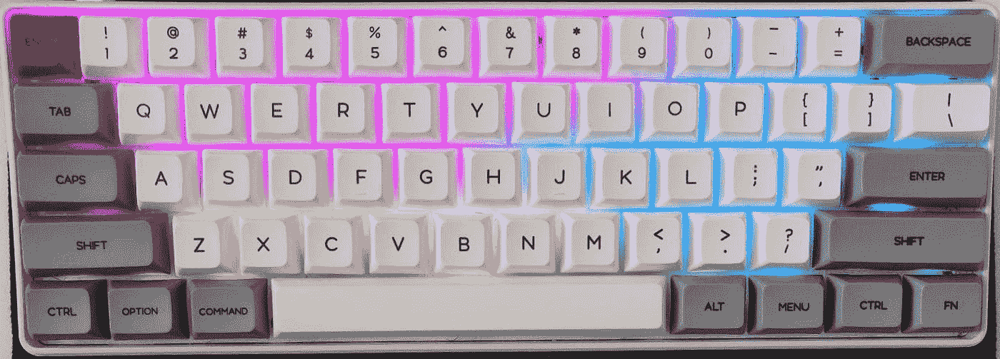

[*购买链接*](https://www.epathbuy.com/product/custom-gh60-keycaps-set-pbt-61) ， [*下载链接*](http://www.jikedingzhi.com/downloadlist?driverID=41)

## 对临时层编程

该键盘具有允许重新映射按键的软件，以启用临时层，如[使用导航键更快](https://medium.com/p/a7d65194f0ce#43cd)部分所示，从而提高工作效率。

如果你需要任何帮助来定义映射，那么试试这个 [YouTube 视频](https://www.youtube.com/watch?v=0du_7cg058Y)。还有，随便伸手！

就这样，伙计们！我希望你喜欢这篇博文。如果你有任何关于机械键盘的问题，或者在看完这篇文章后决定了解更多，请告诉我。

> *免责声明:我仍在摸索机械键盘的广阔世界。有很棒的资源可以让你进一步了解机械键盘。Youtube 是一个很好的起点，只要写下“机械键盘入门”就可以开始了(只要记得打开秒表阻止你进入永无止境的视频虫洞)。*

```
**Want to Connect?**If you liked this content, [consider signing up to my newsletter (it's free)](https://buildstupidstuff.com/newsletter).Originally published at [https://buildstupidstuff.com](https://buildstupidstuff.com/a-60-keyboard-is-good-for-you).
```

# 参考

*   【https://www.midjourney.com/home/ 
*   [https://buildstupidstuff . com/building-stupid-stuff # heading-why-write-a-blog-at-all](https://buildstupidstuff.com/building-stupid-stuff#heading-why-write-a-blog-at-all)
*   [https://www.pcmag.com/encyclopedia/term/mechanical-keyboard](https://www.pcmag.com/encyclopedia/term/mechanical-keyboard)
*   [https://en.wikipedia.org/wiki/Membrane_keyboard](https://en.wikipedia.org/wiki/Membrane_keyboard)
*   [https://www.wepc.com/tips/what-is-a-mechanical-keyboard/](https://www.wepc.com/tips/what-is-a-mechanical-keyboard/)
*   [https://steel series . com/blog/gaming-keyboard-mechanical-switches-44](https://steelseries.com/blog/gaming-keyboard-mechanical-switches-44)
*   [https://www . key chron . com/blogs/news/keyboard-size-layout-buying-guide](https://www.keychron.com/blogs/news/keyboard-size-layout-buying-guide)
*   [https://www.computerhope.com/jargon/h/hrk.htm](https://www.computerhope.com/jargon/h/hrk.htm)
*   [https://www.ctrl.blog/entry/keyboard-form-factor-guide.html](https://www.ctrl.blog/entry/keyboard-form-factor-guide.html)
*   [https://drop.com/talk/108/massdrop-101-intro-to-keycaps](https://drop.com/talk/108/massdrop-101-intro-to-keycaps)
*   [https://keebworks.com/kailh-box-white](https://keebworks.com/kailh-box-white)
*   [https://thocstock.com/switches/gazzew-boba-u4-silents](https://thocstock.com/switches/gazzew-boba-u4-silents)
*   [https://www.youtube.com/watch?v=0du_7cg058Y](https://www.youtube.com/watch?v=0du_7cg058Y)
*   [https://www . epath buy . com/product/60-RGB-mechanical-keyboard-hot swap-switch-PBT-key caps-programmable-61-key-poker-layout-smart monkey-igk 61-set2b/](https://www.epathbuy.com/product/60-rgb-mechanical-keyboard-hotswap-switch-pbt-keycaps-programmable-61-key-poker-layout-smartmonkey-igk61-set2b/)
*   [https://www . epath buy . com/product/custom-gh60-key caps-set-PBT-61/](https://www.epathbuy.com/product/custom-gh60-keycaps-set-pbt-61/)
*   [http://www.jikedingzhi.com/downloadlist?driverID=41](http://www.jikedingzhi.com/downloadlist?driverID=41)