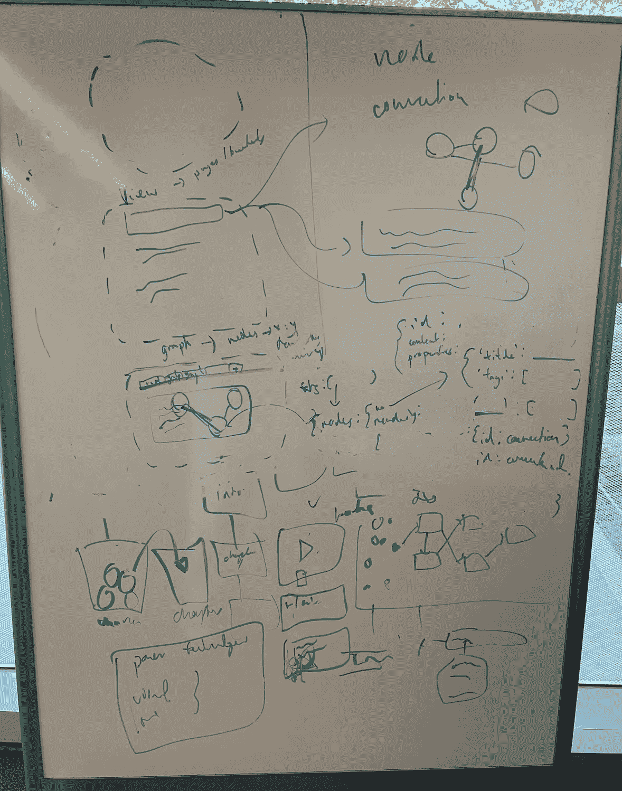
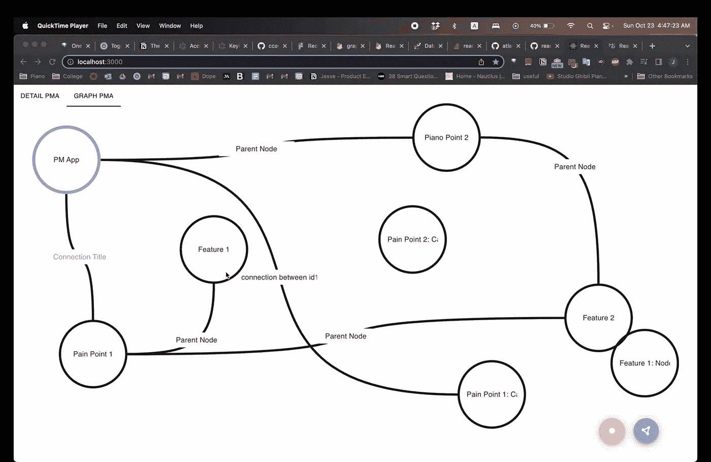
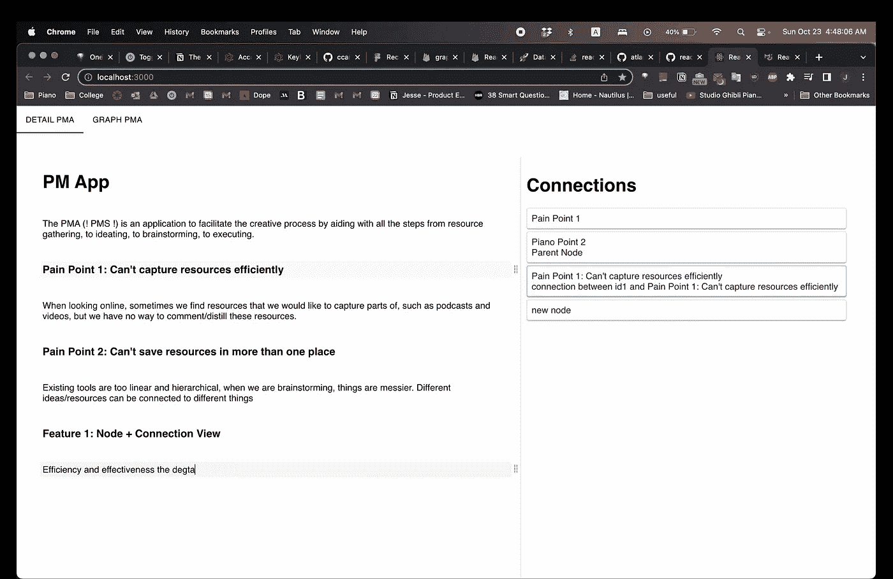

# 婴儿图表，以及之前的 36 个小时

> 原文：<https://betterprogramming.pub/a-baby-graphiqal-and-the-36-hours-that-preceded-it-8a574f5cac73>

## 一个关于创造性思维的数据可视化项目


法希姆·蒙塔希尔在 [Unsplash](https://unsplash.com?utm_source=medium&utm_medium=referral) 上拍摄的照片

几个周末前，我和杰西连续相处了将近 36 个小时。当我还在从创伤中恢复过来的时候，这个黑客马拉松周末是一个关于一个领域的紧张会议的缩影，他和我经常讨论这个领域:生产力、效率和创造力。不同的是，这是一个*致力于*关于这些话题的周末。我认为我们最终得到了非常酷的东西:)

对于那些不熟悉黑客马拉松的人来说，它们是为期两天的活动，在此期间，团队构思并实施他们选择的软件项目，最多受一个广泛主题的限制。所以世界真的是我们的牡蛎。

今天，我想和你们分享我们经历的所有过程，来创造现在的一切(太令人激动了！！！！！)更长期的项目(上蹿下跳！！！)我们正在考虑采用它(你能看出我还在为这个而紧张吗？).甚至在两天的小规模项目中，你会看到我们仍然经历了一个超加速版本的旧产品开发过程，包括动机、愿景、设计选择和实施。

# **星期五，晚上 9 点:我们下班了…**

*动机和愿景*

“黑客”时代正式开始了。我们来到绘图板前，拉出一块白板开始头脑风暴。我们知道我们想在工具的一般领域创造一些东西来帮助生产力或创造性发展，但是我们还不确定是什么。我们首先抛出与我们想要在自己的生活中解决的问题相关的想法，或者自动化我们已经手动对我们自己的日常事务进行的修改，这也可以使其他人受益。其中一些包括一种更智能的方法来检测个人的最佳专注时间，以帮助他们提高生产力，其他的则与通过查看具有相似兴趣的人正在看什么来从互联网上建议资源有关。他们中的一些人变得有点古怪，比如在头脑中实施渐进超负荷的健身房原则，而另一些人变得更有雄心，比如创建一个全公司范围的 Slackbot，在人们打字时智能地将他们与其他员工和资源联系起来。为了了解我们达到的极客水平，这是我们的画板，第 1 面，共 2 面。



我们美丽的图画

我知道你可能很想从这里窃取我们令人惊叹的想法，但是我们实际上把它们加密了，以至于当我回头看这个的时候，我甚至不能告诉你我们在想什么。这么多有价值的想法被浪费了…

但是有一件事我们一直在绕回，我们就像这样一字不差地写下来，包括打字错误和所有的东西:

> 💡以不同的格式表示、存储和操作可以存在于多个地方的数据。没道理但会很酷 *🥵🤯😤*

因此，尽管这可能是我们清单上最抽象的想法，我们还是决定采用它。这让我们很着迷。

本质上，我们讨论了人类思维是如何非线性和无层次的。试图将你头脑中杂乱的想法或白板上的涂鸦翻译成计算机存储会导致大量有价值内容的丢失。在创作过程中尤其如此，比如写书或策划这篇博文。当我们进行头脑风暴和计划时，我们经常在知道它们在哪里或如何适合一个过程之前就想出主意，我们进行不一定是父子格式的混乱连接，我们经常想要将相同的想法/信息与多个事物联系或使用。然而，即使是最强大的笔记和创意工具也迫使你以线性方式写东西。唯一偏离页面直线的是点击 tab 键并获得一个层次关系。没有什么能比得上白板笔和干净的写字板的自由和流畅，画出圆圈并用线条随意连接它们。正是在这种固有的混乱中，真正的创造性思维和联系产生了。想象一下将这与计算机的速度、效率和能力结合起来的潜力。

所以，这个想法是要彻底改变我们表达和操作信息的方式。如果你想一想，我们存储信息的方式(以文档形式，只是文本直行)自从文本被发明以来就没有改变过。我们想打破这种强制的线性等级制度。我们玩弄了数据可视化的想法，问自己人们倾向于如何思考事物和想法。在我们的头脑中，*任何东西*都可以连接到*任何东西，*但是你怎么告诉电脑去做这件事呢？抽象思维的力量在于我们能够以任何形式想象同样的信息；只需点击一个按钮，将相同的数据从图表转换为时间线、报告再转换为思维导图，这难道不是很酷吗？

感觉更强大的是，我们不断意识到这样一个产品对于规划这个产品本身是多么有用。几乎是递归的…

所以现在，女士们先生们，为了盛大的揭示…


[腾雅特](https://unsplash.com/@tengyart?utm_source=medium&utm_medium=referral)在 [Unsplash](https://unsplash.com?utm_source=medium&utm_medium=referral) 上拍照

# 星期六，凌晨 1 点:图形的想法诞生了

*设计*

我们项目的基本设计决策如下:我们将把我们头脑中的所有信息表示为两个实体中的一个——节点或连接。一个节点代表一条信息，比如一本书中的一个人物。节点本身可以包含仅与自身相关的详细信息，例如角色的特征、毛发颜色、喜欢的狗的品种等。从根本上说，所有的节点都是平等的，无论是人物、地点还是书本身。他们只是以不同的方式联系在一起。第一次创建节点时，它可以独立存在。但在现实世界中，事情很难保持单干。这两个想法把我们带到了连接。

连接本身就是一个实体，它表示两个节点之间的关系。这可能是两个角色之间的关系，角色与背景的关系，或者角色与书的某个部分之间的关系。地狱(系好安全带，因为事情将变得更加疯狂)，它甚至可能是在不同的时间点发生在一个角色和他/她自己之间。这个想法是，一个连接有一个不必严格分层的类型，它本身包含元数据。这样，理论上，节点可以存在于多个地方，以不同的方式连接到各种事物。

具体来说，我们将创建一个工具，用户可以用它来创建这些节点和连接，并在经典的文本编辑器工具、图形界面、时间线、树或其他任何他们想要的方式中查看它们。终极自由是终极目标。对于用户必须如何绑定他们的思维，使其适合如何在计算机上表示事物的特定“盒子”,没有限制。

**我们将这个想法映射到一个具体的用例上，**我们选择这个用例作为写书的过程。我们指出的一些事情是，你可能会想到一个最初独立存在的角色:你可能不知道这个聪明、古怪、神秘的遛狗者如何融入故事，但你知道你希望他在那里。您可能还希望指定该角色如何链接到特定的设置，如他最喜欢的披萨店，但仍然将它们作为独立的实体(而不是将一个作为项目符号放在另一个下面)。你可能希望能够看到与特定角色相关的所有事物，或与该角色相关的所有事物，或与相关事物相关的所有事物…你明白了。对于所有的 CS 爱好者，请考虑一下图表中的距离度。或者不要，我会尽量克制自己的书呆子气。

此时，已经快到凌晨 3 点了，但是，唉， **GraphIQal 已经出生了**(这个蹩脚的名字是杰西的主意。事实上，我认为这很酷。明白了吗？智商大写？？？)

我们建立了我们的技术栈，决定这将是最有意义的桌面应用程序。我们选定了一个基于 React JS 构建的框架，名为 Electron.js，用于桌面应用。现在，我们将跳过后端，因为我们的主要挑战是前端体验。在这一点上，头晕如昔，我们决定到此为止。

各位晚安。

# 星期六，上午 10 点:构建过程开始

*实施*

在短暂的 5 小时睡眠后，我们回到图书馆，准备出发。我们并肩坐在一起，开始编码。然而，在不太深入的时候，我们开始询问关于我们想法的理论的问题。我们回顾了我们的计划(这些计划远没有我在上面说的那么清晰)。为了再次解释我们现有的想法，我们在兔子洞里越陷越深，在白板上画出更大更复杂的图片。我们回到了绘图板，但不知何故取得了负面进展(添加了越来越多的酷功能，却没有真正理解工具的核心应该做什么。不要这样)。

在这里，我们作出了行政决定，是时候进行提炼了:虽然在一个周末彻底革新数据可视化真的很有趣，但这并不完全可行。[从我们之前在 Meetr](/on-missing-the-fairy-godmother-moment-of-software-7d429216a1d9) 上犯的错误中吸取教训，我们想要保持软件设计原则的真实性，保持事情小，并且开发每个单独的功能，使其足够有用和模块化，可以独立存在。通常，这意味着分解东西，蒸馏。例如，史蒂夫·乔布斯(Steve Jobs)已经吸收并阐明了这一原则，解释了通过关注事物的本质和消除不必要的组成部分来简化事物的重要性。

那么，我们可以在一个周末内实际制作出什么样的图形，它本身是有用的，并且仍然代表了我们试图解决的总体痛点？这是一个非常复杂的问题，但下面是我们着陆的地方，也是我们最终建造的地方:

我们的工具有两个界面:一个图形界面和一个熟悉的文本编辑器。在图形视图中，您可以添加节点和节点之间的连接，立即能够以这种“思维导图”的方式直观地看到它们。在这个视图中，您只看到每个节点和连接的标题，这是一个高级视图。您可以拖动节点，并按照您想要的方式放置它们，您创建的每个特定视图都会被保存。然后，您可以在这个视图和文本编辑器视图之间切换。



图形视图

一旦切换到文本编辑器视图，您在图形视图中所做的更改就会得到反映。这更像是一个特定节点的分屏“详细”视图。在左边，您可以看到并以传统的笔记方式写下节点的详细信息。在头脑风暴/写作时，您可以拖动您编写的文本块以任何顺序显示。你也可以点击键盘上的一个按钮，一个弹出窗口出现(感谢这个想法),让你创建一个连接。在屏幕的右侧，您可以看到该节点的连接。您可以单击任何连接，它会作为副标题出现在详细信息屏幕上，如果您想详细了解您想记住的关于此特定连接的信息。而且，神奇的是(或者通过一些我甚至不记得写过的复杂代码)，当你切换回图形屏幕时，你建立的任何新连接都会显示出来。



详细视图

杰西负责细节视图，我负责图形视图。我们选择将用户界面做得尽可能简约——我们能够发现我们项目的主要困难在于它的抽象性。考虑到这一点，我们真的想专注于并解决让应用程序的功能对用户来说尽可能简单和直观的挑战。一旦我们开始做事，这一天过得真的很快，我们每个人都得到了一些很酷的东西。就开发而言，我们知道由于时间限制，黑客马拉松项目天生就是杂乱无章的，只是“拼凑”在一起的，所以我们允许自己查看一些最佳实践来让事情运转起来。然而，我们仍然计划了结构和数据设计，同时从长远考虑，这样至少应用程序的主干是健全的。

# 周日，凌晨 2 点:合并

差不多了。

“git merge”这个词会让其他人紧张吗，还是只有我会紧张？

我们在各自的视角中都有工作，现在，深呼吸，是时候…合并了。我们特意将应用程序设计为依赖于两个部分一致的数据结构，以便为用户提供无缝连接和更新。因此，据推测，自动同步应该可以完美运行，理论上甚至可以立即*。但是，凭我们的运气(和过去的经验)，我们没有抱太大希望。这可能会很好，我们会在一个小时内完成，或者我们会一直工作到上午 9 点黑客攻击结束，没有一个成品。*

所以，深呼吸，然后呼气。

```
git merge
```

# 周日凌晨 4 点:一幅完整的婴儿图画

*最终产品，并超越*

所以我选择省略丑陋的细节。但是最后，在两个小时的一个又一个的错误之后……在崩溃之后……我们有了一个创造性可视化的功能工具。我们兴奋地将它提交给了黑客马拉松，但是我们已经想得更远了。我们谈到了我们想添加但没有时间做的事情:我们希望用户能够指定他们希望从每个节点看到多少度的距离，或者进行“路径搜索”来探索节点的连接。我们希望用户能够点击图中的一个节点，并看到该节点及其连接的扩展视图。我们希望用户能够查看单个节点随时间的进展，那么连接外部 API 和信息以向其节点添加内容的能力如何呢？还有大约一百万个更酷的东西。杰西似乎非常热衷于让这个应用程序超级“hacky ”,以便能够使用一堆很酷的键盘快捷键来做随机的事情。黑客马拉松让我们有机会从这样一个抽象的空间中创造出一些具体和有形的东西，尽管这些东西很小，还没有完全开发出来。现在，我们有了概念证明，看到 GraphIQal 有潜力成为真正*酷的东西。这就是我们现在要努力实现的目标:)*

*作为一名计算机科学专业的学生，我最看重的一点是，如果你留出一个周末，你可以从相对较少的东西中创造出一些真正酷的东西。在 36 个小时里，我们从一无所有，到检查我们如何存储所有信息和进行所有思维过程的基础，到一个小的、有形的产品。正是这种*创造*并利用这种影响力的能力将我吸引到了科技领域。*

**

*由[凯利·西克玛](https://unsplash.com/@kellysikkema?utm_source=medium&utm_medium=referral)在 [Unsplash](https://unsplash.com?utm_source=medium&utm_medium=referral) 上拍摄的照片*

*查看我们提交的黑客马拉松图片:[https://devpost.com/software/graphiqal](https://devpost.com/software/graphiqal)*

*我很想听听你们对这个想法的看法。敬请关注，了解更多关于 GraphIQal 发展的消息:)*