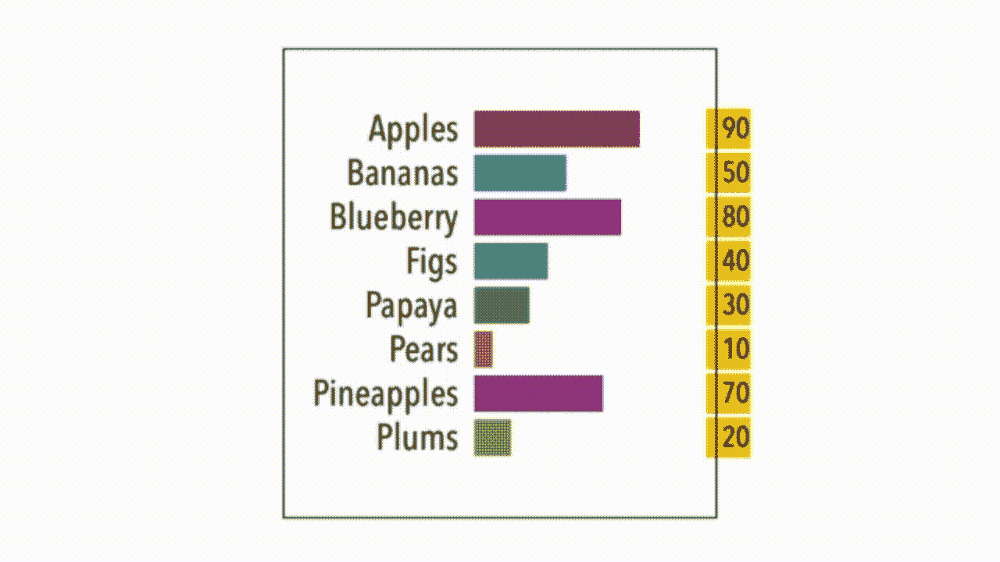

# 使用 SwiftUI 2.0 的条形图竞赛

> 原文：<https://betterprogramming.pub/a-bar-chart-race-using-swiftui-2-0-ef84dc68b678>

## 我的图表系列的第 3 部分

条形图竞赛

这是我在 SwiftUI 2.0 构建图表系列中的第三篇文章。你现在看到的柱状图，柱状图中的巴伦，是一个动画的、自动上色的、价值转移的、视觉排序的柱状图——我认为这是柱状图领域的终极挑战之一:柱状图竞赛。这些图表现在非常流行。

那它在做什么？嗯，这只是一个排序的条形图，一个不断变化的动态图，在这个过程中视觉上不断变化。

我是怎么做到的？正在讨论的代码——*Barron 条形图，姑且称之为*——使用了一个包含四个值的结构。第一个是文本标签，第二个是作为排序依据的值，第三个表示它在整个图表中的位置，最后是条形的颜色。颜色开始是清晰的，在第一次运行时设置，因为它最初绘制图表。

我用一个计时器来给我画的每一条线添加一个延迟。构建完视图后，我使用第二个计时器来循环排序、输入新值和重新排序的过程。包含案例的代码最初只是对条形进行排序，然后根据它们更新值，然后再次对它们进行排序——在最后两个案例中循环，永无止境。

整个事情的布局是一个 ZStack 数据结构中的位置字段指示要添加的偏移量。偏移量清楚地表明了条形在整个图表中出现的位置。现在你知道了。我包含了比你需要的多得多的代码，所以你有东西可以玩了。阅读“[在 SwiftUI](https://medium.com/better-programming/linking-animations-together-to-build-bar-charts-in-swiftui-6a51e3c9bb94) 中将动画链接在一起以构建条形图”和“[用组合消息为您的条形图制作动画](https://medium.com/better-programming/animating-your-bar-chart-with-combine-messages-d703c4266273)”以了解关于代码其余部分如何工作的更多信息。

我必须承认:这比我最初想象的要容易得多，或者是因为我越来越擅长于此。不过，我确实需要向我的同事塔那·海宁格点点头，因为他帮我编写了代码，特别是计时器的想法(以前，我使用线程)。在接下来的几周里，我会考虑对饼状图做同样的事情。

保持冷静，继续编码。