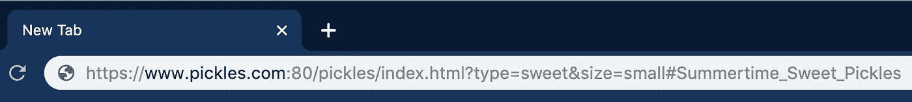

# 一个基本的面试问题:你能解释一个 URL 的每一部分吗？

> 原文：<https://betterprogramming.pub/a-basic-interview-question-can-you-explain-every-part-of-a-url-41fec140f80d>

## 让我们一点一点地分解 URL


(照片由[比安卡·卡斯蒂略](https://unsplash.com/@bianeyre?utm_source=unsplash&utm_medium=referral&utm_content=creditCopyText)在 [Unsplash](https://unsplash.com/?utm_source=unsplash&utm_medium=referral&utm_content=creditCopyText) 上拍摄)

一个华而不实的新网络服务的广告活动吸引了你的注意力。你打开手机，选择你最喜欢的网络浏览器，输入你能记住的网址。几秒钟后(取决于你的手机运营商)，瞧，一个新的网页出现在你眼前！

这是一个由来已久的故事(或者至少是 20 世纪 90 年代末)，但是你能解释一下那个至关重要的组件——URL——是如何工作的吗？如果你想成为一名网页开发者，这是你必须知道的一个非常基本的概念。让我们开始吧。

# 什么是 URL？

URL 是统一资源定位器*的缩写。*顾名思义，URL 详细描述了网络上唯一资源的具体位置，并作为浏览器用来检索该位置上任何已发布资源的工具。URL 通常被比作街道地址，URL 的每个部分作为地址的不同部分，代表不同的信息。让我们来看看这个示例 URL，并一点一点地分解它:



[https://www.pickles.com:80/pickles/index.html?type=sweet&size = small # summer time _ Sweet _ Pickles](https://www.pickles.com:80/pickles/index.html?type=sweet&size=small#Summertime_Sweet_Pickles)

## 计划

`http://`:这是一个方案，它标识了浏览器在 URL 请求数据时必须使用的协议(协议是通过互联网发送数据的规则)。有许多方案，但最常见的是 **http** (无 SSL)和 **https** (有 SSL)，后者是用于敏感数据的 http 协议的安全版本。冒号`:`是方案分隔符，正斜杠`//`建立域名的开始。

## 域名

`pickles.com` **:** 这是域名(也称为主机)，表示所请求的主机或网络服务器。由句点分隔的主机名的每个组成部分都是一个域。在右边(。com)是域名后缀或顶级域名，左边的域名(www。)是二级域或子域。域名后缀变化很大，包括。组织，。net 和特定地区的后缀，如. gov.au。

## 港口

`:80`:这是端口，表示用于访问目标 web 服务器上的资源的入口。当浏览器联系服务器时，它可能会使用一个众所周知的端口号。众所周知的端口号被分配给互联网协议。例如，HTTP 的标准端口是 80 (HTTPS 是 443)。当使用标准端口时，URL 的这一部分通常会被省略(鉴于 HTTP 的共性，这种情况经常发生)。否则，必须包括一个端口。这里的冒号也充当分隔符。

## **路径**

`/pickles/index.html`:这是路径，表示浏览器想要访问的服务器上特定资源的路径。正斜杠用作分隔符来维护 URL 分层语法。

## 查询字符串

`?type=sweet&size=small`:这是一个查询字符串，总是以一个问号`?`开头，后跟一个或多个参数，使服务器能够返回特定的内容。参数是用`&`符号(& size=small)分隔的键/值对(type=sweet)。每个 web 服务器都根据自己独特的规则处理参数。

## 锚

`#Summertime_Sweet_Pickles`:这被称为锚，也称为片段标识符，它总是以一个哈希`#`开头，后面跟着文本。这个部分代表了用户将被带到的网页上的特定位置，就好像 URL“锚定”在那里一样。如果 URL 检索 HTML 页面，则片段标识符可以使用该子部分的相关 ID 来指示该页面的子部分。

# 把所有的放在一起

不是每一个 URL 都包含上面详述的每一个元素，但是它们共同构成了 URL 的核心组成部分。使用每个标签作为其各自的部分和适当的分隔符，可能有助于可视化如下 URL:

```
scheme://domain:port/path?query=string#anchor
```

URL 还有其他部分和其他规则，但这些是你最常看到的 URL 组件，你应该准备好解释。现在去面试吧！