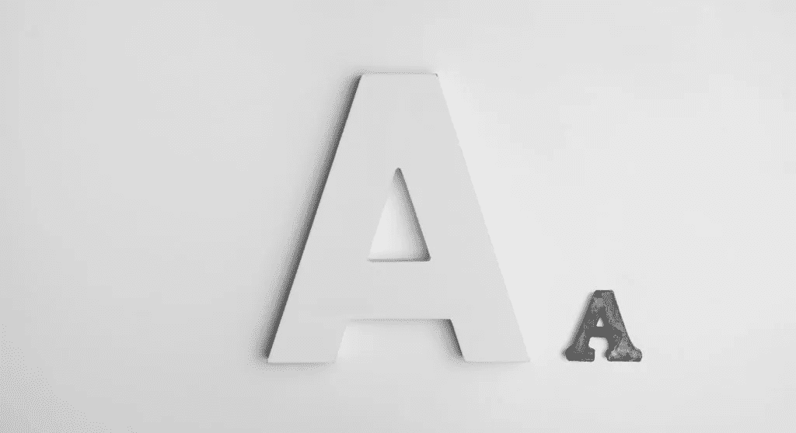
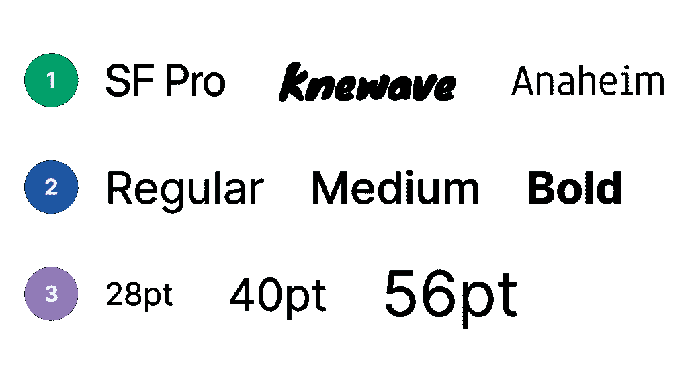
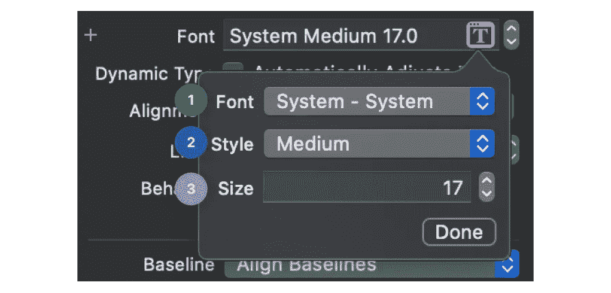
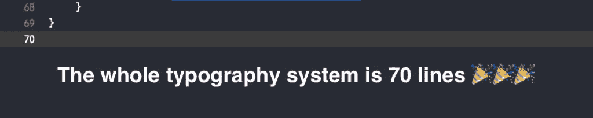

# Swift 和 SwiftUI 的基本排版设计系统

> 原文：<https://betterprogramming.pub/a-basic-typography-design-system-for-swift-and-swiftui-8ee026247c05>

## 通过集中字体管理提高一致性和可扩展性

由[亚历山大·安德鲁斯](https://unsplash.com/@alex_andrews?utm_source=unsplash&utm_medium=referral&utm_content=creditCopyText)在 [Unsplash](https://unsplash.com/?utm_source=unsplash&utm_medium=referral&utm_content=creditCopyText) 拍摄的照片

今天，每一个拥有流线型设计流程的高素质团队都应该有自己的设计系统，包括颜色、排版、图标等。
在本文中，我将向你展示如何使用 Swift 在 iOS app 中制作一个基本的排版设计系统。

# 为什么你需要一个排版系统？

## **一致性**

每个现代公司都有一个排版系统(一组预定义的文本样式)，可以跨不同平台或在一个平台内使用，为用户提供一致的体验。对于用户来说，处理六七种文本样式更容易，这些样式在屏幕上创建了一个视觉层次，以便他们理解内容的关键部分。

## 可量测性

这个世界上没有什么是不变的，文字样式也不例外。在某些时候，你的设计师可能会想出一个天才的主意，让整个应用程序中的所有 h1 都是 28 磅而不是 26 磅，或者将字体系列从旧金山改为泰晤士报新罗马字体。如果你有一个复杂的应用程序，这将需要你检查故事板和类，并手动更改它们。这是不可扩展的。

最好有一个集中的地方进行所有的字体管理。这种管理应该是可扩展的，并且对于任何专业水平的新队友来说都是容易理解的。

# 文本样式结构

文本样式有几个主要组成部分:

1.  文本族
2.  文本粗细(样式)
3.  文本大小
4.  行高(可选)
5.  颜色(可选)

文本样式结构

前三条是最重要的，所以我们把重点放在这三条上。

如果您打开 Storyboard，您可以很容易地找到这三个组件:

使用故事板在 iOS 中分配字体

通过组合这三个组件，您可以为您的应用程序创建一组可重用的文本样式。通常，这是由设计师完成的，整个应用程序中使用了六七种不同的文本样式。

例如，在我们的项目中，我们有标题 1、标题 2、标题 3、正文 L、正文 M 和正文 s。

我建议你在命名上与设计师保持一致，使用他们在设计中使用的相同名称。这会简化你们的交流，让你们保持一致。

# 创建字体管理器

该说重点了。

首先，创建一个文件来管理你的字体(例如，`FontManager`)。

为了避免与字体名称的字符串值混淆，请为字体系列、粗细和样式创建枚举。

下面描述的方法从 family 和 weight 参数中返回字体名称。

下面我将这段代码添加到了`FontManager`文件范围。

`stringName`方法为您提供了列出不兼容字体系列和字体粗细的选项。(比如 Inter 没有很重的分量)

重要提示:在添加新字体之前，请检查该字体系列的可用权重:`UIFont.familyNames.map { UIFont.fontNames(forFamilyName: $0) }`。否则，您将来会得到不兼容字体系列和字体粗细的异常或不正确字体。

是时候更新您的代码，将所有内容整合在一起了:

此外，我添加了一个默认的字体系列(以防你的应用程序只有一个)。但是有时候你的应用需要支持不止一种字体。

# Swift UI 更新

如果你已经开始转换到`SwiftUI`，将上面的代码添加到`FontManager`文件的底部:

很简单！

# 使用

为了说明使用的简单性，我们来看看使用 Swift 为 UIKit 元素分配新字体有多简单:

SwiftUI:

# 可选改进

此外，您可以在`UIFont`扩展(或 SwiftUI 的`Font`扩展)中添加您最常用的字体样式

从 iOS 13.0 开始，苹果加入了自己的排版系统。
要使用自定义字体，覆盖现有字体:

# 概述

最后，对我来说，整个排版系统有 70 行！

使用 Swift / SwiftUI 的 iOS 应用中的基本排版设计系统

谢谢你的时间。我希望你能从这篇文章中学到一些新的东西。你可以从 GitHub 下载要点。

丽塔和❤️一起写的。