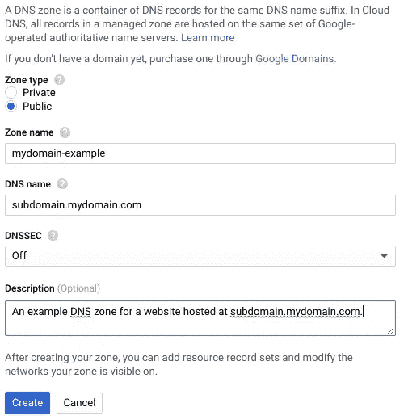
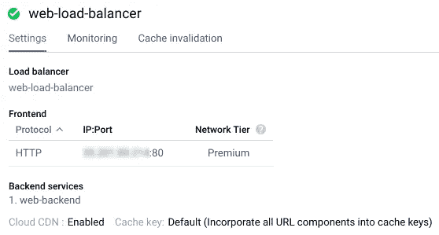
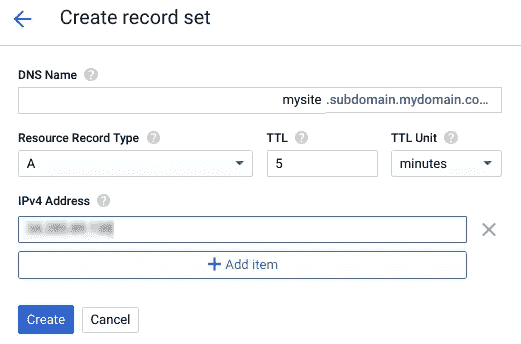
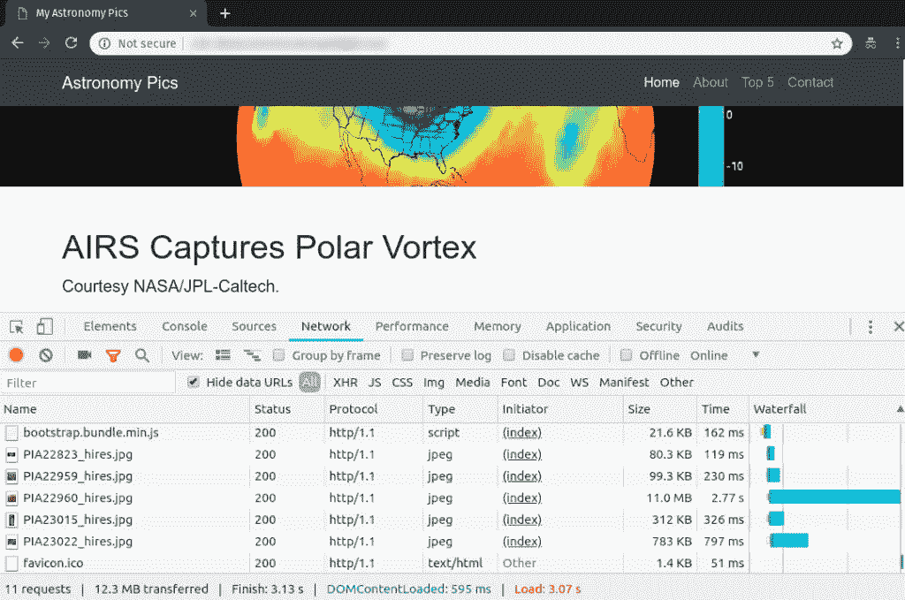
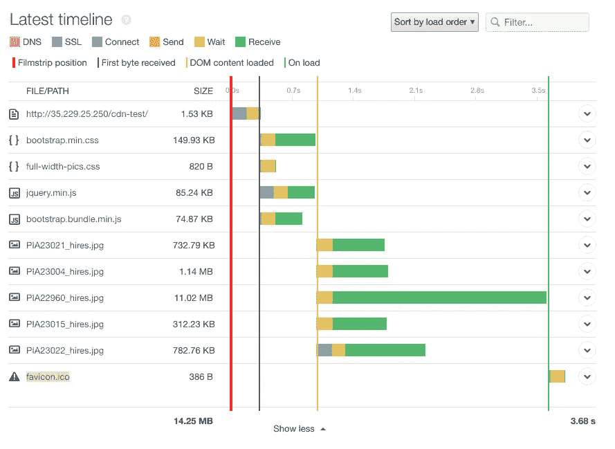
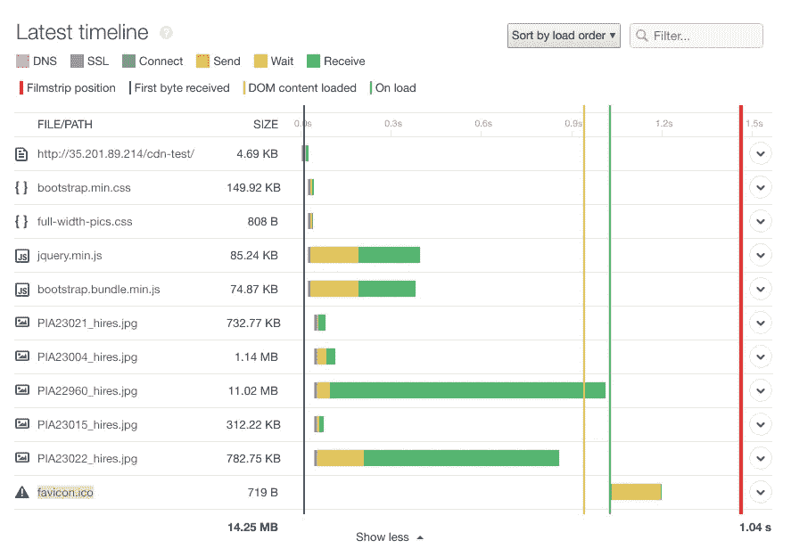
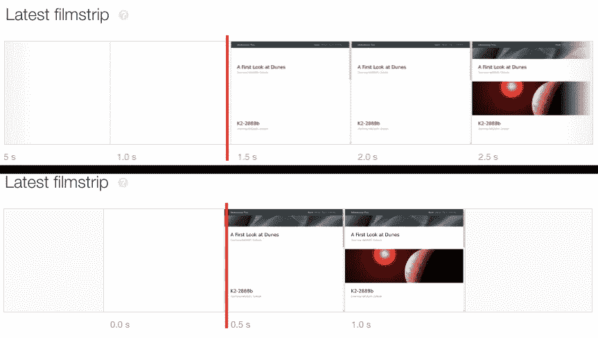

# 使用 cdn 的初学者指南

> 原文：<https://betterprogramming.pub/a-beginner-s-guide-to-using-cdns-3193cb8bd12e>

由 [Unsplash](https://unsplash.com/search/photos/speed?utm_source=unsplash&utm_medium=referral&utm_content=creditCopyText) 上的 [chuttersnap](https://unsplash.com/@chuttersnap?utm_source=unsplash&utm_medium=referral&utm_content=creditCopyText) 拍摄

## 用这个简单的工具提高你网站的速度

在过去的几年里，网站变得越来越大，越来越复杂，用户希望网站能够即时加载，即使是在移动设备上。最小的性能下降都会产生重大影响；页面加载时间仅仅减少[100 毫秒，转化率就会下降 7%](https://www.akamai.com/uk/en/about/news/press/2017-press/akamai-releases-spring-2017-state-of-online-retail-performance-report.jsp) 。竞争对手只需点击一下鼠标，希望吸引和留住客户的组织需要将 web 性能放在首位。一种相对简单的方法是使用内容交付网络(cdn)。

在这篇文章中，我们将解释 cdn 如何帮助[提高 web 性能](https://www.pingdom.com/solutions/web-performance-optimization-solution/)。我们将解释它们是什么，它们是如何工作的，以及如何在你的网站中实现它们。

# 什么是 CDN？

CDN 是一种分布式网络和存储服务，在全球不同的地理区域托管 web 内容。这些内容可以包括 HTML 页面、脚本、样式表、多媒体文件等等。这使您可以从 CDN 而不是自己的服务器提供内容，从而减少服务器处理的流量。

cdn 还可以充当您和您的用户之间的代理，提供负载平衡、防火墙、自动 HTTPS 等服务，甚至在您的源服务器离线时提供冗余(例如 [Cloudflare Always Online](https://www.cloudflare.com/always-online/) )。

# 我为什么要使用 CDN？

cdn 从您的服务器卸载流量，降低您的总体负载。它们还针对速度进行了优化，在许多情况下提供更快的性能，这可以提高你的 SEO 排名。由于 cdn 在位于世界各地的中心托管数据，它们实际上将您的内容移动到离您的用户更近的地方。这可以大大减少一些用户的延迟，并避免因数据中心中断或路线中断而导致的[停机](https://www.pingdom.com/topics/website-downtime-monitoring/)。

# cdn 是如何工作的？

CDN 由遍布全球的多个数据中心组成，称为存在点(pop)。每个 PoP 都能够为用户托管和提供内容。cdn 根据许多因素将用户路由到特定的 PoP，这些因素包括距离、PoP 可用性和连接速度。

PoP 充当用户和原始服务器之间的代理。当用户从您的网站请求资源(如图像或脚本)时，他们会被定向到 PoP。如果 PoP 缓存了资源，那么它将把资源交付给用户。

但是，如何将内容发送到您的 PoP 呢？使用两种方法中的一种:推或拉。推送需要你事先把你的内容发送到 CDN。这让你可以更好地控制 CDN 提供的内容，但如果用户请求你尚未推送的内容，他们可能会遇到错误。

拉取是一种自动化程度更高的方法，CDN 会自动检索尚未缓存的内容。当用户请求尚未缓存的内容时，CDN 会从您的原始服务器获取最新版本的内容。一段时间后，缓存的内容过期，CDN 会在下次请求时从原始位置刷新它。

# 我如何选择一个 CDN？

虽然 cdn 的工作方式基本相同，但它们在许多因素上有所不同，包括:

## 价格

大多数 cdn 根据使用的带宽量收费。有些还可能根据缓存命中(缓存提供的文件)、缓存未命中(从原点检索)和刷新的次数来收费。其他公司收取固定费用，并在一段时间内允许一定量的带宽。在比较 cdn 时，您应该估计您的带宽需求和预期增长，以找到最佳交易。

## 可用性和可靠性

cdn 努力实现 100%的正常运行时间，但完美的正常运行时间是无法保证的。考虑您的可用性需求以及每个 CDN 如何支持这些需求。此外，根据其 PoP 正常运行时间而非总体正常运行时间来比较 cdn，尤其是在您希望服务的地区。如果可能的话，验证你的 CDN 是否提供了回退选项，比如绕过关闭的 pop。

## PoP 位置(服务区域)

根据您的用户所在的位置，某些 pop 可以更有效地为您的用户服务。选择一个管理用户附近的 pop 的 CDN，否则你将错过 CDN 提供的许多性能优势。

# 如何将 CDN 添加到我的网站？

向您的网站添加 CDN 的过程取决于您的网站托管的位置和方式。我们将在下面介绍一些更常见的方法。

## 虚拟主机提供商

如果您的网站由 inMotion Hosting、HostGator 或 1&1 等提供商托管，您的提供商可能会提供 CDN 作为内置或额外的服务。例如， [Bluehost](https://my.bluehost.com/hosting/help/cloudflare) 免费提供 Cloudflare，并默认为所有计划启用。如果您的主机不明确支持 CDN，您仍然可以使用它，但它可能属于以下过程之一。

## 内容管理系统

像 WordPress 和 Squarespace 这样的内容管理系统(CMS)通常通过使用插件来支持 cdn。对于 WordPress， [Jetpack](https://jetpack.com/) 自动提供对自己 CDN 的支持。其他如 [W3TC](https://blog.cloudflare.com/w3-total-cache-w3tc-total-cloudflare-integrat/) 、 [WP 超级缓存](https://wordpress.org/plugins/wp-super-cache/)、 [WP 最快缓存](https://wordpress.org/plugins/wp-fastest-cache/)让你选择将用户定向到哪个 CDN。

## 自托管

你自己托管的网站在选择 CDN 方面提供了最大的灵活性。然而，它们也需要更多的设置。举个例子，让我们为一个托管在谷歌云平台(GCP)上的网站启用谷歌云 CDN。

此示例假设您拥有一个 GCP 帐户、一个在注册服务商处注册的域名，以及一个托管在 Compute Engine、App Engine 或其他 GCP 服务中的网站。如果你还没有 GCP 账户，[创建一个](https://console.cloud.google.com/)并登录[谷歌云控制台](https://console.cloud.google.com/)。

步骤 1:配置您的 DNS 记录

传统上，将用户路由到 CDN 的方法是将网站中的资源 URL 更改为指向 CDN 提供的 URL。大多数现代 cdn 通过管理你的 DNs 记录来避免这种情况，让你重定向用户而不需要改变你的网站。

要配置云 DNS，请查看[云 DNS 快速入门文档](https://cloud.google.com/dns/docs/quickstart)，并按照[创建托管公共区域](https://cloud.google.com/dns/docs/quickstart#create_a_managed_public_zone)的说明进行操作。还不要创建新记录或 CNAME 记录，因为我们还没有 DNS 记录指向的 IP 地址。在下面的截图中，我们为域*subdomain.mydomain.com*创建了一个名为 *mydomain 的新区域，例如*。

*在云 DNS 中创建 DNS 区域。2019 谷歌有限责任公司。保留所有权利。*

创建区域后，更新您的注册商的域设置以指向云 DNS 名称服务器。这将让您通过云 DNS 管理您的域名记录，而不是通过您的注册商。有关更多信息，请访问[上的云 DNS 文档页面更新您的域名服务器](https://cloud.google.com/dns/docs/update-name-servers)或参考您的注册服务商的文档。

第二步:启用云 CDN

配置好 DNS 后，我们现在需要启用 CDN 本身。对于云 CDN，必须选择一个负载均衡器作为源。如果你还没有负载均衡器，你可以按照这些[指南](https://cloud.google.com/load-balancing/docs/how-to)来创建一个。对于标准的 HTTP/S 网站，[请遵循本指南](https://cloud.google.com/load-balancing/docs/https/setting-up-https)获取具体说明。

创建好负载平衡器后，按照这些说明[为现有后端服务启用云 CDN。创建新原点后，从原点列表中选择它。您将需要显示在**前端**表中的 IP 地址来配置云 DNS，因此请确保您复制它或保持此窗口打开。下面的屏幕截图显示了一个示例云 CDN 源:](https://cloud.google.com/cdn/docs/using-cdn#enable_existing)

*查看云 CDN 中的原点详情。2019 谷歌有限责任公司。保留所有权利。*

检索您的前端 IP 地址后，返回到云 DNS 并选择您的区域。创建一个新的 A 记录，将域指向您的原始 IP 地址。您可以在云 DNS 快速入门文档页面上的[创建新记录](https://cloud.google.com/dns/docs/quickstart#create_a_new_record)下找到说明。这在下面的截图中显示。或者，您还可以创建一个 CNAME 记录来重定向来自子域的用户，例如[*www.yourdomain.com*。](http://www.yourdomain.com.)

*在云 DNS 中创建新的 DNS 记录集。2019 谷歌有限责任公司。保留所有权利。*

步骤 3:配置您的 web 服务器

为了确保您的内容被正确缓存，请确保您的 web 服务器使用正确的 HTTP 头来响应请求。云 CDN 只缓存[满足某些需求](https://cloud.google.com/cdn/docs/caching)的响应，其中一些是云 CDN 特有的。您将需要查看您的 web 服务器的文档，以了解如何设置这些头。 [Apache](https://cloud.google.com/cdn/docs/caching) 和 [Nginx](https://www.nginx.com/blog/nginx-caching-guide/https:/www.nginx.com/blog/nginx-caching-guide/) 提供了配置缓存的最佳实践指南。

步骤 4:将内容上传到 CDN

对于大多数网站运营商来说，你不需要做任何事情来上传内容。这是因为当人们访问你的网站时，CDN 会自动从你的服务器缓存资源。这也被称为“拉动方法”或者，谷歌确实允许你通过手动上传来推送你想要托管的特定内容。

# CDN 如何影响性能？

为了展示 CDNs 的性能优势，我们在 Google 云平台上的一个网站上运行了一个性能测试。该网站是一个静态的单页网站，由 [Bootstrap](https://startbootstrap.com/) 和[全幅图片](https://startbootstrap.com/template-overviews/full-width-pics/)模板创建，由 [NASA/JPL 加州理工](https://www.jpl.nasa.gov/spaceimages/)提供的七幅高分辨率图片组成。服务器是一个 Google 计算引擎实例，位于 us-east1-b 地区，运行 Nginx 1.10.3。

我们将实例配置为允许直接传入 HTTP 流量。我们还为该实例设置了 Google Cloud CDN。您可以使用瀑布图在下面看到该网站的网页和联网时间的截图。

*使用 Chrome DevTools 的测试站点的瀑布图。2019 谷歌有限责任公司。保留所有权利。*

然后，我们使用网络安全管理软件产品 Pingdom 运行了一个性能测试。Pingdom 提供了一个[页面速度测试](https://www.pingdom.com/product/page-speed/),用于测量获取和呈现 web 页面的每个元素所需的时间。我们创建了两个独立的检查来分别测试原始服务器和 CDN，然后比较结果，看哪种方法更快。为了最大化延迟，我们从 Pingdom Eastern Asia 位置运行了这两个检查。

## 原始结果

在原始服务器上运行速度测试的结果是页面加载时间为 3.68 秒。从服务器下载第一个字节的时间(显示为蓝线)是 318 毫秒，这意味着用户在他们的设备开始接收内容之前必须等待三分之一秒。渲染页面(用橙色线表示)需要额外的 679 毫秒，这意味着用户必须等待几乎整整一秒才能看到屏幕上的任何内容。当页面完成呈现(绿线)时，用户已经等待了超过 3.5 秒。

这种延迟主要是由于下载高分辨率图像，但是连接到服务器并等待内容开始传输花费了大量时间。

连接到我们的测试源服务器时的页面加载时间线。

## CDN 结果

有了 CDN，我们立即看到了加载时间的显著改善。整个页面的加载只需 1.04 秒，比原始服务器快了两秒多。最显著的变化是第一个字节(蓝线)的时间，它下降到只有 7 毫秒。这意味着我们的用户在连接到 CDN 后几乎立即开始接收内容。

*连接谷歌云 CDN 时页面加载时间线。*

虽然 DOM 内容加载时间(橙色线)没有显著改善，但是连接和等待时间显著下降。我们还看到，在页面加载 0.5 秒后，内容就开始出现在页面上。我们可以通过查看电影片段来确认这一点，电影片段显示了页面在加载过程中各个点的截图。相比之下，源服务器开始呈现内容需要 1.5 秒。

*比较有 CDN(下图)和没有 CDN(下图)的页面渲染时间。*

# 结论

cdn 提供了显著的性能提升，而无需组织付出太多努力。最大的挑战是找到选择哪家 CDN 提供商。如果你不确定哪家提供商对你最有利，[我们对四家最受欢迎的提供商进行了基准测试](https://royal.pingdom.com/benchmarking-cdns-cloudfront-cloudflare-fastly-and-google-cloud/) (Cloudflare、Fastly、AWS CloudFront 和 Google CDN)。虽然性能在每个提供商的生存能力中起着重要作用，但我们也鼓励您考虑 CDN 提供的额外功能、安全性和集成。

设置好 CDN 后，您可以使用网络安全管理软件产品 Pingdom 检查性能差异。除了运行一次性测试，您还可以使用 Pingdom 安排定期检查，以确保您的网站始终以最佳状态运行。此外，您可以使用 Pingdom 持续监控网站的可用性和易用性。