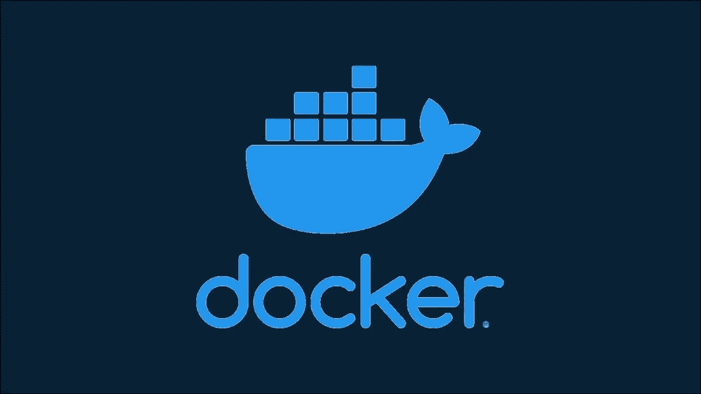
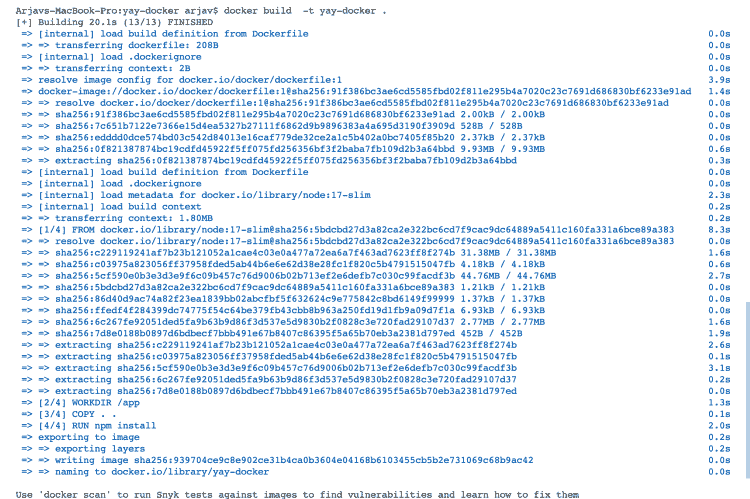
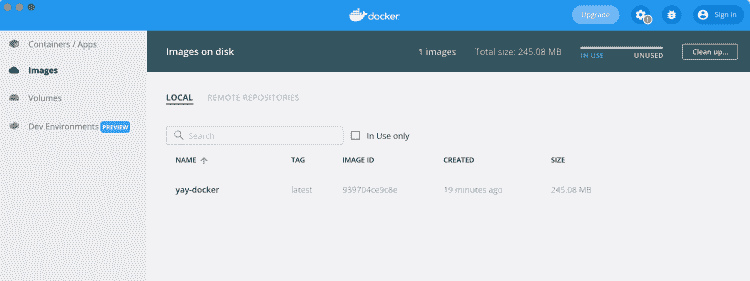
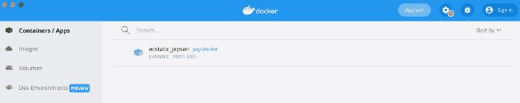

# 码头工人初学者备忘单

> 原文：<https://betterprogramming.pub/a-beginners-cheat-sheet-for-docker-f5024fd6c17f>

## 了解什么是 docker 以及如何使用它



# Docker 是什么？

Docker 的流行有多种原因，其中之一是创建了快速且易于部署的便携容器。正如他们的[网站](https://www.docker.com/resources/what-container/)上提到的，一个容器将你的代码和任何其他依赖项打包在一起，这样它就可以可靠地跨多个平台部署。这些容器可以在你的 Windows，Mac & Linux 上本地运行。其次，像 AWS 或 Azure 这样的主要云系统确实支持开箱即用。最后，它可以在任何可以安装和运行它的托管空间上使用。

容器是 docker 的组成部分。在这篇博客中，我们将浏览帮助我们操作和创建容器的各种命令。当我们浏览每个命令时，你会对 docker 的工作原理有更好的理解。所以让我们坚持到底。

# 先决条件

*   您的系统应该预装了 docker。你可以在这里找到下载链接: [Windows](https://docs.docker.com/desktop/windows/install/) 或者 [Mac](https://docs.docker.com/desktop/mac/install/) 。

# 入门指南

执行以下命令来验证 docker 安装:

```
docker --version
```

它将打印已安装的版本。现在，我们将创建一个非常基本的 Node.js 应用程序来进行容器化。

创建一个名为 yay-docker 的文件夹。其次，创建两个名为 server.js 和 package.json 的文件，如下所示:

`package.json`:

```
{
 "name": "yay-docker",
 "dependencies": {
  "express": "^4.17.1"
 }
}
```

`server.js`:

```
const server = require("express")();
server.listen(8080, async () => { });
server.get("/yay-docker", async (_, response) => { 
  console.log('Request Received for yay-docker');
  response.json({ "yay": "docker" });
});
```

为了创建容器，我们首先需要创建如下所示的“Dockerfile ”:

`Dockerfile`:

```
# Download the slim version of node
FROM node:17-slim# Set the work directory to app folder. 
# We will be copying our code here
WORKDIR /app#Copy the contents of our project in the app folder inside container
COPY . .# Install the dependencies in the container
RUN npm install# Run the node server with server.js file
CMD ["node", "server.js"]# Expose the service over PORT 3000
EXPOSE 3000
```

这是我们的基本设置，我们将从中创建一个图像，并将其作为一个容器运行。

# 基本 Docker 命令

我们将会看到 docker 的以下功能。为此，从终端或命令提示符导航到您的项目目录。

*   [创建图像](https://arjavdave.com/2022/04/12/docker-introduction-and-cheat-sheet/#create-an-image)
*   [将图像作为容器运行](https://arjavdave.com/2022/04/12/docker-introduction-and-cheat-sheet/#run-image-as-container)
*   [列出容器](https://arjavdave.com/2022/04/12/docker-introduction-and-cheat-sheet/#list-containers)
*   [集装箱日志](https://arjavdave.com/2022/04/12/docker-introduction-and-cheat-sheet/#container-logs)
*   [进入集装箱](https://arjavdave.com/2022/04/12/docker-introduction-and-cheat-sheet/#entering-the-container)
*   [奖励命令](https://arjavdave.com/2022/04/12/docker-introduction-and-cheat-sheet/#bonus-commands)

# 创建一个图像

```
docker build -t yay-docker .
```

运行上面的命令开始创建项目的图像。这里， *yay-docker* 是您想要创建的图像的名称。它将启动多层下载 [*节点:17-slim*](https://hub.docker.com/_/node) 图像。一旦完成，它将运行`npm install`从你的`package.json`文件中安装依赖项，如 *express* 。下面是成功运行该命令后的屏幕截图。



该图像也可以在 Docker 桌面软件中看到，如下图所示。



# 将图像作为容器运行

```
docker run -p 3000:8080 -d yay-docker
```

上面的命令将简单地运行名为 *yay-docker* 的映像。3000 是集装箱的端口号。而 8080 是在我们的容器中运行的节点应用程序的端口号。您可以在 docker 桌面应用程序中查看容器列表，如下图所示。



为了测试你的容器是否运行成功，在你的浏览器上打开`[http://localhost:3000/yay-docker](http://localhost:3000/yay-docker)`。将显示一个漂亮的 JSON 文本`{“yay”:”docker”}`。恭喜你！您已经成功运行了您的第一个容器。

# 列出容器

```
docker ps -a
```

如果在本地运行，Docker Desktop 会显示容器列表。但是如果需要通过命令行查看，您可以使用上面的命令。它将列出所有容器以及容器 id、正常运行时间和状态。容器 id 用于操作容器，我们将在下面看到

# 集装箱日志

```
docker logs <container-id>
```

如果您想在控制台中看到您的应用程序正在打印什么呢？上面的命令正是这样做的。它打印你的容器的日志。

在上面的命令中，用容器列表中的 id 替换`<container-id>`。你可以在日志中看到一行写着*“yay-docker”*的请求已收到。这通常有助于在云上调试任何错误或检查控制台日志。

# 进入集装箱

```
docker exec -it <container-id> /bin/sh
```

有时你想进入集装箱收集信息。例如查看日志文件。使用上面的命令可以很容易地做到这一点。您可以键入`ls` 命令来查看容器的`/app`目录中的列表文件，并根据需要操作容器。

输入`exit` 命令退出容器。

# 奖励命令

**启动容器**

```
docker start <container-id>
```

**停止容器**

```
docker stop <container-id>
```

**取出容器**

```
docker rm <container-id>
```

# 从这里去哪里

希望您已经很好地理解了 Docker 是什么，以及如何将您的应用程序容器化以获得更好的稳定性。当第 2 部分正在编写时，你可以访问[官方文档](https://docs.docker.com/engine/reference/commandline/docker/)来了解更高级的特性集。

你可以把整个项目放在我的 Github 账户上:[https://github.com/shenanigan/yay-docker](https://github.com/shenanigan/yay-docker)