# 数据分析入门指南(第 2 部分)

> 原文：<https://betterprogramming.pub/a-beginners-guide-to-analyzing-data-part-two-5bb5d7e2f728>

## 数据分析初学者指南的第二部分，也是最后一部分


艾萨克·史密斯在 [Unsplash](/s/photos/data-graphs?utm_source=unsplash&utm_medium=referral&utm_content=creditCopyText) 上拍摄的照片

本文是我关于如何分析数据的两部分系列的第二部分。本指南的主要目标是在 [Matplotlib](https://matplotlib.org/) 中教授和使用一些基本但有用的技术，这些技术将允许您可视化您的数据集。在我们开始之前，我强烈建议您务必阅读我的系列文章的第一部分[，否则您可能没有一些正确的工具来完成本文中的任务。](https://medium.com/better-programming/a-newbies-guide-to-analyzing-data-part-one-33e88a41884e)

# 目标

*   Matplotlib 简介
*   学习一些基本的绘图技术
*   可视化我们的数据集
*   回顾我们完成的和学到的内容
*   未来有用的资源

# Matplotlib 简介

Matplotlib 是一个 Python 软件库，主要用于数据可视化。有了 Matplotlib，我们可以毫不费力地绘制数据集的详细图(如直方图、散点图、三维图等等)。我们开始探索吧！


[M. B. M.](https://unsplash.com/@m_b_m?utm_source=unsplash&utm_medium=referral&utm_content=creditCopyText) 在 [Unsplash](/s/photos/graph?utm_source=unsplash&utm_medium=referral&utm_content=creditCopyText) 上拍摄的照片

首先，我们必须安装 Matplotlib。我将使用终端和 pip，但这不是安装它的唯一方法。如果你在这方面有困难，这篇文章会帮助你。

当在终端中执行时，下面的行将开始安装 Matplotlib:

```
python -m pip install -U matplotlib
```

现在我们已经安装了 Matplotlib，我们可以跳回到 [JupyterLab](https://jupyterlab.readthedocs.io/en/stable/) 并开始可视化我们的 SAT 分数数据集。我计划在本文中使用 Python 2，所以如果您使用 Python 3，请注意 Python 2 和 Python 3 语法可能产生的错误。

我们还应该导入 Matplotlib 库，以便使用其有用的方法和函数。

```
import matplotlib.pyplot as plt
```

# 学习一些基本的绘图技术

在我们开始使用 SAT 分数数据集进行实验之前，我们应该回顾一下 Matplotlib 中的一些基本绘图技术。大部分信息都很基础，不会很难掌握。然而，当您想要可视化数据集时，这些是您必须熟悉的一些基本技术。请记住，我在本节中使用的标签和用法完全是我自己想出来的。

## 线形图

你应该知道的第一个基本绘图技术是 [plot()函数](https://matplotlib.org/api/_as_gen/matplotlib.pyplot.plot.html)。这个函数本质上是用你输入的点创建一个线图。例如，尝试编写以下代码:

```
plt.plot([1, 2, 3, 4, 5], [6, 7, 8, 9, 10])
```

您的输出应该如下所示:

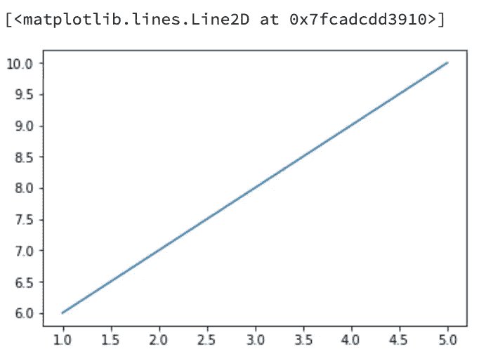

我们也可以重新命名标题，*x*-轴，*y*-轴:

```
plt.title('matplotlib Demonstration')
plt.xlabel('Small Numbers')
plt.ylabel('Big Numbers')
```

现在，您的线图应该有一些轴标签和一个标题:

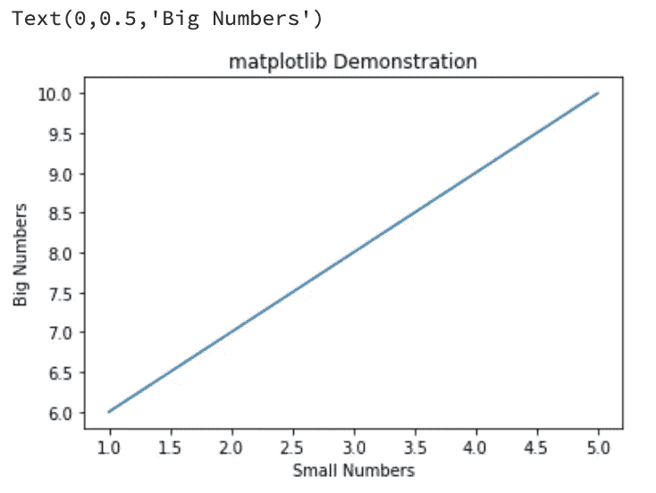

## 条形图

下一个有用的绘图方法叫做 [bar()方法](https://matplotlib.org/3.2.1/api/_as_gen/matplotlib.pyplot.bar.html)。这个方法的工作是使用您提供的数据构建一个条形图。条形图的关键特征是它能够在其一个轴上显示分类数据。例如，尝试执行以下代码:

```
plt.bar(['Audi', 'BMW', 'Jeep', 'Ford', 'Tesla'], [3, 7, 3, 20, 10])
```

您的输出应该如下所示:

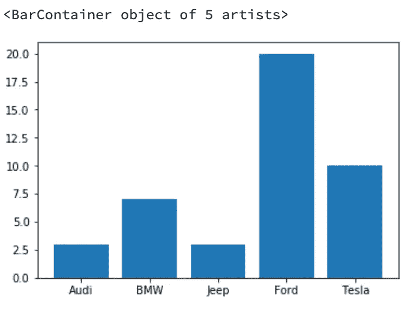

我们还可以更改标题，*x*-轴和*y*-轴标签:

```
plt.title('matplotlib Demonstration')
plt.xlabel('Car Brands')
plt.ylabel('Number of Customers')
```

这是我最后的条形图:

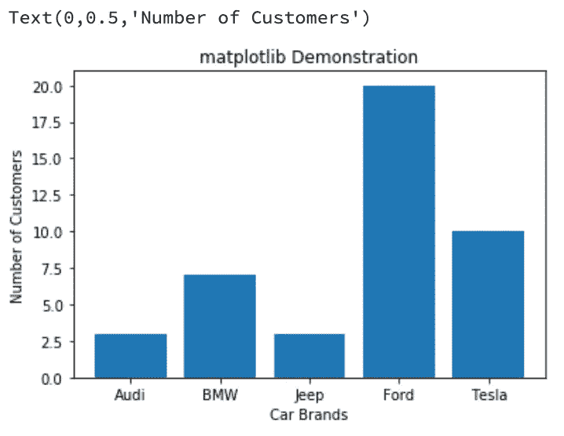

## 柱状图

Matplotlib 中另一个有用的绘图方法是 [hist()函数](https://matplotlib.org/3.2.1/api/_as_gen/matplotlib.pyplot.hist.html)。该函数的作用是为您输入的数据绘制直方图。尽管条形图和直方图看起来相似，但它们之间有一个关键的区别:直方图使用定量数据的区间/组，而条形图使用分类变量。要在 Matplotlib 中看到这一点，请运行以下代码行:

```
plt.hist([1, 2, 3, 3, 5, 5, 4, 3, 3, 4, 3, 2, 2, 3, 2.3, 3.2, 3.1, 2.3, 3.7, 3.6], bins=5)
```

我们的直方图应该是这样的:

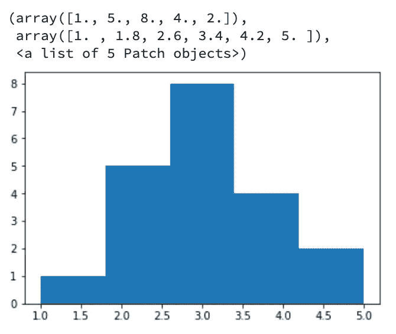

让我们标记标题和轴:

```
plt.title('matplotlib Demonstration')
plt.xlabel('Test Scores')
plt.ylabel('Frequency')
```

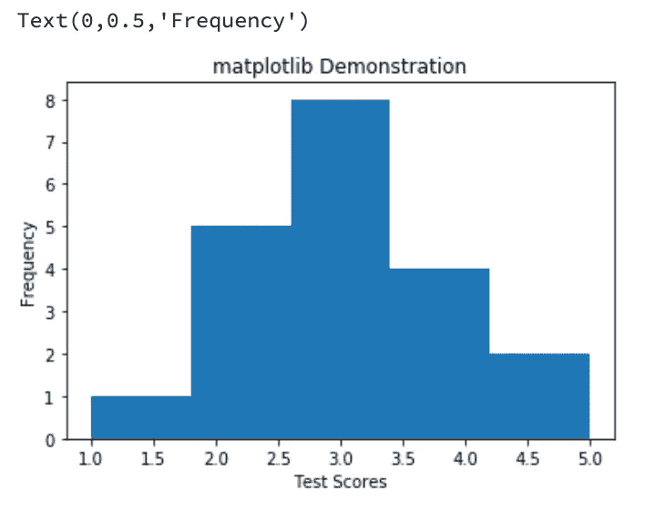

不幸的是，这并不是 Matplotlib 中 hist()函数的最佳示例，但是一旦我们可视化了 SAT 分数数据集，我们就可以更好地了解直方图及其用途。

## 散点图

在进入本指南的下半部分之前，你应该知道的最后一个方法是 [scatter()方法](https://matplotlib.org/3.1.1/gallery/shapes_and_collections/scatter.html)。散点图向我们展示了两个定量变量之间的关系。该图对于可视化数据集至关重要。让我们使用下面的命令在 Matplotlib 中创建一个散点图:

```
plt.scatter([1,2,3,4,5,6], [6, 5,4,3,2,1])
```

我们的输出应该如下所示:

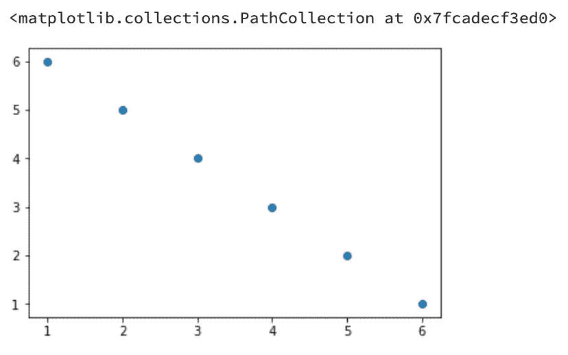

此外，我将重命名散点图的标签:

```
plt.title('matplotlib Demonstration')
plt.xlabel('House Price')
plt.ylabel('Area of House (in square feet)')
```

这是我最终的散点图:

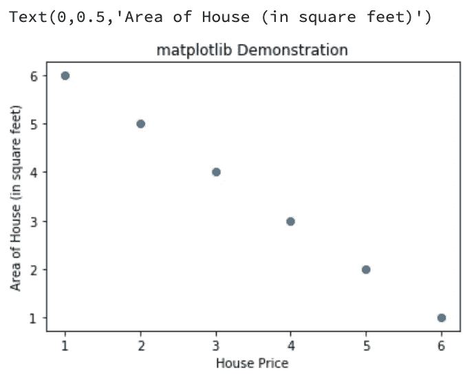

同样，所有这些数据都是虚构的，但从这些数据中，我们可以观察到房屋面积(以平方英尺为单位)和房价呈负相关(或逆相关)。厉害！我们可以开始使用我们在本节中学到的一些图来可视化我们的 SAT 分数数据集。

# 可视化我们的数据集

如果您还没有，请确保导入正确的库并从 data.gov 的[读取您的 CSV 数据集。下面几行将完成我们想要的任务:](https://www.data.gov/)

```
import pandas as pd
import matplotlib.pyplot as plt
data = pd.read_csv('sat.csv')
```

让我们看看数据的一些部分(或列)是如何组织的。使用 hist()函数，我们可以可视化数据集中每个单独列的分布。例如，如果我们想要查看我们的考生数量的分布，我们可以执行下面一行代码:

```
data['Number of Test Takers'].hist()
plt.xlabel('Number of Test Takers')
plt.ylabel('Occurence')
plt.title('Number of Test Takers per School in New York City')
```

输出应该如下所示:

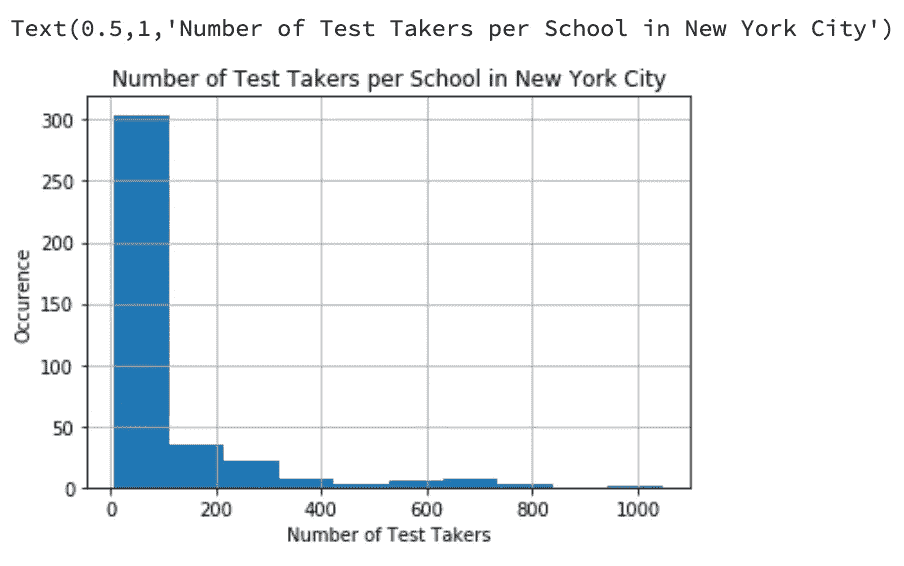

为了使这个直方图更加精确和有用，我将添加`bins = 40`来通知计算机我希望我的数据被分成多少个区间。

```
data['Number of Test Takers'].hist(bins = 40)
plt.xlabel('Number of Test Takers')
plt.ylabel('Occurence')
plt.title('Number of Test Takers per School in New York City')
```

这是我的输出结果:

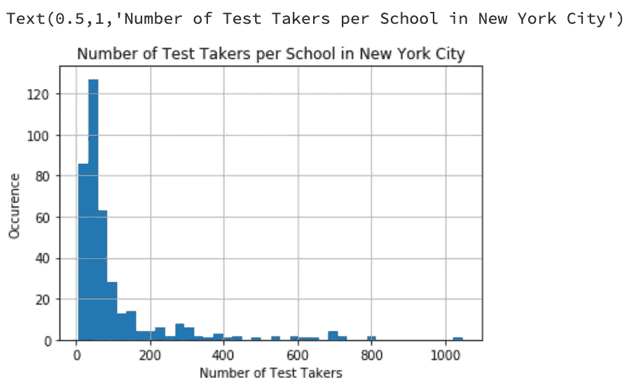

酷！我们可以通过可视化这些数据进行一些即时观察。我们可以看到，数据集中的考生人数向右倾斜。使用我们的统计学知识，如果我们的数据向右倾斜，那么我们的平均考生人数大于平均考生人数。

我们可以在 Pandas 中使用`data.describe()`和[中值()函数](https://pandas.pydata.org/pandas-docs/stable/reference/api/pandas.DataFrame.median.html)来证实这一点:

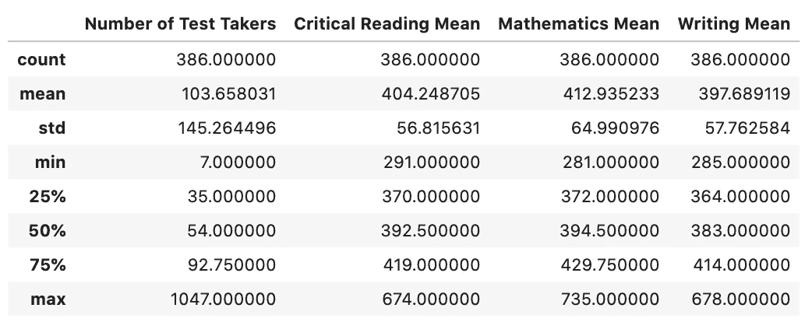

```
data['Number of Test Takers'].median()
```

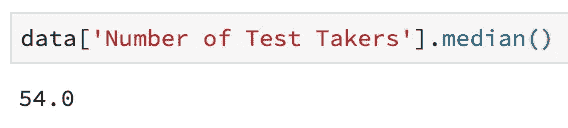

正如你所看到的，考生人数的平均值大约是 103.66，而中位数只有 54.0，正如我们所预期的。统计学是不是很牛逼？好像我们在预测未来！

看看您是否可以对我们数据集中的其他类别(或列)执行我刚才执行的相同过程(绘制、预测和验证)。

接下来，让我们弄清楚一些列变量之间的相关性。在我们开始之前，问问你自己我们应该用什么样的情节来做这件事。没错，我们要用散点图，因为散点图可以告诉我们两个定量变量的相关性。例如，让我们试着找出数学平均值和批判性阅读平均值之间的相关性。

```
plt.scatter(data['Mathematics Mean'], data['Critical Reading Mean'])
plt.xlabel('Mathematics Mean')
plt.ylabel('Critical Reading Mean')
plt.title('Mathematics Mean vs. Critical Reading Mean per School in NYC')
```

您的输出应该如下所示:

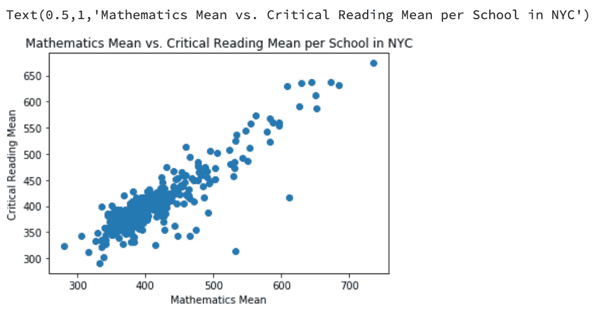

我们可以立即看出，批判性阅读平均数和数学平均数之间有很强的正相关关系。这里和那里有一些异常值，但是大多数数据看起来非常线性。仔细想想，这是有道理的。学术实力强的学校不会只关注 SAT 的一个科目，而是关注 SAT 的所有科目，以获得最高分。

我们画出批判性阅读和写作的方法怎么样？运用直觉，在你绘制它之前，试着想象它是什么样子。一旦你完成了，创建一个这两个类别的散点图。

```
plt.scatter(data['Writing Mean'], data['Critical Reading Mean'])
plt.xlabel('Writing Mean')
plt.ylabel('Critical Reading Mean')
plt.title('Writing Mean vs. Critical Reading Mean per School in NYC')
```

您应该得到与此类似的东西:

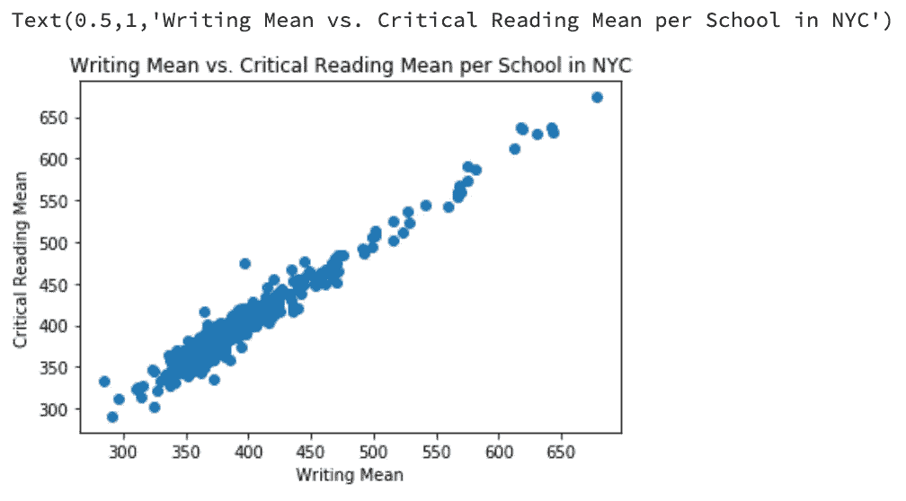

哇哦。批判性阅读意义和写作意义之间有很强正相关关系。在我看来，在这个散点图中没有异常值(尽管对某些人来说可能有争议)。让我们集思广益，找出两个可能解释我们所看到的现象的原因。第一个原因类似于第一个散点图:学术实力强的学校关注并练习 SAT 的所有科目。第二个原因是擅长阅读的学生擅长写作，反之亦然。这是因为阅读和写作更紧密地联系在一起，而不是数学。

既然我们已经在真实世界的数据集上使用了我们所学的一些知识，那么是时候让您自己进行实验了。去 data.gov，给自己找一个数据集，然后用它做实验。看看你是否能对你的数据进行观察。有很多有趣的数据集通过它们的数据讲述一个故事。

# 回顾我们完成的和学到的内容

1.  安装了 Anaconda-Navigator、pandas 和 Matplotlib
2.  熟悉了木星实验室的环境
3.  在熊猫中学到了一些简单的数据结构:序列和数据帧
4.  使用并学习了熊猫对数据集进行清洗、操作和可视化的函数: [read_csv()函数](https://pandas.pydata.org/pandas-docs/stable/reference/api/pandas.read_csv.html)、 [head()函数](https://pandas.pydata.org/pandas-docs/stable/reference/api/pandas.DataFrame.head.html)、 [describe()函数](https://pandas.pydata.org/pandas-docs/stable/reference/api/pandas.DataFrame.describe.html)、 [median()函数](https://pandas.pydata.org/pandas-docs/stable/reference/api/pandas.DataFrame.median.html)、 [info()函数](https://pandas.pydata.org/pandas-docs/stable/reference/api/pandas.DataFrame.info.html)、 [dropna()函数](https://pandas.pydata.org/pandas-docs/stable/reference/api/pandas.DataFrame.dropna.html)、[。loc[]功能](https://pandas.pydata.org/pandas-docs/stable/reference/api/pandas.DataFrame.loc.html)或[。iloc[]函数](https://pandas.pydata.org/pandas-docs/stable/reference/api/pandas.DataFrame.iloc.html)、 [sort_values()函数](https://pandas.pydata.org/pandas-docs/stable/reference/api/pandas.DataFrame.sort_values.html)和 [rename()函数](https://pandas.pydata.org/pandas-docs/stable/reference/api/pandas.DataFrame.rename.html)
5.  使用 Matplotlib 及其方法可视化一个数据集: [plot()函数](https://matplotlib.org/api/_as_gen/matplotlib.pyplot.plot.html)， [xlabel()函数](https://matplotlib.org/3.1.1/api/_as_gen/matplotlib.pyplot.xlabel.html)， [ylabel()函数](https://matplotlib.org/3.1.1/api/_as_gen/matplotlib.pyplot.ylabel.html)， [title()函数](https://matplotlib.org/3.1.1/api/_as_gen/matplotlib.pyplot.title.html)， [bar()方法](https://matplotlib.org/3.2.1/api/_as_gen/matplotlib.pyplot.bar.html)， [hist()函数](https://matplotlib.org/3.2.1/api/_as_gen/matplotlib.pyplot.hist.html)，[散点()方法](https://matplotlib.org/3.1.1/gallery/shapes_and_collections/scatter.html)
6.  从数据集中得出逻辑观察和结论

非常感谢您关注我们的两部分系列。我们学到了很多新东西，希望这能让你对数据分析有所了解。一如既往，如果你有任何问题，请在下面留下。

# 未来有用的资源

[](https://www.datacamp.com/community/blog/python-pandas-cheat-sheet) [## Python 中数据科学的熊猫备忘单

### 熊猫图书馆是数据科学家进行数据操作和分析的最受欢迎的工具之一，仅次于…

www.datacamp.com](https://www.datacamp.com/community/blog/python-pandas-cheat-sheet) [](https://www.datacamp.com/community/blog/python-matplotlib-cheat-sheet) [## (备忘单)Matplotlib:用 Python 绘图

### 数据可视化和用数据讲述故事是每个数据科学家需要交流的基本技能…

www.datacamp.com](https://www.datacamp.com/community/blog/python-matplotlib-cheat-sheet) [](https://legacy.tapclicks.com/resources/blog/the-ultimate-guide-to-data-visualization/) [## 数据可视化的终极指南:图表、图形以及点击鼠标之间的一切

### 如果做得好，视觉数据应该讲述一个故事。与纯文本不同，数据可视化需要复杂的信息和…

legacy.tapclicks.com](https://legacy.tapclicks.com/resources/blog/the-ultimate-guide-to-data-visualization/)