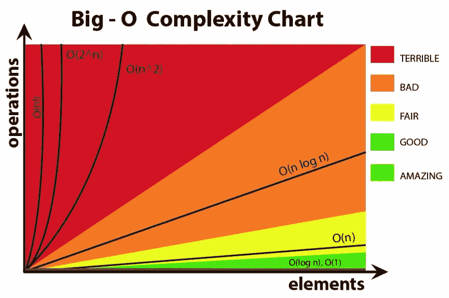
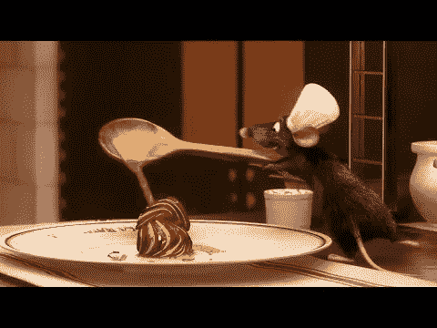
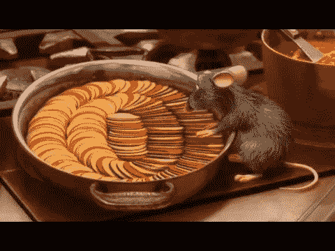

# 大 O 符号初学者指南(第 1 部分)

> 原文：<https://betterprogramming.pub/a-beginners-guide-to-big-o-notation-pt-1-19ec031b698b>

## 借助《料理鼠王》介绍时间复杂性

当我们编写代码时，理解我们对代码的选择如何影响我们正在创建的程序的速度和性能是很重要的。大 O 符号是一种对算法的运行时间/操作数或空间相对于输入`n`增加的速度进行分类的方法。它着眼于最坏的情况，假设在编写算法时触及了所有可能的元素。

在 Big O 符号中有七个分类，从奇妙的、快速的和/或节省空间的解决方案(不管输入大小如何都保持不变)到绝对糟糕的*请不要使用这些*解决方案！



了解不同的数据结构和算法如何适应这种大的复杂性梯度，可以帮助您选择正确的数据结构和算法，并在工作中优化您的代码——或者在技术编码面试中。

# O(1)常数时间

让我们假设你是厨师雷米，你被要求做你的世界著名的杂烩。



好吃！图片来源:皮克斯

你要做的第一件事是收集配料、香料和香草来准备这道菜。厨房是你的第二个家，你知道在哪里可以找到你需要的一切:

```
let kitchen = {
    vegetables: {
        broccoli: {name: "broccoli", ...}, 
        zucchini: {name: "zucchini", ...}, 
        eggplant: {name: "eggplant", ...}, 
        carrot: {name: "carrot", ...}, 
        squash: {name: "squash", ...}, 
        tomato: {name: "tomato", ...}, 
        radish: {name: "radish", ...}, 
        cabbage: {name: "cabbage", ...}, 
        redPepper: {name: "redPepper", ...}
    },
    seasoning: {
        onion: {name: "onion", ...}, 
        garlic: {name: "garlic", ...}, 
        basil: {name: "basil", ...}, 
        oregano: {name: "oregano", ...}, 
        herbesDeProvence: {name: "herbesDeProvence", ...}, 
        sage: {name: "sage", ...}, 
        ginger: {name: "ginger", ...}
    }
}
```

你不需要厨房里的所有东西来做这道菜——西兰花和生姜毕竟不属于《料理鼠王》!️:相反，你只拿你需要的配料，就像这样:

```
let ingredients = []ingredients.push(kitchen.vegetables.zucchini.name)
ingredients.push(kitchen.vegetables.eggplant.name)
ingredients.push(kitchen.vegetables.squash.name)
ingredients.push(kitchen.vegetables.tomato.name)
ingredients.push(kitchen.vegetables.redPepper.name)ingredients.push(kitchen.seasoning.onion.name)
ingredients.push(kitchen.seasoning.garlic.name)
ingredients.push(kitchen.seasoning.herbesDeProvence.name)// ingredients = ["zucchini", "eggplant", "squash", "tomato", "redPepper", "onion", "garlic", "herbesDeProvence"]
```

这些操作的最大 O 符号时间复杂度是多少？🤔

这些操作中的每一个(抓取配料，将其推入`ingredients`数组)都需要恒定的时间，即 O(1)。操作的数量不会随着数组的大小或厨房对象的大小而增加。我们可以直接访问每个元素来获取我们所需要的，所以时间复杂度不会改变。

这是另一个例子:

```
function addDigitsUpToNumber(n) {
    return n * (n + 1) / 2
}addDigitsUpToNumber(5) // 15, same as 1 + 2 + 3 + 4 + 5 = 15
```

在这个函数中，我们将从 1 到`n`的所有数字相加，并使用快速数学技巧返回总和。该函数也具有 O(1)时间复杂度，因为无论`n`是等于 5、10、1，000 还是 1，000，000，000，000，它都需要完全相同的运算次数。

# O(n)线性时间

要开始准备炖菜，你首先要切碎配料:

```
let ingredients = ["zucchini", "eggplant", "squash", "tomato", "redPepper", "onion", "garlic", "herbesDeProvence"]function chop(ingredients) {
    for (let i = 0; i < ingredients.length; i++) {
        console.log(`${ingredients[i]} has been chopped!`)
    } 
}
```

我们的`chop`函数需要多长时间才能完成？更好的是，需要进行多少次操作？🤔

因为在我们的`ingredients`数组中有七个元素，并且该函数遍历每个元素一次(在我们进行的过程中进行斩波)，我们可以说需要进行七次操作(O(7))。如果我们向数组中添加额外的`n`元素，这个函数将会执行`n`操作，因为它需要接触这些元素中的每一个元素一次，也就是 O(n)。

O(n)时间复杂度也被称为*线性时间* ，通常被认为是一种高效的解决方案。它不如 O(1)或 O(log n)好或快，我们将在后面讨论，但通常这种时间复杂度被认为是可以接受的。

如果我们添加另一个迭代会发生什么？毕竟那些杂烩食材需要在烤箱里烤！



图片来源:皮克斯

```
let ingredients = ["zucchini", "eggplant", "squash", "tomato", "redPepper", "onion", "garlic", "herbesDeProvence"]function chop(ingredients) {
    for (let i = 0; i < ingredients.length; i++) {
        console.log(`${ingredients[i]} has been chopped!`)
    }
}function roast(ingredients) {
    for (let i = 0; i < ingredients.length; i++) {
        console.log(`${ingredients[i]} has been roasted!`)
    }
}function makeRatatouille(ingredients) {
    chop(ingredients)
    roast(ingredients)
}
```

我们的`makeRatatouille`函数需要迭代所有的成分两次:第一次在`chop`函数中，然后再次在`roast`函数中。我们可以说这个函数需要 O(2n)时间，因为它将遍历配料数组两次。

这个函数的时间复杂度仍然与`n`成比例增长，所以我们将删除任何常数(在这个例子中是数字 2)并将它称为 O(n)，就像以前一样。例如，即使这个函数有得出 O(4n + 20)的额外操作，我们仍然会将其简化为 O(n)，因为在大 O 符号中，c *常量和更小的操作不计算在内。*

# O(n)次时间

作为厨师雷米，你会听到著名的餐馆评论家(也是臭名昭著的坏脾气者)柯博先生第一次来评判你的食物。呀！😰


图片来源:皮克斯

他只会接受最好的，所以你决定整理所有切碎的蔬菜，为他的炖菜找到最好的。让我们假设每个部分都有一个从 1 到 n 的等级，1 表示最好的部分，n 表示最差:

```
let zucchiniSlices = [20, 11, 25, 3, 14, 5,...]function sortByBestSlices(veggieSlices) {
    for (let i = 0; i < veggieSlices.length; i++) {
        for (let j = 0; j < veggieSlices.length; j++) {
            if (veggieSlices[i] < veggieSlices[j]) {
                let temp = veggieSlices[i];
                veggieSlices[i] = veggieSlices[j];
                veggieSlices[j] = temp;
            }
        }
    }
    return veggieSlices
}sortByBestSlices(zucchiniSlices)
```

这个函数的时间复杂度非常糟糕。这里我们看的是 O(n)，也称为*二次时间* ，因为我们有一个嵌套的`for`循环情况。在这个函数中，我们遍历我们的`veggieSlices`数组中的每一个片，一个接一个地与所有其他片进行比较，就像`n * n`一样。如果阵列有 30 个切片，我们将有 30 x 30 次操作(900)。如果我们有 100 个切片，以这种方式排序将需要 10，000 次操作！

运行时间可能会增长得相当快——柯博先生正等着吃饭呢！难道没有一种更有效的排序方法，对运行时影响更小吗？

当然有！

有很多算法比 O(n)快得多，比如运行时间为 O(log n)和 O(n log n)的算法。我们将在本系列的第 2 部分中探讨这些问题。

与此同时，让我们为柯博先生再倒一杯酒，希望他保持耐心。🍷敬请期待！


图片来源:皮克斯

更新:查看第 2 部分，我们将深入探讨 O(log n)、O(n log n)、O(2^n)和 O(n！)[这里](https://medium.com/swlh/a-beginners-guide-to-big-o-notation-part-2-c4ede76cea36)！