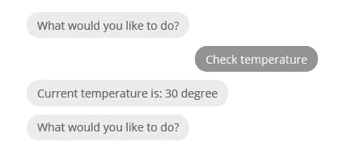
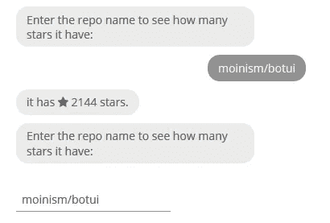
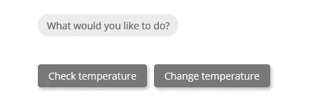
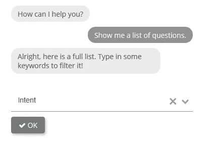

# 聊天机器人 ui 的 Botui 框架初学者指南

> 原文：<https://betterprogramming.pub/a-beginners-guide-to-botui-framework-for-chatbot-ui-a4e6d9a4a74>

## 使用 JavaScript 框架为聊天机器人创建自己的对话式用户界面


使用 BotUI 框架创建的一个 web 应用程序的屏幕截图

这篇文章涵盖了为聊天机器人构建一个简单的前端 UI 的基本步骤。首先，Botui 是一个基于 Vue 的 Javascript 框架，用于创建对话式 ui。它有一个直观、易于调用的 API 来添加消息和显示用户可以执行的操作。您可以在几个小时内轻松构建一个简单的聊天机器人 UI。让我们来看看下面使用 Botui 框架的例子:

*   🌡️ [恒温机器人](http://examples.botui.org/thermostat-bot/):一个简单的机器人来检查和改变当前温度。作为基于智能家庭的应用。



恒温机器人

*   ⭐ [Git Stars Bot](http://examples.botui.org/git-stars-bot/) :一个找出 Github 库的总星级数的机器人。



Git Stars 机器人

*   📝[提醒机器人](http://examples.botui.org/reminder-bot/):询问并为你添加提醒的机器人。这个版本不跟踪提醒。


提醒机器人

*   ✉️ [送货机器人](http://examples.botui.org/delivery-bot/):确认送货地址的机器人。


送货机器人

下面的[库](https://github.com/botui/botui-examples)包含上面给出的例子的源代码。完成教程后，请随意测试它们。本教程包含三个部分:

1.  设置和安装
2.  基本 API 调用
3.  结论

# 设置和安装

如官方[指南](https://docs.botui.org/install.html)所述，有四种方法可以安装 Botui 框架:

1.  使用内容交付网络(CDN)
2.  NPM 安装
3.  使用网络包
4.  本地下载

在本教程中，我将使用 CDN 方法，因为它是所有方法中最简单的，不需要下载或配置任何文件。官方指南提供的步骤有点混乱，它为相同的文件提供了不同的链接。我将要分解的共有四个重要文件:

**基本布局**

第一个文件是基本布局的 CSS 文件。有两个选项可用:

```
<!--first option-->
<link rel="stylesheet" href="https://unpkg.com/botui/build/botui.min.css"/><!--second option-->
<link rel="stylesheet" href="https://cdn.jsdelivr.net/npm/botui/build/botui.min.css"/>
```

**默认主题(您可以创建自己的主题)**

接下来是主题 CSS 文件，它定义了 UI 的整体外观。如果你想定义自己的自定义主题，请点击下面的[链接](https://docs.botui.org/theme.html)。同样，有两种选择。

```
<!--first option-->
<link rel="stylesheet" href="https://unpkg.com/botui/build/botui-theme-default.css"/><!--second option-->
<link rel="stylesheet" href="https://cdn.jsdelivr.net/npm/botui/build/botui-theme-default.css"/>
```

**Vue**

Vue 是必需的，因为 Botui 基于 Vue 框架。您可以导入最新版本。

```
<script src="https://cdn.jsdelivr.net/vue/latest/vue.min.js"></script>
```

**博推**

最后一个文件是 Botui 框架的 JavaScript 文件。你可以选择从[unkpg.com](http://unkpg.com)或者[cdn.jsdelivr.net](http://cdn.jsdelivr.net)进口。

```
//first option
<script src="https://unpkg.com/botui/build/botui.min.js"></script>//second option
<script src="https://cdn.jsdelivr.net/npm/botui/build/botui.js"></script>
```

或者，您可以下载文件并在本地链接它们。

## 机器人界面

在 HTML 文件中，您需要创建一个`div`节点并用`bot-ui`标签填充它。记得给它提供一个`id`，因为我们稍后将通过 JavaScript 调用它。

```
<div id="my-chatbot-ui">
  <bot-ui></bot-ui>
</div>
```

接下来，我们将在 Javascript 中将 Botui 初始化为一个全局变量。您可以随意命名，但强烈建议使用`botui` 作为变量名。使用您在 HTML 文件中定义的确切 ID 作为初始化参数。

```
var botui = new BotUI('my-chatbot-ui');
```

你可以选择将它添加到同一个 HTML 文件或者一个外部的`.js`文件中。下面的[示例](https://docs.botui.org/guide.html)展示了如何将它们放在一起，在一个 HTML 文件中创建一个简单的 Hello World 聊天机器人。不要担心 API 调用，我将在下一节向您解释:

1.  **CSS 文件** —你应该把基本布局和主题 CSS 放在`<head>`标签里面。
2.  **BotUI 标签** —这是创建一个 div 作为保存聊天机器人 UI 的容器的部分。记得指定`id`。
3.  JavaScript 文件 —你应该在结束`<body>`标签之前放置所有的 Javascript 文件。如果你正在使用一个外部的`.js`文件，记得也在这里链接它。
4.  **初始化** —创建一个全局变量，并使用`<bot-ui>`标签的`id`作为参数对其进行初始化。
5.  **API 调用** —你可以开始调用 API 向机器人添加消息。

让我们转到下一节，了解关于 API 调用的更多信息。

# 基本 API 调用

在这一节中，我将解释一些在创建交互式聊天机器人时很重要的 API 调用。你可以参考这个[链接](https://docs.botui.org/guide.html)获得 API 调用的完整列表。下面所有的例子都是基于`botui` 作为全局变量。如果您使用了不同的变量名，请相应地修改它。

## 消息

您可以使用`message.bot` 功能向 UI 添加消息。消息显示在左侧，表示这是来自 bot 的消息。

如果您想要显示来自用户的消息，您可以通过调用`message.human`函数来实现。该消息将显示在右侧。

建议使用一般的`message.add` 功能。您仍然可以通过指定`human` 参数来控制显示在哪一边。如果没有指定，它将采用默认值`false`。

此外，您还可以通过指定`type`参数来显示 HTML 和嵌入内容。默认值为`text`。HTML 内容接受 HTML 格式的字符串，而`embed content`接受 URL。

默认情况下，消息会立即显示。如果您希望有一个短暂的延迟来模拟正常人的反应时间，您可以使用`delay`和`loading` 参数。

`delay` 参数接受整数，单位为毫秒。换句话说，你应该用 2000 来表示两秒钟的延迟。将`loading` 参数设置为 true，以便在 UI 中显示三个动画点。

## 利润

Botui 框架还支持一些 markdown 语言来显示内容中的图像、图标和链接，而不需要接触 HTML。总共有三个受支持的集合:

*   **URL** —使用`[name](url)`语法显示链接。默认情况下，它将在同一个选项卡中打开链接。在末尾添加`^`以在新选项卡中打开链接。

*   **图像** —使用``显示图像。在撰写本文时，如果在图像之后有其他文本要显示，则存在图像不能正确显示的问题。

*   **图标** —使用`!(icon name)`显示图标。Botui 依靠 FontAwesome 来显示图标。在下面给出的例子中，`check`指的是`fa fa-check .` ，你只需要在`fa fa-`后面指定一个字符串就可以显示正确的图标。

请参考下面的[链接](https://fontawesome.com/v4.7.0/icons/)获取可用图标的完整列表。或者，你可以用表情符号代替图标。查看我以前的[文章](https://medium.com/better-programming/emoji-are-the-future-of-effective-web-design-a9bf98b18616)了解更多！我个人只对简单的用例使用 markdown。如果需要显示大量的图片和格式，我推荐你使用 HTML 内容。

## 行动

Action 提供了一种向用户显示文本输入、按钮和下拉菜单的方式。一次只能显示一个动作。这允许我们从用户那里获得输入来决定下一个动作。

*   **文本输入** —第一个动作是文本输入，允许用户键入他们自己的内容。你可以通过`action.text`函数调用它。让我们来看看官方指南中的一个例子:

1.  我们首先显示“你叫什么名字？”通过`message.add`功能发送信息。
2.  `then` 关键字用于继续对话。`then` 将返回一个`Promise`对象，该对象代表异步操作的最终完成(或失败)及其结果值。
3.  调用`action.text`函数并设置占位符值。如果您打算进一步向下链接消息，您需要返回此操作。
4.  继续与另一个`message.add`函数的对话。请注意，该消息将仅在用户提交输入后显示。它有一个`res` 参数，因为每个动作都会返回一个`result` 对象
5.  每个`result`对象包含三个变量，即`type`、`value`和`text`。`Text`仅在消息的`type` 为*按钮*时出现。

以下是文本输入的一个示例:


买些牛奶是占位符的文本

*   **按钮** —这类似于一个选择题，用户可以从中选择一个作为答案。您可以指定任意数量的按钮。

1.  调用**动作按钮**功能启动。
2.  通过指定**文本**和**值**来添加第一个按钮。
3.  继续向列表中添加另一个按钮。您可以根据用例继续添加更多内容。

以下是按钮外观的示例:



作者图片

*   下拉列表—最后一个操作是一个下拉列表，用户可以从中选择一个或多个答案。如果选择多于 5 个或需要多选时，建议使用下拉菜单。

1.  调用 action.select 函数初始化下拉菜单。
2.  使用**值**参数设置要显示的默认值。必须与选项值之一匹配。您可以使用整个对象，而不仅仅是值。
3.  确定是否允许**搜索**功能。
4.  每个选项代表一个选择。你想加多少就加多少。
5.  您可以更改确定按钮的**图标**和**标签**。图标的名字是基于 FontAwesome 就像上面提到的图标 markdown 一样。
6.  Dropdown 将返回一个**结果**对象，该对象可用于确定下一步操作。

以下是 dropdown 外观的示例:



作者图片

请随意查看下面的[链接](https://docs.botui.org/reference.html)以了解 Botui 框架中对象的更多功能和可用参数。

# 结论

让我们回顾一下你从本教程中学到了什么。我们通过内容交付网络从一个简单的安装开始，我们在一个 HTML 文件中链接了 4 个重要的文件。然后，我们探索了 Botui 框架提供的一些基本功能。这包括向 UI 显示消息，调整消息对象的一些参数以支持 html 和 markdown 内容。此外，我们学会了使用三种不同类型的动作，从文本输入到下拉菜单。动作允许我们从用户那里获得输入。然后，我们可以利用这些信息来决定下一步的行动。希望你喜欢这篇文章，下次再见！❤️

# 参考

1.  https://medium . com/better-programming/e moji-are-the-future-of-effective-web-design-a9bf 98 b 18616
2.  [https://docs.botui.org/index.html](https://docs.botui.org/index.html)
3.  [https://github.com/botui/botui](https://github.com/botui/botui)
4.  https://fontawesome.com/v4.7.0/icons/