# D3.js 初学者指南

> 原文：<https://betterprogramming.pub/a-beginners-guide-to-d3-js-962a3234f76>

## D3.js 是一个基于数据操作文档的 JavaScript 库——下面是它的使用方法。

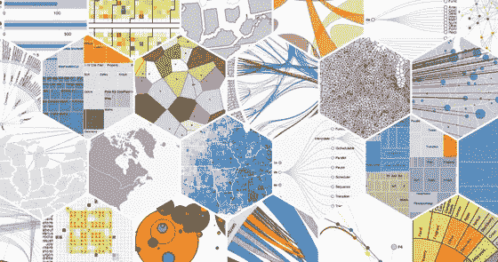

D3

## D3 是什么？

[D3.js](https://d3js.org/) 是一个开源的 Javascript 库，专注于数据驱动的文档操作。"数据驱动的文档操作？"那是什么意思？

这意味着 D3 允许你通过 HTML、CSS 或 SVG 来可视化你的数据，这意味着你可以在现代浏览器上查看你的可视化。它允许您将数据绑定到 DOM(文档对象模型),并转换文档以显示您的数据。有很多很棒的设计，你可以用 d3.js 来定制你的文档

在本指南中，我们将了解 D3 的一些方面:

1.  选择
2.  数据绑定和加载
3.  数据可视化
4.  缩放比例
5.  轴

## 重要的事情先来

创建一个目录，并在代码编辑器中打开它。创建 3 个文件:index.js，index.css 和 index.html

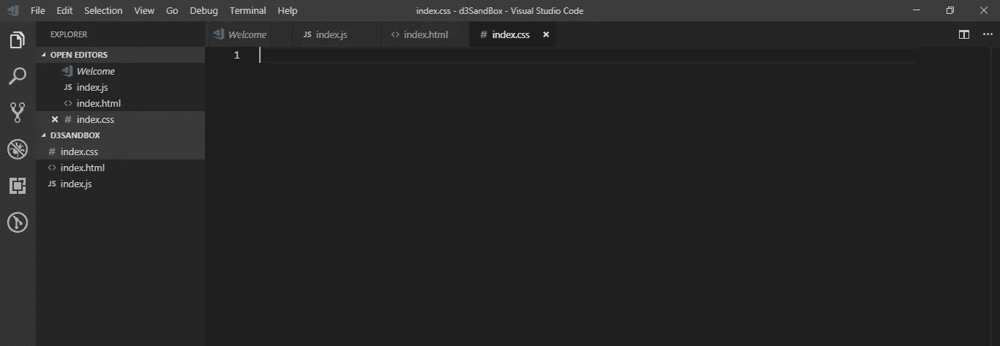

在您的 index.html 中，确保您正在加载 D3 库以及 index.js 文件(并确保您正在使用[库的最新链接](https://d3js.org/))。

```
<script src="https://d3js.org/d3.v5.min.js"></script>
```

让我们转到 index.js 文件并开始工作。

# 选择

D3 允许你使用名字(比如 p，h1)或者 CSS 选择器来识别 DOM 元素。那么，在识别它们之后，我们如何选择它们进行操作呢？D3 为我们提供了两种选择方法:d3.select()和 d3.selectAll()。它们接受元素的名称或 CSS 选择器(让我们称之为“标识符”)作为参数，并返回元素的选择。

这两种选拔方式有什么区别？d3.select()返回匹配标识符的第一个元素，d3.selectAll()返回匹配标识符的所有元素。选择之后，您可以操作数据、设置数据样式并将数据绑定到 DOM 元素。

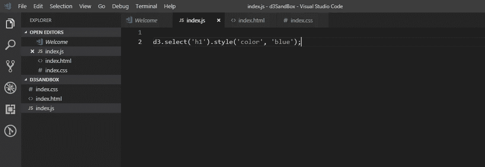

这将返回它找到的第一个

# T5，并把它涂成蓝色。如果没有找到任何 h1 标签，它将返回一个空选择。

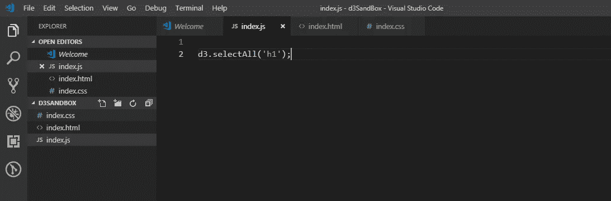

这将返回它找到的所有

。如果没有找到任何 h1 标签，它将返回一个空选择。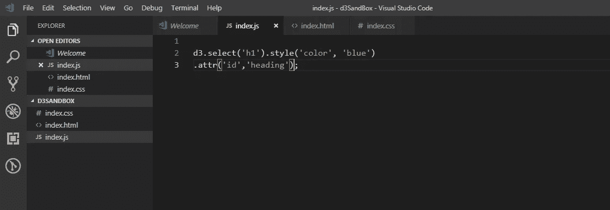

与。attr()方法，可以给选中的元素添加属性。它接受两个字符串参数:属性的名称和值。

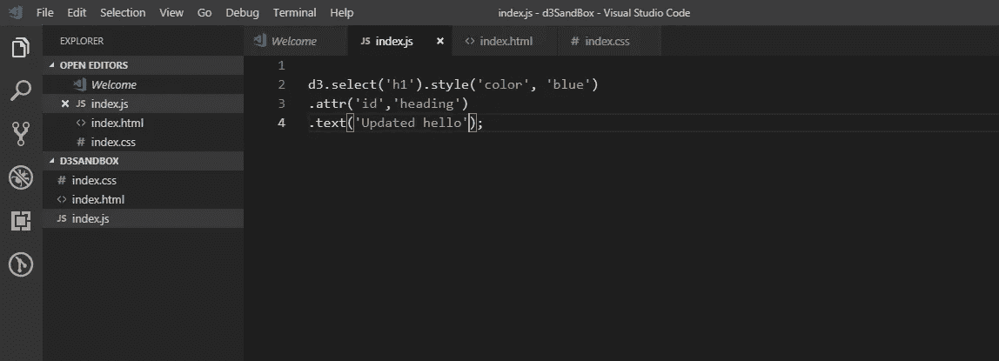

与。text()方法，可以更新所选元素的值。它接受一个字符串参数:值。

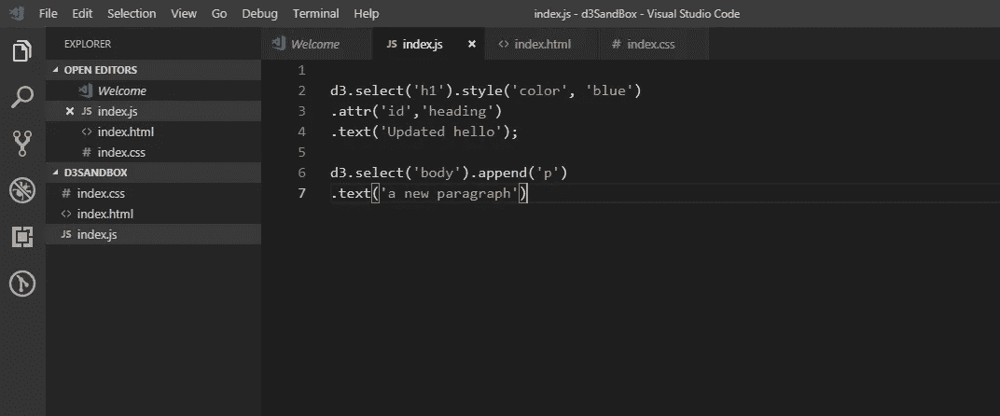

与。append()方法，可以向 DOM 添加一个新元素。它接受一个字符串参数:标记的名称。

这是它在您的浏览器中应该显示的样子。

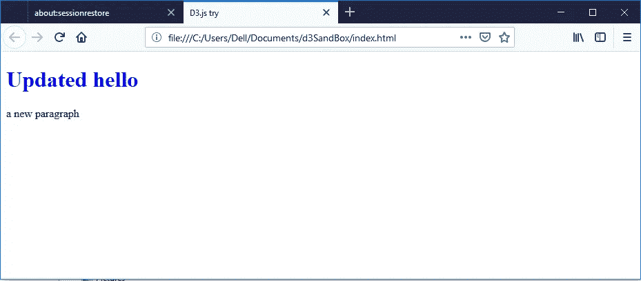

**任务**:用 append()方法添加更多的 p 标签，用 text()方法将它们的值设置为你喜欢的食物；然后使用 selectAll()和 style()方法将它们的颜色改为橙色。请做这个任务来巩固你的知识。如果你第一次没有成功，不要担心——再看一遍选择部分，你会找到窍门的。

# 数据绑定和加载

使用 D3，您可以用。data()方法，它接受数据集作为参数。在的帮助下。方法，可以对传入的数据集执行类似“for each element”的操作。数据()。

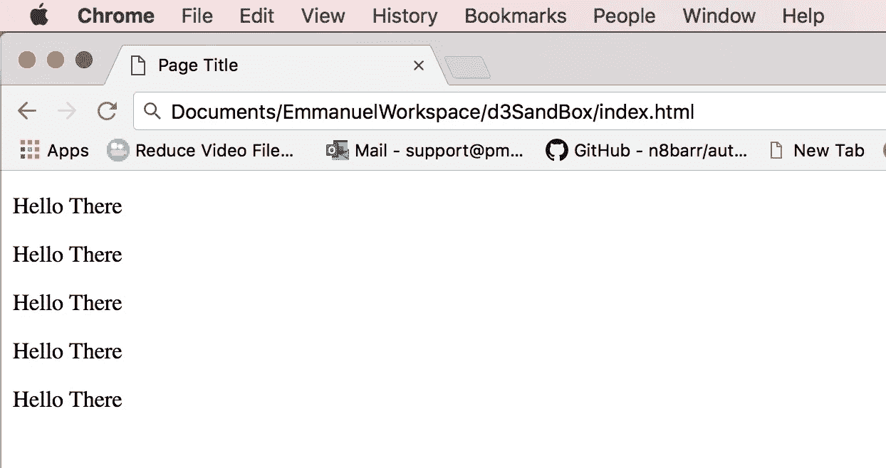

**任务 2** :将数据集修改为包含您最喜爱的菜肴，并将 p 标签的值修改为数据集中元素的值。

提示:将第六行替换为:

# 数据可视化

现在我们知道了一些基本知识，我们将创建一个简单的带有任意数据集的条形图。

在 HTML 文件中包含 svg 标签:

```
<svg class="bar-chart"></svg>
```

将它添加到 index.js 文件中:

这看起来像很多代码，但不要惊慌。再检查一遍。svg 标记的宽度和高度分别在 svgWidth 和 svgHeight 中指定，条形之间的间距在 barSpacing 中设置，totalBarWidth 是条形的宽度(BarWidth)和条形间距。

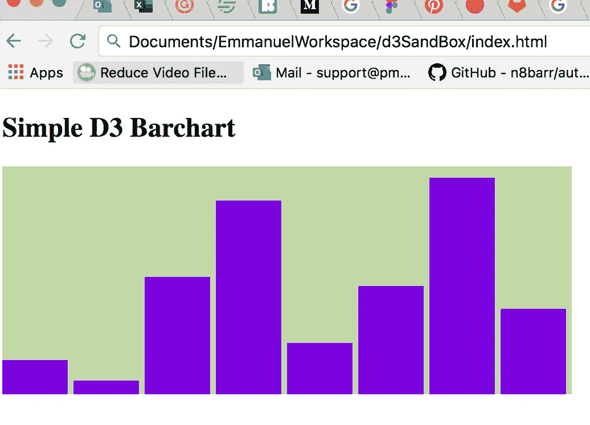

一个简单的 D3 条形图

# 缩放比例

希望您能够成功地创建条形图。看起来不错吧？帮我一个忙:将数据集中的值更改为小于 15 的数字。你的条形图现在看起来怎么样？我想不太好——这些条现在太小了，无法阅读。这就是伸缩性发挥作用的地方。我们将重构我们的代码来解决这个问题。

scale 变量接受一个. domain()对象，该对象接受一个数组作为参数。该数组有两个元素:0 和数据集中的最高值(最高值是用。max())。的。range()方法也接受一个包含两个元素的数组:0 和条形应该缩放到多高。在上面的代码中，它被设置为 svg 高度。中的元素随意增减数字。domain()和 range()参数数组。如果您正确地重构代码，您的图表应该是可伸缩的。

# 轴

干得好，你已经走到这一步了。这将是我要说的最后一个方面，但最后我会给你一些有好的 D3 教程的链接。

那么，为什么我们需要一个轴呢？没有轴，你怎么能正确地读取数据呢？透过栅栏，你可以看出它们的高度不同，但这还不够精确。我们将不得不创建垂直和水平的线，用彼此等距离的数字标记它们，确保这些标签是可扩展的…天哪！这已经很多了。幸运的是，D3 有一些很棒的方法，只需几行代码就能帮上忙。

要创建您的 x 轴(xAxis ),您需要使用 D3 提供的 axisBottom()(axis 将出现在底部)方法，并通过 scale()方法传入您的 x 刻度，然后在 svg 元素中创建一个 group 标记，向该组添加一个 translate 转换属性，并使用 call()方法调用 xAxis。

要创建 y 轴(yAxis ),您需要使用 D3 提供的 axisLeft()(axis 将出现在左边)方法，并通过 scale()方法传入您的 y 刻度，然后在 svg 元素中创建另一个 group 标记，向该组添加 translate 转换属性，并使用 call()方法调用 yAxis。

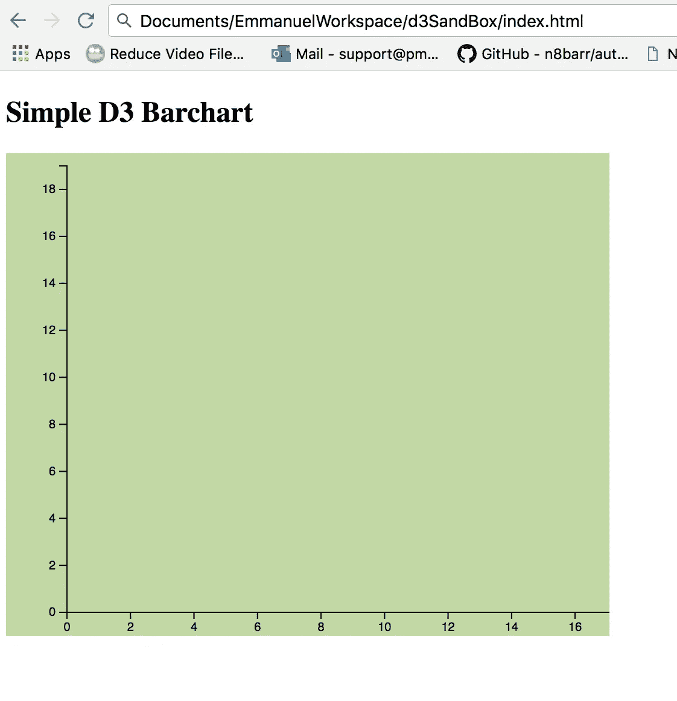

你的应该是这样的

**任务三**:将条形图添加到轴上。

正如所承诺的，这里有一些好的资源可以帮助你完成 D3.js 之旅:

https://www.youtube.com/watch?v=C4t6qfHZ6Tw[https://www.youtube.com/watch?v=EYmJEsReewo](https://www.youtube.com/watch?v=C4t6qfHZ6Tw)[https://www.youtube.com/watch?v=dL5dWNMGy5g](https://www.youtube.com/watch?v=dL5dWNMGy5g)T4

祝你好运！