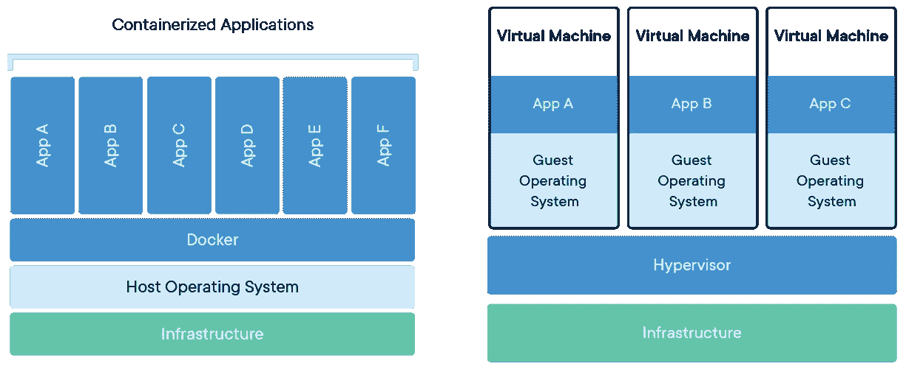

# 码头工人入门指南

> 原文：<https://betterprogramming.pub/a-beginners-guide-to-docker-4915d691b972>

## 构建和配置第一个基于 Docker 的应用程序的完整教程


图片 Via[[https://docker.com](https://docker.com)

你是最酷的孩子之一。你听说过 Docker，知道你可以把你的代码打包在一个容器里，在一个隔离的环境下运行。您听说过许多公司正在使用它来构建、测试和部署他们从开发到生产的应用程序。但是你还没有机会和 Docker 一起工作。

我在想，如果这件事传出去，你还会是一个酷孩子吗？

别担心。我自己也在那里。我不是专家，但我帮你搞定了。让我们准备好进入 Docker。

# 后续步骤:

1.  为什么要用 Docker？
2.  安装 Docker
3.  我将如何打包我所有的依赖项？
4.  我如何运行这个打包的映像？
5.  我们如何配置 docker 基于图像的应用程序？

# 1.为什么要用 Docker？

每个应用程序都有自己的依赖项集。假设我希望我的应用程序有一个完整的工作实例，传统的做法是使用脚本列出所有的依赖项，或者在 Python 应用程序的情况下使用`requirements.txt`。

让我们来看看可能出现的一些问题:

*   我的需求成功地安装在我的机器上，但不是我同事的。啊，是的，臭名昭著的`”Works on my machine!”`难题，因为操作系统/内核/系统级别的差异。
*   我对我的应用程序所做的更改在我的机器上运行得非常完美，但是由于上面提到的差异，在生产环境中失败了。你能想象这有多恐怖吗？！
*   我错误地配置了一些依赖项。我能以多快的速度推倒重来？

从上述问题来看，主题似乎是在[https://12factor.net/](https://12factor.net/)看到的`The Twelve-Factor App`提到的环境平价有问题。这里的想法是，如果所有的环境都是对等的，难道我们不能用最少的默认配置构建应用程序一次，然后在环境/配置中需要时，用较小的覆盖更改在任何地方运行吗？

以下是一些问题:

*   我们能不能*打包*我们的应用程序，让它可以带着它的依赖项在任何地方运行？
*   我们能否通过确保配置/打包在所有环境中尽可能保持一致来解决这个问题？
*   我们能否确保应用程序运行时在所有环境中保持几乎相同？
*   我们能否构建一次应用程序，然后在任何地方运行*？*

# *码头工人来救援了！*

*[Docker](https://www.docker.com/) 是一个[开源项目](https://github.com/docker/docker)，用于将任何应用程序打包成自给自足、可独立部署的单一单元，*又名*容器，可以在云、桌面或任何其他平台上运行。其思想是应用程序运行在完全隔离的环境中，该环境运行在 Docker 引擎之上，Docker 引擎运行在主机操作系统之上。与传统的虚拟化软件相比，隔离的应用程序看起来有点像下图:*

**

*图片来自[[https://docker.com](https://docker.com)*

# *2.安装 Docker*

## *我们从哪里开始？*

*首先，让我们从[https://docs.docker.com/install/#supported-platforms](https://docs.docker.com/install/#supported-platforms)下载并安装适合你操作系统的 Docker CE(社区版)*

## *验证 Docker 正在工作*

*只需运行`docker run hello-world`。如果您看到以下输出，则它正在工作:*

```
*Unable to find image 'hello-world:latest' locallylatest: Pulling from library/hello-world1b930d010525: Pull completeDigest: sha256:2557e3c07ed1e38f26e389462d03ed943586f744621577a99efb77324b0fe535Status: Downloaded newer image for hello-world:latestHello from Docker!This message shows that your installation appears to be working correctly.To generate this message, Docker took the following steps:1\. The Docker client contacted the Docker daemon.2\. The Docker daemon pulled the "hello-world" image from the Docker Hub.(amd64)3\. The Docker daemon created a new container from that image which runs theexecutable that produces the output you are currently reading.4\. The Docker daemon streamed that output to the Docker client, which sent itto your terminal.To try something more ambitious, you can run an Ubuntu container with:$ docker run -it ubuntu bashShare images, automate workflows, and more with a free Docker ID:[https://hub.docker.com/](https://hub.docker.com/)For more examples and ideas, visit:[https://docs.docker.com/get-started/](https://docs.docker.com/get-started/)*
```

## *恭喜你！*

*现在，您的机器上已经安装了一个可以工作的 docker。*

# *3.打包应用程序*

*现在我们已经在系统上安装了 docker，让我们来探索如何使用 Docker 打包应用程序。*

*为了简单起见，让我们以一个非常简单的 flask 应用程序为例，它只打印出被调用的请求方法。*

*在您的工作区中创建一个名为`docker-demo`的文件夹。*

*现在创建一个名为`app.py`的文件，内容如下:*

*让我们在同一个`docker-demo`文件夹中为包依赖项创建一个`requirements.txt`文件。*

*现在我们已经准备好 python 应用程序和依赖项列表，让我们开始打包应用程序。*

*一个`Dockerfile`拥有将应用程序构建为 Docker 映像所需的所有步骤。在同一个`docker-demo`文件夹中，我们创建一个名为`Dockerfile`的文件，内容如下:*

*让我们仔细看看`Dockerfile`中的每一行:*

## *第一行:*

*`FROM python:latest`*

*这一行告诉 docker 引擎，它必须将最新的可用`python`图像作为应用程序图像的基础。*

## *第二行:*

*`COPY requirements.txt /usr/src/code/`*

*这一行告诉 docker 引擎应该将文件`requirements.txt`从我们当前的项目文件夹复制到最终图像上的路径`/usr/src/code/`*

## *第 3 行:*

*`WORKDIR /usr/src/code/`*

*这一行告诉我们当前的工作目录在图像中应该是`/usr/src/code/`*

## *第 4 行:*

*`RUN pip install -r requirements.txt`*

*这一行确保我们的应用程序依赖项已经安装。*

## *第 5 行:*

*`COPY . /usr/src/code/`*

*这一行告诉我们将当前项目文件夹的内容复制到 docker 图像上的文件夹`/usr/src/code/`中。*

## *第 6 行:*

*`CMD gunicorn --bind 0.0.0.0:8000 app:app`*

*这一行定义了运行最终 docker 映像时要运行的默认命令。*

*既然我们已经对 docker 文件中的内容有了一些了解，让我们试着构建应用程序。*

*在 shell 上运行以下命令:*

*`docker build . -f Dockerfile -t docker-demo`*

*这个命令基本上是说用当前文件夹`.`的上下文运行`Dockerfile` ，并用名称`docker-demo`标记结果图像。*

*如果映像构建成功，您应该会看到以下输出:*

```
*docker-demo$ docker build . -f Dockerfile -t docker-demo
Sending build context to Docker daemon  1.47MB
Step 1/6 : FROM python:latest
 ---> 4c0fd7901be8
Step 2/6 : COPY requirements.txt /usr/src/code/
 ---> Using cache
 ---> 0ae7f5e0b8f1
Step 3/6 : WORKDIR /usr/src/code
 ---> Using cache
 ---> 758680b1755e
Step 4/6 : RUN pip install -r requirements.txt
 ---> Using cache
 ---> a4d56393776b
Step 5/6 : COPY . /usr/src/code/
 ---> e37d0a98dcd1
Step 6/6 : CMD gunicorn --bind 0.0.0.0:8000 app:app
 ---> Running in 4e30f7d4bb82
Removing intermediate container 4e30f7d4bb82
 ---> 041dbd6f6add
Successfully built 041dbd6f6add
Successfully tagged docker-demo:latest*
```

# *4.运行 Docker 映像*

*运行以下命令来运行现在打包为 docker 映像的应用程序:*

*`docker run -p 8000:8000 docker-demo`*

*我们已经使用`-p` (publish)指令将容器中的应用程序运行端口`8000`暴露给外部端口`8000`。*

*一旦成功运行，您将看到以下输出:*

```
*[2019-07-09 20:43:15 +0000] [6] [INFO] Starting gunicorn 19.9.0
[2019-07-09 20:43:15 +0000] [6] [INFO] Listening at: [http://0.0.0.0:8000](http://0.0.0.0:8000) (6)
[2019-07-09 20:43:15 +0000] [6] [INFO] Using worker: sync
[2019-07-09 20:43:15 +0000] [9] [INFO] Booting worker with pid: 9*
```

*您可以从主机使用`curl`测试应用程序 URL。*

```
*docker-demo$ curl 'http://localhost:8000/hello?name=Kishan'
Hello Kishan
docker-demo$ curl 'http://localhost:8000/hello'
Hello John Doe*
```

*您现在已经使用 Docker 运行了一个应用程序！*

# *5.配置基于 Docker 的应用程序*

*现在我们已经构建好了，让我们考虑一下配置应用程序的真实场景。通常，任何应用程序都有一个合理的默认值，然后您可以根据需要在每个环境中覆盖它。*

*应用程序使用两种类型的配置:*

*   *环境变量*
*   *基于文件的流程配置*

*让我们对应用程序进行更改，以便它根据配置做一些不同的事情。*

## *A.基于环境变量的配置*

*让我们假设您的应用程序必须根据当前环境做一些不同的事情。为了简单起见，我刚刚编辑了之前的 Flask 应用程序，我们必须打印出关于当前环境的额外信息:*

*这里，应用程序被配置为在发送响应时使用环境变量`env`。如果在`env`中没有得到任何值，则默认为`prod`。*

*现在让我们也在 docker 文件中做一些更改:*

*您可能会注意到这一行:`ENV env prod`*

*一旦构建了这个映像，这实际上就向应用程序运行时注入了一个值为`prod`的环境变量`env`。*

*现在让我们来试试这个:*

```
*docker build . -t docker-demo:env*
```

*我们将这张新图片标记为`docker-image:env`。*

*在运行这个容器之前，您可能想使用 CTRL^C 退出现有的旧容器，如果您还没有这样做的话。*

*让我们运行这个新图像:*

```
*docker-demo$ docker run --rm --name docker-demo -p 8000:8000 docker-demo:env
[2019-07-13 12:29:24 +0000] [6] [INFO] Starting gunicorn 19.9.0
[2019-07-13 12:29:24 +0000] [6] [INFO] Listening at: [http://0.0.0.0:8000](http://0.0.0.0:8000) (6)
[2019-07-13 12:29:24 +0000] [6] [INFO] Using worker: sync
[2019-07-13 12:29:24 +0000] [9] [INFO] Booting worker with pid: 9*
```

*您可能会注意到两个新选项:`--rm`和`--name`*

*`--rm`告诉 docker 引擎一旦退出就删除这个容器。*

*`—-name`告诉将容器命名为`docker-demo`*

*让我们进行一个 API 调用。*

```
*docker-demo$ curl '[http://localhost:8000/hello?name=Kishan'](http://localhost:8000/hello?name=Kishan')
Hello Kishan from 'prod'*
```

*现在，我们看到应用程序正在使用 Dockerfile 文件中的已配置环境。我们来验证一下怎么样？*

*让我们使用`bash`登录到正在运行的容器*

```
*docker-demo$ docker exec -it docker-demo bash
root@6160a487196c:/usr/src/code# echo $env
prod
root@6160a487196c:/usr/src/code#*
```

*瞧啊。*

*现在，让我们假设我在一个名为`dev`的不同环境中，因为我遇到了一个错误，并且想要重现它。我应该如何为不同的环境覆盖`env`配置？让我们尝试在 docker 容器启动期间更改环境变量`env`:*

```
*docker-demo$ docker run --rm --name docker-demo -e env=dev -p 8000:8000 docker-demo:env
[2019-07-13 12:29:24 +0000] [6] [INFO] Starting gunicorn 19.9.0
[2019-07-13 12:29:24 +0000] [6] [INFO] Listening at: [http://0.0.0.0:8000](http://0.0.0.0:8000) (6)
[2019-07-13 12:29:24 +0000] [6] [INFO] Using worker: sync
[2019-07-13 12:29:24 +0000] [9] [INFO] Booting worker with pid: 9*
```

*真的那么容易吗？我们打个 API 电话怎么样？*

```
*docker-demo$ curl '[http://localhost:8000/hello?name=Kishan'](http://localhost:8000/hello?name=Kishan')
Hello Kishan from 'dev'*
```

***引人深思:**如果你注意到了，我们只构建了一次应用程序*。但是，我们已经覆盖了配置变量，从而使它在不同的*环境*下运行。**

## **b.基于文件的配置**

**一如既往，事情从来没有你想象的那么简单。使用环境变量并不能解决所有问题。您可能最终会为 uwsgi、supervisor、gunicorn、nginx 等编写配置文件。其配置不能放在环境变量中。**

**为了简单起见，让我们配置 gunicorn 的主机和端口绑定配置。**

**gunicorn 接受任何有效的 python 文件作为配置。**

**让我们创建一个名为`configuration.py`的新文件，内容如下:**

**`bind = "0.0.0.0:8000"`**

**让我们更改 docker 文件的最后一行，以支持我们的新配置。**

**出发地:**

```
**CMD gunicorn --bind 0.0.0.0:8000 app:app**
```

**收件人:**

```
**CMD gunicorn -c configuration.py app:app**
```

**让我们构建图像，并给它一个新的标签。**

```
**docker build . -t docker-demo:config**
```

**现在让我们运行应用程序:**

```
**docker-demo$ docker run --rm --name docker-demo -p 8000:8000 docker-demo:config
[2019-07-13 13:33:09 +0000] [6] [INFO] Starting gunicorn 19.9.0
[2019-07-13 13:33:09 +0000] [6] [INFO] Listening at: [http://0.0.0.0:8000](http://0.0.0.0:8000) (6)
[2019-07-13 13:33:09 +0000] [6] [INFO] Using worker: sync
[2019-07-13 13:33:09 +0000] [9] [INFO] Booting worker with pid: 9**
```

**我们可以看到应用程序已经成功地从 configuration.py 文件中获取了配置，并在`0.0.0.0:8000`上绑定了它。**

**让我们来谈谈如何超越这一点。**

**在环境变量的情况下，我们可以使用`-e`开关来覆盖应用程序容器中的现有环境。我们如何为一个文件这样做呢？**

**Docker [volumes](https://docs.docker.com/storage/volumes/) 通过将主机目录/文件暴露到容器中，是将持久性放入应用程序容器的一种方式。默认情况下，容器没有任何内置的持久性，因为它们应该是轻量级的、隔离的、易于拆卸和重建的。Docker 卷是展示配置、日志等的绝佳方式。到/从集装箱。**

**在我们的场景中，我们需要的是更改`configuration.py`的内容，然后在运行映像时使用这个新配置，而不必再次构建 docker 映像。**

**让我们创建一个名为`configuration2.py`的文件，内容如下:**

```
**bind = "0.0.0.0:9000"**
```

**在这里，我们实际上是将 gunicorn 的绑定配置从端口 8000 更改为 9000。**

**让我们用下面的命令终止以前的容器并启动一个新的容器:**

```
**docker-demo$ docker run --rm --name docker-demo -v `pwd`/configuration2.py:/usr/src/code/configuration.py -p 8000:9000 docker-demo:config
[2019-07-13 13:52:30 +0000] [7] [INFO] Starting gunicorn 19.9.0
[2019-07-13 13:52:30 +0000] [7] [INFO] Listening at: [http://0.0.0.0:9000](http://0.0.0.0:9000) (7)
[2019-07-13 13:52:30 +0000] [7] [INFO] Using worker: sync
[2019-07-13 13:52:30 +0000] [10] [INFO] Booting worker with pid: 10**
```

**我们使用`-v`开关在主机上创建文件`configuration2.py`的一个卷，然后将它挂载到映像中的文件`configuration.py`上，从而用`configuration2.py`的内容替换它的内容。如您所见，应用程序现在运行在端口`9000`上，正如新配置中所写的那样。**

**如果您再次注意到，我们已经覆盖了配置，而不必重新构建应用程序。**

**让我们进行 API 调用:**

```
**docker-demo$ curl '[http://localhost:8000/hello?name=Kishan'](http://localhost:8000/hello?name=Kishan')
Hello Kishan from 'prod'**
```

**我们的教程到此结束！**

**我们在本教程中完成的内容:**

*   **写了一个 REST 应用。**
*   **编写了应用程序的依赖项。**
*   **为应用程序编写 Dockerfile 规范。**
*   **使用 Dockerfile 文件构建应用程序，并用名称标记图像。**
*   **运行 docker 映像并测试 URL 端点。**
*   **使用环境变量和配置文件配置应用程序**
*   **在运行时覆盖环境变量和配置文件的配置，而不重建映像。(又名*构建一次，随处运行*)**

**如需进一步阅读，请查看以下链接:**

*   **[Dockerfile 最佳实践](https://docs.docker.com/develop/develop-images/dockerfile_best-practices/)**
*   **[Docker 联网](https://docs.docker.com/network/)**
*   **[Docker 撰写](https://docs.docker.com/get-started/part3/)**

# **结论**

**祝贺您完成本教程！**

**这篇博文中使用的代码可以在[这里](https://github.com/kishanreddykethu/docker-demo)找到。提交历史与我们已经讨论过的例子一致。我要特别感谢[拉利特](https://www.linkedin.com/in/lalitanand-dandge-456076a/)和[尼哈尔](https://www.linkedin.com/in/nihar-rathod/)校对了我的漫谈，并就本教程应该涵盖的内容给出了很好的建议。**