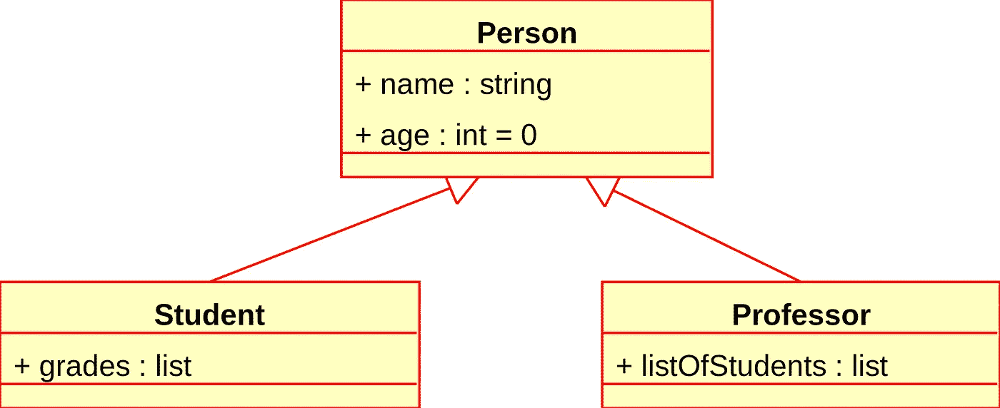
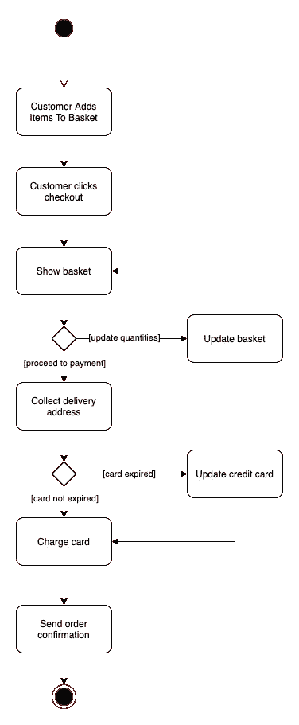
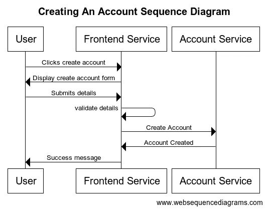

# 绘制技术图表的初学者指南

> 原文：<https://betterprogramming.pub/a-beginners-guide-to-drawing-technical-diagrams-fb0c97fdbc5e>

## 介绍了几乎涵盖所有场景的四个常见图表


由[万花筒](https://unsplash.com/@kaleidico?utm_source=medium&utm_medium=referral)在 [Unsplash](https://unsplash.com?utm_source=medium&utm_medium=referral) 上拍摄的照片。

直到我开始努力被提升为一名工程师，我才把图表添加到我的技能中。不管你是刚刚开始你的技术生涯还是已经做了一段时间的工程师，开始做图表永远不会太早或太晚。

自从学会了用图表，我已经记不清有多少次我的一位同事指出，由于增加了一个图表，事情变得容易理解了。

如果使用得当，它们可以成为非常强大的交流工具。同样，一个糟糕的图表只会导致混乱和误解。在本文中，我将介绍图表制作的基础知识，如何开始，涵盖大多数场景的一些常见图表类型，以及我发现的一些能够让您创建优秀图表的工具。

# 你为什么要学习图表？

在进入图表的细节之前，我想谈谈为什么我相信图表是如此强大，为什么你应该学习如何用图表。

考虑一下你必须向一群人展示某样东西的常见场景。参加会议时，每个人都使用幻灯片是有原因的。它更容易理解，也更容易消化。对于图表来说也是如此。任何阅读该图的人都会发现它比 Word 文档或你试图用语言表达你的想法更容易理解。

图表也非常适合协作。如果你正在向某人提交一个建议以获得一些反馈，那么很容易调整这个建议，然后简单地通过调整一些方框或线条来重新评估。

图表也是高度通用的——它们不仅仅适用于架构师。我向主要编写代码的工程师介绍了图表绘制，这帮助他们编写更好的代码，并帮助我解释如何构造类的想法。

我们将从查看四种不同的图类型开始，包括它们的用途、何时使用以及示例。接下来，有一个关于图表制作的入门指南。

# 类图

类图是 UML 图众多类型中的[之一。顾名思义，它们用来表示类的集合。它们通常显示:](https://creately.com/blog/diagrams/uml-diagram-types-examples/)

*   每个类的名称。
*   每个类具有的属性。
*   每个类拥有的方法。
*   每一个类是如何相互联系的。

## 例子



图片来自[维基百科](https://en.wikipedia.org/wiki/Class_diagram)。

## 何时使用它们

类图通常在开始编写代码之前使用——尤其是如果您不确定需要什么类的时候。它们可以单独使用，让你快速勾画出你的想法，也可以在投入时间之前，合作寻求早期反馈。

我会尽量缩小范围——为你的整个代码库创建一个类图可能非常耗时，而且很快就会过时。因此，我总是试图保持它的简洁，并把它限制在代码库中相对较小的区域。

# 活动图

活动图是 UML 中的另一种类型。它们不像其他图那样关注技术，而是关注特定流程的流程。例如，一个活动图可以显示一个顾客在你的网站上购物的流程。

它们本身对于理解过程流是有用的，但是通常它们由更侧重于技术的图表来补充。然后，您可以使用活动图来验证您的技术方法。

## 例子



图片来源:作者

## 何时使用它们

我会在一项新工作开始时使用活动图，试图理解你需要涵盖的所有场景。当与非技术同事讨论工作时，比如你的产品经理，他们也非常有用。

如果我们继续购买流程示例，这些只是我们想要涵盖的几个场景:

*   快乐之路
*   信用卡过期了
*   更改地址
*   调整数量

乍一看，你可能认为这种类型的图表应该由像你的产品经理这样的人来绘制。当然有可能。然而，确保您设计的系统满足业务需求也是您的责任，活动图对于确保您已经涵盖了业务案例是完美的。

# 序列图

我要谈的最后一种 UML 图类型是序列图。它们非常通用，可以用来显示类和系统之间的交互。

与类图相比，它们要高级得多。虽然类图给出了属性和方法等细节，但是序列图只能真实地显示类之间的交互(例如，A 类调用 B 类，B 类又调用 C 类)。

## 例子



图片来源:作者

## 何时使用它们

序列图对于勾画一组类或系统间交互的高层设计来说是完美的。有了像 [WebSequenceDiagrams](https://www.websequencediagrams.com/) 这样的工具，相对于一个类图中所涉及的细节，它们可以非常快速地生成。这允许您基于反馈快速迭代设计，以及绘制多种方法并比较每种方法的优缺点。

它们也非常适合在向团队演示时使用，因为它们允许每个人快速、轻松地看到高水平的提案。

# C4 模式

[C4 模型](https://c4model.com/)是 UML 的替代图表方法。它将许多 UML 图类型组合到一个单一的模型中，从一个非常高的层次开始，逐渐放大以显示更多的细节。

在我看来，C4 的一大卖点是，它可以被需要快速浏览的非技术人员以及真正想要深入了解细节的技术人员所访问。任何查看 C4 图的人都可以选择他们希望看到的详细程度。顾名思义，有四个抽象级别:

*   *语境* 观点很大程度上是非技术性的。它显示了用户如何与系统交互，并且只显示了应用程序以及它们如何相互交互。
*   *容器* 视图显示了每个可部署的单元。在上下文视图中，您可能有一个“订单服务”当在容器视图中深入查看时，您可能会看到它在[上构建了一个 API。NET 框架](https://dotnet.microsoft.com/learn/dotnet/what-is-dotnet-framework)以及一个 [Postgres](https://www.postgresql.org/) 数据库。
*   *组件* 视图放大每个容器，并勾勒出该容器中的各个模块或包。大多数语言都有名称空间或模块的概念，所以一个组件代表一组具有明确定义的接口的类。继续订单服务示例，您可能有诸如“交付”和“支付”的模块
*   最后，*代码* 视图表示了组件中的每个类以及它们如何相互作用。我还没有使用过 C4 的这个方面，主要是因为在创建 C4 模型时，我从来不需要那么多细节。C4 创建者的指导是，这一步是可选的，只有对于最复杂的组件才真正需要。

## 例子


图片由[西蒙·布朗](https://simonbrown.je/)对[c4model.com](https://c4model.com/)拍摄。

## 何时使用它

我发现，在设计一个新系统或对一套现有系统做出重大改变时，C4 模型非常有效。它非常适合于捕获您计划构建的整个架构，以及演示和记录您的架构选择。

非技术同事可以使用上下文视图来理解参与者和系统之间的相互作用，这对于向涉众传达高层细节是必不可少的。技术同事可以协作使用图表，以确保负责不同系统的所有团队理解每个系统如何适应更大的图景。

# 图表制作入门

图表需要一些时间来适应——特别是在布局和让读者明白一切方面。我收集了一些适用于几乎所有图的技巧，也是初学者经常会忘记的:

*   在使用这些图之前，我建议阅读一下 [C4 模型](https://c4model.com/)和 [UML 教程](https://www.tutorialspoint.com/uml/index.htm)。UML 有一些细微差别，比如不同类型的箭头，在早期学习这些差别是很重要的。
*   从使用序列图开始。到目前为止，它们是最容易拿起的，并且可以在各种各样的情况下使用。一旦你熟悉了它们，就可以进入更复杂的图表了。
*   确保图表适合观众。例如，如果你和一个非技术同事交谈，使用一个高级序列图或者 C4 上下文图。如果你打算引入一个新系统，不要展示低级的类图。
*   *总是*包含一个标题，让图表清楚地展示什么。
*   确保你*总是*包含足够的细节，这样图表才清晰。对大多数图表来说，图例是一个很好的补充，每样东西都应该有一个标签，并且可以随意添加一些额外的注释来概述任何问题或复杂性。
*   在广泛分发图表之前，将它展示给几个同事以获得早期反馈。他们将能够突出任何含糊不清的地方，让你在正式向任何人展示之前澄清这些地方。

# 工具

最后，这里是我在绘制图表时使用的两个主要工具:

*   [Diagrams.net](https://www.diagrams.net/)(以前的 draw . io)——这是我的首选工具，因为它的界面干净易用，非常适合上课、活动和 C4。
*   [WebSequenceDiagrams](https://www.websequencediagrams.com/) —顾名思义，这个非常适合绘制序列图。您使用简单的语法来编写它们，并且图表是自动生成的，所以它非常适合快速迭代。

# 摘要

正确使用时，图表是一个非常强大的可视化工具。

如果它们一开始就不是艺术品，不要灰心丧气。我一点也没有艺术创造力，但随着时间的推移，我已经设法提高了我的绘图技能。他们提升了我与各种各样的人交流我的建议的能力，并使我成为一名更好的建筑师和工程师。

```
**My book, Creating Software with Modern Diagramming Techniques, is out now!**[Click here](https://www.amazon.com/dp/1680509837?maas=maas_adg_265A9C302E256D26C2E10C30DA1AA728_afap_abs&ref_=aa_maas&tag=maas) to learn how to create diagrams to communicate information more directly and clearly than words ever can. Using only text-based markup, powered by Mermaid, create meaningful and attractive diagrams to document your domain, visualize user flows, reveal system architecture at any desired level, and much more!
```