# 反应本地导航的初学者指南

> 原文：<https://betterprogramming.pub/a-beginners-guide-to-react-native-navigation-a3d7042666c9>

## 如何在 React 本地应用中执行路由和导航


来源: [Diego Jumenz](https://unsplash.com/@diegojimenez) 在 [Unsplash](http://unsplash.com)

React Native 对于希望构建移动应用的开发人员来说是一个绝佳的选择。但是它的一个主要缺点是路由。例如，看看下面的代码:

这里，我们只渲染了`Home`组件。然而，考虑一下:如果我们想让用户在应用程序的不同部分导航，该怎么办？例如，让我们尝试用下面的代码呈现`Details`组件:

在这段代码中，您会注意到一个主要问题:我们如何告诉 React Native 从`Home`组件导航到`Details`组件？

这就是[反应导航](https://reactnavigation.org/)进入场景的地方。这是一个易于使用的库，允许开发人员在他们的应用程序中利用路由功能。

在本教程中，您将学习如何使用 React 导航库执行简单的动态路由。到本文结束时，您将已经构建了一个演示导航功能的应用程序。

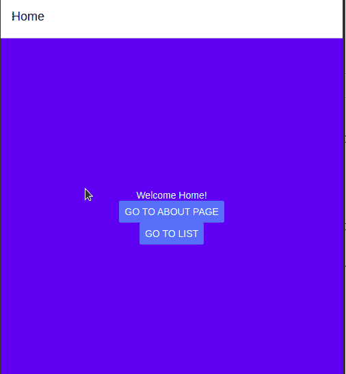

这篇文章的结果

我们开始吧！

# 入门指南

## 项目初始化和设置

在本文中，我们将使用`expo-cli`来实例化我们的 React 原生应用。为此，运行以下终端命令:

```
expo init navigation-tutorial
```

然后，它会要求您决定一个模板。选择`bare workflow`部分下的`minimal`选项。

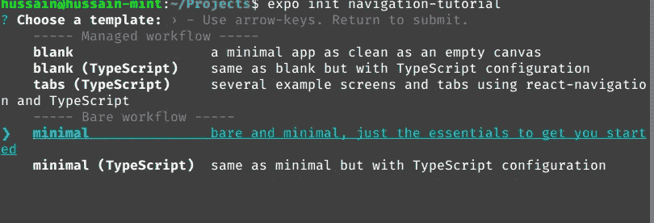

选择“最小”

完成后，就该安装以下库了:

*   `@react-navigation/native`:这个项目的核心模块。
*   `@react-navigation/stack`:构建我们的堆栈导航器。在本文的后面，您将了解更多关于堆栈导航器的内容。

为此，运行以下终端命令:

```
npm install [@react](http://twitter.com/react)-navigation/native @react-navigation/stack
```

现在继续使用以下命令安装对等依赖项:

```
expo install react-native-gesture-handler react-native-reanimated react-native-screens react-native-safe-area-context [@react](http://twitter.com/react)-native-community/masked-view
```

我们现在已经完成了初始阶段。现在让我们编写一些代码来创建堆栈导航器。

## 堆栈导航器

栈导航器是构建路由系统的核心模块；它让你的应用程序在不同的屏幕之间转换。因此，这允许客户端浏览应用程序的不同部分。

现在，让我们编写堆栈导航器。转到`App.js`并添加以下导入:

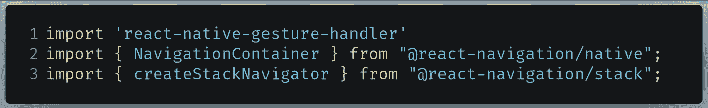

要在 App.js 中编写的代码

*   第 2 行:`NavigationContainer`组件将管理我们的应用程序状态，并将我们的堆栈导航器挂接到应用程序。
*   第 3 行:`createStackNavigator`函数将构建我们的堆栈导航器。

我们现在需要构建我们的导航容器。为此，在您的`App`组件声明的正上方编写以下代码行:

```
const Stack = createStackNavigator();function App() { 
  //further code...
```

接下来，在`App.js`中找到你的`return`区块:

```
return (
  <View style={styles.container}>
  <Text>Open up App.js to start working on your app!</Text>
  <StatusBar style="auto" />
  </View>
);
```

像这样改变它:

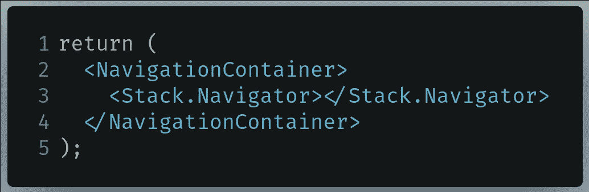

要在 App.js 中编写的代码

*   第 2 行:创建我们的导航容器。我们的导航员会在这里。
*   第 3 行:初始化我们的`Stack.Navigator`组件。我们将把我们的路线放在这里。

完成后，尝试运行代码。这将是结果:

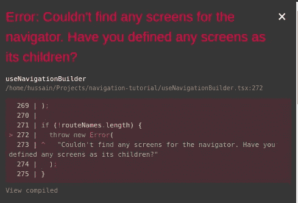

输出错误

我们的导航器找不到任何路线，因此出错。在本文的下一部分，我们将初始化我们的屏幕，以便 React Native 可以显示它们。

最后，`App.js`应该是这样的:

# 基本路由

在本节中，我们将创建一个主页，允许用户转到“关于我”页面。

## 主页

在项目的根目录下，创建一个名为`screens`的文件夹。在这里，创建一个名为`Home.js`的文件。

在`screens/Home.js`中，编写以下代码:

这是一个标准的 React 本地组件，显示一段文本。

*   第 12–22 行:我们的页面应该有一个蓝色的背景颜色和白色的字体颜色

作为最后一步，我们需要告诉导航库这将是我们的主页。

转到`App.js`并找到以下代码:


要在 App.js 中查找的代码

像这样改变它:

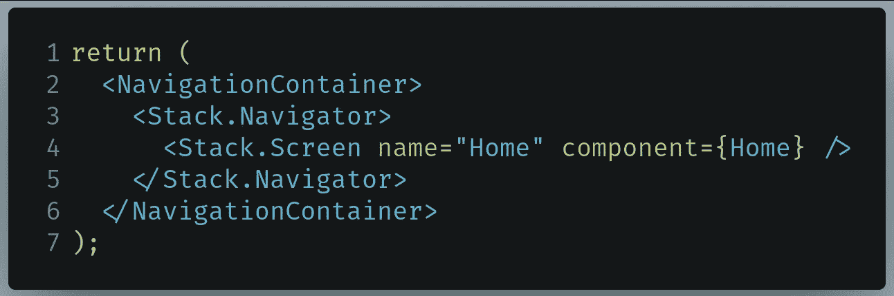

App.js 中要替换的代码

*   第 4 行:通知 React Navigation,`Home`组件将是我们想要呈现的屏幕之一。
    组件`Screen`具有`name`和`component`支柱。在这种情况下，我们已经指定当用户转到`Home`路线时，React Native 应该呈现`Home`组件。

运行代码。这将是结果:

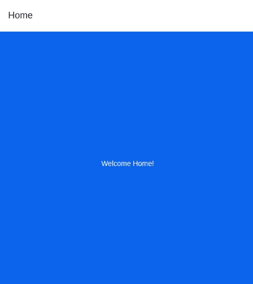

代码的输出

太神奇了，我们的代码起作用了！现在让我们尝试添加一个“关于我”页面作为路线。

最后，`App.js`应该是这样的:

## “关于”页面

在您的`screens`文件夹中，创建一个名为`About.js`的文件。在这里，编写以下代码:

*   第 19 行:我们的`Text`元素应该有 40 个单位大。

我们现在需要将这个组件添加到堆栈中。为此，在`App.js`中找到您的`return`块，并按如下方式更换它:

*   第 5 行:当用户走到`About`路线时，再渲染`About.js`组件。
    由于`Home`组件是堆栈中的第一项，它将作为我们应用程序的主页。

运行代码。这将是结果:


代码的输出

即使我们将`About`组件添加到可用路线中，为什么我们不能导航到它？这是因为我们还没有编写告诉 React Native 改变路由的代码。

为此，请转到`screens/Home.js`并找到以下代码:

```
export default function Home() {
```

像这样改变它:

```
export default function Home({ navigation }) {
```

每个屏幕组件中都捆绑了`navigation`道具。它包含几个执行导航相关操作的实用函数。

接下来，在`App.js`中找到你的`return`块:

```
return (
  <View style={styles.container}>
    <Text style={styles.text}>Welcome Home!</Text>
  </View>
);
```

像这样改变它:

*   第 6 行:当用户点击这个`Button`元素时，然后转到我们的`About`路线。因此，这将呈现出`About`屏幕。

再次运行代码。

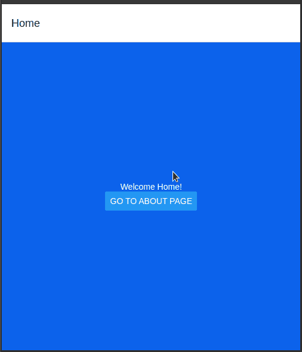

代码的输出

我们完事了。在下一部分中，我们将使用该库执行动态路由。

最后，`screens/Home.js`应该是这样的:

# 动态路由

在本节中，我们将使用 [Coffee API](https://sampleapis.com/api-list/coffee) 来演示 React 导航中的动态路由。

我们的计划是呈现咖啡名称的列表。如果客户点击其中的任何一个，那么应用程序应该会将他们带到另一个页面，该页面包含关于所选项目的更多信息。

## 呈现我们的咖啡单

在您的`screens`文件夹中，创建一个名为`CoffeeList.js`的文件。在这里，编写以下代码:

*   第 1 行:这个组件可以执行与导航相关的操作。
*   第 6 行:`data`钩子将包含 API 返回的响应。
*   第 8–13 行:`fetchData`函数将执行对 Coffee API 的请求，然后将其响应存储到`data`钩子中。此外，我们还记录了它对控制台的响应。
*   第 15–17 行:当组件首次安装时，运行`fetchData`功能。

我们现在需要将它添加到堆栈中。在`App.js`中，编写以下代码:

我们现在需要呈现一个按钮，让用户前往`CoffeeList`路线。为此，转到`screens/Home.js`并编写以下代码:

这将是结果:

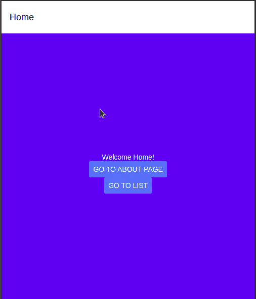

代码的输出

现在看看你的控制台:

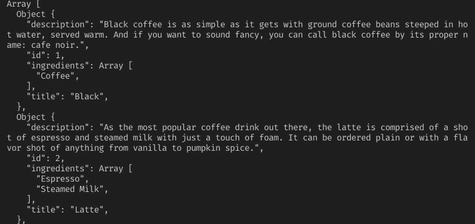

终端中的输出

我们的产量和预期的一样！现在，让我们将这个列表呈现在屏幕上。

接下来，在`CoffeeList`函数中编写以下代码块:

*   第 1 行:我们将使用`renderItem`函数将列表呈现到屏幕上。
*   第 2 行和第 3 行:将每个元素表示为一个`Text`元素，并显示该项目的`title`字段。

最后一步，在`CoffeeList.js`中找到下面的代码:

```
return (
  <View>
    <Text>Text pasted here.</Text>
  </View>
);
```

像这样改变它:

*   第 3 行:[平面列表](https://reactnative.dev/docs/flatlist)组件将呈现我们的列表。
*   第 4 行:告诉 React Native 呈现存储在我们的`data`钩子中的项目。

再次运行代码。这将是结果:

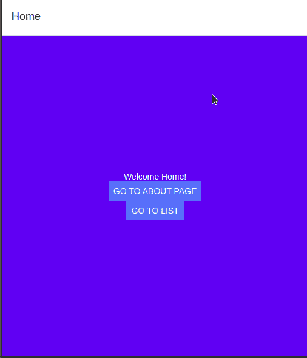

我们就快完成了！在下一节中，我们将使用这个 API 来显示每个项目的信息。

最后，`CoffeeList.js`应该是这样的:

## 显示咖啡信息

在您的`screens`文件夹中，创建一个名为`CoffeeInfo.js`的文件。在这里，编写以下代码:

*   第 4 行:`route`属性对于获取参数值很有用。我们将在本文的后面了解这一点。

您现在需要将它作为一个屏幕添加到我们的堆栈中。转到`App.js`并像这样改变您的`return`块:

第二步，转到`screens/CoffeeList.js`并找到您的`renderItem`功能，并将其更改如下:

*   第 2 行:单击后，导航到`CoffeeInfo`路线，并将项目的`id`字段作为参数发送。

运行代码。这将是结果:

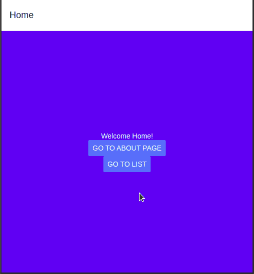

太好了！我们的代码按预期工作。我们现在需要使用参数的值从我们的 API 获取数据。

最后，转到`CoffeeInfo.js`并编写以下代码:

*   第 3 行:从参数中提取`id`属性。
*   第 5–10 行:根据`id`获取咖啡信息，然后将其响应存储到`data`钩子中。
*   第 12–14 行:当组件首次安装时，运行`fetchData`方法。
*   第 17 行:检查`data`挂钩是否不是`undefined`或`null`。如果是`true`，则显示`title`和`description`字段。
*   第 24 行:否则，通知用户数据正在路上。

运行代码。这将是结果:

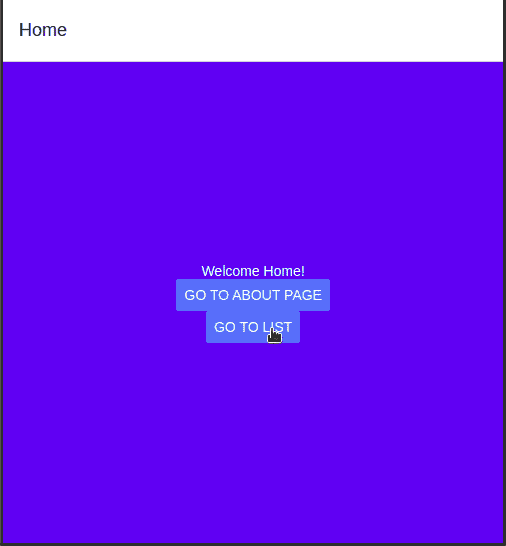

代码的输出

我们完事了。

最后，`CoffeeInfo.js`应该是这样的:

# 额外资源

## Github 知识库

本文的代码在这里。

## 进一步阅读

*   【React 导航入门— [Ross Bulat](https://medium.com/u/7cbf2b1d5a4e?source=post_page-----a3d7042666c9--------------------------------)
*   [反应导航 v5 —反应原生学校](https://www.youtube.com/watch?v=nQVCkqvU1uE)
*   [React 本地导航:教程和示例— LogRocket](https://blog.logrocket.com/navigating-react-native-apps-using-react-navigation/)

# 结论

React 导航库提供了在 React 本地项目中实现简单和动态路由的简单解决方案。除了堆栈导航器，您还可以获得基于[标签的](https://reactnavigation.org/docs/tab-based-navigation)和[抽屉导航](https://reactnavigation.org/docs/drawer-based-navigation)。此外，考虑到路由对于一个项目是多么的重要，难怪这个库[是复杂和大型应用](https://reactnavigation.org/docs/used-by/)中的主要部分。

如果您在这篇文章中遇到了任何困惑，我建议您解构代码，并摆弄它，以便您可以完全掌握主题。

非常感谢您阅读这篇文章！编码快乐！