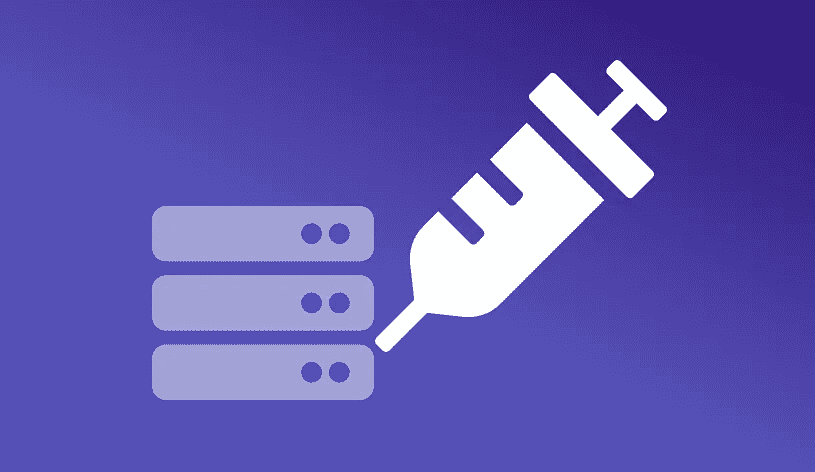

# SQL 注入初学者指南

> 原文：<https://betterprogramming.pub/a-beginners-guide-to-sql-injection-163c1ad2257f>

## 它是什么，我们如何保护我们的代码免受黑客和不良行为者的攻击？



***SQL 注入*** 是一个 web 安全漏洞，使得攻击者能够改变对数据库的 SQL 查询。这可用于检索一些敏感信息，如数据库结构、表、列及其底层数据。

例如，假设应用程序使用以下查询获取某人的登录详细信息:

```
SELECT USERNAME,PASSWORD from USERS where USERNAME='<username>' AND PASSWORD='<password>';
```

这里，`username`和`password`是用户提供的输入。假设攻击者在两个字段中都输入了`' OR '1'='1`。因此，SQL 查询将类似于:

```
SELECT USERNAME,PASSWORD from USERS where USERNAME='' OR '1'='1' AND PASSWORD='' OR '1'='1';
```

该查询产生一个 true 语句，因此用户登录。这个例子描述了最基本的 SQL 注入。

可以在任何地方使用 SQL 注入从数据库中获取任何敏感信息。

注意:这是最基本的例子，只是为了便于理解。在现实世界中，你几乎找不到这样的案例。

您可以使用这个[备忘单](https://portswigger.net/web-security/sql-injection/cheat-sheet)来查看如何对不同的 SQL 数据库提供者进行查询。

# 如何检测 SQL 注入的存在？

在大多数情况下，通过提供无效的参数很容易检测到 SQL 注入，如`'`、`'' a' or 1=1--`、`"a"" or 1=1--"`、`or a = a`、`a' waitfor delay '0:0:10'--`、`1 waitfor delay '0:0:10'--`、`%26`、`' or username like '%`等。然后，您可以观察应用程序行为的变化。

您可以尝试分析服务器响应的长度，以及发送响应所需的时间。像`'`、`a' or 1=1--`等有效载荷。可能会显示数据库服务器响应的变化。但是如果没有变化，那么我们尝试使用类似`a' waitfor delay '0:0:10'--`的有效载荷来触发时间延迟。这可能会使服务器在发送响应之前延迟一段特定的时间。

在确定网站是否易受`SQL Injection`攻击后，我们可以尝试从数据库中提取一些敏感信息。

在此之前，我们需要识别 SQL 查询返回的`number of columns`。这很重要，因为如果我们试图提取的列数与查询实际返回的列数不相等，那么它将返回一个错误。

我们可以通过使用`order by`命令来确定列的数量。例如:

```
[www.onlineshopping.com/products.php?pid=8](http://www.onlineshopping.com/products.php?pid=8) order by 1 -- //
www.onlineshopping.com/products.php?pid=8 order by 2 -- //// If the parameter is a string then you need to add ' after it.www.onlineshopping.com/products.php?usr=b' order by 3 -- //
www.onlineshopping.com/products.php?usr=a' order by 4 -- //
```

`--`的重要性在于它是 SQL 中的注释指示器，这使得查询的其余部分成为注释。现在为了保留`--`后的`space`，我们在其后添加了任何字符，这样`space`就不会在`HTTP request`中被忽略。根据 SQL 数据库提供者的不同，我们可能还会使用`#`或`/* */`进行注释。

继续此过程，直到遇到错误。如果在使用有效负载`order by 5`时遇到错误，而在使用`order by 4`时没有遇到错误，这意味着查询将返回`4`列。

# 如何利用 SQL 注入进行开发

一旦您知道应用程序易受 SQL 注入攻击，并且您已经确定了列的数量，我们将尝试找到关于数据库的必要信息，如所需表的`DB name`、`DB user name`、`DB version`、`table names`、`column names`等。查看 SQL 注入备忘单，找到相应的问题。

# SQL 注入的类型

1.  **基于错误的**:这种类型的 SQL 注入依赖于数据库服务器抛出的`error messages`，它可能为我们提供一些关于数据库结构的有用信息。
2.  **基于联合的**:这种技术使用 SQL `UNION`操作符来组合两个`SELECT`查询的结果并返回一个表。它允许攻击者通过将结果附加到对数据库的原始查询中，从其他表中提取信息。
3.  **盲注入**:当应用程序易受`SQL Injection`攻击，但`SQL query`的结果没有在`HTTP response`中返回时，就会出现这种情况。在这种情况下，我们查询数据库中的任何真/假语句，并查看真和假条件的变化。它有两种类型:
4.  **基于内容的**:在这种技术中，使用任何条件语句查询数据库服务器，并且在发送`true`条件和`false`条件的同时，分析来自服务器的`response`的任何差异。
5.  **基于时间的**:这种技术依赖于注入一个 SQL 查询，让数据库根据指定的条件等待特定的时间。服务器发送回响应所花费的时间决定了查询是对还是错。
6.  **带外注入**(不常见):这不是一种非常常见的`SQL Injection`类型，因为它取决于数据库服务器上启用的特性。它依靠数据库服务器的能力来发出类似于`HTTP`、`DNS`和`ftp`的 web 请求，以便向攻击者发送数据。

# 如何保护你的代码免受 SQL 注入？

1.  永远不要用用户的输入直接构造查询。相反，使用**参数化语句**。它们确保传递给 SQL 查询的输入得到安全处理。
2.  T21 对用户输入进行净化总是好的。此外，正确的**输入验证**应该完成，例如，姓名不能是数字，电话号码不能是字母。然而，这有时可以被绕过。
3.  使用**安全驱动**与您的 SQL 数据库交互。它们会自动防范所有 SQL 注入攻击。比如 python 的 SQLAlchemy。

# 资源

1.  [SQL Map](http://sqlmap.org/) 是一个开源工具，用于`automates`处理`detecting`和`exploiting` SQL 注入漏洞。
2.  这个[库](https://github.com/swisskyrepo/PayloadsAllTheThings/tree/master/SQL%20Injection)在`SQL Injection`上有一些很酷的资源。这包括一些备忘单和许多有用的有效载荷，可以根据用例来使用。

不要忘记留下一些掌声，以防你喜欢这个博客

*我们连线吧？*

*领英:*[*https://linkedin.com/in/ashwigoel*](https://linkedin.com/in/ashwigoel)

*网址:【https://ashwingoel.com】[](https://ashwingoel.com)*

**邮箱:*[*【goelashwin36@gmail.com】*](mailto:goelashwin36@gmail.com)*