# Gmail API 及其文档的初学者指南

> 原文：<https://betterprogramming.pub/a-beginners-guide-to-the-google-gmail-api-and-its-documentation-c73495deff08>

## 让我们在 Gmail 的基础上构建一些很酷的东西吧！

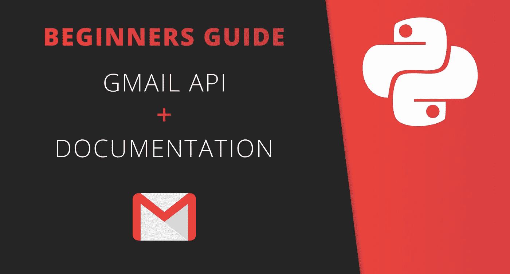

编程的一个关键部分是与不同的应用程序编程接口(API)进行通信的能力。如果你访问[谷歌应用编程接口浏览器](https://cloud.google.com/monitoring/api/apis-explorer)，你会发现一个巨大的应用编程接口库，包括他们所有知名的应用程序，如 Gmail、Drive 和 Calendar。简单地说，API 允许您通过 HTTP 请求向服务获取或发送数据。

这些 API 的用法和文档一开始可能有点复杂，但是一旦你学会了，你就能把你的知识应用到大多数 Google 应用程序中。

我决定写一本如何使用和理解 Gmail API 的初学者指南。该指南是基于文档的，这意味着您将学习寻找什么以及如何阅读它，而不仅仅是复制代码。由于大多数其他 Google API 参考文档都是相似的，一旦你知道如何真正阅读这些文档，你就会发现适应它们要容易得多。这将允许你写自己的代码，并真正理解你在做什么。

本指南中使用了 Python 3，但是在其他语言中的用法应该也很相似。

# 快速入门

谷歌通常会提供一个快速入门指南来简化授权。本指南将使用快速入门指南中的授权，这意味着它会有一些限制，但对于我们的目的来说已经足够了。获得 API 密匙的另一种方法是创建一个新项目，这有点复杂。

Python 快速入门指南可以通过这个链接访问[，但是我会继续给你展示这里的一切是如何完成的。](https://developers.google.com/gmail/api/quickstart/python)

这是快速入门的样子:

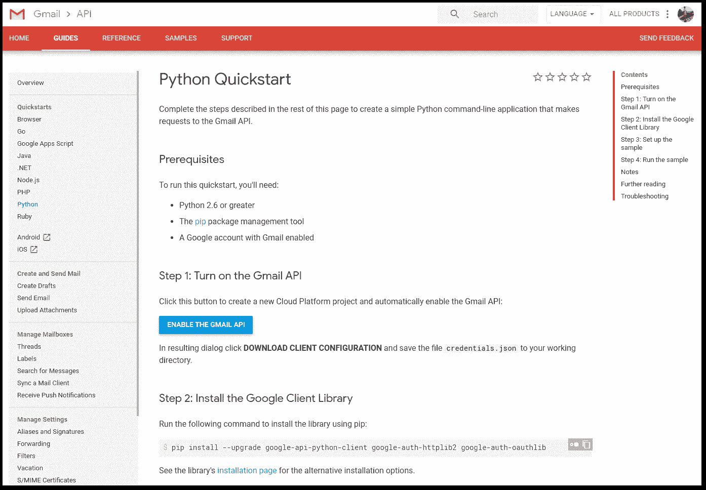

# 打开 Gmail API

第一步是启用 API 并下载在我们的项目中使用的凭证。按下“启用 Gmail API”*按钮，我们将打开一个新窗口，显示我们的凭据。*

*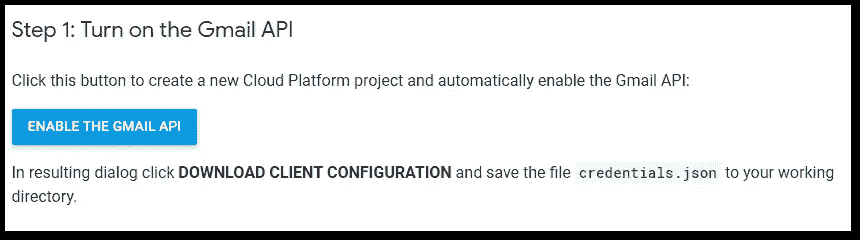*

*将显示我们的客户 ID 和客户密码。选择要下载的客户端配置。将保存一个文件，名为`credentials.json`。我们将把它保存到代码所在的文件夹中。*

*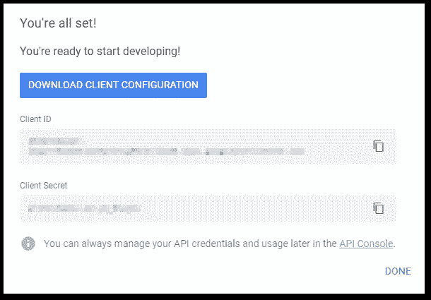*

# *安装库*

**

*安装所需的库是通过 Google 提供的一个简单的 pip 命令完成的。我也把它贴在了下面。我建议在虚拟环境中做这件事。但是，这不在本指南中介绍。*

```
*pip install — upgrade google-api-python-client google-auth-httplib2 google-auth-oauthlib*
```

# *首次运行—允许访问*

*在我们继续遵循指南之前，我们需要允许我们的脚本访问 Gmail API。让我们从制作实际的脚本开始。*

*创建一个*。项目目录中的 py* 文件(与带有`credentials.json`的目录相同)。为了方便起见，姑且称之为`gmail.py`。*

*将示例代码从 Python 快速入门复制到`gmail.py` 文件中。暂时忽略代码，稍后我们将深入研究它。我们只需要在第一次运行时允许访问——它也将为以后的所有运行保存。*

*像平常一样运行这个文件，你就可以在网络浏览器中登录你的谷歌账户了。*

```
*python gmail.py*
```

*登录您的帐户。将显示一条警告，说明该应用程序未经验证。由于我们使用快速入门方法，我们的应用程序尚未通过验证。现在只需点击图片上显示的链接继续并允许访问。*

*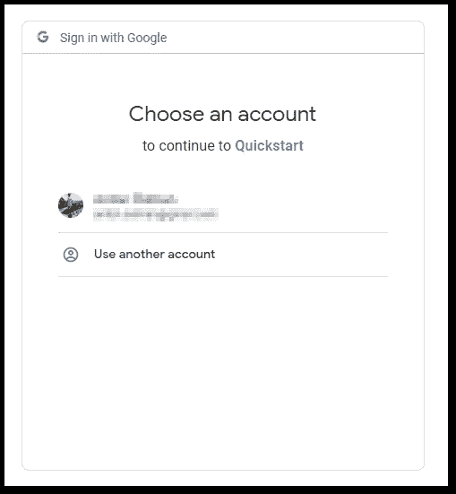**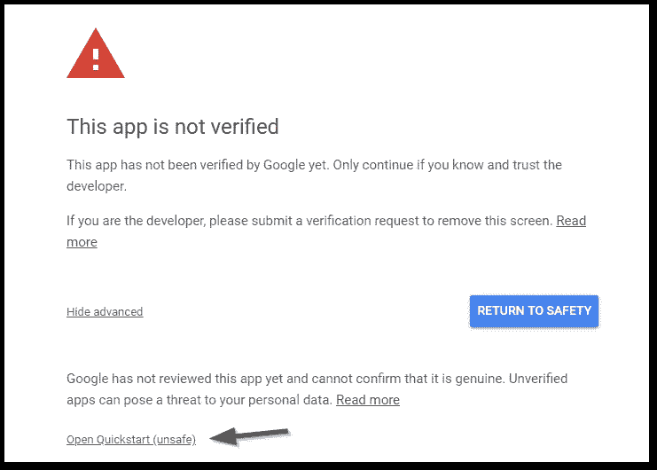**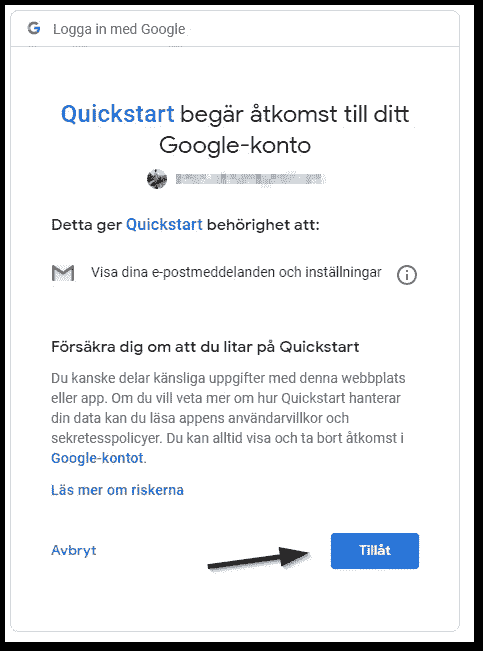*

# *理解代码*

*示例代码一开始可能看起来让人不知所措，但是我将把它分成更小的部分以保持简单。到最后，你会发现其实并没有那么难。*

## ***进口和范围***

*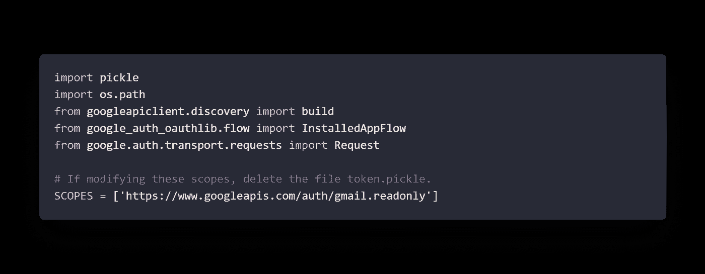*

*与任何其他 Python 脚本一样，我们将从导入开始。大多数导入都是用`credentials.json`文件进行授权的。所有这些都是默认提供的，所以我们不需要做任何改变。*

*然而，范围是最重要的部分。这个变量稍后会被修改，但是现在，我们将满足于提供的默认范围。*

*这就是说，它将允许我们从`gmail.readonly`范围访问数据。还有更多的范围，这允许我们对 Gmail API 进行一系列的操作和请求。其他一些请求需要其他作用域。*

*稍后，我们将添加另一个作用域来使用其他功能。*

## ***凭证***

*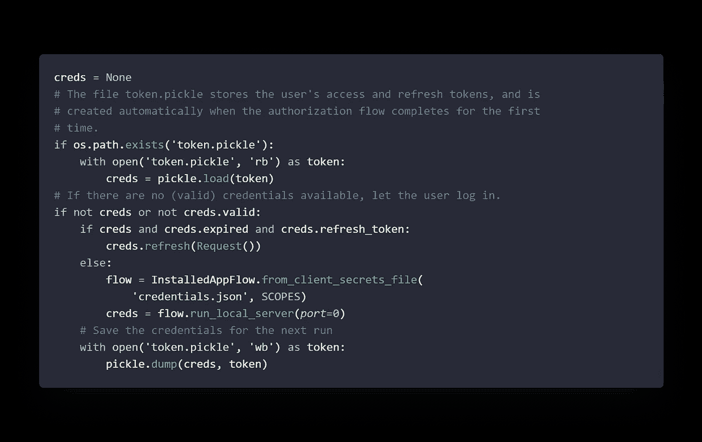*

*授权可能是对脚本的最高级部分。我们现在不会深入讨论这个问题，因为它已经被配置为开箱即用。*

*这是获取您从`credentials.json`下载的凭证的部分。首先，它寻找一个`token.pickle`文件。这是在您第一次允许访问您的帐户时创建的文件。如果文件已经存在，它会从中获取凭证，这意味着您不必多次允许访问。*

*如果`token.pickle`文件不存在，它会从您的`credentials.json`文件加载凭证。这需要您允许通过 web 浏览器访问，就像您之前所做的那样。*

*在这两种情况下，凭证都保存在`creds`变量中以备后用。*

## ***API***

*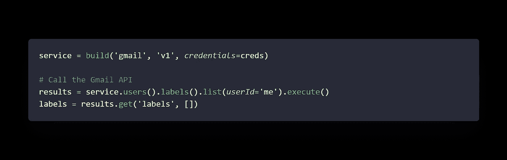*

*这是脚本有趣的部分:从 Gmail API 获取数据的部分。如你所见，它实际上并没有那么先进。这是我们将深入探讨的部分。*

*`service`是使用之前导入的`build`函数构建的。我们之前得到的凭证作为参数传递给它。*

*然后使用`service`获取授权账户的所有 Gmail 标签。数据被保存到`results`变量。*

*最后一行将所有标签保存到`labels`变量中。它们被格式化为列表，因此如果列表为空，则指定默认值(`[]`)。*

*本指南的下一部分将查看文档来理解这一点。*

## ***结果***

*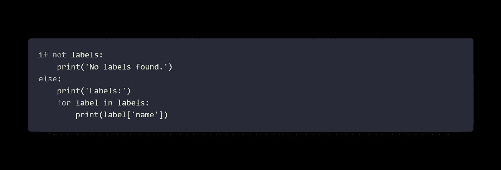*

*最后，打印标签名称(如果有)。*

# *理解文档*

*这就是快速入门示例代码。但是，不看文档没有太大意义。这一部分将向您展示如何真正理解代码中所写的内容，以及如何使用文档来编写自己的代码。*

*首先，让我们转到“参考”选项卡来访问文档。*

**

*左侧显示了一个大的摘要菜单。它包含了很多信息，但在接下来的步骤中会非常有用。*

*当我们使用标签时，让我们选择`Users.labels`部分和`Overview`部分来获得一些关于标签的基本信息。*

*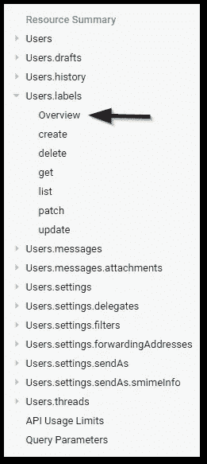*

*迎接我们的是这个屏幕:*

*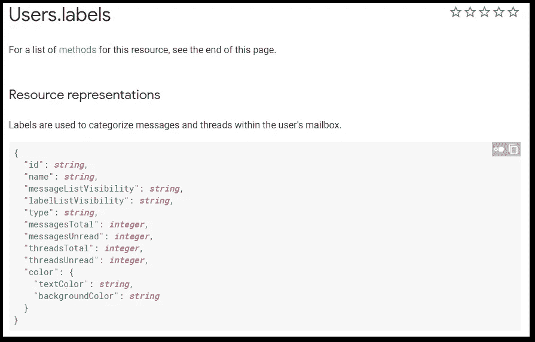*

*说明方法列表以及标签的*资源表示* 位于页面末尾的文本。信息通常以 JSON 的形式发送，像 Python 中的字典一样处理。*

*这是我们获取的每个标签包含的信息。如果我们继续向下滚动，应该会看到一个表，其中提供了字典中每个属性的信息。*

*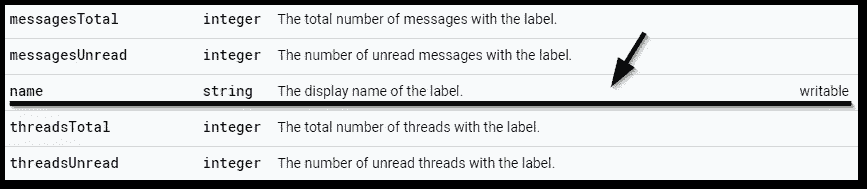*

*我突出显示了名称部分，因为我们以前使用过它。我们在之前打印标签时访问了标签的`name`。像这样:*

*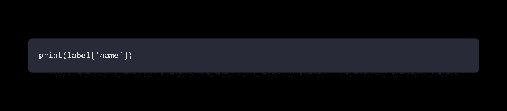*

*在这种情况下，`label`是一个字典，我们访问其中的`name`属性。我们可以访问上面提到的任何其他属性，但是现在，`name`就可以了。*

*需要注意的是`name`是一个字符串，但是有些值可能是整数。在文档中很容易找到。*

*如果我们继续向下滚动到页面的底部，我们会看到所有的方法。提供了每种方法的简短描述，以及指向文档的超链接。*

*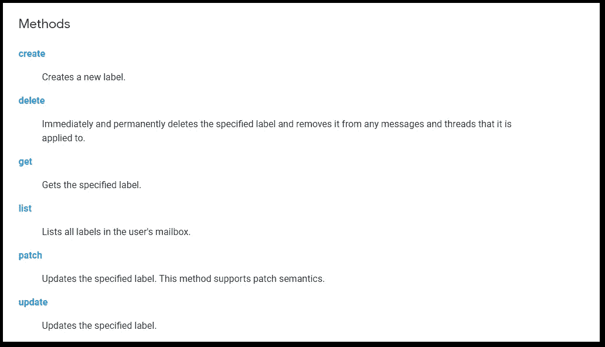*

*根据你想做的事情，你会使用不同的方法。快速入门示例使用`list`方法获取 Gmail 帐户上的所有标签。如果我们想要创建一个新标签，我们将使用`create`方法，我们将在后面实际执行。*

*如果我们回到顶部，看看左边的概述，您会看到每个方法都有自己的菜单按钮。*

**

## ***列表方法***

*让我们仔细看看列表方法，我们以前通过点击菜单栏上的`list`来使用它。*

*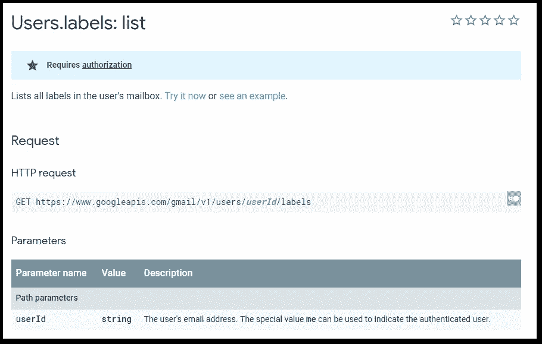*

*这提供了很多有用的信息。首先，向标签 URL 发送一个 HTTP GET 请求来获取所有标签:*

```
*https://www.googleapis.com/gmail/v1/users/userId/labels*
```

*例如，我们可以使用 Python 中的`requests`库来手动完成这项工作。然而，在本指南中，我们将使用提供的 Google 库。*

*需要授权，但我们之前已经处理了这部分。*

*最后，同样重要的是，我们可以传递给`list`方法的参数。如你所见，`userId`是我们唯一能通过的。*

*`userId`是代表用户电子邮件地址的字符串。值`me`可以替代地用于指示被认证的用户。我们实际上在示例代码中使用了`me`值。*

*我们将很快对此进行深入研究，但是首先，我们将通读`list`方法文档的其他部分。*

## ***授权和范围***

*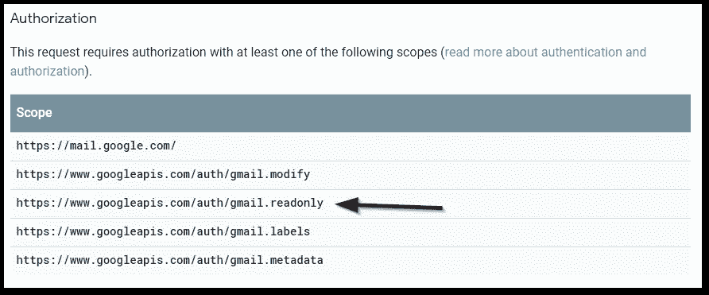*

*范围可能听起来很熟悉，这是因为我们之前简单地提到过它。要访问`list`方法，至少需要一个提供的作用域。*

*如您所见，我们已经在代码的顶部添加了`gmail.readonly`范围。*

*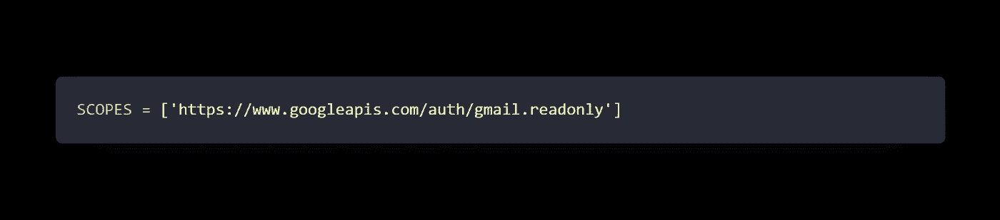*

## ***响应***

*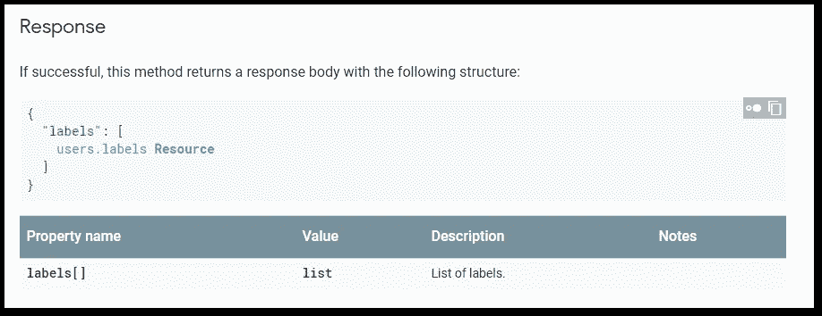*

*最后一部分向我们展示了成功的请求将返回什么:JSON 格式的主体。所有标签存储为列表，可通过`labels`键访问。基本上是这样:*

```
*list_of_labels = response["labels"]*
```

*就像在 Python 中使用普通字典一样。*

# *提出列表请求*

*现在我们已经从文档中收集了更多的信息，让我们回头看看代码的 API 部分。*

*首先，`service`是用我们的凭证打造的。这只是用于发出请求的基础(使用我们之前看到的方法)。*

*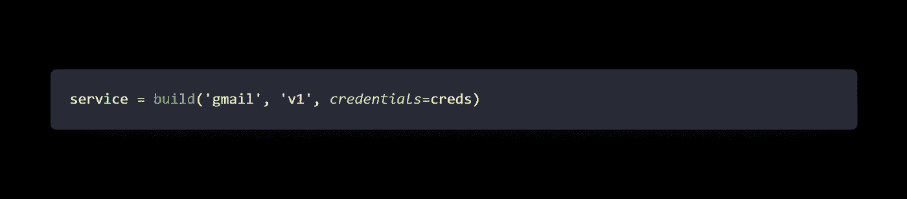*

*接下来，我们实际上使用 list 方法通过这段代码发出请求。一旦我们浏览了文档，现在看起来可能会更熟悉一些。*

*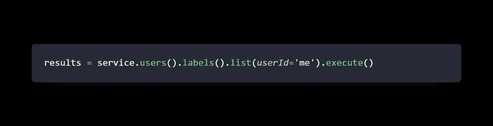*

*为了更容易地向您展示语法是如何构建的，我用颜色编码了代码和菜单，以向您展示 API 是如何工作的。*

*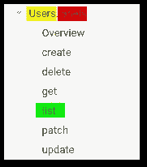***

*我们从`service`变量开始。通过简单地遵循树状结构，一个方法接一个方法，我们将最终到达列表方法。*

*让我们更仔细地看看`list`方法，尤其是我们熟悉的`userId`参数，它将`me`作为参数传递。*

*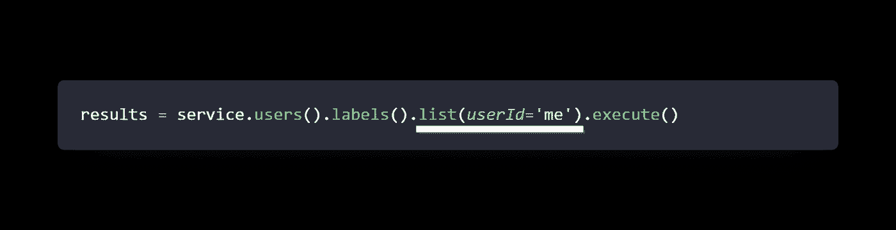*

*如果我们向上滚动到`list`方法文档的顶部，我们会看到我们之前谈到的参数的概要。指定了`userId`参数，以防我们不知道它是什么。*

*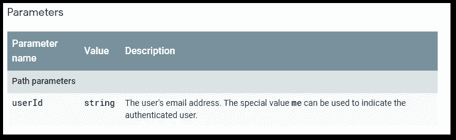*

*我们只是将它作为参数传递给代码中的`list`方法。*

*您可能还记得，根据文档的响应部分，请求应该返回一个字典。我们将它存储在`results`变量中。*

**

*为了访问标签，我们使用字典的`.get`方法。我们传递的第一个参数是我们想要得到的东西的名称(`labels`)，第二个参数是如果它没有找到任何具有该名称的东西，我们得到的返回。*

*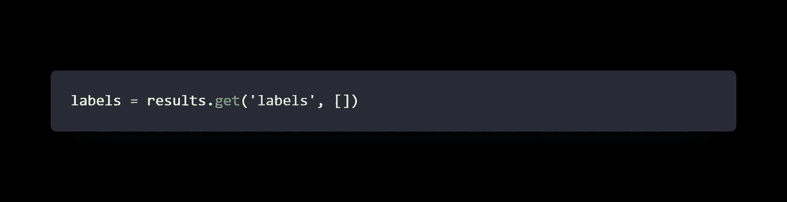*

*如果没有名为`labels`的键，将返回一个空列表。*

*这就是阅读文档的基本方式，也是`list`方法的工作方式。让我们试着按照 API 文档从头开始做些别的事情。*

# *创建新标签*

*让我们利用新发现的知识，做一些新的事情，从零开始(几乎)。*

*从文档中删除所有与 API 相关的代码。只保留导入、范围和凭证处理。我们将尝试通过 API 创建一个新标签。*

*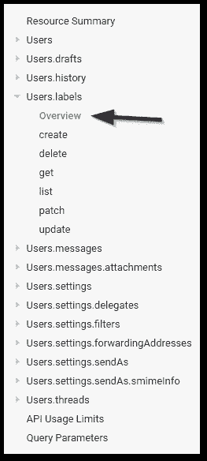*

*让我们转到标签的概述页面。向下滚动到方法，看看我们需要使用哪一个来创建我们自己的方法。*

*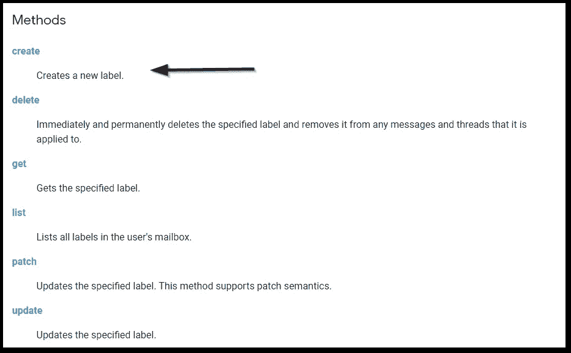***

*您可能已经注意到，我们将使用一个名为`create`的方法。去那个方法的文档看看我们需要什么。*

*让我们从授权和范围开始。*

*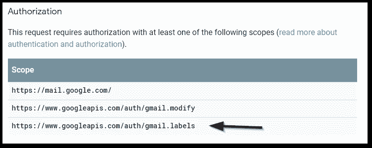*

*如您所见，我们至少需要三个现有范围中的一个。然而，我们的代码中没有任何一个。让我们添加`gmail.labels`范围。*

*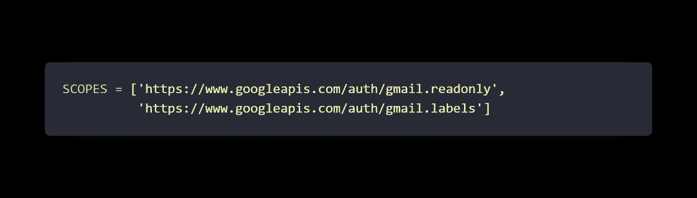*

*`SCOPES`变量接受一个列表，这意味着我们可以简单地用逗号分隔来添加新的范围。*

*由于旧的授权存储在`token.pickle`文件中(只要该文件存在就用于授权)，我们需要删除它并用新的范围重新创建它。*

*使用`python gmail.py`再次运行 Python 应用程序进行重新授权，但是，可以看到一个微小的变化:*

*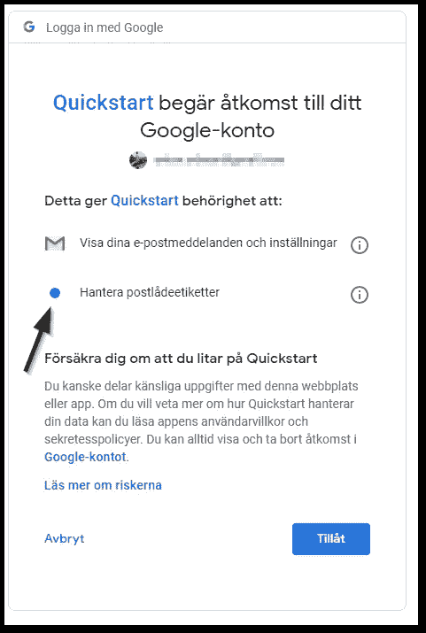*

*添加了新的依赖项。由于瑞典语的原因，你可能不理解，但它基本上说的是“处理标签”所以新的作用域给我们的应用程序增加了一个新的依赖项。*

## *代码*

*如果我们看一下`create`方法文档的顶部，我们可以看到它与`list`方法非常相似。它需要授权，发出 HTTP POST 请求，并且需要一个`userId`参数。*

*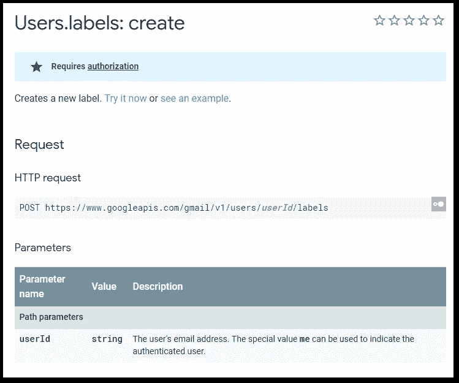*

*但是我们需要在请求中传递实际的标签。如果我们向下滚动到请求体，我们将看到如何做到这一点。*

*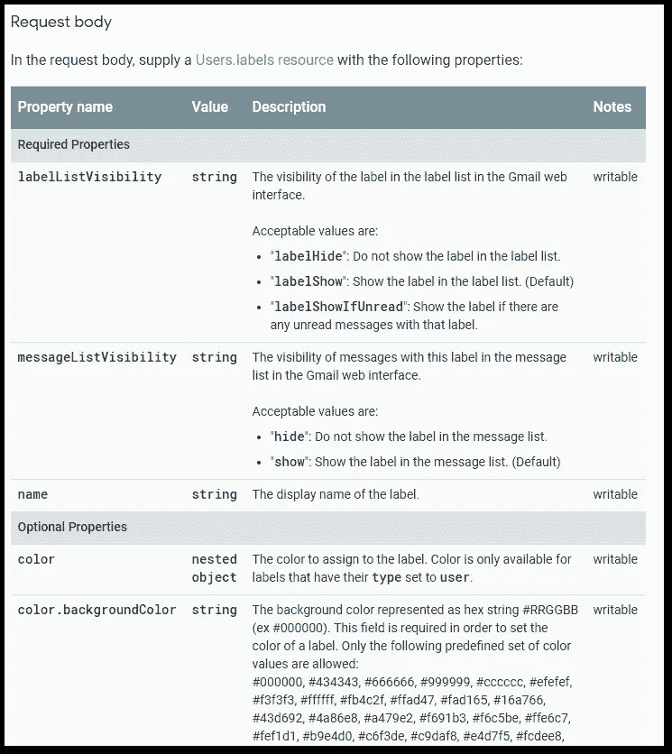*

*在我们的请求正文中，应该有一个至少具有以下属性的标签来创建标签:*

*   *标签可视性*
*   *邮件列表可见性*
*   *名字*

*您可以在文档中了解它们应该属于哪种类型，以及它们是什么。*

*就像我们在字典中接收数据一样，数据应该作为字典发送。*

## *创建标签*

*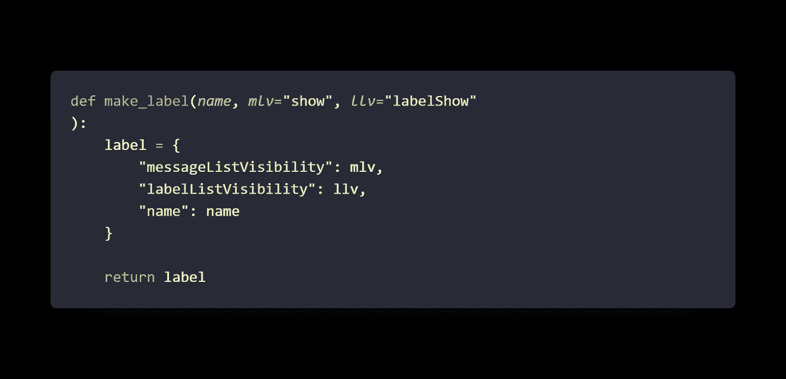*

*这是一个创建标签的简单函数。它需要一个名称和另外两个可选参数。如果没有指定，`show`和`labelShow`将被默认使用。*

*标签被创建为字典，然后被返回。*

*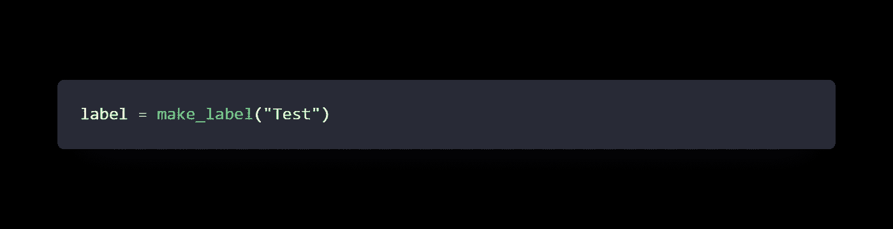*

*要创建名为`Test`的标签，我们将使用上面的语法。*

## *向 API 发出请求*

*是时候向 API 发出实际请求，并将我们的标签传递到我们的 Gmail 帐户了。让我们遵循和上次一样的程序。*

*我用颜色标记了到`create`方法的路径。*

*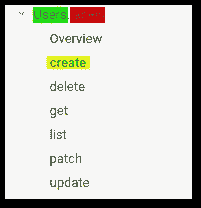*

*与我们上次的 API 调用相比，我们没有太大的变化。我们从之前创建的`service`开始，添加每个方法，直到到达`create`方法。然而，我们在这方面还没有完全完成。*

*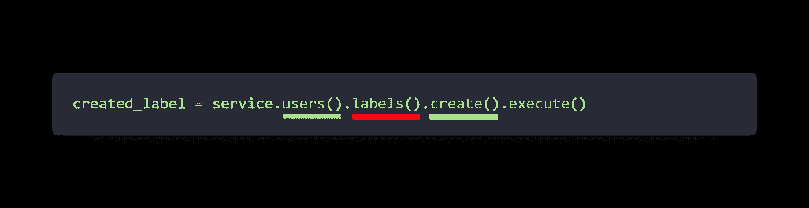*

*如果我们滚动到文档的参数部分，我们会看到我们需要将`userId`作为参数传递，就像我们的最后一个调用一样。*

**

*让我们再次使用`me`，就像文档建议的那样。*

**

*我们仍然缺少一些东西:实际的标签。我们还需要在请求中传递标签。让我们再次向下滚动到请求正文。*

*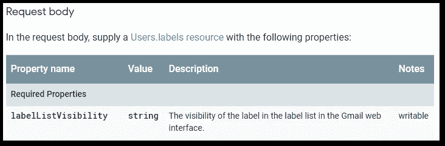*

*我们已经创建了具有所有必需属性的标签，所以我们需要在请求体中传递它。这可以通过简单地向名为`body`的`create`方法添加另一个参数来实现。*

*让我们在其中传递我们的`label`对象。*

*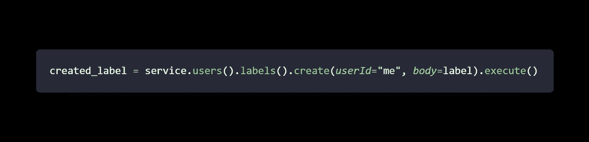*

*实际的调用已经完成，但是为了添加一些错误检查，让我们将它包装到一个 try/except 语句中。*

*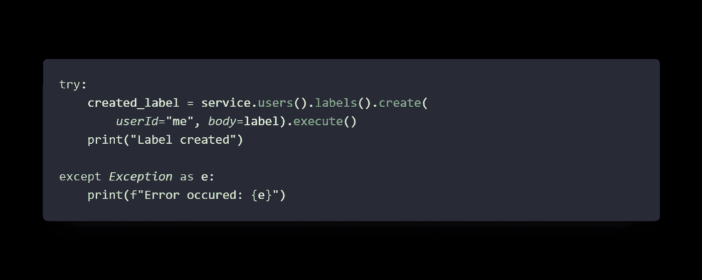*

*如果出现问题，错误消息将会打印在我们的控制台上。如果一切按计划进行，将打印出`Label created`(并且标签将被创建)。*

*因此，让我们回头看看我们为创建新的 API 请求而创建的代码部分:*

*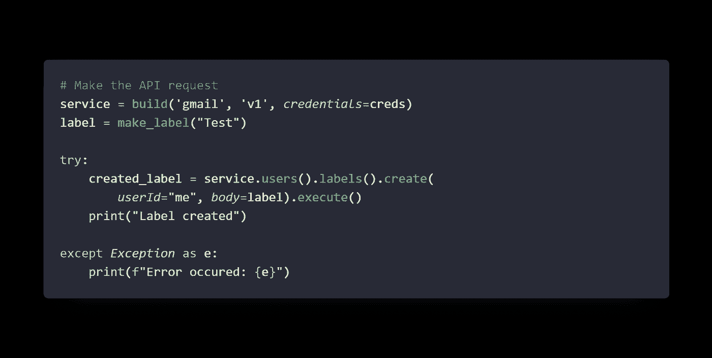*

*API 处理实际上并不困难。实际的获取并不需要很多行代码——棘手的部分是授权，我们甚至不需要自己处理。*

*如果我们用`python gmail.py`保存并运行代码，我们的 Gmail 帐户中应该会创建一个新标签。*

**

# ***搞定！***

*我们成功地从零开始对 Gmail 进行了 API 调用，并创建了自己的标签。同样的基本原则也适用于 Gmail API 和其他 Google APIs 中的大多数其他方法。*

*请随意尝试提出其他要求，以便掌握诀窍。最好的学习方法是练习。一旦你开始理解文档，创建你自己的调用并不困难。*

*尝试创建自己的邮件草稿，或者基于查询获取所有收件箱邮件——所有内容都在文档中指定。*

*如果你想看看我们例子的最终结果，我已经在 GitHub 上提供了[的完整代码](https://github.com/banjoanton/gmail-api-guide/blob/master/gmail.py)。祝你的项目好运，编码愉快！*