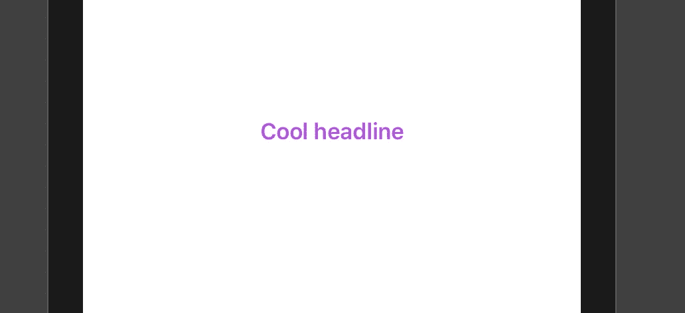
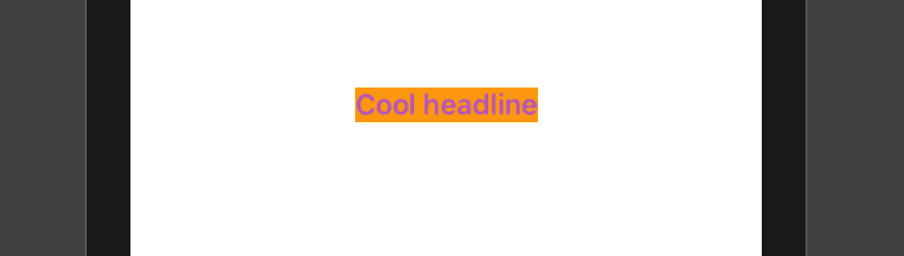
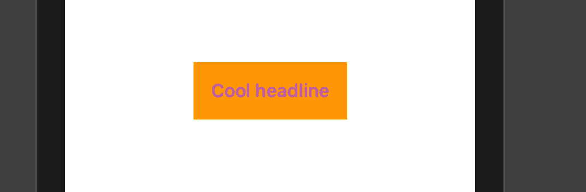
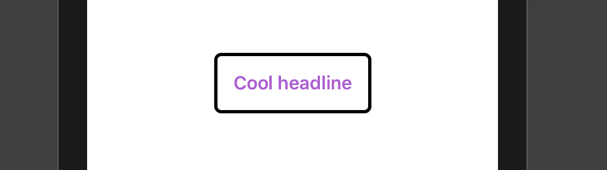

# 在 SwiftUI 中查看修改器的初学者指南

> 原文：<https://betterprogramming.pub/a-beginners-guide-to-view-modifiers-in-swiftui-8782c3e44d75>

## 创建包含其他元素的自定义 SwiftUI 元素

照片由[约书亚·索蒂诺](https://unsplash.com/@sortino?utm_source=unsplash&utm_medium=referral&utm_content=creditCopyText)在 [Unsplash](https://unsplash.com/s/photos/abstract?utm_source=unsplash&utm_medium=referral&utm_content=creditCopyText) 上拍摄

保持 UI 的一致性，同时保持代码库的整洁是必须的。但是我们如何在 SwiftUI 中实现这一点呢？

开发一个喜爱的/严肃的项目是学习一个新框架或范例的完美方式。SwiftUI 也不例外。

在这样做的时候，我偶然发现必须在几个屏幕上使用相同的组件:标题、副标题和按钮。在项目中为不同的 UI 构建块提供迷你 UI 库非常有帮助。

# 什么是视图修改器？

在 SwiftUI 中，我们可以通过视图修改器将现有的 UI 组件(如`Text`、`TextField`和`Button`)与我们自己的共享样式一起使用。

一个*视图修饰符*是视图实例的一个方法。它的作用是:

*   采用视图(或另一个修改器)
*   制作视图的副本
*   在对其样式进行一些更改后，返回修改后的视图。

如果您已经尝试过使用 SwiftUI 构建 UI，那么您有 99%的可能使用过视图修改器。有一些内置的修改器可以帮助你改变屏幕的形状。要获得完整的列表，您可以浏览文档。

在 Xcode 中，在源代码编辑器中“按住 Option 键点按视图”，然后点按“在开发人员文稿中打开”

最简单的例子是对`Text`视图应用填充或字体:

向文本组件添加字体、颜色和填充

这是我们应用这些修改器后的结果:

# 排序视图修改器

要记住的一点是，有时应用视图修饰符的顺序会影响 UI 的结果。有时并不是这样。

在我们的示例中，以下内容具有相同的结果(如最后一幅图所示)。

"使用标题字体并使其为紫色" = "使其为紫色并使用标题字体。"

但是如果你想添加背景色，那就另当别论了。下面你添加一个橙色背景，然后一些填充。

这里你添加填充，然后一个橙色背景。

## 解释时间

`.padding()`是一个增加视图周围间距的修饰符。这里调用它时没有参数，所以 SwiftUI 在顶部、左侧、底部和右侧添加了默认填充。

如果没有参数，SwiftUI 会在所有四个方向添加默认填充，但您可以自己配置该填充。示例:

在第一个示例中，首先应用背景色，然后应用间距。

在第二个例子中，当您首先应用`padding`时，背景颜色被应用到不同的放大视图。

为了更好地说明问题，请尝试在填充前后添加背景色。

填充在文本和视图边缘之间增加了一些空间。红色背景色应用于仅包含文本的视图。填充修改器产生一个新视图，橙色背景应用于该视图。

有时，您可以使用这种方法来直观地调试更复杂的预览(例如，检查填充、边框、定位等)。).就像来自 React 原生世界的`{ borderWidth: 1 }`。

# 自定义视图修改器

这太好了。但是如果你在整个应用程序中有几个紫色的标题呢？每次都告诉短信“做一个带填充的紫色标题”并不是一个好的解决方案，不是吗？

你可能会说，“我希望能够写出这样的东西”:

`Text("Cool headline").purpleHeadline()`

幸运的是，我们可以在内置修改器的基础上创建自己的修改器。我们可以给它们起相应的名字。

我知道你很忙，所以代码如下:

首先，创建一个实现`ViewModifier`协议的`struct`。

然后，实现`func body(content: Content)`函数，在这里你将应用所有你需要的修改器。

## 解释时间

它所做的是获取视图(内容)并使用应用的修饰符返回它。因为我们将这个自定义修改器应用到一个视图，所以我们可以向它添加一个扩展:

*   您可以随意命名该函数
*   确保它返回`some View`

在创建的方法中，指定要应用的内容和自定义修饰符。

`ModifiedContent`表示应用了视图修饰符的包装器值。

现在写`Text("Cool headline").purpleHeadline()`就有意义了。

# 带参数的修饰符

什么？定制你的自定义修改器？也许用一些值作为参数？

我还以为你不会问呢！

当然，我们的自定义视图修改器可以带参数。我们要做的是在结构中或者在`init`方法中指定它们，如果你需要更多的定制(基于那些值)。

例如，让我们创建另一个向视图添加边框的自定义修改器。除此之外，我们将指定边框宽度和半径。

归根结底，视图修饰符只是一个`struct`，所以我们可以利用存储的属性。在这个例子中，我们使用`borderRadius`和`borderWidth`来定制覆盖。

用法:

# 从这里去哪里

你不应该不使用任何你需要的修饰语。有很多选项可以用来修改 UI 控件在屏幕上的外观，比如大小、粗细、覆盖、圆角半径。

大多数时候，你不会记得修饰语和他们的签名。这就是为什么你应该使用文档。

总是使用 Apple Docs，所以我再写一遍:在 Xcode 中，在源代码编辑器中的任何视图上“按住 Option 键点按”，然后点按“在开发者文档中打开”

在下一篇文章中，我将讨论在按钮上应用视图修改器，以及我们如何开始拥有一个适合 SwiftUI 项目的迷你 UI 库。跟紧了。