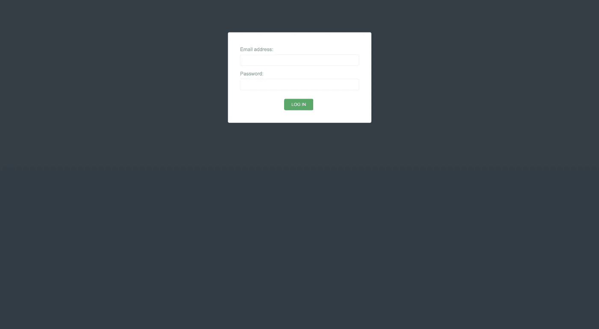
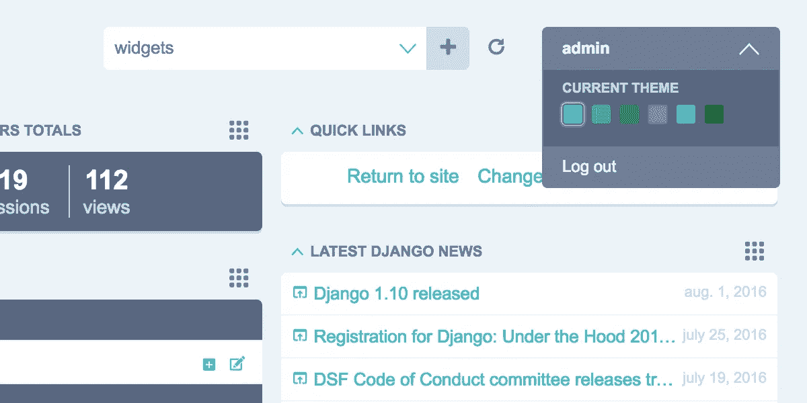
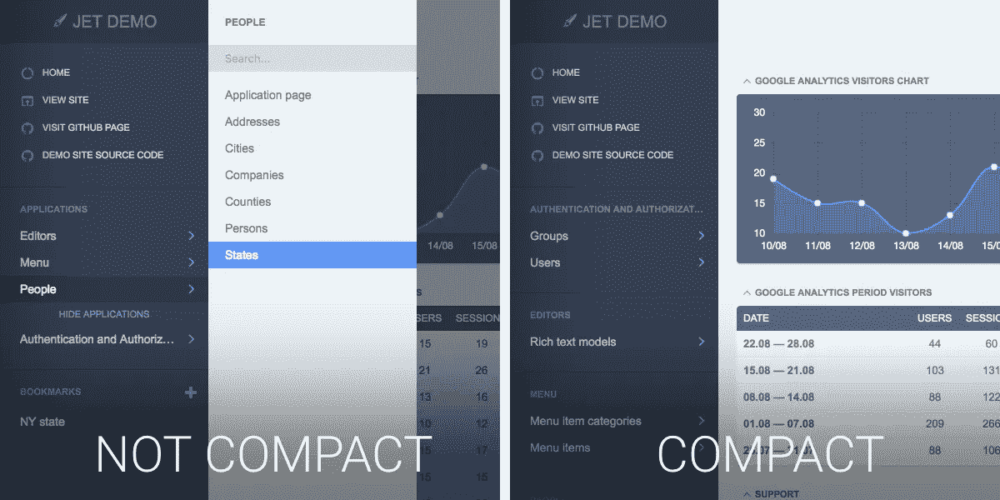

# 使用 Django Jet 改进您的 Django 管理面板

> 原文：<https://betterprogramming.pub/a-better-admin-for-your-django-app-b6302ae06847>

## 一个更好的 Django 应用程序管理员


django-jet-reboot 的管理示例。([来源](https://github.com/assem-ch/django-jet-reboot))

每个 Django 开发者都喜欢它的开箱即用的管理面板，对吗？嗯，不完全是…让我们来看看一个好的替代方案。

虽然 Django 允许开发者快速从 0 升级到 *live* 的能力是的一大优势，但基本管理面板的外观可能无法与 Django 页面当前的*外观和感觉*保持一致。

如果你对管理面板有更多的要求，但没有时间通过创建你自己的自定义视图来完全自定义它，我强烈建议试试`django-jet-reboot` 。

Django Jet Reboot 是在 Django Jet 的基础上重新启动的，这使得改进管理面板的整体外观变得非常容易。

> 它只支持 Django >= 3.0 和 Python >= 3.7，所以在继续之前要考虑这一点。
> 
> 在你继续之前:这个库和 django-jet 都有 AGPLv3 许可证。这个许可证是一个很强的版权所有的许可证，所以要小心它的发展。Jet 提供 65 美元(一个项目)的商业许可。

## 让我们开始吧

1.  使用`pip`下载并安装 Django JET Reboot 的最新版本

```
pip install django-jet-reboot
```

2.将它添加到 Django 设置的`INSTALLED_APPS`部分

> **重要**:应该在 django.contrib.admin 之前

```
INSTALLED_APPS = (
    ...
    'jet',
    'django.contrib.admin',
)
```

3.确保`settings.py`上的`django.template.context_processors.request` 已启用:

```
TEMPLATES = [
    {
        'BACKEND': 'django.template.backends.django.DjangoTemplates',
        'DIRS': [],
        'APP_DIRS': True,
        'OPTIONS': {
            'context_processors': [
                ...
                'django.template.context_processors.request',
                ...
            ],
        },
    },
]
```

4.将 Django Jet URL 模式添加到项目的 URL 文件中。

```
urlpatterns = patterns(
    '',
    path('jet/', include('jet.urls', 'jet')),  # Django JET URLS
    path('admin/', include(admin.site.urls)),
    ...
)
```

5.运行`migrate`创建数据库表

```
python manage.py migrate jet
```

> *如果您不在生产环境中，可以跳过下一步。*

运行`collectstatic` *:*

```
python manage.py collectstatic
```

清空浏览器的缓存，并进行测试！

如果一切正常，您现在应该会在您的`/admin` URL 上看到 Django Jet 的登录页面:



django-jet-reboot 管理面板的登录页面。

不过先不要登录，我们可以做得更好…

我们还需要安装 Django Jet Dashboard 应用程序，以获得该库提供的所有好东西。

6.将 dashboard 应用程序添加到您的`settings.py`:

```
INSTALLED_APPS = (
    ...
    'jet.dashboard',
    'jet',
    'django.contrib.admin',
    ...
)
```

7.现在将仪表板`urls`添加到您的主`urls`文件中:

```
urlpatterns = patterns(
    '',
    path('jet/', include('jet.urls', 'jet')),  # Django JET URLS
    path('jet/dashboard/', include('jet.dashboard.urls', 'jet-dashboard')),  # Django JET dashboard URLS
    path('admin/', include(admin.site.urls)),
    ...
)
```

8.创建模型(*再次…* )

```
python manage.py migrate dashboard
```

> *如果您不在生产环境中，可以跳过下一步。*

运行`collectstatic`(再次运行*……*)

```
python manage.py collectstatic
```

就是这样。现在说真的。登录到您的管理面板，看看吧！

现在让我们对它进行一点定制…

# 用户化

现在，这部分来自 [django-jet](https://github.com/geex-arts/django-jet) 。配置在 settings.py 文件中处理。

# 主题

Jet 有 6 个主题可供您使用:

*   系统默认值
*   绿色的
*   浅紫色
*   浅绿色
*   浅蓝色
*   浅灰色

要设置新主题，只需将`JET_DEFAULT_THEME`添加到您的设置中。

```
JET_DEFAULT_THEME = 'light-gray'
```

您也可以通过在您的`settings.py`中添加一个可能的主题列表，让用户动态地决定主题:

```
JET_THEMES = [
    {
        'theme': 'default', # theme folder name
        'color': '#47bac1', # color of the theme's button in user menu
        'title': 'Default' # theme title
    },
    {
        'theme': 'green',
        'color': '#44b78b',
        'title': 'Green'
    },
    {
        'theme': 'light-green',
        'color': '#2faa60',
        'title': 'Light Green'
    },
    {
        'theme': 'light-violet',
        'color': '#a464c4',
        'title': 'Light Violet'
    },
    {
        'theme': 'light-blue',
        'color': '#5EADDE',
        'title': 'Light Blue'
    },
    {
        'theme': 'light-gray',
        'color': '#222',
        'title': 'Light Gray'
    }
]
```

这将允许用户选择:



django-jet 主题选择器([来源](https://jet.readthedocs.io/en/latest/config_file.html)

您也可以使用 Jet 添加自己的配色方案。为此，向`/static/jet/css/themes/<my_theme>`添加一个新文件夹

文档告诉我们你可以使用`/jet/static/jet/css/themes/light-violet/` 文件夹作为例子。

`_variables.scss`包含`all`可定制的变量。

你必须编译所有的。scss 文件放在`theme`目录下，开始使用你自己的主题。

# 菜单

菜单可以像这样压缩或扩展

```
JET_SIDE_MENU_COMPACT = True
```



扩展菜单与紧凑菜单([来源](https://jet.readthedocs.io/en/latest/config_file.html))

默认情况下，`JET`在侧边菜单中按字母顺序显示所有应用程序及其型号。这很好，但我发现它通常不适合大多数项目，因为往往有比其他模型更重要的模型需要用户访问。

让我们自定义菜单项…

要显示您想要的应用程序和模型或更改它们的顺序，您可以在您的`settings.py`中使用`JET_SIDE_MENU_ITEMS`:

```
JET_SIDE_MENU_ITEMS = [  # A list of application or custom item dicts
    {'label': _('General'), 'app_label': 'core', 'items': [
        {'name': 'help.question'},
        {'name': 'pages.page', 'label': _('Static page')},
        {'name': 'city'},
        {'name': 'validationcode'},
        {'label': _('Analytics'), 'url': 'http://example.com', 'url_blank': True},
    ]},
    {'label': _('Users'), 'items': [
        {'name': 'core.user'},
        {'name': 'auth.group'},
        {'name': 'core.userprofile', 'permissions': ['core.user']},
    ]},
    {'app_label': 'banners', 'items': [
        {'name': 'banner'},
        {'name': 'bannertype'},
    ]},
]
```

每个项目可以有以下键

*   `app_label` —应用名称(*您的 django 应用的名称*)
*   `label` —应用文本标签
*   `items` —子项目列表
*   `url` —自定义 url(格式如下所述)
*   `url_blank` —在新表格中打开 URL(布尔值)
*   `permissions` —显示项目所需的权限列表

`items` 为必填字段。另外，`app_label` 或者`label` 都是必填项。任何定义上的错误都不会在门户中显示菜单。

每个菜单项也是一个字典，包含以下键:

*   `name` —型号名称(可以是`MODEL_NAME`或`APP_LABEL.MODEL_NAME`)
*   `label` —项目文本标签
*   `url` —自定义 url(格式如下所述)
*   `url_blank` —在新表格中打开 url(布尔值)
*   `permissions` —显示项目所需的权限列表

对于项目，需要设置名称或标签。尊重项目的顺序。

请访问[文档](https://jet.readthedocs.io/en/latest/index.html)获取可定制项目的完整列表。为了避免这篇文章过长，我在这里省略了 2 或 3 个，但是您也可以自定义搜索的自动完成功能和面板的过滤器。

# 结论

值得吗？嗯，*如果你没有时间创建自己的定制管理面板，那就是*。例如，当你拿起 Django 来快速创建一个 MVP 或原型时，这种情况更常见。

如果你有时间并且需要一个真正定制的 Django 管理面板，我建议你自己创建视图，并覆盖 Django 自带的默认面板。Django 的一个非常好的特性是，管理中的这些视图都是可定制的(*这就是 django-jet 这样的软件包正在做的*)。

我会试着在专题里写一篇关于这个的文章。同时,[这里的](https://adriennedomingus.medium.com/adding-custom-views-or-templates-to-django-admin-740640cc6d42)是我认为由@ [Adrienne Domingus](https://medium.com/u/104ffdc9bb29?source=post_page-----b6302ae06847--------------------------------) 创作的一部好作品。

总而言之，Jet 是非常可定制的，并且对于管理员来说，它比默认面板有更好的外观和感觉，所以我肯定会推荐这种方法。

# 来源

[Django Jet 重启](https://github.com/assem-ch/django-jet-reboot)

[Django Jet Docs](https://jet.readthedocs.io/en/latest/)

感谢阅读！