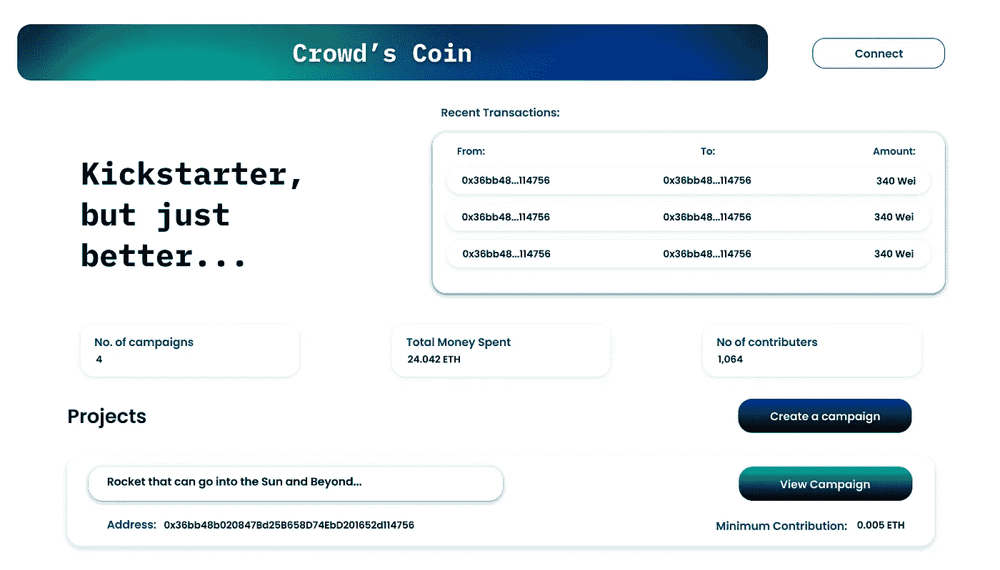
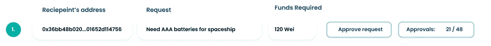
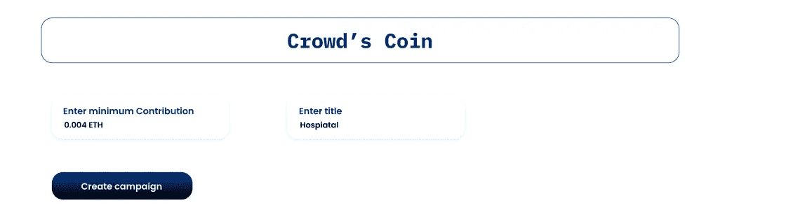
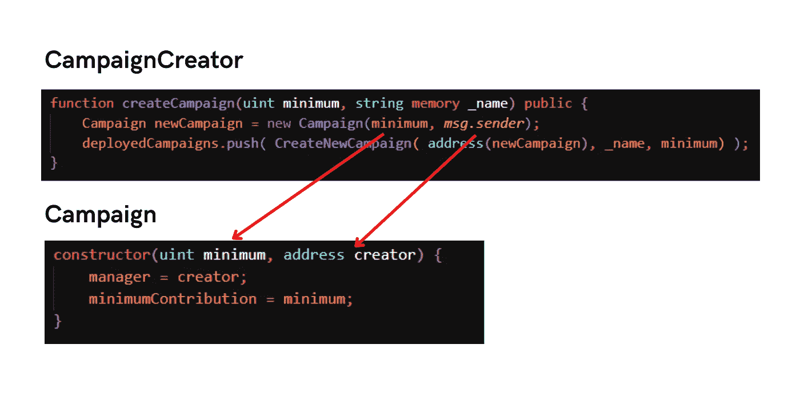
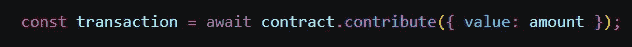
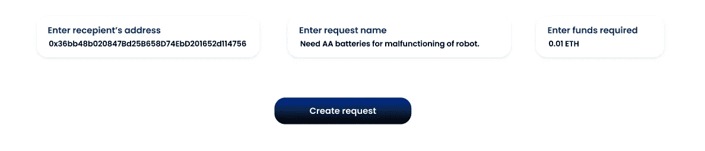
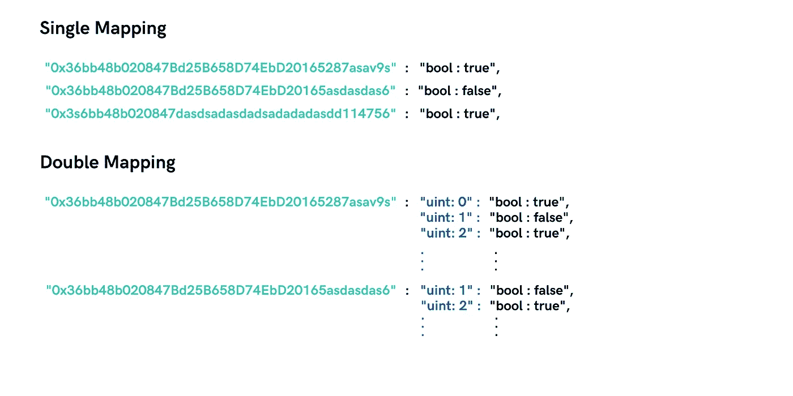
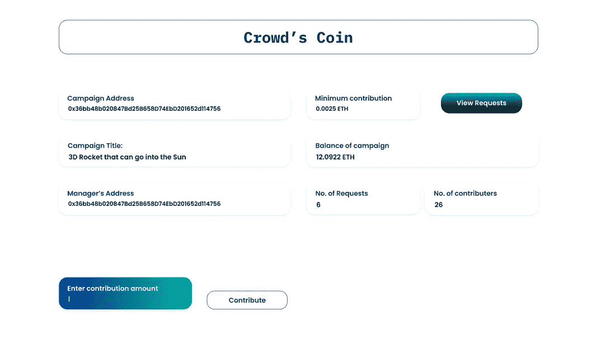

# 使用 Web3.0 的 Kickstarter 的更好版本——Solidity

> 原文：<https://betterprogramming.pub/a-better-version-of-kickstarter-using-web3-0-solidity-8bbea829d2f0>

## 为了防止 Kickstarter 欺诈，贡献者可以对货币决策进行投票



登录页面

在这篇博客中，我将解释如何为 Kickstarter 制作一个原型，该原型将考虑到项目支持者的投票，以做出关于资金去向的重大决定。在这种情况下，活动经理可以创建一个请求，其中他可以提到收件人的地址和收件人的服务，人们可以投票决定是否批准该服务。



参与者查看的请求示例。

然而，这是一份聪明的合同。智能合同可以被定义为一个实体，它可以发送和接收货币( *crypto* )，而不仅仅是网络上的用户。这是一段管理你的钱以及你如何引导它执行特定功能的代码——因此，是区块链上的程序！

这些程序一旦部署就不能修改，并且是最终版本。我们不要深入讨论智能合约的许多有益方面，因为有许多方面，而且时间是相对的。

我将在这里解释智能合约。

1.  创建市场活动的合同。
2.  处理活动经理如何创建请求以及其他人如何与之交互的合同。

先说我们的编译器版本和契约函数。

```
pragma solidity ^**0.8.15**;contract CampaignCreator{}
```



创建活动页面。

我们将从创建一个结构开始，它接受上面的细节。

```
struct CreateNewCampaign{
    **address** addressOfNewCampaign;
    **string** name;
    **uint** minimumContribution;
}
```

*   `addressOfNewCampaign` →要创建的活动的地址。
*   `name` →要创建的活动的标题。
*   `minimumContribution` →投票选举活动决策所需的最低捐款额。

现在用一个数组来存储上述结构的列表。

```
CreateNewCampaign[] public deployedCampaigns;
```

这里，创建数组的语法如下:

```
data_type [] visibility name_of_the_array;
```

现在，一个创建活动的函数，接受 2 个参数→活动的最小贡献和标题。

```
function **createCampaign**(uint minimum, string memory _name) public {Campaign newCampaign = new Campaign(minimum, *msg.sender*);**deployedCampaigns**.push( **CreateNewCampaign**( address(**newCampaign**), _name, minimum) );}
```

Line: 1 — `Campaign newCampaign = new Campaign(minimum, *msg.sender*);`这里，`**Campaign**`是我们稍后要编码的活动契约，`**newCampaign**` 是它的实例。我们传入两个参数，即`minimum`和`msg.sender`，这两个参数调用活动契约的构造函数，我们稍后将在本博客中介绍。
Line: 2 — `**deployedCampaigns**.push(
**CreateNewCampaign**( address(newCampaign), _name, minimum)
);`这里，我们只是将新创建的合同的值放入我们创建的活动列表中。

最后，在这个合同中，检索所有活动的功能。

```
function **getDeployedCampaigns**() public view returns ( CreateNewCampaign[] memory) {return deployedCampaigns;}
```

## 让我们现在开始活动合同—

```
contract Campaign{}
```

当一个契约被调用时，首先调用的是构造函数。

我们将使用两个变量`manager`和`minimumContribution`来获取活动经理的值和活动的最小贡献。

```
address public **manager**;
uint public **minimumContribution**;**constructor**(uint minimum, address creator) { manager = creator;
    minimumContribution = minimum;}
```



访问活动合同的构造者。

现在，创建一个接受贡献的函数。无论谁投稿，都可以批准活动决策/请求。但在此之前，我们需要将我们的审批者存储在某个地方。

```
mapping(address => bool) public contributer;
```

这个映射帮助我们检查一个特定的地址(用户)是否有贡献。我们只需要将密钥地址改为 true。默认情况下，此映射中的所有值都将为假。

此外，还有一个获取贡献者计数的变量。

```
uint public **countOfContributers**;function **contribute**() public **payable**{ require( msg.value > minimumContribution );
  if(contributers[msg.sender] == false)
  {
    contributers[msg.sender] = true;
    countOfContributers++;
  }}
```

首先，该函数被标记为`payable`，这意味着它接受付款。

第 1 行— `require( msg.value > minimumContribution );`这一行检查发送的值是否大于最小贡献值。`msg.value`是正在发送的 ETH 的数量。



上面的函数是如何调用的。

下一个 if 语句检查调用 contribute 函数的地址(用户)是否已经是 contributor，如果不是，那么它写入`contributers`映射并增加`countOfContributers` uint。
这样做是为了正确统计贡献者人数，以防有人不止一次贡献。

## 现在是困难的部分，提出贡献者可以投票的请求。

首先，创建一个定义请求的结构。

```
struct Request{ string title;
   uint fundsRequired;
   address receiver;
   uint approvalCount;
   bool complete;}
```

`title` →请求标题
`fundsRequired` →所需资金
`receiver` →资金(ETH)的接收地址，以完成请求。
`approvalCount` →批准请求的人数。
`complete` →请求的状态，如果完成，则为真。



创建请求页面

现在用一个数组来存储请求列表。

`Request[] public requestsArray;`

现在，创建请求的函数。

```
function **createRequest** ( string memory _title , uint _funds , address _receiver ) public{**requestsArray**.push( Request( _title, _funds,_receiver,0, false ) );}
```

## 注意:

我们使用`memory` 来访问函数中作为参数的字符串，基本上内存所做的是，将被访问变量的范围限制在函数本身。

现在让我们批准这些请求:)

```
function approveRequest( uint idOfRequestToApprove ) public {Request storage requestToApprove = requestsArray[idOfRequestToApprove];**require**( contributers[msg.sender] == true );**require**( approvalsOfAllRequests[msg.sender][idOfRequestToApprove] == false );**approvalsOfAllRequests**[msg.sender][idOfRequestToApprove] = true;**requestToApprove**.approvalCount++;}
```

我们用一个`uint` 参数调用上面的函数— `idOfRequestToApprove`这个参数用于访问一个特定的请求，例如:`approveRequest(0)`将获得请求数组`requestsArray`中的第一个请求。

第 1 行— `Request storage requestToApprove = requestsArray[idOfRequestToApprove];`该行接受`requestsArray`中的`idOfRequestToApprove` ( 0，1，2，3，4，5 … a 数)请求，并将其存储到`requestToApprove`结构中。所以我们可以从`requestsArray`访问实际的请求。→我们为此使用存储(存储→存储—通过引用分配)。

第 2 行— `**require**( contributers[msg.sender] == true );`，只是检查批准请求的地址(用户)是否是贡献者。

第 3 行—这一行用于检查地址(用户)是否已经批准了请求。这是通过双重映射完成的。

```
**mapping** ( **address** => **mapping**( uint => bool )) **approvalsOfAllRequests**;
```

这里我们用另一个映射来映射地址，这个映射的键是 uint，值是 bool，这里 uint 是请求 ID，bool 是地址是否批准了请求。假设我们想知道 XYZ 地址是否对第三个请求进行了投票？

```
return approvalsOfAllRequests[XYZ][2] == true;
```



第 4 行—该行用于防止地址(用户)再次批准同一请求。
第 5 行——最后，我们从我们在此函数中访问的相应请求的请求结构中增加批准计数。

最后一个功能是完成一个请求。我们确实走过了漫长的道路:)

```
function finaliseRequest( uint idOfRequestToApprove)  public {require(msg.sender == mananger);Request storage requestToApprove = requestsKaArray[idOfRequestToApprove];require(requestToApprove.approvalCount>(countOfContributers/2));require( requestToApprove.complete == false );require ( address(this).balance > requestToApprove.fundsRequired );requestToApprove.complete == true;payable( requestToApprove.receiver ).transfer(requestToApprove.fundsRequired);}
```


最终确定请求

类似于 approve 函数，我们传递我们想要访问的请求的 uint → ID。

第 1 行— `require(msg.sender == mananger);`检查调用最终功能的地址(用户)是否是活动经理。我们不希望别人来完成我们的请求，是吗？

第 2 行—类似于批准功能。

第 3 行— `require(requestToApprove.approvalCount >(countOfContributers/2));`这是为了检查大多数贡献者是否批准了请求。

第 4 行— `require( requestToApprove.complete == false );`检查请求是否尚未完成。

第 5 行— `require ( address(this).balance > requestToApprove.fundsRequired );`这是检查合同是否有足够的余额来执行对接收方的交易。我们在`address(this).balance`前得到合同的余额。

第 6 行— `payable( requestToApprove.receiver ). transfer ( requestToApprove . fundsRequired );`最后，我们向收款人支付资金:)

以下是完整的代码:

```
[https://gist.github.com/Khanisic/5d069575addc0716ce09d4e849027be1](https://gist.github.com/Khanisic/5d069575addc0716ce09d4e849027be1)
```



我们的活动页面

## 链接

*   [维尔塞尔部署的链接](https://crowdcoin-five.vercel.app/)
*   [Github](https://github.com/Khanisic/Crowdcoin)
*   [Figma 设计文件](https://www.figma.com/file/Tx5fzNUGJ1vB4CcsqsWfIj/Crowdcoin's-Figma?node-id=0%3A1)