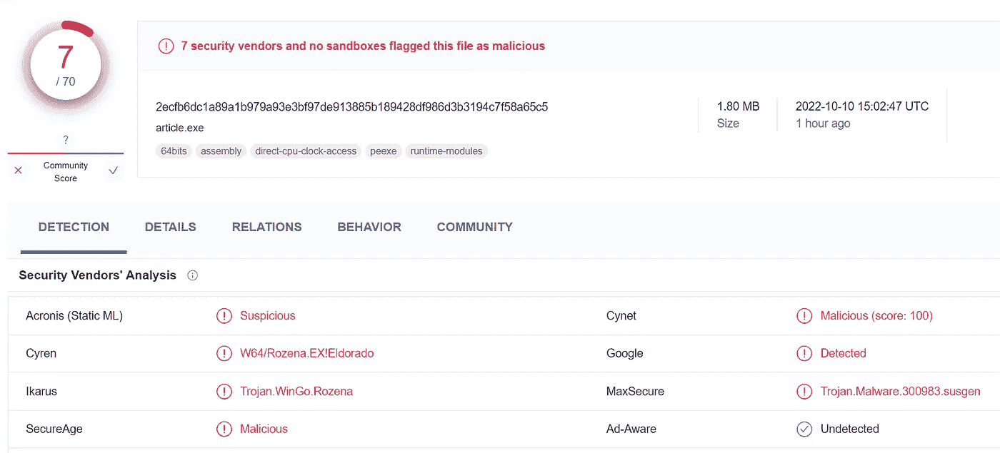
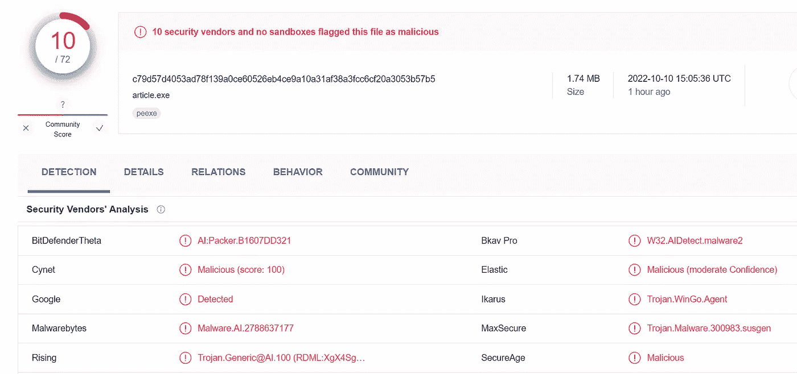
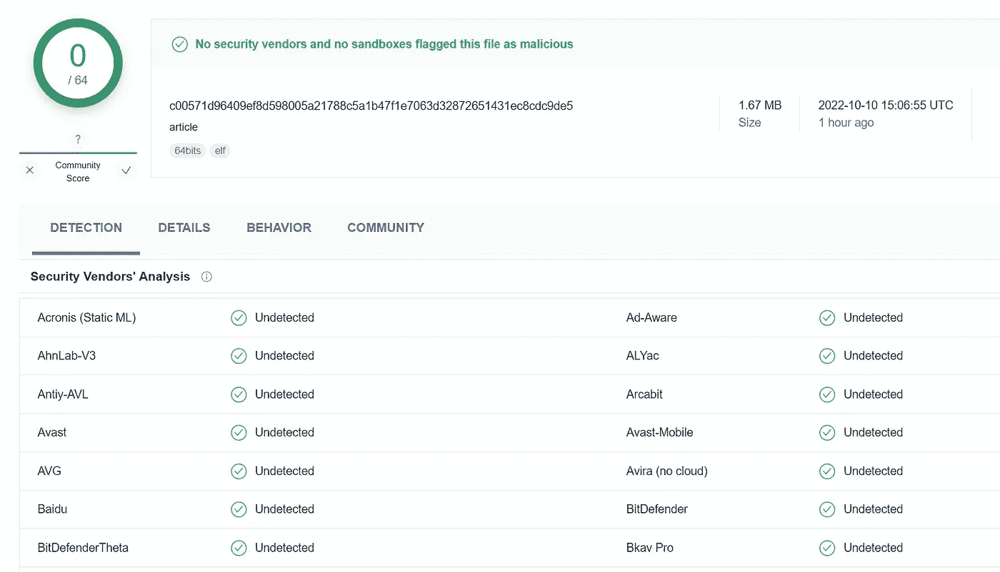
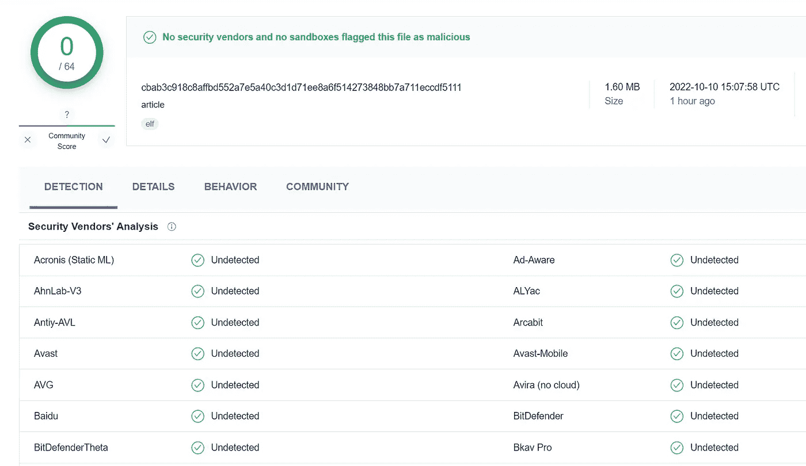
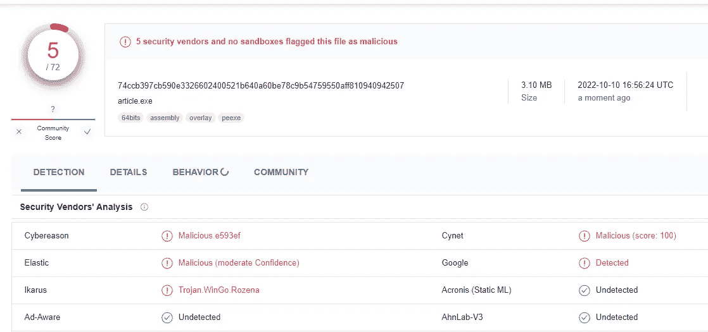
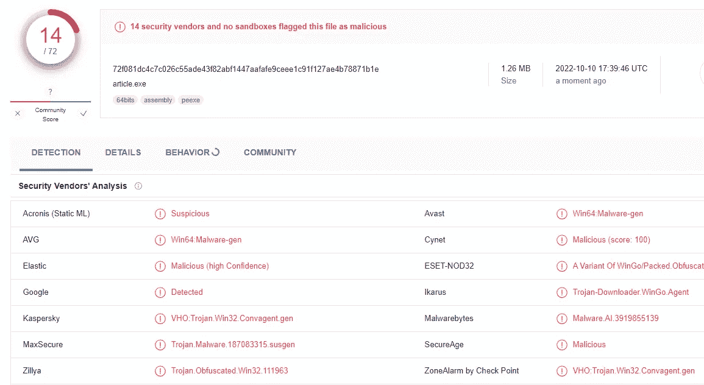

# 围棋中一个没人谈论的大问题

> 原文：<https://betterprogramming.pub/a-big-problem-in-go-that-no-one-talks-about-328cc3e71378>

## 由于谷歌和微软之间缺乏沟通，将 Go 项目编译成 Windows 可执行文件是有问题的

在 [Unsplash](https://unsplash.com?utm_source=medium&utm_medium=referral) 上 [Elisa Ventur](https://unsplash.com/@elisa_ventur?utm_source=medium&utm_medium=referral) 拍摄的照片

# 交叉编译 Go 项目

如果你是一名 Go 开发者，你可能知道交叉编译是这种语言的一大特色。这允许您在一个平台上编译代码，以便在另一个平台上使用。例如，您可以在 Mac 上编译代码，以便在 Windows 机器上使用。这对于那些希望代码面向多个平台的开发人员来说非常棒。

然而，当编译 Go 项目以在 Windows 上使用时，有一个大问题。

# 问题是

为 Windows 编译 Go 项目时，会创建一个二进制文件(在 Windows 上，这些文件是。exe 文件)。Go 如何编译这个二进制文件的过程是相对独特的，并且经常混淆反病毒扫描程序，导致二进制文件被错误地检测为病毒。

这当然很成问题，因为可能发生浏览器根本不允许下载编译后的文件的情况。我的一个开源项目就是这样。用户无法下载新版本。如果他们禁用了 Chrome 中的病毒扫描程序并下载了可执行文件，则该文件会在下载后被 Windows Defender 直接删除。这使得不关闭整个计算机的病毒防护就无法安装该程序。

# 问题分析

我用 Go 编写了一个简单的“Hello World”程序，并针对 Windows、Linux 和 macOS 进行了编译。以下是不同病毒扫描程序的结果:

经过测试的源代码

我没有包括 macOS 的测试结果，因为它们与 Linux 的测试结果相同。

目前所有程序都是最新版本(v1.19.2)。

## 为 Windows 编译

64 位:`GOOS=windows GOARCH=amd64`

[https://www . virus total . com/GUI/file/2 ecfb 6 DC 1a 89 a1 b 979 a 93 e 3 BF 97 de 913885 b 189428 df 986 d3b 3194 c 7 f 58 a 65 c 5？nocache=1](https://www.virustotal.com/gui/file/2ecfb6dc1a89a1b979a93e3bf97de913885b189428df986d3b3194c7f58a65c5?nocache=1)

32 位:`GOOS=windows GOARCH=386 go build .`

[https://www . virus total . com/GUI/file/c 79d 57d 4053 ad 78 f 139 a 0 ce 60526 EB 4 ce 9 a 10 a 31 af 38 a 3 FCC 6 cf 20 a 3053 b 57 b 5？nocache=1](https://www.virustotal.com/gui/file/c79d57d4053ad78f139a0ce60526eb4ce9a10a31af38a3fcc6cf20a3053b57b5?nocache=1)

## 为 Linux 编译

64 位:`GOOS=linux GOARCH=amd64 go build .`

[https://www . virus total . com/GUI/file/c 00571d 96409 ef 8d 598005 a 21788 C5 a1 b47 f1 e 7063d 32872651431 EC 8 CDC 9 de 5？nocache=1](https://www.virustotal.com/gui/file/c00571d96409ef8d598005a21788c5a1b47f1e7063d32872651431ec8cdc9de5?nocache=1)

32 位:`GOOS=linux GOARCH=386 go build .`

[https://www . virus total . com/GUI/file/CBA B3 c 918 c 8 affbd 552 a 7 e 5a 40 C3 D1 d 71 ee 8 a6 f 514273848 bb 7a 711 eccdf 5111？nocache=1](https://www.virustotal.com/gui/file/cbab3c918c8affbd552a7e5a40c3d1d71ee8a6f514273848bb7a711eccdf5111?nocache=1)

尽管构建是一个简单的“Hello World”程序，但 Windows 构建会触发一些病毒扫描程序。在我们的“Hello World”示例中，Windows Defender 没有检测到任何内容。不幸的是，这种情况在真实的程序中更常见。

此外，我们还可以看到，32 位版本比 64 位版本更容易被检测到。

令人担忧的是，几乎任何 Windows 版本都会被检测为病毒，不管程序实际上做了什么。尤其是在开源场景下，这是一个很大的打击。通常，这些程序背后没有大公司，而是私人，他们可以积极地处理他们的发布。在许多情况下，错误的病毒检测会导致这样一个事实，即如果不手动覆盖防病毒保护，项目就无法在 Windows 下安装，这通常被认为是不好的。

# 缺乏沟通

在我看来，主要问题是谷歌和微软之间缺乏沟通。

谷歌拥有围棋。因此，谷歌应该努力确保用 Go 编写的程序能在所有支持的平台上流畅运行。毕竟 Go 最大的一个特点就是交叉编译。另一方面，微软也应该确保它的病毒扫描器不会仅仅因为程序使用某种编程语言就怀疑它们是无害的。

特别是因为微软还拥有 GitHub，微软应该对帮助开源社区有特殊的兴趣。

因此，最好的解决方案是让谷歌和微软的相关团队一起努力解决这个问题。

毕竟，这个问题已经存在很多年了，谷歌唯一的官方声明是一个 FAQ 条目，其中这种行为被归类为正常。应该是不正常的。

> 商业病毒扫描程序经常被 Go 二进制文件的结构搞糊涂，它们不像其他语言编译的程序那样经常看到这种结构。
> (来源:[https://go.dev/doc/faq#virus](https://go.dev/doc/faq#virus))

# 变通办法

不幸的是，这个问题不容易解决。但是，有一些方法可以帮助防止可执行文件被视为病毒。

## 导入“C”

在互联网上，您经常读到导入“c”会有所帮助。因为 CGO 随后被用于构建，所以二进制文件的结构会有所改变，并且不容易出现误报。

瞧，这是真的。而不是七个检测，我们现在“只”在 64 位版本中潜水。

不幸的是，这不足以保证良好的部署。

AMD64 构建与 CGO[https://www . virus total . com/GUI/file/74 CCB 397 CB 590 e 3326602400521 b 640 a 60 be 78 c 9 b 547595550 aff 810940942507？nocache=1](https://www.virustotal.com/gui/file/74ccb397cb590e3326602400521b640a60be78c9b54759550aff810940942507?nocache=1)

## 代码签名

另一种方法叫做“代码签名”代码签名是对二进制文件进行加密签名以验证程序和开发人员的来源的过程。然而，为了能够对二进制文件进行签名，您需要一个“代码签名证书”这些证书的起价是每年几百欧元。Windows 直接信任的、不再触发 smartscreen 消息的更好的证书每年的成本高达数千欧元。

这是最常建议的解决方案。不幸的是，签名的二进制文件并不能证明没有病毒。该证书仅证明谁构建了该程序。因此，即使在这里，虚假的病毒消息也可能出现。

## 混淆构建

另一个(经常建议的)方法是，混淆构建。这样，二进制文件的结构就改变了，它不再存储诸如变量名之类的东西(它们被替换成随机值)。我试了一下，这是 64 位构建的结果:

[https://www . virus total . com/GUI/file/72f 081 DC 4c 7 c 026 c 55 ade 43 f 82 abf 1447 aafafe 9 CEE E1 c 91 f 127 AE 4b 78871 B1 e？nocache=1](https://www.virustotal.com/gui/file/72f081dc4c7c026c55ade43f82abf1447aafafe9ceee1c91f127ae4b78871b1e?nocache=1)

如您所见，检测次数甚至增加了一倍。这并不奇怪，因为模糊构建比非模糊构建的行为更加不透明。病毒经常被混淆以隐藏它们的意图。

以 UPX 为例，压缩二进制文件会因为同样的原因产生同样的结果。

## 从病毒数据库中手动删除二进制文件

这是最安全的方法。许多病毒扫描程序，包括 Microsoft Defender，都允许报告错误的检测结果。Microsoft Defender 要求在线填写表格。

不幸的是，以这种方式实现完全自动化的部署管道已经不可能了。每个版本都必须手动提交给微软(和其他病毒扫描公司)进行验证。

# 其他方法

有两种方法可以避免病毒检测，但是它们不太用户友好。

*   告诉你的用户使用“Go install your.package/path@latest"
    Go install 在你用户的设备上编译程序。这不会触发病毒检测。
*   使用 docker 映像
    通过编译 docker 映像，您的用户可以在隔离的环境中运行该映像。这对于测试 CLI 来说通常很好，但是在实际场景中，您的用户可能希望 CLI 位于主机上。

# 结论

等待可能是你现在能做的最好的事情。随着每天越来越多的 Go 项目被编译，病毒扫描程序应该了解其结构并更可靠地检测它。也许谷歌和微软甚至会联合起来，试图更快地解决这个问题。只有时间能证明一切。

如果您有反馈或任何补充，请随时发表评论！