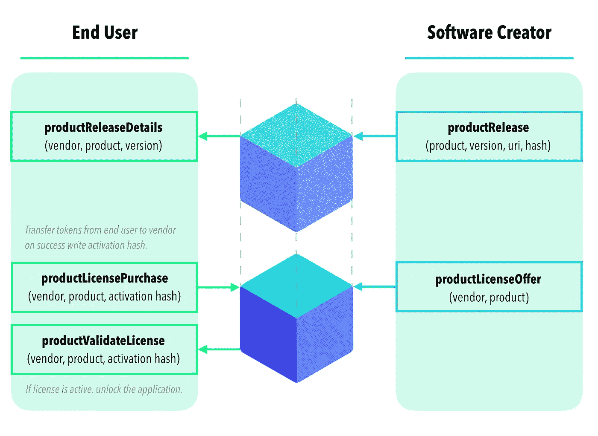

# 数字作品的区块链信任根

> 原文：<https://betterprogramming.pub/a-blockchain-root-of-trust-for-digital-works-4726bbeb3c7e>

## 数字创作者直接向客户分发和销售的一种方式——安全、透明、隐私且不收取额外费用。



不变生态系统中智能合同货币化的流程。中间链中的箭头表示对区块链的写入(需要 gas)，远离的箭头表示读取(免费)。原始图像由亚历克斯·科若卡鲁制作，由 T2 的肖恩·劳里斯修改。

流行的操作系统越来越多地限制数字创作者的选择，拦截他们的客户，同时在法律上和技术上阻挠发行替代方案。许多这些封闭/集中的分发系统缺乏基本的第三方信任验证。当有人从专有商店购买和/或安装应用程序时，对于创建者或最终用户来说，设计是不透明的。去中心化的区块链颠覆了中心化的发行模式，将数字版权还给创作者和他们的用户。数字创作者现在可以直接向他们的客户分发和销售他们的作品——安全、隐私、免费，并且透明，可由第三方验证。

[ImmutableSoft Inc.](https://immutablesoft.org/) 是一家可减税的 501(c)(3)公益非营利组织，它创建了一种集中式销售和分发的替代方案，采用区块链技术进行保护，并以尽可能低的成本向所有数字作品和开发环境开放。代码是开源的，是为信任而设计的，包括对这种信任的第三方验证。

这篇文章描述了我们如何保护我们的直接数字销售和许可证分发解决方案。这种授权技术与安全分发(数字文件标记)一起使用，以确保 ImmutableSoft 的分散式应用商店中的货币化。当数字创作者利用区块链作为他们的信任根时，硬件特有的单向哈希可以确保他们的创作只能在付费用户的设备上运行。

以新颖的方式利用安全技术通常是不安全或麻烦的。系统安全性应该更容易使用，并且应该利用每种技术的优势。由于几乎没有重叠和灰色区域，每种安全技术都应该在协调运行的同时覆盖另一种技术的局限性。我们小心翼翼地使用开放的区块链以太坊作为我们生态系统的信任基础。每个数字创作者在注册过程中共享他们的公共以太坊钱包地址。使用生态系统的批准需要写入智能合同，以允许该钱包地址——并且仅允许*该地址—*—以注册服务商的名义创建产品、发布或优惠。通过我们的智能合约使用安全以太坊交易，并由您的钱包签名，是做出改变的唯一方式。

为产品创建的每个数字许可证都是独一无二的，并赋予所有者在单个设备上使用单个数字产品的权利。运行软件或在设备上播放电影，称为产品激活。数字创作者或分发者可以共享他们锁定的作品(软件、电影、音乐、数字艺术等)。)在线，公开提供激活以交换加密货币。每个产品激活都是唯一的，并表示为不可替换的令牌(NFT)，称为激活令牌。每个激活令牌代表令牌的所有者在特定时间段(和/或其他限制)内解锁他们设备上的特定数字产品的能力。

数字创作者可以直接创建、管理和分发激活特定数字产品的 NFT，或者他们可以创建交换要约。激活产品的要约包含加密货币价格和条款，通常称为“使用条款”许可。来自客户的付款直接进入创建者配置的以太坊入站(银行)账户，以换取新产品激活 NFT 给予(即。为)购买者铸造。系统的安全性依赖于通过将创建者和产品标识符以及许可条款直接嵌入到唯一的 NFT 令牌 ID 中，通过每个创建者的注册以太坊钱包来扩展区块链信任根(参见[在大整数内序列化数据](/serializing-data-within-large-integers-433684c8e7cd))。优惠可以用代币、ETH 或稳定的硬币来定价。私有以太坊链和/或公共测试网(Roptsten 等。)也受支持。

随时更改组织的授权电子钱包地址，以保持组织所需的安全级别。由于钱包安全为交易提供了信任，智能合约可以将所有权从要约直接扩展到为交换加密而制造的 NFT 中。外部威胁(伪造、缺乏资金等。)因此被设计出来，同时给予每个创建者对他们自己的操作安全性的完全控制。随着你的钱包签署的每一个新的软件发布交易，硬件加密钱包已经成为我们区块链未来的硬件安全模块(HSM)。

强制实施数字权限以仅激活特定用户的设备是一个完全独立的安全挑战，但它对于自动化软件资产管理(SAM)至关重要。每个激活令牌一次只能在一个设备(笔记本电脑、平板电脑、手机等)上授权一个产品，这是一个普遍的愿望。).除了设备标识符之外，还有其他锁定激活的方法——我们将不讨论这些方法，但它们可以以同样的方式集成。由于每个设备都具有不可变的硬件标识符，因此可以使用这些标识符中的一个或多个作为激活标识符。虽然每个设备的操作系统不同，但这里有一个使用 Linux dbus/machine-id 作为惟一硬件标识符的例子。对于 Windows，过程是类似的，只是我们使用 SMB/BIOS 接口来访问注册表中的只读 MachineGuid。

```
/*****************************************************************/
/* AutoLmMachineId: Find and return the Unix Dbus machine-id     */
/*                                                               */
/*      Inputs: comp_id = OUT the dbus machine-id from Unix      */
/*                                                               */
/*     Returns: OUT comp_id length if success, otherwise error   */
/*                                                               */
/*****************************************************************/
// Get the MachineId in string, hexadecimal format
//   OUT: comp_id array size must be 35 bytes or larger
int AutoLmMachineId(char *comp_id)
{
  char tmp[64];
  FILE *pFILE; tmp[0] = 0;
  pFILE = fopen("/var/lib/dbus/machine-id", "r");
  if(pFILE) {
    fgets(tmp, 32, pFILE);
    tmp[32] = 0;
  }
  sprintf(comp_id, "0x%s", tmp);
  return strlen(comp_id); // Return string length
}
```

使用硬件 ID 直接导致了同一设备上不同产品之间的明显冲突，并引发了隐私问题。可扩展设备关联要求将特定于产品的信息添加到标识符中，以确保跨产品的唯一性。此外，出于隐私目的，在将信息存储到公共区块链之前对其进行匿名处理也很重要。此外，为了激活查找检查的有效操作，拥有唯一的一对一查找是至关重要的。

这些要求意味着需要一个单向散列来保证唯一的结果(即沙 256)。将具有唯一设备标识符的产品信息作为输入的一部分包括到 SHA 256 计算中，确保了在同一设备上不同产品之间产生的激活 ID 的唯一性。而且，按照设计，单向散列就是单向的。没有关于原始硬件标识符的信息泄漏。

使用唯一且不可变的硬件标识符作为单向散列函数的数据输入的基础，该单向散列函数的结果也是唯一的，这是该系统的核心安全性。验证产品已被激活的检查对应用程序已知的唯一硬件 ID 和产品信息执行单向散列计算(详情见 [AutoLM](https://immutablesoft.github.io/AutoLM/) )。如果发现激活 NFT 与相同的激活标识符相关联，并且相关联的激活令牌是有效的(正确的产品、未过期等)。)，则验证检查被认为是成功的，并且数字产品被认为在该设备上被激活(应用特征被启用、视频播放、艺术被显示等)。).

简单介绍一下代码，下面的`Solidity`函数和注释描述了检查产品激活状态的界面。组织(实体)和产品标识符对应用程序是已知的，可以静态编译，而`licenseHash`是硬件标识符加上产品细节通过单向哈希算法的唯一结果。

```
 /// [@notice](http://twitter.com/notice) Return user activation value and expiration for product
 /// Entity and product must be valid.
 /// [@param](http://twitter.com/param) entityIndex The entity the product license is for
 /// [@param](http://twitter.com/param) productIndex The specific ID of the product
 /// [@param](http://twitter.com/param) licenseHash the external unique identifier to activate
 /// [@return](http://twitter.com/return) the activation value (flags, expiration, value)
 /// [@return](http://twitter.com/return) the price in tokens it is offered for resale
 function activateStatus(uint256 entityIndex, uint256 productIndex,
                         uint256 licenseHash)
    external view returns (uint256, uint256)
  {
    require(entityIndex > 0, EntityIsZero);
    uint256 tokenId = ActivateIdToTokenId[licenseHash]; if (tokenId > 0)
    {
      require(entityIndex == (tokenId & EntityIdMask) >>
              EntityIdOffset, "EntityId does not match");
      require(productIndex == (tokenId & ProductIdMask) >>
              ProductIdOffset, "ProductId does not match");
    } // Return license flags, value. expiration and price
    return (
             (tokenId & (FlagsMask |      //flags
                         ExpirationMask | //expiration
                         ValueMask)),     //value
             TokenIdToOfferPrice[tokenId] //price
           );
  }
```

让我们试着找出安全上的弱点。一个显而易见的攻击媒介是尝试创建假凭证或激活令牌。然而，即使是假冒的产品名称也会被拒绝。智能合同(参见上述`activateStatus()`)将检测具有匹配激活的激活令牌是否由不同组织制造(NFT 令牌 ID 中的`entityIndex`将有所不同)。只有创建者的钱包，直接或通过报价，才能铸造包含其唯一组织标识符的 NFT(`entityIndex`)。独特性和不变性的另一个杠杆作用，形成了该解决方案的优势和简单性的基础。

由于智能合约中的许可证激活检查确保了正确的产品和组织标识符存在，由该产品的所有者注册的以太坊钱包是唯一可行的制造(即创建)这些令牌。然而，由于我们的智能合约是开源的，允许第三方安全审计和私人区块链部署，因此可以在测试以太坊网络上创建具有相同 ID 的假凭证/NFT。为了防止非官方的不可变生态系统模仿您的生态系统，确保对区块链(Infura 等)的读取请求的软件是很重要的。)使用以太坊 Mainnet 和我们的官方生态系统合约地址。在配置对区块链的访问时允许选项可能会使验证区块链凭据时要使用的路径不受您的控制。这种设计是必需的，因为它允许生态系统部署在私有以太网上，以避免 ETH gas 成本。

还需要实施最新的阻止。允许旧的阻止时间可以允许使用过去的许可证(在转售或移动到新设备之前)。建立和维护测试网所需的时间和专业知识降低了被用于欺诈的风险。通过确保用于激活检查的配置参数在您的应用程序中是静态的且不可由用户配置来缓解这一问题(默认为 [AutoLM](https://immutablesoft.github.io/AutoLM/) )。

防范可能试图完全移除激活检查的逆向工程攻击也很重要。因此，将安全性融入产品中非常重要。例如，不仅要保持状态(*确保选中了* 激活)，还要验证执行该检查的代码是未被篡改的(关于文件认证的后续文章即将推出)。建议在您的产品中使用严格的许可协议规则来禁止反向工程，因为它们可以对这些行为提供强大的法律威慑，尤其是公开披露这些行为。

虽然并不完美，但这种软件许可解决方案有一个其他许可系统没有的优点。以前的设备锁定解决方案没有公开的信任根，因此依赖于隐藏在代码中的秘密算法来计算真实性——作为信任根的秘方。在过去，如果秘方被曝光，那么任何人都可以为产品创建许可证。服务器访问技术在一定程度上缓解了这一问题，但是为客户维护和确保这些服务器的正常运行时间是有成本的，并且通常会导致集中化。作为信任根的区块链让每个人都失去了秘方和集中式服务器。将区块链作为您的信任根，保护您的数字作品渠道。

软件许可和分发一直充满挑战，安全地自动化这些过程通常会导致集中化。我们相信，我们的区块链解决方案为创作者提供了一个安全的基础，可以直接向客户销售他们的作品。此外，这是唯一一个自动化和隐私的解决方案，是第三方可验证的，没有版税。

利用区块链的安全性和[不可变的生态系统智能合同](https://immutablesoft.github.io/ImmutableEcosystem/)来销售您的数字作品的访问权限。**我们的承诺是永远在全球范围内以自动化销售和配送，并按成本提供。**

将任何安全的以太坊钱包转变为您组织的数字产品的信任之根。[加入我们的俱乐部](https://www.immutablesoft.org/registration/)，你的数字作品可以解锁，换取加密货币。数字创作者和他们的顾客之间的平等现在是不可改变的。