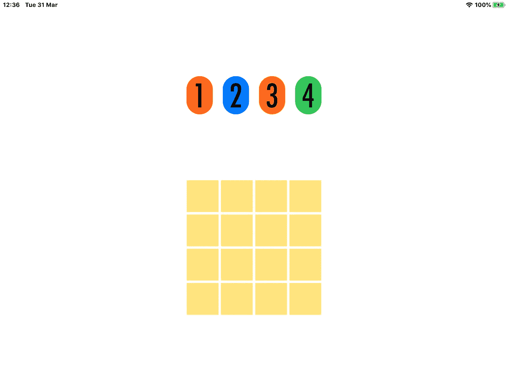
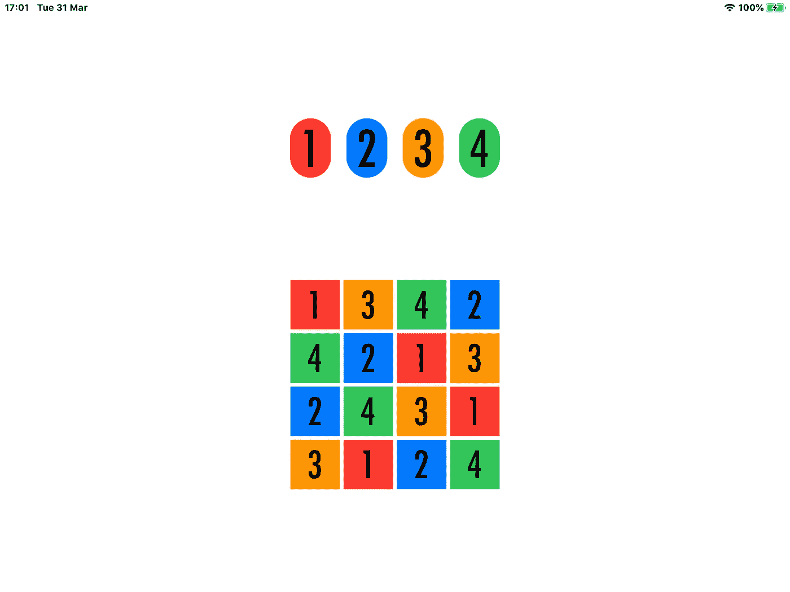

# 构建一个没有政治的棋盘游戏(第 2 部分)

> 原文：<https://betterprogramming.pub/a-board-game-without-the-politics-e18240b5bcf2>

## 通过拖放使用 SwiftUI


照片由[维姆·范因德](https://unsplash.com/@wimvanteinde?utm_source=medium&utm_medium=referral)在 [Unsplash](https://unsplash.com?utm_source=medium&utm_medium=referral) 上拍摄。

本文基于 iOS 11.4 和 2020 年 3 月下旬发布的 Swift 5 的一个版本。警告:如果你还没有更新你的 iDevice 和/或 Xcode，显然它不会工作。

在本文中，我将通过几个例子来介绍新的拖放协议的构建。最终目标是创建一个迷你数独板，然后您可以填充它。当我开始的时候，我没有意识到 SwiftUI 本身实际上是数字挑战。你会在最后找到解决办法的。我们的目标只是创建一个类似数独的棋盘，你可以在上面拖动棋子。当然，它可以是你想尝试和构建的任何棋盘游戏的任何棋盘。

不管怎样，欢迎回来。这是第 2 部分。理想情况下，你应该先读完第 1 部分才能理解。

上次我们入住的时候，我正走运呢。实际上，我以为我是。下一关应该花两分钟完成，但是花了更长的时间。我最终使用了带有命名变量的循环。我很快也遇到了其他几个错误消息。事实上，在 SwiftUI 中实现嵌入式循环本身就是一种艺术形式。

一天后，重新上线。我敢肯定你开始想知道数独的链接在哪里。让我们把“Hello World”标签换成数字，让它们变大，让我们的矩阵变大。我将发布`ContentView.swift`的整个代码库，以确保我们都在同一页上。

我最终设法建立了一个更大的网格，但我还远远没有脱离险境:

和一个稍加修改的`InsideView`结构:

假设您只是对第 1 部分做了一些小的调整，您应该能够再次编译并运行，您会发现自己正在看这个。尝试将数字拖到棋盘上，为自己创建一个迷你数独游戏。这比你想象的要困难得多。试着造一个。记住，每一行在行和列中都必须有一个唯一的数字。



数字挑战。我想要颜色。但是每次我在上面代码的循环中添加任何东西时，我都会得到这个错误消息:‘编译器无法在合理的时间内对这个表达式进行类型检查；尝试将表达式分解成不同的子表达式。“我在栈溢出上查了一下。我尝试关闭除 Xcode 之外的所有应用程序。我花了一两纳秒的时间考虑买一台新的更快的笔记本电脑。我试图简化它。什么都没用。我在这件事上又损失了一天。事实证明，用 SwiftUI 添加颜色极其困难。

我回到 SO 寻找一些线索，也许是一个解决方案。当然，我一贴问题，就看到了答案。这是我代码中的一个简单表达式。SwiftUI 好像数学很差。我不能内联添加它，但是我发现我可以通过函数调用来添加它。是的，一个简单的函数调用。

我修改了绘制网格的函数，保存了坐标。现在，它会根据拖动到它上面的数字，在这样做和放置正确的颜色之间交替。那么是什么改变了呢？我终于能够让主循环绘制一个稍微复杂一点的矩阵:

当然，对“去死吧”错误消息的解决方案是:

```
func fCalc(c:Int, r:Int) -> Int {
  return (c + (r*4))
}
```

以及对`dropDelegate`代码的更改，根据拖动到位的数字设置正确的值:

显然，您需要更改对`dropDelegate`的调用，并将主循环中的新变量声明为:

```
@State private var textColors = [Color](repeating: Color.clear, count: 16)let dropDelegate = TheDropDelegate(textID: $textID, textText: $textText, rect: $rect, textColors: $textColors)
```

你也应该能够添加颜色。这是一个可行的解决方案。当然，你应该能找到其他人:



接下来呢？让我们试着让矩阵变得更大。让我们把它变成一个不可能的，不可解的矩阵。这是一个挑战。

我们需要做什么？嗯，应该很容易。我们需要检查瓷砖的间距和大小，剔除一些我们一开始就不应该添加的神奇数字，并更新一些静态的东西，比如颜色的名称。

浏览代码，最不灵活的部分在我们的`dropDelegate`中。这是一份我们需要修改的案件陈述。事实上，有一个更好的解决方案。这个，代替了我们的 switch 语句。注意 *-1* 是因为我的板从数字 *1* 开始，我的数组从 *0* 开始:

```
self.textColors[self.textID!] = backgrounds[Int(text)! - 1]
```

我们可以用计数代替`ForEach`语句中使用的幻数。所以第一个应该是这样的:

```
ForEach((0 ..< textValue.count), id: \.self) { column in
```

第二个和第三个看起来基本相同。为了保持一致，我们应该将这个数字作为第三个参数提供给`fCalc`函数:

```
func fCalc(c:Int, r:Int, x:Int) -> Int {
  return (c + (r*x))
}
```

抱歉，这有点神秘，我写的时候心情不好。最后，我们需要更改文本框架中用于间距的幻数:

```
let minWidith = CGFloat(32)
let minHeight = CGFloat(40)
let fontSize = CGFloat(40)
```

然后我们需要添加更多的颜色，更多的`textValues`，增加我们的数组来考虑所有的事情。不幸的是，我们没有太多内置 Swift 颜色的选项，所以我们需要大胆尝试:

这应该可以了。如果我们现在跑，我们将能得到一个真正的数独板。我连夜思考了这个系列，决定再写一篇文章。敬请期待！