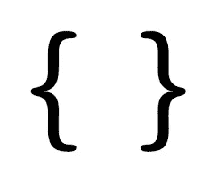

# 编程中花括号的简史

> 原文：<https://betterprogramming.pub/a-brief-history-of-the-curly-brace-in-programming-5b3eacdc3f7a>

## 我们每天都在使用它们，但是代码中的花括号是从哪里来的呢？


照片由[沙哈达特·拉赫曼](https://unsplash.com/@hishahadat?utm_source=unsplash&utm_medium=referral&utm_content=creditCopyText)在 [Unsplash](https://unsplash.com/s/photos/coding?utm_source=unsplash&utm_medium=referral&utm_content=creditCopyText) 上拍摄

花括号，这个标记代码块开始和结束的熟悉符号，是什么时候成为编程的一部分的？也许更重要的是，代码块什么时候成为程序结构的一部分？

在这篇文章中，我将回答这些问题。



图片由 codingwithchuck.com 提供

# 首先，一个非块语言的例子

所有熟悉 C 风格编程语法的程序员都熟悉编程块。C、C++、Java、JavaScript 和其他语言中的所有主要编程结构都是块结构的。换句话说，这些构造的主体放在块中，这些块用左花括号和右花括号分隔。

可能有人会争辩说，严格来说这不是真的，因为仅举两个编程结构来说，如果语句和循环的主体只有一条语句那么长，那么它们可以不用块来构成。然而，在过去的几年中，编程风格专家建议将所有的构造体放在一个块中(参见 Douglas Cockroft 的“JavaScript: The Good Parts ”,其中有一个特别有说服力的论点，将所有的 if 和 loop 体放在块中)。

然而，最初的高级编程语言没有块。

我将用大约 20 世纪 50 年代末的 FORTRAN 语言来演示这一点。唐纳德·克努特(Donald Knuth)在其著作《计算机语言文选》中转载的关于早期高级编程语言的优秀综述文章《编程语言的早期发展》中，比较了几种早期编程语言的特点。他通过演示一个特定的计算机程序如何在不同的语言中实现来做到这一点。这个程序实现了一种叫做 TPK 算法的算法，在现代 JavaScript 中是这样的:

不要担心程序做什么。重要的一点是，这个程序实现了 Knuth 认为在现代编程语言中测试很重要的所有特性。

正如我提到的，Knuth 用这个算法比较了几种编程语言。他研究的最后一种语言现在通常被认为是第一种真正的高级编程语言。下面是 Knuth 编写的 Fortran 语言的 TPK 程序:

```
C   THE TPK ALGORITHM, FORTRAN STYLE
    FUNF(T) = SQRTF(ABSF(T))+5.0*T**3
    DIMENSION A(11)
1   FORMAT(6F12.4)
    READ 1, A
    DO 10 J = 1, 11
    I = 11 – J
    Y = FUNF(A(I+1))
    IF (400.0-Y) 4, 8, 8
4   PRINT 5, I
5   FORMAT(I10, 10H TOO LARGE)
    GO TO 10
8   PRINT 9, I, Y
9   FORMAT(I10, F12.7)
10  CONTINUE
    STOP 52525
```

我不会深入 Fortran 语法的细节，但是您可以清楚地看到该语言不包含块。该函数在一行中定义，而不是作为代码块定义。`DO`循环使用线标签来控制循环。当时的高级语言没有将复合语句分组为块的概念，这些语言仍然依赖于`goto`来控制程序流。

这段代码是 Knuth 使用 1957 年版本的 Fortran 编写的。1957 年至 1960 年间，一种新的语言 ALGOL 被开发出来，它弥补了 Fortran 和当时其他高级语言的许多缺陷。

# Algol 语言的积木

Algol 编程语言在 1958 年首次被描述，尽管该语言最流行的版本是 Algol 60。Algol 的一个特性是能够将语句分组为*复合语句*，称为*块*。每个 Algol 程序都被认为是一个块，因为一个程序通常包含一个或多个语句(因此是复合语句)。Algol 的开发人员认识到，许多编程场景，如条件和循环，需要将语句视为一个单元。

Algol 用关键字`begin` 和`end`标记一个区块的开始和结束。一个块可以嵌套在另一个块中，外部块被认为是*主*块，内部块被认为是*从*块。例如，下面是一个嵌套块的 Algol 程序:

```
begin real a;
     a := 1;
     begin real a;
          a := 2;
          print(a)
     end;
     print(a)
end
```

数字 2 和 1 按此顺序打印出来。

下面是一个在 Algol 的`if`语句中如何使用块的例子:

```
if x > -1 then
     begin
          if x ≠ 0 then
          x := 1/x
     end;
```

以下是 Algol 中一个`for`循环块的例子:

```
begin
     real a0, a1, a2, a3, z, p;
     integer n, i;
     read(a0, a1, a2, a3);
     read(n)
     for i := 1 step 1 until n do
          begin
               read(z);
               p := ((a3 × z + a2) × z + a1) × z + a0
               print(p)
          end i
end
```

现在让我们看看 Algol 语言的 TPK 程序，看看与 Fortran 语言版本相比，块结构如何帮助该程序:

```
TPK begin integer i, real y; real a[0:10];
     real procedure f(t); real  t; value t;
     f := sqrt(abs(t)) + 5 × t ↑ 3;
     for i := 0 step 1 until 10 do read(a[i]);
     for i := 10 step -1 until 0 do
          begin y := f(a[i]);
               if y > 400 then write(I, 'TOO LARGE')
               else write(i, y);
          end
end TPK
```

你应该能看出 Algol 版本的块结构使它更像你我今天习惯阅读的代码。

# 继续前往 BCPL

块结构语言句法的下一个变化是 1967 年左右由剑桥大学的 Martin Richards 开发的 BCPL 语言。在 1960 年到 1967 年 Algol 的最初开发期间，编译器和系统开发人员一直在寻找使用机器和汇编语言以外的语言开发系统应用程序(如操作系统)的方法。我之所以强调 BCPL，是因为 C 语言是通过一种由 Ken Thompson 开发的叫做 b 的中间语言，作为 BCPL 语言的细化和改进而发展起来的

Richards 将 BCPL 开发成一种系统开发语言，它与汇编语言一样高效，但语法更高级，使编码更容易、更高效。这意味着像 Algol 这样的高级语言的许多特性需要包含在像 BCPL 这样的语言中，但要以一种更有效的方式。

实现这种效率的一种方法是将代码块的命名从单词(`begin`和`end`)简化为符号。对于复合语句和块，Richards 选择符号`$(`表示开始，选择符号`)$`表示结束。这些符号被称为*部分括号*。

在 BCPL，如果`$(`和`)$`与`if`语句或循环这样的结构一起使用，那么它们就是复合语句的定界符。如果`$(`包含一些声明，那么它们是在分隔一个块。

例如，在 BCPL，带有复合语句的`if`语句是这样写的:

```
IF A < B
     $( LET T = A
          A := B; B := T
     $)
```

这里有一个 BCPL 街区的例子:

```
GET "LIBHDR"
LET START() BE
     $( LET A, B, C, SUM = 1, 2, 3, 0
          SUM := A + B + C
          WRITES("Sum is ")
          WRITEN(SUM)
     $)
```

这里，开始部分的括号打开了一个块，因为括号后面紧跟着一个声明。

# $(和$)在 C 中变成{和}

大约在 1968 年或 1969 年，贝尔实验室的肯·汤普森和丹尼斯·里奇开始尝试使用系统编程语言开发操作系统。汤普森实际上是通过尝试使用 Fortran 来开始这一探索的，但当他意识到这是不可能的时，他很快就放弃了。他认为他需要修改 BCPL，使系统编程语言更符合他的喜好，于是开发了 b。

B 虽然更接近 Thompson 和 Ritchie 想要的系统开发语言，但仍然不能完全满足他们的需求，所以 Ritchie 开始为新的 B 开发另一种语言，称为 NB。NB 并没有存在很长时间，最终被一种全新的语言所取代，他们自然称之为 C。如果你对 C 是如何从 BCPL、B 和 NB 发展而来感兴趣，我鼓励你阅读 Dennis Ritchie 的 C 语言历史。

Thompson 在 B 中修正的许多东西中的一个被带到了 n B 和 C 中，就是缩写运算符。这些是扩展语言适应当时计算机内存限制所必需的。例如，Thompson 创造了复合赋值操作符(`+=`)和增量(`++`)和减量(`—`)操作符，作为使语言更有效的方法。这一提高效率的举措导致来自 BCPL 的其他运营商被简化——例如，`$(`和`$)`被替换为`{`和`}`。

# 我们今天在哪里

在许多编程语言中，花括号被认为是块的主要符号，尤其是那些最接近 C 风格的语言，包括 C++、Java、C#和 JavaScript。

更有趣的是，新的语言已经开始使用花括号，包括 Go 和 Rust。事实上，Go 对每个条件或循环结构都需要花括号，这是遵循编程专家的观点，即即使语言不需要花括号，程序员也应该对每个可以使用花括号的结构使用花括号。

感谢您阅读这篇文章，请给我发电子邮件，告诉我您的意见和建议