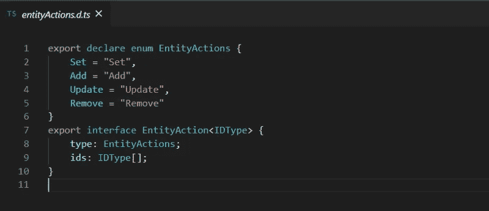

# Angular 中超前(AOT)编译简介

> 原文：<https://betterprogramming.pub/a-brief-intro-to-ahead-of-time-aot-compilation-in-angular-f13517592cce>

## AOT 编译的来龙去脉

[Icons8 团队](https://unsplash.com/@icons8?utm_source=medium&utm_medium=referral)在 [Unsplash](https://unsplash.com?utm_source=medium&utm_medium=referral) 上的照片

# 介绍

Angular 代码主要由 HTML 模板和 TypeScript 组件组成，但是对于要在浏览器中运行的 Angular 应用程序来说，它们必须被编译成 JavaScript 代码。

将 Angular 代码编译成 JavaScript 主要有两种方法。

1.  实时(JIT)编译—这是指运行时在浏览器中编译代码。
2.  提前(AOT)编译——这是将代码编译作为构建过程的一部分，因此得名*提前*。

从 Angular 版本 9 开始，默认选择的编译是 AOT。这意味着，每当您使用命令`ng build --prod`构建用于生产的 Angular 应用程序时，该应用程序也将作为构建过程的一部分被编译。

**注:**对于 Angular 版本 8 及更早版本，要使用 AOT 进行编译，使用命令`ng build --prod --aot=true`。

# AOT 编译的优势

在这个阶段，你可能想知道 AOT 能提供什么。下面是 AOT 编译优于 JIT 编译的一些优点。

*   更快地渲染您的 Angular 应用程序——使用 AOT，代码在构建过程中编译。因此，浏览器加载准备好立即呈现的可执行代码。非常快！
*   更小的 Angular 应用程序大小——不需要下载 Angular 编译器，因为应用程序已经编译好了。如果像 JIT 一样在运行时在浏览器中进行编译，Angular 应用程序将与 Angular 编译器一起发布。编译器的大小大约是 Angular 本身的一半。很重吧？
*   更好的代码质量——这是因为模板错误在应用程序编译的早期就被检测出来，作为构建过程的一部分。
*   更安全、更健壮的应用程序——这是因为 HTML 模板和 TypeScript 组件在运行时不会在浏览器中进行动态评估。这导致注入攻击的机会减少。

# AOT 是如何运作的

Angular Ivy 是 Angular 版本 9 和更新版本中新的编译和渲染管道。Angular Ivy 与它的前辈 View Engine 相比，速度超快，效率高。

编译过程中会发生的主要事情是代码的树抖动、捆绑、丑化和缩小。此外，编译器移除了特定于 Angular 的装饰符、构造函数参数和未使用的代码。

编译分为三个主要阶段，如下所示:

## 1.代码分析

这是编译器分析角度特定元数据的地方，例如`@Component()`和`@Input()` ***。*** 元数据为 Angular 提供了构建应用程序实例所需的信息，例如，如何创建一个组件并生成其可视化表示。Angular 代表了`.metadata.json`文件中装饰元数据的整体结构。

在这个阶段还会检测和记录元数据语法违规错误。

代码分析阶段的主要输出之一是类型定义文件，其扩展名为`.d.ts`。*AOT 编译器使用这些文件生成应用程序代码。一个示例`.d.ts`文件如下所示。*

**

## *2.代码生成*

*在编译的第二阶段，编译器将解释上面第一阶段产生的`.metadata.json`文件的输出。它还将检查元数据的语义是否符合编译器规则。*

*元数据重写是这个阶段的另一个关键步骤。例如，如果在元数据表达式中发现了箭头函数，代码生成阶段会将该函数重写为对编译器更友好的形式。*

## *3.模板类型检查*

*编译的最后阶段与 Angular 模板有很大关系，即保存 HTML 代码的文件。在这个阶段，编译器将对表达式进行类型检查，这样它们就不会在运行时导致崩溃。*

*Angular 编译器还利用 TypeScript 编译器来验证模板中的绑定表达式。当检测到类型错误时，模板验证会产生适当的错误消息。*

***注意:**有了 Angular Ivy，模板检查器比它的前身视图引擎要严格一点。因此，一些在 View Engine 中编译的带有类型检查错误的模板在 Angular Ivy 中可能不会这样做。*

# *AOT 的小缺点*

*AOT 汇编提供的优势远远超过其缺点。然而，意识到 AOT 的一些小问题是件好事。*

*   *与 JIT 编译相比，如果使用 AOT 编译，DevOps 构建管道或本地构建通常会花费更长的时间。*
*   *AOT 不支持元数据表达式中的 arrow 或 lambda 函数和函数表达式。如果您碰巧在元数据表达式中有这样的函数，则在编译的分析阶段会生成一个错误。**注意**:Angular 的新版本会尝试自动为你做这个转换。*

# *结论*

*用 Angular Ivy 进行 AOT 编译速度非常快，为开发人员的工作流程提供了许多好处。*

*最后，AOT 提供了一种有效的方式来编译你的角度代码，从而产生健壮、安全和精简的应用程序。*