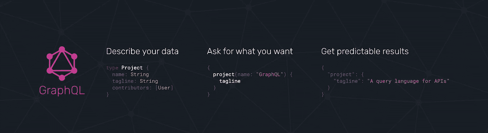
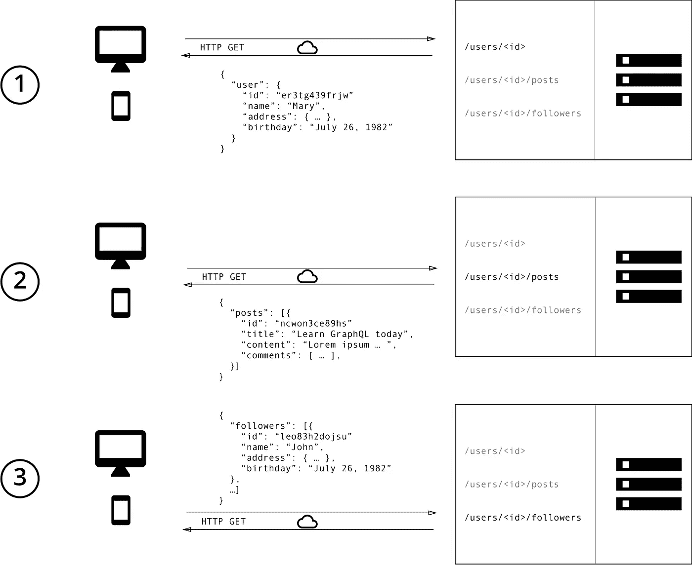
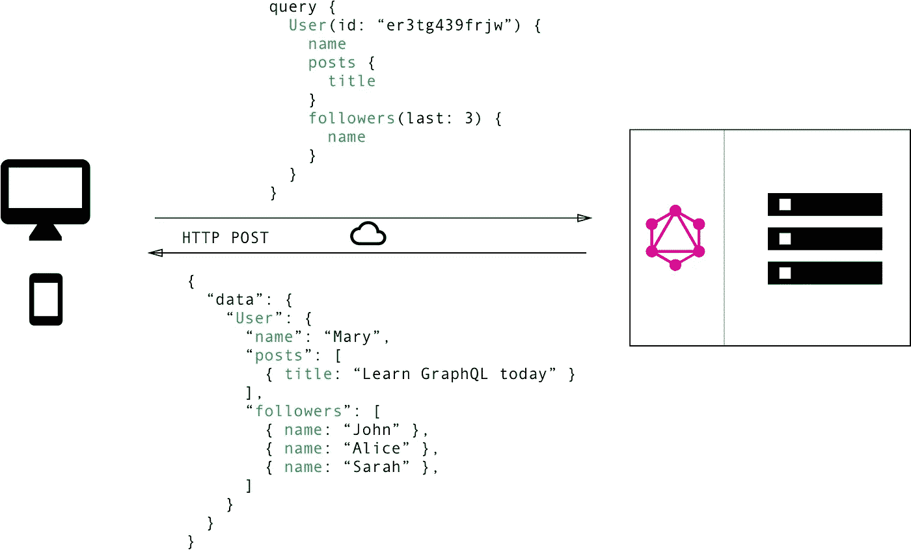
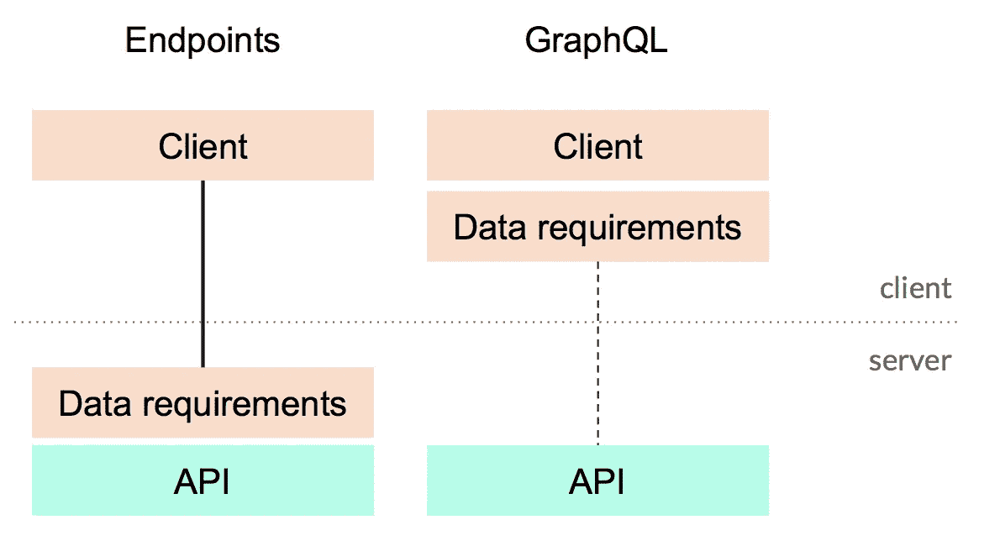

# GraphQL 简介

> 原文：<https://betterprogramming.pub/a-brief-introduction-to-graphql-b7c039d60414>

## 它与 REST API 有什么不同？

[https://graphql.org/](https://graphql.org/)

当我接近熨斗学校的最后一个模块时，我花了更多的时间查看开发人员的招聘信息。几个月前，当我浏览软件工程角色描述时，我感到非常困惑。

有许多我不熟悉的术语和概念。但是随着我在 Flatiron 课程中的进展，那些外来的概念和缩略语——MVC 模式、RESTful APIs、前端框架等等。幸好已经减少了。

然而，有一项技术对我来说仍然是新的，我注意到它在工作描述中出现得更频繁: [GraphQL](https://graphql.org/) 。

那么，GraphQL 是什么？让我们来看看官方文件中的定义:

> “G raphQL 是一种 API 查询语言，也是一种用现有数据完成这些查询的运行时语言。
> 
> GraphQL 为 API 中的数据提供了完整且易于理解的描述，使客户能够准确地要求他们需要的东西，使 API 更容易随时间发展，并支持强大的开发工具。"

这个定义有两个关键部分:

1.  GraphQL 是一种“API 的查询语言”。
2.  它“让客户有权要求他们所需要的，仅此而已。”通过一个简单的例子，我们可以更好地理解这些概念。

考虑一个有以下资源的博客应用程序:帖子、用户和追随者。该应用程序需要显示某个用户的帖子的标题，以及该用户最近获得的三个追随者。

让我们首先考虑如何使用典型的 RESTful API 访问这些信息。

使用 REST APIs，开发人员需要分别访问每个资源，以便访问所有必要的数据。下面是这三个步骤的流程图。

RESTful API:

[https://www . howtographql . com/basics/1-graph QL-is-the-better-rest/](https://www.howtographql.com/basics/1-graphql-is-the-better-rest/)

另一方面，使用 GraphQL，我们能够简单地使用一个查询来访问我们需要的信息。

GraphQL API:

[https://www . howtographql . com/basics/1-graph QL-is-the-better-rest/](https://www.howtographql.com/basics/1-graphql-is-the-better-rest/)

思考 GraphQL 与 REST 有何不同的另一种方式是考虑您的数据需求是在哪里定义的。

在 REST 中，数据的结构是由 API 本身定义的。但是在 GraphQL 中，数据需求是由客户端定义的，如下所示:

[https://blog . apollographql . com/the-graph QL-stack-how-everything-fits-together-35 F8 BF 34 f 841](https://blog.apollographql.com/the-graphql-stack-how-everything-fits-together-35f8bf34f841)

现在我们已经看到了一个简单的例子，它展示了 GraphQL 相对于 REST 的一些优势，那么您如何在项目中实际使用 GraphQL 呢？

不幸的是，它并不像上一张图让你相信的那样简单明了。

设置项目以利用 GraphQL 需要几层工具。Steven Mercatante 对 GraphQL 栈的必要部分做了很好的概述，这些部分包括客户机、网关、GraphQL 服务器、传统服务器、数据库到 GraphQL 服务器以及数据库本身。

如果你有兴趣更多地了解 GraphQL 在实践中是如何工作的，我强烈推荐你看看 Steven 的概述:

 [## GraphQL 堆栈，解释

### GraphQL 堆栈的可视化解释，以及所有部分如何组合在一起。

www.graphqlstack.com](https://www.graphqlstack.com/) 

GraphQL 还为流行的编程语言提供了几个服务器和客户端库，包括 Ruby 和 JavaScript。对于 Ruby，有[graph QL-Ruby](https://github.com/rmosolgo/graphql-ruby)gem；对于 JavaScript 客户端，最流行的库是 [Relay](https://relay.dev/) 和 [Apollo 客户端](https://www.apollographql.com/docs/react/)。

# 摘要

总的来说，GraphQL 相对于传统的 API 方法提供了许多好处，比如解决了通常与 RESTful APIs 相关的数据过度提取和提取不足的问题。

然而，为了获得这些好处，开发人员必须适应 GraphQL 给项目带来的额外复杂性。

随着 GraphQL 越来越受欢迎，我期待着更多地了解这项有前途的技术，并关注那些将成为实现 GraphQL 的良好用例的项目。