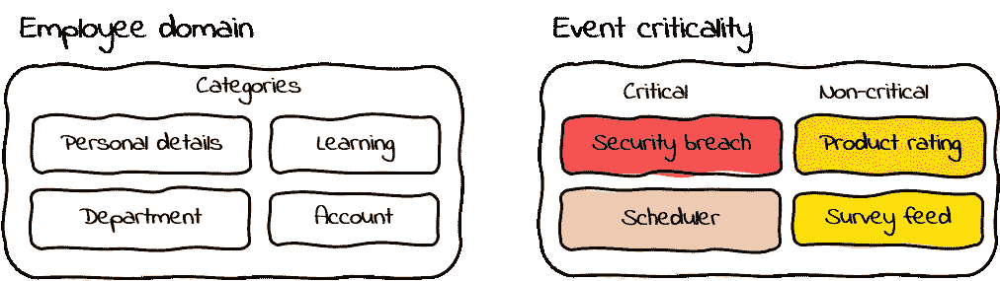
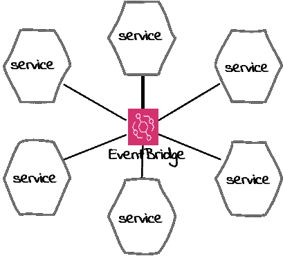
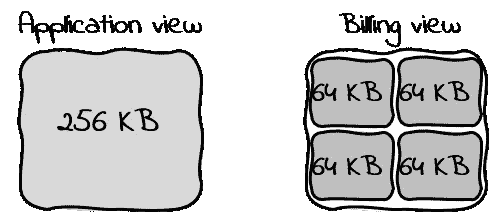
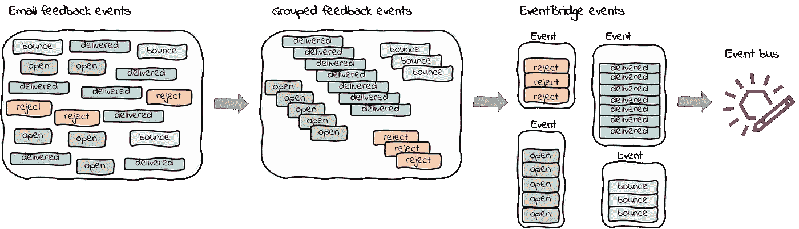

# Amazon EventBridge 中的事件批处理案例

> 原文：<https://betterprogramming.pub/a-case-for-event-batching-in-amazon-eventbridge-303f5c3eecee>

## 批处理事件时可以做什么


图片来自 [Pixabay](https://pixabay.com/?utm_source=link-attribution&utm_medium=referral&utm_campaign=image&utm_content=3200849) 以色列

事件是在某一特定时间点发生的重要事情。它是独一无二的。它是单数。用技术术语来说，事件携带的信息有可能影响一个或多个应用程序。

以下是一些示例事件。

*   产品 X 的状态已更改
*   付款 Y 被授权
*   客户 C 下了订单
*   账户 A 记入 100 英镑的贷方

典型的应用程序在其运行过程中会发出大量事件。

# 事件构成

当我们想到一个事件时，我们主要将其与携带一条消息的简单数据结构联系起来。尽管大多数事件都是如此，但事件的内容和规模会因其来源而异。

大多数事件都有一些共同的属性。标识符、其来源和时间戳是一些常见的特征。

下面是一个通知提交订单的示例事件。

```
{
  "id": "0c90d427-c90bb8ae53fd",
  "detail-type": "event",
  "source": "service-checkout",
  "time": "2019-12-17T10:29:48Z",
  "detail": {
      "type": "ORDER",
      "status": "SUBMITTED",
      "orderNumber": "T123123123"
    }
  }
}
```

# 事件分类

事件可以用许多方式分类和分组。常见的分类是基于领域的。属于特定域的事件具有特定于该域的子类别。例如，属于 Employee 域的事件可以有与个人详细信息、学习、帐户、部门等相关的类别。



图片来源:作者

对事件进行分类的另一种方式是根据它所携带的信息的关键程度。并非所有的事件在处理时都表现出同等的重要性和紧迫性。

同样，对一个应用程序至关重要的事件不会对另一个应用程序造成同等程度的影响。

# 关键事件

一个*关键事件*是需要立即采取行动的事件。同样，包含关键数据且因此不会丢失的事件也是关键事件。

*   成功的支付授权对于订单处理应用程序来说是一个重要事件。
*   每天凌晨 2 点触发批处理作业的系统事件是独一无二的，也是一个关键事件。
*   警告未授权访问的安全事件是高优先级事件。

由于这些事件的性质和响应的紧迫性，关键事件可能需要单独处理。

# 非关键事件

尽管被归类为非关键事件，但这些事件也包含重要信息。然而，对这些事件的反应不必是即时的。因此，可以一起(批量)接收几个事件，而不是单独接收。

在很大程度上，这种分类是由目标应用程序和此类事件的内容驱动的。

*   例如，产品评级事件对于企业来说是一个重要的事件，但就其处理的紧迫性而言，可以被视为非关键事件。
*   来自网站的点击流事件对商业洞察很有价值，但可以多次处理。
*   来自测量城市空气质量的物联网设备的事件是重要的数据，但就处理速度而言并不重要。

# 亚马逊事件桥

简单来说， [Amazon EventBridge](https://aws.amazon.com/eventbridge/) 是一个无服务器的事件总线，帮助连接服务和数据。在事件驱动的架构中，Amazon EventBridge 充当协调者，使用事件来编排不同微服务之间的交互。

它通常被称为星型模式，如下所示。



图片来源:作者

虽然事件总线构成了 EventBridge 的核心，但是它的事件过滤和路由规则增加了识别和路由事件到一个或多个目标服务的能力和灵活性。

## 灵活的事件结构

在 EventBridge 中，事件是一个简单的 JSON 文档。顶层有几个强制属性和一个用于添加自定义数据的`detail` 部分，如 AWS 文档中的[所述。](https://docs.aws.amazon.com/eventbridge/latest/userguide/aws-events.html)

```
{
  "id": "0c90d427-c90bb8ae53fd",
  "detail-type": "event",
  "source": "email-registration",
  "time": "2019-12-17T10:29:48Z",
  "detail": {
    "metadata": {
      "domain": "LEGO-SHOP",
      "service": "email-registration",
      "type": "REGISTRATION_REQUEST",
      "status": "REQUEST"
    },
    "data": {
      "requestId": "unique_request_id",
      "email": "[some_email@address.com](mailto:some_email@address.com)",
      "product": "987654",
      "notificationType": "SOLD_OUT"
    }
  }
}
```

对于源自微服务的自定义事件，`detail`部分是必不可少的部分。它允许我们添加任意数量的有效 JSON 数据，只要整个事件的大小在允许的 256 KB 以内(在撰写本文时)。

# 一个事件，两种含义

重要的是要理解，我们发送和接收的事件并不完全是在 AWS 内部看到的。

虽然我们的应用程序将一个事件视为一个完整的数据实体，但对于 EventBridge billing，AWS 将一个*事件*计为一组数据块。

## 事件—在数据上下文中

数据事件就是我们在这个博客中讨论的内容。对于应用程序事件，256 KB 的最大大小允许打包合理数量的数据。然而，在大多数情况下，事件都比较小，小于 KB。

不管大小如何，最佳实践是在每个事件中只添加所需的数据。避免填写对任何人都没有用的细节。还有，考虑数据的敏感性，剔除不需要的。



数据事件与计费事件

## 事件—在计费环境中

*计费事件*是我用来描述 AWS 内部认为的定价和计费事件的术语。

如上所示，对于定价，每个 64 KB 的数据块被计为一个事件。例如，一个 256 KB 的数据事件是四个计费事件。

*   64 KB 数据= 1 个计费事件
*   100 KB 数据事件= 2 次计费事件

# 批量事件

简单地说，一个*批处理事件*是一个承载多个业务事件的 EventBridge 事件——换句话说，一个 EventBridge 事件中的一批业务事件！

## 为什么？

正如我们前面讨论的，发送和接收非关键事件的应用程序不需要单独处理它们。有一种情况是，在某些情况下，这样的事件可以作为一束发送并一起处理。

## 示例使用案例

[Amazon Simple Email Service(SES)](https://aws.amazon.com/ses/)作为电子邮件发送服务，可以对您发送的电子邮件进行配置，以接收不同类型的反馈。如果您使用这种配置发送大量电子邮件，您可能会收到大量反馈事件。

这些反馈事件虽然对业务有用，但不需要立即处理，也不需要单独发送给目标。

下面是一个类型为`Send`的 SES 反馈事件的精简版本。

```
{
  "eventType": "Send",
  "mail": {
    "timestamp": "2020-10-23T13:10:09.270Z",
    "source": "[sample.user@mail.com](mailto:sample.user@mail.com)",
    "sendingAccountId": "1234567",
    "messageId": "010701755594b076",
    "destination": [
      "[sample.user@mail.com](mailto:sample.user@mail.com)"
    ],
    "headersTruncated": false,
    "headers": [
      {
        "name": "From",
        "value": "[sample.user@mail.com](mailto:sample.user@mail.com)"
      },
      {
        "name": "To",
        "value": "[sample.user@mail.com](mailto:sample.user@mail.com)"
      }
    ],
    "tags": {
      "country": [
        "GB"
      ],
      "ses:configuration-set": [
        "email-notifications"
      ],
      "ses:from-domain": [
        "sample.domian.com"
      ],
      "notificationType": [
        "BACKORDER"
      ],
      "sku": [
        "987654"
      ]
    }
  },
  "send": {}
}
```

如果这些 SES 反馈事件是通过亚马逊 Kinesis DataFirehose 获取的，那么这就允许我们批量处理这些 SES 事件。该处理可以通过删除不需要的数据来清理 SES 事件，按照类型和其他参数对它们进行分组，重新打包，并将其作为 EventBridge 事件发送，如下图所示。



图片来源:作者

## 批量事件示例

下面显示的是一个包含两个反馈事件的示例批处理 EventBridge 事件。`metadata`部分包含常见的属性，如`feedbackType` 和`emailType`、，而数据部分包含一组经过修整的 SES 事件。

```
{
  "id": "0c90d427-c90bb8ae53fd",
  "detail-type": "event",
  "source": "email-feedback-processor",
  "time": "2019-12-17T10:29:48Z",
  "detail": {
    "metadata": {
      "domain": "LEGO-SHOP",
      "service": "email-feedback-processor",
      "feedbackType": "Send",
      "emailType": "BACKORDER"
    },
    "data": [
      {
        "timestamp": "2020-10-23T13:10:09.270Z",
        "messageId": "010701755594b076",
        "email": "[sample.user@mail.com](mailto:sample.user@mail.com)",
        "country": "GB",
        "sku": "987654"
      },
      {
        "timestamp": "2020-10-23T13:10:08.280Z",
        "messageId": "010701755594b098",
        "email": "[new.user@mail.com](mailto:new.user@mail.com)",
        "country": "US",
        "sku": "123456"
      }
    ]
  }
}
```

## 利益

看情况！它不是一个放之四海而皆准的解决方案，而是针对具体的使用案例。这里有几个好处。

*   **减少事件噪音。**与上面的用例一样，这种方法减少了淹没 EventBridge 的事件数量。使用 EventBridge APIs 发送自定义事件有[配额和限制，详见 AWS 文档](https://docs.aws.amazon.com/eventbridge/latest/userguide/cloudwatch-limits-eventbridge.html)。
*   **减少事件消费者的负担。**在 lambda 函数作为事件消费者的情况下，这将减少并发执行的数量，从而不会不必要地消耗帐户并发性。
*   **降低成本。**由于事件是以 64 KB 数据块为单位进行计费的，因此事件批处理可以降低总体成本。
*   **减少数据泄露。**组织非常重视数据保护和数据隐私。降低非预期数据的可见性有助于缓解部分担忧。

## 最佳实践

*   **知道事件有效载荷大小限制**。不要一次打包太多。
*   **避免在一个批次中混合不同类型的数据项**。这将有助于简化过滤和路由规则配置。
*   考虑潜在的事件目标。了解他们的数据大小限制。并非所有使用者都匹配 EventBridge 事件负载大小。
*   **了解事件**的重要性及其处理要求。如果有疑问，那就不要批。

# 结论

AWS 提供多种无服务器服务，使我们能够更快地创新和开发。我们获得的知识和经验使我们能够尝试新事物，识别新模式，并使我们的方法更加实用。

重要的是要有一个务实的心态来实施最适合我们的解决方案！