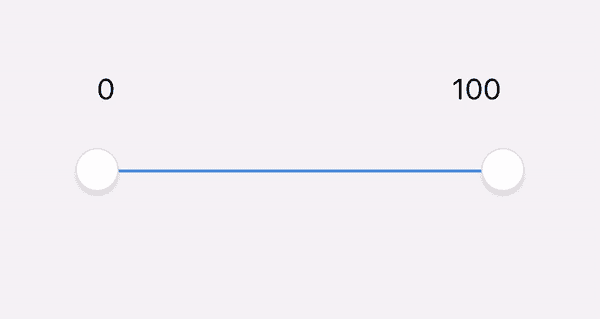
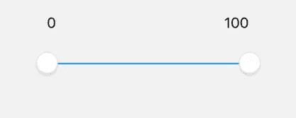
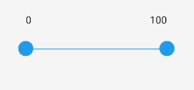

# 使用钩子为 Android 和 iOS 构建一个干净的 React 原生多滑块

> 原文：<https://betterprogramming.pub/a-clean-react-native-multi-slider-for-android-and-ios-using-hooks-3bd6c587b381>

## 更好的移动滑块



1, 2, 3… 100.我们走吧！

今天的文章将向你展示如何建立一个多滑块，可用于年龄，距离，体重范围等。

# 我们将使用什么

*   [样式化组件](https://github.com/styled-components/styled-components)
*   [反应原生多滑块](https://github.com/ptomasroos/react-native-multi-slider)

# 你会得到什么

适用于 iOS 和 Android 的滑块:



ios



机器人

# 步骤 1:安装依赖项

```
$ npm i --save @ptomasroos/react-native-multi-slider
$ npm i styled-components-native
```

# 步骤 2:创建您的组件

这里发生了什么事？

1.我们正在创建样式组件来设计`View`和`Text`。

2.`useState`钩子返回一个有状态值(`multiSliderValue`)和一个更新它的函数(`setMultiSliderValue`)。`multiSliderValue`的初始状态和值是一个设置为`[0, 100]`的数组。

4.**`multiSliderValuesChange`函数将更新值`onValuesChange`并更新状态。**

**5.`…Platform.select({})` — React Native 提供了一个模块，用于检测应用程序运行的平台。您可以使用检测逻辑来实现特定于平台的代码，在这里您会发现 Android 和 iOS 的不同风格。**

# **第三步:导入它**

**在你喜欢的任何地方实现你的组件！**

# **🎬鳍。你完了！**

****有更多问题吗？让我知道！****